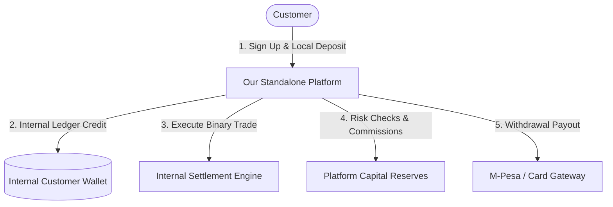
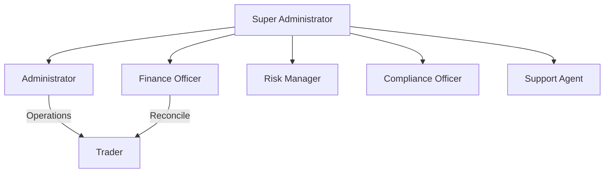
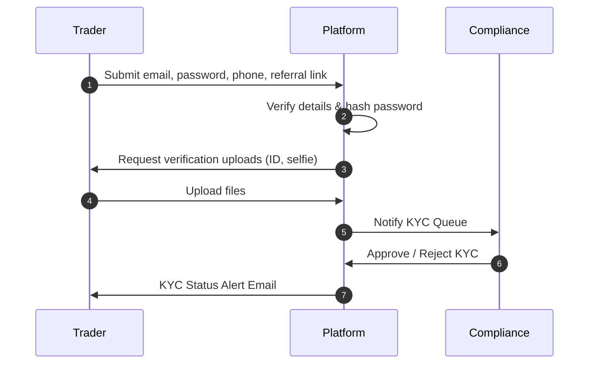
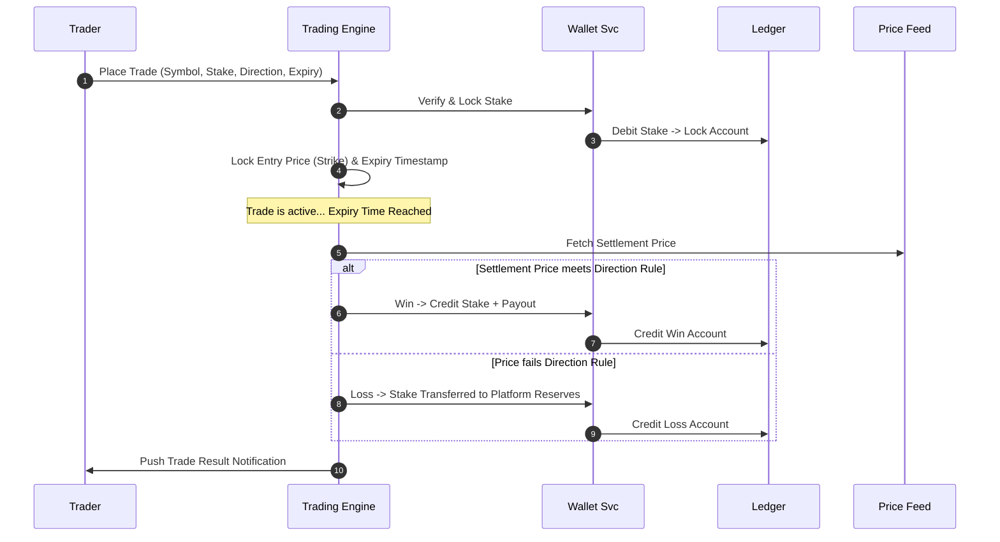
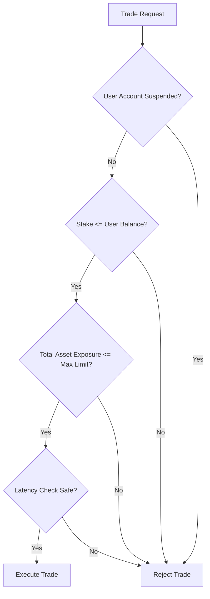

# Business Requirements Document (BRD)
## Project: Independent Online Binary Trading Platform

---

## Revision History

| Date | Version | Description | Author |
| :--- | :--- | :--- | :--- |
| 2026-07-22 | 1.0.0 | Initial release of the Business Requirements Document (BRD) for the standalone binary trading platform. | Lead Business Architect / Antigravity |

---

## Table of Contents

1. [Executive Summary](#1-executive-summary)
2. [Business Goals & Success Metrics](#2-business-goals--success-metrics)
3. [Business Model & Revenue Architecture](#3-business-model--revenue-architecture)
4. [User Types & Access Levels](#4-user-types--access-levels)
5. [User Journey Lifecycle](#5-user-journey-lifecycle)
6. [Core Business Processes & Workflows](#6-core-business-processes--workflows)
7. [Business Rules & Policy Configurator](#7-business-rules--policy-configurator)
8. [Revenue Rules & Platform Profitability](#8-revenue-rules--platform-profitability)
9. [Risk Management & Fraud Policies](#9-risk-management--fraud-policies)
10. [Compliance, Privacy & Audit Standards](#10-compliance-privacy--audit-standards)
11. [Business Key Performance Indicators (KPIs)](#11-business-key-performance-indicators-kpis)
12. [Future Expansion & Product Roadmap](#12-future-expansion--product-roadmap)
13. [Open Business Questions](#13-open-business-questions)
14. [Glossary of Business Terms](#14-glossary-of-business-terms)

---

## 1. Executive Summary

### Business Definition
The business is a self-contained, independent online **Binary Trading Platform** that allows individual retail customers to speculate on the price movements of global financial markets (such as Foreign Exchange, Commodities, Indices, and Synthetics) by purchasing fixed-odds binary contracts. 

Unlike trading utilities that act as interfaces to external brokerages, this platform operates its own market clearing, internal ledger, user wallets, risk profile management, and payment routing.

### Problem Statement
Traditional retail trading platforms present steep barriers to entry for beginners:
*   **High Complexity**: Traditional forex and CFDs (Contracts for Difference) require an understanding of leverage, pip values, margin calls, and execution mechanics.
*   **Platform Dependency**: Modern automated solutions require traders to register with external foreign brokers, generate API tokens, and trust third-party software with full API read/write scopes.
*   **Funding Barriers**: Depositing and withdrawing funds to international brokers is slow, expensive, and often unsupported by local payment networks like mobile money.

### Core Value Proposition
The platform simplifies retail trading into intuitive contracts (Yes/No predictions on asset direction) with predefined risk and return parameters. It removes the necessity of external broker accounts. 

By operating an internal ledger and integrating directly with local and international payment gateways, the business makes trading accessible, safe, and immediate on any device.



---

## 2. Business Goals & Success Metrics

The business will follow a phased roadmap designed to achieve operational viability in the short term while building scalable, long-term market presence.

### Short-Term Goals (Months 1–6)
*   Deploy a secure, operational Minimum Viable Product (MVP) supporting core binary contracts (Higher/Lower).
*   Integrate at least one local high-volume mobile payment gateway (e.g., M-Pesa) and one international credit card processor.
*   Successfully complete full system security, financial ledger, and compliance audits.
*   Acquire the first 5,000 registered users, with an active trading rate of at least 30%.

### Long-Term Goals (Months 18+)
*   Secure financial brokerage and operational licenses in multiple jurisdictions.
*   Expand the asset index to support 24/7 trading including synthetic indices, commodities, and digital tokens.
*   Reach 100,000 active users globally.
*   Maintain a stable net revenue margin of 12% to 15% on total platform trading volume.

### Success Metrics & Growth Objectives
*   **Customer Acquisition Cost (CAC)**: Keeping CAC below $15 via automated referral campaigns.
*   **Customer Lifetime Value (LTV)**: Target an LTV-to-CAC ratio greater than 3:1 within the first year.
*   **System Availability**: Maintain 99.9% uptime on trading, pricing feeds, and payment systems.

---

## 3. Business Model & Revenue Architecture

The platform operates as a market-making operator (principal broker) that maintains its own liquidity book and profit margins.

| Revenue Model | Description | Business Advantages | Strategic Disadvantages | Recommendation |
| :--- | :--- | :--- | :--- | :--- |
| **Trading Margin (The House Edge)** | Pricing contracts so winning payouts represent 70% to 90% of the stake (leaving 10% to 30% of losing stakes as platform gross profit). | Highest potential margin; scales directly with trading volume. | Higher risk exposure if user win-rates spike unexpectedly. | **Primary Model**: Implement dynamic pricing algorithms to adjust payouts based on exposure. |
| **Withdrawal Fees** | Charging a small percentage fee or flat rate on customer withdrawal transactions. | Predictable income; offsets transaction processing costs from payment gateways. | Can discourage active deposits if set too high. | **Recommended**: Flat fee covering gateway costs + 0.5% platform processing margin. |
| **Premium/VIP Memberships** | Monthly tiers giving users slightly higher payout percentages, faster withdrawals, or advanced charting tools. | Stable recurring subscription revenue; increases customer loyalty. | Requires additional operational resources for VIP client management. | **Secondary Phase**: Deploy after core systems stabilize. |
| **Referral Commissions** | Giving affiliates a cut of the platform margin generated by users they refer. | Highly cost-effective marketing; pays out only on active trades. | Reduces net margin on referred transactions. | **Highly Recommended**: Core growth engine. |

> [!TIP]
> **Sustainable Model Selection**: The core revenue model will be a hybrid of **Trading Margin** (derived from asymmetric win/loss payouts) and **Flat Withdrawal Fees** to offset processing overheads, coupled with an active **Referral/Affiliate program** to drive customer acquisition.

---

## 4. User Types & Access Levels

To maintain security, financial oversight, and segregation of duties, the platform defines the following distinct roles:



### 1. Trader (Customer)
*   **Responsibilities**: Open accounts, undergo KYC, deposit funds, execute trades, request withdrawals, generate referral links, and contact support.
*   **Permissions**: Read access to personal dashboard, write access to order creation.
*   **Restrictions**: Cannot view other users' accounts, adjust balances, modify pricing, or reverse payments.

### 2. Support Agent
*   **Responsibilities**: Assist users with navigation, respond to tickets, and escalate issues.
*   **Permissions**: Read access to user profiles and transaction histories; write access to support tickets.
*   **Restrictions**: Cannot modify user wallet balances, approve withdrawals, or view passwords.

### 3. Finance Officer
*   **Responsibilities**: Reconcile payment gateway logs, audit ledger entries, and process pending withdrawals.
*   **Permissions**: Read access to wallets and ledgers; write access to approve or decline withdrawals.
*   **Restrictions**: Cannot alter trading rules, adjust client risk parameters, or change system settings.

### 4. Risk Manager
*   **Responsibilities**: Monitor platform exposure, watch for latency arbitrage, adjust payout limits, and flag suspicious activities.
*   **Permissions**: Read access to open trades; write access to platform settings (adjust asset payout rates, block symbols).
*   **Restrictions**: Cannot process financial transactions or access user passwords.

### 5. Compliance Officer
*   **Responsibilities**: Review KYC documents, audit activities for Anti-Money Laundering (AML) flags, and check system logs.
*   **Permissions**: Write access to approve or reject KYC documents; read access to user audit trails.
*   **Restrictions**: Cannot trade or adjust financial balances.

### 6. Administrator
*   **Responsibilities**: General platform administration, agent creation, and settings management.
*   **Permissions**: Full management access across customer support, risk parameters, and platform parameters.
*   **Restrictions**: Cannot delete audit logs or modify database code.

### 7. Super Administrator
*   **Responsibilities**: Executive system owner.
*   **Permissions**: Unrestricted access, including creating and deleting administrator accounts, overriding payment locks, and database resets.
*   **Restrictions**: Strictly monitored via hardware security tokens and system-level immutable logs.

---

## 5. User Journey Lifecycle

```
[Visitor] ──► [Registration] ──► [KYC Verification] ──► [Deposit]
                                                             │
[Account Closure] ◄── [Support / Referral] ◄── [Withdrawal] ◄── [Trading]
```

### 1. Visitor
*   Accesses the platform public pages (Landing Page, pricing index, educational materials).
*   Can view historical charts in demo/sandbox modes without financial risk.

### 2. Registration
*   Signs up using Email, Name, and Phone Number.
*   Optionally enters an affiliate referral code.
*   Accepts the terms and conditions and privacy policies.

### 3. KYC Verification
*   Trader is prompted to submit details (e.g., identity card, selfie, proof of address) depending on deposit thresholds.
*   System automatically or manually reviews credentials.

### 4. Deposit
*   Selects a payment gateway (e.g., M-Pesa, card networks, crypto).
*   Enters the amount. The platform prompts the gateway, verifies the transaction, credits the internal wallet, and logs the ledger transaction.

### 5. Trading
*   Accesses the active workspace panel.
*   Selects an asset, contract type (e.g., Higher/Lower), stake, and expiry duration.
*   Places the contract. The system locks the stake from the wallet balance.
*   On expiry, the contract settles, and the outcome updates the balance.

### 6. Withdrawal
*   Requests a payout. The system locks the requested amount from the active balance.
*   Goes through administrative review or automatic safety checks.
*   The gateway processes the payout, and the ledger records the completed transaction.

### 7. Support & Referral
*   The user can open help tickets if a transaction encounters an issue.
*   Can share personal referral codes to earn commission cuts on referred traders' volume.

### 8. Account Closure
*   The user can request account deactivation.
*   Remaining verified balances are withdrawn, active affiliate links are disabled, and user records are archived to comply with regulatory recordkeeping policies.

---

## 6. Core Business Processes & Workflows

### 1. User Registration & KYC Approval


### 2. Payment Ingestion (Deposit)
1.  **Initiation**: The Trader enters the deposit amount.
2.  **Payment Lock**: The system creates a pending transaction record with a unique tracking code.
3.  **Gateway Handshake**: The system triggers a checkout prompt (e.g., M-Pesa STK Push or card portal).
4.  **Verification**: The platform receives an authenticated callback from the payment provider confirming success.
5.  **Ledger Entry**: The platform applies a double-entry update: debiting the Payment Gateway Clearing Account and crediting the User's Wallet.
6.  **Confirmation**: The UI updates the balance and registers a success entry in the activity log.

### 3. Trade Execution & Settlement


---

## 7. Business Rules & Policy Configurator

To maintain operational flexibility, the platform avoids hardcoding numerical rules. Instead, it relies on a central settings registry that administrators can adjust in real-time.

### Configurable Limits

| Parameter | Default Value | Purpose |
| :--- | :--- | :--- |
| **Minimum Deposit** | $10.00 | Prevents micro-transaction gateway fees from consuming margins. |
| **Minimum Withdrawal** | $15.00 | Manages operational overhead for cash processing. |
| **Maximum Stake per Trade** | $500.00 | Protects capital reserves from single-trade shocks. |
| **Minimum Trade Expiry** | 1 Minute | Prevents extreme latency front-running of price ticks. |
| **Maximum Active Exposure** | $10,000.00 | The maximum aggregate amount the platform will risk on a single asset at any moment. |
| **Inactivity Grace Period** | 6 Months | Duration before an account is marked as inactive. |
| **Inactivity Monthly Fee** | $5.00 | Fee applied to inactive accounts with positive balances. |
| **Automatic Approval Limit** | $100.00 | Withdrawals below this value clear automatically, while larger requests undergo manual review. |

### Contract Expiry & Strike Rules
*   **Strike Price Definition**: The exact, mid-market price of the asset at the millisecond the trade is recorded in the platform's database.
*   **Winning Conditions**:
    *   **Higher (Call)**: Expiry Price is strictly greater than the Strike Price.
    *   **Lower (Put)**: Expiry Price is strictly lower than the Strike Price.
    *   **Draw Rule**: If Expiry Price matches the Strike Price, the stake is returned to the user (0% profit/loss).

---

## 8. Revenue Rules & Platform Profitability

The platform guarantees its long-term financial health by ensuring payouts are mathematically structured to favor the house edge over a high volume of transactions.

### 1. Payout Rate Configuration
*   Payout percentages (represented as $R$) are dynamically mapped between 65% and 88% depending on liquidity, market volatility, and platform exposure.
*   **Payout Equation**: If a user stakes $S$ on a contract, the settlement payouts are:
    *   **User Wins**: Payout to user = $S \times (1 + R)$. Net platform expense = $- (S \times R)$.
    *   **User Loses**: Payout to user = $0$. Net platform profit = $+ S$.
    *   **Platform Margin**: If users win 50% of the time, the platform's net mathematical edge is:
        $$\text{Margin} = 1 - \frac{R}{2}$$
        *   At an 80% payout rate, a 50/50 win rate yields a stable **10% net platform profit margin** on total volume.

### 2. Fee Structures
*   **Deposit Processing Fee**: 0% (covered by the platform to encourage funding).
*   **Withdrawal Processing Fee**: Flat 1.5% or $2.00 (whichever is higher) to offset payment processor merchant charges.
*   **Currency Conversion Spread**: A 2.0% markup applies to deposits or withdrawals converted between local currencies (e.g., KES) and platform base currencies (USD).

---

## 9. Risk Management & Fraud Policies

To safeguard the platform against bankruptcies, fraud, and system exploits, several security parameters are enforced at the business level.



### Risk Controls
*   **Latency Front-Running Protection**: If the latency between a client's trade request and the backend execution timestamp exceeds 800 milliseconds, the trade is rejected to prevent front-running.
*   **Anti-Arbitrage Checks**: Trading is disabled on assets experiencing high external volatility where feed streams are delayed or unstable.
*   **Responsible Trading Limits**: Users can set self-exclusion periods, maximum daily loss limits, and deposit limits from their profile menu.
*   **Multiple-Account Linkage Detection**: If the system detects multiple user accounts using identical IP addresses, withdrawal accounts, or device fingerprints, the accounts are flag-locked for administrative review.
*   **Withdrawal Holds**: Accounts that change passwords or authentication methods are subject to an automatic 24-hour withdrawal freeze.

---

## 10. Compliance, Privacy & Audit Standards

The business must establish operational systems to comply with relevant local and international financial regulations.

### KYC & AML Frameworks
*   **Identification Verification**: Every user must upload national registration documentation before initiating their first withdrawal.
*   **Politically Exposed Persons (PEPs)**: Users are screened against global databases during verification.
*   **Suspicious Activity Reports (SAR)**: Accounts executing rapid offset trades or depositing/withdrawing funds without trading activity are flagged.

### Financial Recordkeeping & Ledgers
*   **Double-Entry Audit Trails**: No ledger entry can be modified once written. Balance errors must be resolved using correcting transactions, ensuring a clear audit trail.
*   **Daily Reconciliation**: The platform compares internal balance sheets against payment gateway logs daily at midnight. Discrepancies generate alerts.

---

## 11. Business Key Performance Indicators (KPIs)

The platform evaluates its operational health and financial growth using the following metrics:

*   **Daily Active Users (DAU) / Monthly Active Users (MAU)**: Tracks user engagement.
*   **Conversion Rate**: The percentage of registered users who complete verification and initiate a deposit within 30 days.
*   **Average Revenue Per User (ARPU)**: Net margin generated by a user per month.
*   **Churn Rate**: The percentage of active depositors who cease trading for more than 45 days.
*   **Exposure Ratio**: The ratio of active open stakes to the platform's capital reserves.
*   **Withdrawal Processing Turnaround Time**: Target an average of under 4 hours for review-cleared payouts.

---

## 12. Future Expansion & Product Roadmap

```
Phase 1: Binary Core  ──►  Phase 2: Forex & Copy  ──►  Phase 3: Native Apps
  - Higher/Lower             - Forex Options            - iOS & Android
  - Mobile Money             - Copy Trading             - Multi-language
```

*   **Forex Options**: Support standard short-term digital options on major currency pairs (e.g., EUR/USD, GBP/USD).
*   **Copy Trading**: Allow users to share their trades and take a percentage fee when other users copy them.
*   **Native Mobile Applications**: Develop native iOS and Android apps.
*   **Synthetic Market Generation**: Design proprietary mathematical price generators to offer stable indices 24/7.

---

## 13. Resolved Business Decisions & Policies

The following key operational and policy decisions have been established by the project stakeholders to guide the system architecture and implementation:

> [!NOTE]
> 1. **Data Feed Provider**: Interchangeable and provider-agnostic. The system must support abstraction layers to swap market data providers (e.g., Binance, FXCM, OANDA) dynamically. The specific provider selection will be finalized during implementation after cost, licensing, latency, and reliability evaluations.
> 2. **Capital Reserves**: Under financial planning scope. The operational reserve pool will be determined dynamically prior to launch based on anticipated transaction volume, maximum risk exposure settings, and regulatory liquidity requirements.
> 3. **Regulatory Jurisdiction**: Deferred for legal counsel. The operational licensing location and corporation registry will be selected following professional legal guidance, optimizing for taxation, payment gateway partnerships, and target audience accessibility.
> 4. **Withdrawal Approval Limits**: Configurable by administrators. The threshold for manual verification of withdrawals is policy-driven (not hardcoded) and can be adjusted dynamically in the platform management settings. Small withdrawals will process automatically, while larger amounts queue for manual approval.
> 5. **Draw Settlement Policy**: Returned stake. If a binary options contract expires at the exact strike price (Draw), the contract settles neutral. The user's original stake is refunded in full to their wallet, and no profit or loss is recorded.
> 6. **Processing Fees**: Configurable billing policy. Payment processing fees must be fully transparent to users. The option for the platform to either absorb gateway transaction costs or pass them directly to the customer remains a setting in the admin panel settings, with fees clearly rendered in the UI before user checkout confirmation.

---

## 14. Glossary of Business Terms

*   **Binary Option (Higher/Lower)**: A financial contract where the payout is a fixed amount if the prediction is correct, or nothing if incorrect.
*   **Strike Price**: The price of the underlying asset at the moment the trade starts.
*   **Expiry Price**: The price of the underlying asset at the contract's end time.
*   **Payout Rate**: The profit percentage paid to a user on a winning trade (e.g., 80% means a $10 winning trade returns $18).
*   **Double-Entry Ledger**: An accounting system where every entry requires a balancing debit and credit to ensure record integrity.
*   **KYC (Know Your Customer)**: The process of verifying a customer's identity.
*   **AML (Anti-Money Laundering)**: Rules and procedures designed to prevent money laundering.
*   **Self-Exclusion**: A tool allowing users to voluntarily lock themselves out of their account for a set period.
