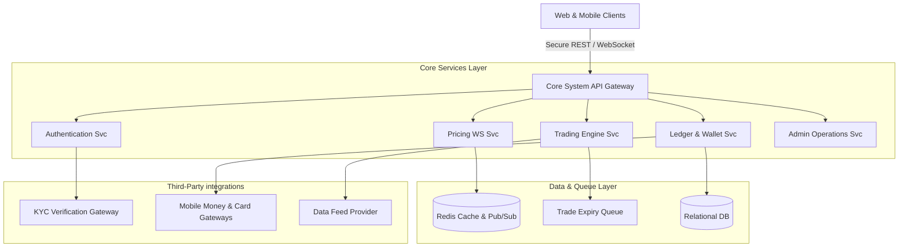
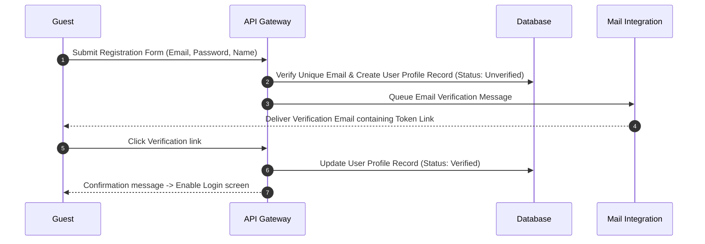
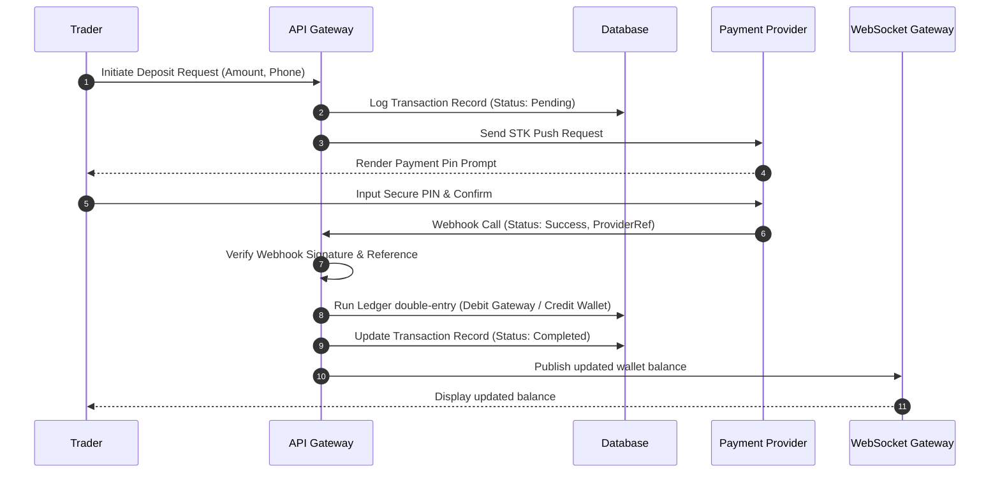
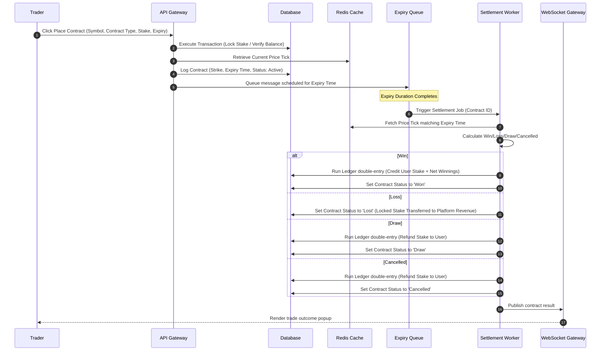

# System Requirements Specification (SRS)
## Project: Independent Online Binary Trading Platform

---

## Revision History

| Date | Version | Description | Author |
| :--- | :--- | :--- | :--- |
| 2026-07-22 | 1.0.0 | Initial drafting of System Requirements Specification (SRS). | Lead Software Architect / Antigravity |

---

## Table of Contents

1. [System Overview](#1-system-overview)
2. [Functional Requirements (FR)](#2-functional-requirements-fr)
3. [Non-Functional Requirements (NFR)](#3-non-functional-requirements-nfr)
4. [User Permissions Matrix](#4-user-permissions-matrix)
5. [System Workflows & Lifecycles](#5-system-workflows--lifecycles)
6. [Error Handling Requirements](#6-error-handling-requirements)
7. [External Integrations](#7-external-integrations)
8. [Security Requirements](#8-security-requirements)
9. [Data & Database Requirements](#9-data--database-requirements)
10. [Quality Attributes (Measurable SLA Targets)](#10-quality-attributes-measurable-sla-targets)
11. [System Assumptions](#11-system-assumptions)
12. [Constraints](#12-constraints)
13. [Traceability Matrix](#13-traceability-matrix)
14. [Glossary of Technical Terms](#14-glossary-of-technical-terms)

---

## 1. System Overview

### System Purpose
The System Requirements Specification (SRS) translates the business rules of the standalone **Binary Trading Platform** into precise functional and technical definitions. The system coordinates user account lifecycle steps, financial transactions, ledger audits, real-time market pricing aggregation, order matching, automated settlements, risk mitigation, and back-office management.

### Scope
The platform contains:
*   **Web Application Interface**: A desktop and mobile web interface for traders and administrators.
*   **Real-time Pricing Engine**: Ingests, caches, and broadcasts low-latency price ticks.
*   **Core Trading Server**: Validates order parameters, balances, and risk exposures, and settles contracts.
*   **Financial Transaction Ledger**: Double-entry ledger API handling payment operations.
*   **Back-office Console**: Admin tools for configuration, manual audits, approvals, and report generation.

---

## 2. Functional Requirements (FR)

### Module: Authentication & Session Management
*   **Purpose**: Protect system resources by verifying user credentials.
*   **Inputs**: User email, password, MFA tokens.
*   **Outputs**: Cryptographically signed JSON Web Tokens (JWT), session logs.
*   **Business Rules**: Session inactivity must log the user out. Password changes expire active sessions.
*   **Dependencies**: None.
*   **Failure Scenarios**: Block logins upon consecutive failures; log rate limit violations.

| ID | Description | Inputs | Outputs | Dependencies |
| :--- | :--- | :--- | :--- | :--- |
| **FR-ATH-001** | **User Registration**: Create a new account with email validation. | Email, Password, Name, Phone. | Verification Email link. | None. |
| **FR-ATH-002** | **Secure Login**: Verify credentials and output a secure session JWT. | Email, Password. | User Session JWT. | None. |
| **FR-ATH-003** | **Multi-Factor Authentication (MFA)**: Support Time-based One-Time Passwords (TOTP). | TOTP Code. | Success/Failure status. | FR-ATH-002 |
| **FR-ATH-004** | **Session Invalidation**: Terminate active token validity (Logout). | Session Token. | Confirmation flag. | FR-ATH-002 |

---

### Module: User Profile & KYC Verification
*   **Purpose**: Verify identities to satisfy Anti-Money Laundering (AML) requirements.
*   **Inputs**: Identification document scans, selfie files, text fields.
*   **Outputs**: Verification approval/rejection flags, audit logs.
*   **Business Rules**: Withdrawals are locked for unverified accounts.
*   **Dependencies**: Authentication.
*   **Failure Scenarios**: Unreadable documents auto-flag to retry; notify admins if multiple attempts fail.

| ID | Description | Inputs | Outputs | Dependencies |
| :--- | :--- | :--- | :--- | :--- |
| **FR-KYC-001** | **KYC Submission**: Capture user name, DOB, country, ID document scans, and selfies. | Document files. | Verification request ID. | FR-ATH-002 |
| **FR-KYC-002** | **Document Verification Status**: Query and check user KYC approvals. | User ID. | Status (Verified, Pending, Declined). | FR-KYC-001 |
| **FR-KYC-003** | **Admin KYC Console**: Enable compliance managers to view and approve documents. | Review action. | Approval/Rejection status. | FR-KYC-001 |

---

### Module: Wallets & Double-Entry Ledger
*   **Purpose**: Maintain transaction integrity and user balances.
*   **Inputs**: Transaction types, debit/credit accounts, currency type, amount values.
*   **Outputs**: Ledger transaction hashes, balance balance logs.
*   **Business Rules**: All database actions must execute in transactions. Wallet balances cannot drop below zero.
*   **Dependencies**: Authentication.
*   **Failure Scenarios**: Rollback operations on system error; generate alerts for balance anomalies.

| ID | Description | Inputs | Outputs | Dependencies |
| :--- | :--- | :--- | :--- | :--- |
| **FR-WLT-001** | **Wallet Query**: Fetch active balances. | User ID. | Balance, Currency. | FR-ATH-002 |
| **FR-WLT-002** | **Ledger Ingestion**: Record double-entry transactions (e.g., stake debits, payout credits). | Debit/Credit details. | Ledger Transaction ID. | None. |
| **FR-WLT-003** | **Platform Reconciliation Audit**: Auto-compare wallet sums against ledger histories. | Cron trigger. | Reconciled/Alert status. | FR-WLT-002 |

---

### Module: Deposit & Payment Processing
*   **Purpose**: Fund internal wallets from external gateways.
*   **Inputs**: Deposit requests, payment gateway webhook payloads.
*   **Outputs**: Status logs, wallet balance increases.
*   **Business Rules**: Only credit balances upon receiving gateway webhook confirmations.
*   **Dependencies**: Wallets & Ledger.
*   **Failure Scenarios**: Log invalid signatures on gateway webhooks; flag deposits with mismatching references.

| ID | Description | Inputs | Outputs | Dependencies |
| :--- | :--- | :--- | :--- | :--- |
| **FR-DEP-001** | **Deposit Initiation**: Create a checkout reference. | Amount, Method. | Payment portal redirect. | FR-WLT-001 |
| **FR-DEP-002** | **Gateway Webhook Handler**: Securely process callback webhooks from processors. | Webhook Payload. | Success/Failure status. | FR-WLT-002 |

---

### Module: Withdrawal Processing
*   **Purpose**: Pay out funds to traders' external accounts.
*   **Inputs**: Payout requests, administrative approval audits.
*   **Outputs**: Gateway disbursement queries, ledger debits.
*   **Business Rules**: Lock requested funds from active balances upon request. Auto-flag large transactions for manual review.
*   **Dependencies**: Wallets & Ledger, User Profile & KYC.
*   **Failure Scenarios**: Restore locked funds to users on gateway failure; log rejected withdrawal reasons.

| ID | Description | Inputs | Outputs | Dependencies |
| :--- | :--- | :--- | :--- | :--- |
| **FR-WTH-001** | **Withdrawal Request**: Request a withdrawal. | Amount, Method, Details. | Pending transaction reference. | FR-KYC-002 |
| **FR-WTH-002** | **Approval Policy Routing**: Check withdrawal limits and route to auto-approve or manual queues. | Request ID. | Queue assignment. | FR-WTH-001 |
| **FR-WTH-003** | **Disbursement Execution**: Route funds to the payment provider. | Approved request. | Gateway status. | FR-WTH-002 |

---

### Module: Trading & Execution Engine
*   **Purpose**: Manage the lifecycle of binary options contracts.
*   **Inputs**: Target asset, contract type, stake, duration.
*   **Outputs**: Active trade records, locked balances, strike prices.
*   **Business Rules**: Reject trades if execution latency is high. Reject contracts exceeding active asset limits.
*   **Dependencies**: Wallets & Ledger, Market Data.
*   **Failure Scenarios**: Block trade requests during price stream gaps.

| ID | Description | Inputs | Outputs | Dependencies |
| :--- | :--- | :--- | :--- | :--- |
| **FR-TRD-001** | **Trade Placement**: Validate balance and buy a contract. | Asset, Contract Type, Stake, Expiry. | Contract ID, Strike Price. | FR-WLT-001 |
| **FR-TRD-002** | **Strike Price Capture**: Timestamp and lock the asset price. | Asset symbol. | Entry Strike Price. | FR-TRD-001 |
| **FR-TRD-003** | **Active Trades Query**: List active user contracts. | User ID. | List of open contracts. | FR-TRD-001 |

---

### Module: Contract Settlement Engine
*   **Purpose**: Evaluate and payout expired trading contracts.
*   **Inputs**: Expired contract records, Expiry price ticks.
*   **Outputs**: Wallet payouts, ledger logs, result messages.
*   **Business Rules**: Refund stakes on a tie. Payout rates apply at execution time.
*   **Dependencies**: Trading Engine, Market Data.
*   **Failure Scenarios**: Put trades in a manual review queue if the expiry price tick is missing.

| ID | Description | Inputs | Outputs | Dependencies |
| :--- | :--- | :--- | :--- | :--- |
| **FR-SET-001** | **Expiry Scheduler**: Track and trigger contract expiries. | Active contract. | Settlement check call. | FR-TRD-001 |
| **FR-SET-002** | **Contract Resolution**: Compare strike and expiry prices. | Expiry tick. | Outcome (Win/Loss/Draw/Cancelled). | FR-SET-001 |
| **FR-SET-003** | **Payout Settlement**: Credit winnings or update account reserves. | Outcome details. | Ledger credit/debit. | FR-SET-002 |

---

### Module: Market Data & Streaming Service
*   **Purpose**: Ingest and broadcast real-time price tick feeds.
*   **Inputs**: External provider price feeds.
*   **Outputs**: Internal WebSocket tick streams, chart historical arrays.
*   **Business Rules**: Keep prices cached in memory. Calculate 1-minute OHLC bars on closed ticks.
*   **Dependencies**: None.
*   **Failure Scenarios**: Automatically fallback to secondary data providers on primary feed disconnection.

| ID | Description | Inputs | Outputs | Dependencies |
| :--- | :--- | :--- | :--- | :--- |
| **FR-MKT-001** | **Price Feed Ingestion**: Connect to provider APIs and cache current price points. | Provider stream. | Cached asset ticks. | None. |
| **FR-MKT-002** | **Tick Streaming (WebSocket)**: Broadcast tick feeds to clients. | Cached prices. | JSON WebSocket payload. | FR-MKT-001 |
| **FR-MKT-003** | **Historical OHLC Query**: Provide API access to historical candle lists. | Symbol, Granularity. | JSON Array of candles. | FR-MKT-001 |

---

### Module: Admin Dashboard & Configuration Console
*   **Purpose**: Centralize back-office management for system configurations and audits.
*   **Inputs**: Admin settings modifications, approval decisions, profile locks.
*   **Outputs**: System setting changes, profile adjustments, report exports.
*   **Business Rules**: Admin activities must generate immutable logs.
*   **Dependencies**: Authentication (with Admin role permissions).
*   **Failure Scenarios**: Restrict admin dashboard access on multiple invalid login attempts.

| ID | Description | Inputs | Outputs | Dependencies |
| :--- | :--- | :--- | :--- | :--- |
| **FR-ADM-001** | **User Management Portal**: Update, suspend, or view trader profile details. | User ID. | Modified status. | FR-ATH-002 |
| **FR-ADM-002** | **Risk Control Console**: Adjust payout rates, limit stakes, or block assets. | Config updates. | System setting database updates. | None. |
| **FR-ADM-003** | **Manual Wallet Adjustment**: Credit or debit a wallet to correct ledger discrepancies. | User ID, Amount. | Ledger audit correction transaction. | FR-WLT-002 |

---

## 3. Non-Functional Requirements (NFR)

### Performance & Latency
*   **NFR-PER-001**: API response times must be under 200ms for 95% of requests.
*   **NFR-PER-002**: WebSockets must broadcast tick streams to clients within 50ms of ingestion.
*   **NFR-PER-003**: The trade settlement process must execute within 2 seconds of contract expiry.

### Availability & Reliability
*   **NFR-AVL-001**: The system must achieve a 99.9% uptime target, excluding planned maintenance windows.
*   **NFR-AVL-002**: If a WebSocket client disconnects, the system must support auto-reconnection and restore state without duplicating active orders.

### Security & Data Privacy
*   **NFR-SEC-001**: Passwords must be hashed using bcrypt or Argon2id with work factors configured for security.
*   **NFR-SEC-002**: All data in transit must be encrypted using TLS 1.3. Stored databases must be encrypted at rest using AES-256.
*   **NFR-SEC-003**: The API gateway must rate-limit endpoints based on IP addresses and authentication tokens.

### Observability & Logging
*   **NFR-OBS-001**: Every financial ledger entry must write to a read-only log database cluster.
*   **NFR-OBS-002**: System failures, payment gateway errors, and trade rejections must trigger real-time alerts.

---

## 4. User Permissions Matrix

| Allowed Action / Domain | Guest | Trader | Finance | Support | Risk Mgr | Compliance | Admin | Super Admin |
| :--- | :---: | :---: | :---: | :---: | :---: | :---: | :---: | :---: |
| View Public Landing Page | ✅ | ✅ | ✅ | ✅ | ✅ | ✅ | ✅ | ✅ |
| View Live Price Charts | ✅ | ✅ | ✅ | ✅ | ✅ | ✅ | ✅ | ✅ |
| Perform Registration | ✅ | ❌ | ❌ | ❌ | ❌ | ❌ | ❌ | ❌ |
| Deposit Funds | ❌ | ✅ | ❌ | ❌ | ❌ | ❌ | ❌ | ❌ |
| Place Binary Options Trade | ❌ | ✅ | ❌ | ❌ | ❌ | ❌ | ❌ | ❌ |
| Submit KYC Verification | ❌ | ✅ | ❌ | ❌ | ❌ | ❌ | ❌ | ❌ |
| Request Withdrawal | ❌ | ✅ | ❌ | ❌ | ❌ | ❌ | ❌ | ❌ |
| View Personal Ledger | ❌ | ✅ | ✅ | ✅ | ❌ | ❌ | ✅ | ✅ |
| Respond to Support Tickets | ❌ | ❌ | ❌ | ✅ | ❌ | ❌ | ✅ | ✅ |
| Review & Approve KYC | ❌ | ❌ | ❌ | ❌ | ❌ | ✅ | ✅ | ✅ |
| Approve Pending Withdrawals| ❌ | ❌ | ✅ | ❌ | ❌ | ❌ | ✅ | ✅ |
| Adjust Global Payout Rates | ❌ | ❌ | ❌ | ❌ | ✅ | ❌ | ✅ | ✅ |
| Perform Wallet Adjustments | ❌ | ❌ | ❌ | ❌ | ❌ | ❌ | ❌ | ✅ |
| Create/Delete Admin Accounts| ❌ | ❌ | ❌ | ❌ | ❌ | ❌ | ❌ | ✅ |

---

## 5. System Workflows & Lifecycles

### 1. User Registration Lifecycle

### 2. Deposit Lifecycle (Mobile Money Push)

### 3. Trade Execution & Settlement Lifecycle

---

## 6. Error Handling Requirements

### Payment Webhook Callback Failures
*   **Requirement EH-001**: If the payment callback webhook endpoint returns an error, the provider will retry delivery. The system must implement processing safeguards to ensure duplicate callbacks are ignored.
*   **Requirement EH-002**: Webhook callbacks received with mismatched checksums must trigger a critical alert.

### Price Feed WebSocket Disconnections
*   **Requirement EH-003**: If the market price WebSocket feed experiences an interruption:
    1.  The Pricing Engine will fall back to secondary feed providers.
    2.  If backup options are unavailable, the system will lock new contract purchases.
    3.  Active trades will settle normally using cached data once the feed stabilizes.

### Database Connection Outages during Settlement
*   **Requirement EH-004**: If the database is unreachable during settlement, the Expiry Queue will retry processing the message.
*   **Requirement EH-005**: The system will prevent processing duplicate expirations.

### Duplicate Request Processing (Idempotency)
*   **Requirement EH-006**: API requests that modify wallet states must include an idempotency key. Duplicate requests with matching keys will return the cached original response.

---

## 7. External Integrations

*   **Payment Gateways**: Mobile money APIs (e.g., M-Pesa C2B/B2C endpoints), international card processors, and cryptocurrency payment providers.
*   **Communications Integration**: SMTP email gateways (e.g., SendGrid) and SMS gateways (e.g., Twilio) for transactional messages and security alerts.
*   **Market Data Providers**: Low-latency pricing feed APIs (e.g., OANDA, FXCM, Binance WebSocket indices).
*   **Identity Verification Gateway**: Automated KYC solutions for document verification.
*   **Cloud Object Storage**: Secure document storage for user identification uploads.

---

## 8. Security Requirements

### Session Security & Tokens
*   **Requirement SEC-001**: User sessions must utilize signed JSON Web Tokens (JWT) using secure algorithms (e.g., RS256).
*   **Requirement SEC-002**: Session tokens must expire. Refresh tokens must be stored in secure HTTP-only cookies.

### API & Data Security
*   **Requirement SEC-003**: The API gateway must protect against SQL injection, Cross-Site Scripting (XSS), and Cross-Site Request Forgery (CSRF).
*   **Requirement SEC-004**: All user identification uploads must be scanned for malware before being moved to private bucket storage.
*   **Requirement SEC-005**: API endpoints must enforce rate limits based on authentication tokens and IP addresses.

---

## 9. Data & Database Requirements

### Transaction Isolation Levels
*   **Requirement DR-001**: To prevent race conditions during balance updates, wallet ledger transactions must enforce strict database transaction isolation levels (e.g., Serializable or Repeatable Read).

### Retention, Archiving, and Deletion Policies
*   **Requirement DR-002**: Financial records must be retained for at least 7 years to meet regulatory compliance standards.
*   **Requirement DR-003**: Deleted user records must be archived in cold storage to comply with AML auditing requirements.
*   **Requirement DR-004**: System access logs and audit trails must be archived after 1 year.

---

## 10. Quality Attributes (Measurable SLA Targets)

*   **Maximum Trade Execution Time**: `< 150ms` (from trade submission to Strike Price capture).
*   **Average API Latency**: `< 200ms` (under peak loads of 1,000 requests per second).
*   **SLA Database Uptime**: `99.95%` annual availability.
*   **Settlement Processing Throughput**: Handle up to 100 contract expirations per second.
*   **MFA Code Validity Window**: 30 seconds.

---

## 11. System Assumptions

*   **Reliable Price Ingestion**: The system assumes the external market feed providers maintain 99.9% uptime.
*   **Client Internet Connectivity**: The platform assumes users have an active, low-latency internet connection to view price charts in real-time.
*   **Payment Provider Callbacks**: The system assumes external payment gateway webhook endpoints deliver event messages within 5 seconds of transaction completion.

---

## 12. Constraints

*   **No Client-Side Calculation of Expiry**: Expiry calculations must run on the backend to prevent users from manipulating trade results.
*   **Regulatory Audits**: Financial ledgers must be audit-ready and immutable.
*   **Browser Compatibility**: The UI must be optimized for Chrome, Edge, Firefox, and Safari on desktop and mobile viewports.

---

## 13. Traceability Matrix

| Business Requirement ID (from BRD) | Software Requirement ID (SRS) | Description / Verification Method |
| :--- | :--- | :--- |
| **BRD-AUTH-01** (User Registration) | FR-ATH-001, FR-ATH-002 | Email verification signup and login flows. |
| **BRD-KYC-01** (KYC Compliance) | FR-KYC-001, FR-KYC-002, FR-KYC-003 | Profile upload, status checks, and admin approvals. |
| **BRD-WLT-01** (Ledger Wallet) | FR-WLT-001, FR-WLT-002, FR-WLT-003 | Ledger transaction records and balance queries. |
| **BRD-DEP-01** (Funding System) | FR-DEP-001, FR-DEP-002 | Payment gateway callback handling. |
| **BRD-WTH-01** (Withdrawal Processing) | FR-WTH-001, FR-WTH-002, FR-WTH-003 | Manual admin audits and gateway payouts. |
| **BRD-TRD-01** (Trading Operations) | FR-TRD-001, FR-TRD-002, FR-TRD-003 | Contract validation, purchase, and strike tracking. |
| **BRD-SET-01** (Settlement Engine) | FR-SET-001, FR-SET-002, FR-SET-003 | Expired trade evaluations and payouts. |
| **BRD-MKT-01** (Price Feeds) | FR-MKT-001, FR-MKT-002, FR-MKT-003 | Ingestion, processing, and WebSocket distribution. |
| **BRD-RSK-01** (Risk Management) | FR-ADM-002, NFR-SEC-003 | Configurable limits, rate constraints, and payout rates. |
| **BRD-SEC-01** (Security & Audit) | FR-WLT-003, NFR-SEC-001, NFR-SEC-002 | Password hashing, data encryption, and reconciliation checks. |

---

## 14. Glossary of Technical Terms

*   **SRS**: System Requirements Specification.
*   **JWT (JSON Web Token)**: A compact, URL-safe means of representing claims to be transferred between two parties.
*   **MFA / TOTP**: Multi-Factor Authentication / Time-based One-Time Password.
*   **STK Push**: Send Transaction Key Push (a mobile money request prompted directly to a user's mobile device).
*   **Webhook**: An HTTP callback that delivers data from an external provider to the application.
*   **Redis Pub/Sub**: In-memory message distribution mechanism to route streams to WebSocket nodes.
*   **Idempotency Key**: A unique value that allows the server to recognize duplicate requests and avoid double-processing.
*   **AES-256 / TLS 1.3**: Advanced Encryption Standard / Transport Layer Security protocols.
*   **SLA**: Service Level Agreement.
