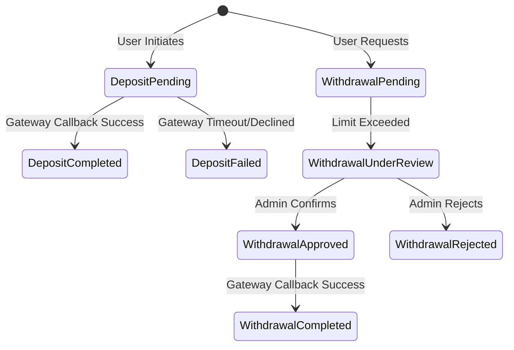
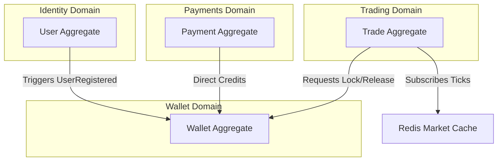
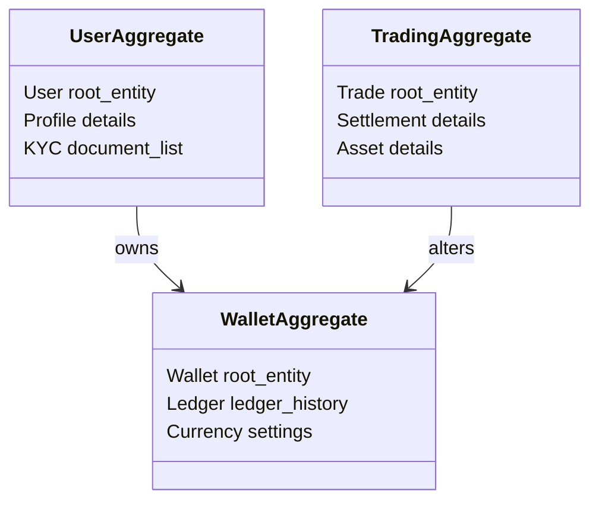

# Domain Model Specification
## Project: Independent Online Binary Trading Platform

---

## Revision History

| Date | Version | Description | Author |
| :--- | :--- | :--- | :--- |
| 2026-07-22 | 1.0.0 | Initial release of Domain Model Specification using Domain-Driven Design (DDD) principles. | Lead Domain Architect / Antigravity |

---

## Table of Contents

1. [Domain Overview](#1-domain-overview)
2. [Domain Catalogue](#2-domain-catalogue)
3. [Core Business Entities](#3-core-business-entities)
4. [Entity Lifecycles](#4-entity-lifecycles)
5. [Domain Ownership & Access Matrix](#5-domain-ownership--access-matrix)
6. [Domain Events & Message Brokerage](#6-domain-events--message-brokerage)
7. [Domain Relationships (Mermaid Diagrams)](#7-domain-relationships-mermaid-diagrams)
8. [Business Invariants](#8-business-invariants)
9. [Aggregate Boundaries (DDD Architecture)](#9-aggregate-boundaries-ddd-architecture)
10. [Future Expansion Sub-domains](#10-future-expansion-sub-domains)
11. [Glossary of Domain Terminology](#11-glossary-of-domain-terminology)

---

## 1. Domain Overview

This specification maps the platform into isolated, contextual **Domains** following Domain-Driven Design (DDD) principles. It establishes the business boundaries, entity states, transactional invariants, and asynchronous message event pipelines without prescribing database models or technical frameworks.

```
       ┌────────────────────────────────────────────────────────┐
       │                      API GATEWAY                       │
       └───────────────────────────┬────────────────────────────┘
                                   │
     ┌─────────────────────────────┼─────────────────────────────┐
     ▼                             ▼                             ▼
┌──────────────┐             ┌──────────────┐             ┌──────────────┐
│   IDENTITY   │             │   TRADING    │             │    WALLET    │
│  SUB-DOMAIN  │             │  SUB-DOMAIN  │             │  SUB-DOMAIN  │
└──────────────┘             └──────────────┘             └──────────────┘
     │                             │                             │
     ▼                             ▼                             ▼
┌──────────────┐             ┌──────────────┐             ┌──────────────┐
│  COMPLIANCE  │             │ MARKET DATA  │             │   PAYMENTS   │
│  SUB-DOMAIN  │             │  SUB-DOMAIN  │             │  SUB-DOMAIN  │
└──────────────┘             └──────────────┘             └──────────────┘
```

---

## 2. Domain Catalogue

### 1. Identity Domain
*   **Purpose**: Manages user profiles, role definitions, and credentials.
*   **Business Responsibilities**: Authenticating login requests, managing credentials, enforcing user access roles, and managing active sessions.
*   **Owned Entities**: `User`, `Role`, `Permission`, `Session`.
*   **Inbound Interactions**: Token validations from the Gateway.
*   **Outbound Interactions**: Broadcasts registration alerts to the Compliance and Referral domains.
*   **Dependencies**: None.
*   **Lifecycle**: Registers profiles, suspends active credentials, and archives profiles on account closure.
*   **Boundaries**: Does not read or modify balances or trade logs.

### 2. Trading Domain
*   **Purpose**: Manages binary option contracts.
*   **Business Responsibilities**: Validating order structures, capturing execution strike prices, scheduling ex-pirations, and calculating outcomes.
*   **Owned Entities**: `Trade`, `Settlement`, `Asset`.
*   **Inbound Interactions**: Order placements from users. Price ticks from the Market Data domain.
*   **Outbound Interactions**: Requests wallet stake locks and settles win/loss credits with the Wallet domain.
*   **Dependencies**: Wallet, Market Data, Risk.
*   **Lifecycle**: Creates draft orders, locks active statuses, and closes/resolves contracts on expiration.
*   **Boundaries**: Cannot modify wallets directly without calling the Wallet domain API.

### 3. Wallet Domain
*   **Purpose**: Manages user balances.
*   **Business Responsibilities**: Ensuring transaction integrity, tracking currency types, and auditing ledger transactions.
*   **Owned Entities**: `Wallet`, `Ledger`.
*   **Inbound Interactions**: Requests to lock stakes or credit wins from the Trading domain. Credit calls from the Payments domain.
*   **Outbound Interactions**: Triggers notification events on ledger changes.
*   **Dependencies**: None.
*   **Lifecycle**: Instantiates wallets during registration, logs transaction entries, and closes wallets on account deactivation.
*   **Boundaries**: Does not process external fiat cash or run trading logic.

### 4. Payments Domain
*   **Purpose**: Integrates external payment gateways.
*   **Business Responsibilities**: Tracking deposit requests, parsing webhook confirmation payloads, and managing withdrawal review pipelines.
*   **Owned Entities**: `Deposit`, `Withdrawal`, `Payment`.
*   **Inbound Interactions**: Deposit checkouts from users. Administrative approvals from the Administration domain.
*   **Outbound Interactions**: Credits the Wallet domain upon payment verification.
*   **Dependencies**: Wallet, Compliance.
*   **Lifecycle**: Records pending requests, queries gate statuses, and writes completed transactions.
*   **Boundaries**: Has read-only access to user profiles. Cannot adjust wallet balances directly without generating double-entry ledger logs.

### 5. Market Data Domain
*   **Purpose**: Manages market price tick aggregation.
*   **Business Responsibilities**: Accessing external price feeds, calculating candlestick aggregations, and broadcasting live ticks.
*   **Owned Entities**: `Market`, `Price`.
*   **Inbound Interactions**: Subscriptions from frontend clients.
*   **Outbound Interactions**: Feeds real-time tick prices to the Trading and Risk domains.
*   **Dependencies**: None.
*   **Lifecycle**: Streams price ticks continuously while asset markets are open.
*   **Boundaries**: Independent of user profiles and ledger balances.

---

## 3. Core Business Entities

### Entity: `User`
*   **Purpose**: Represents a platform customer or operational user.
*   **Owner**: Identity Domain.
*   **State**: `Unverified` -> `Verified` -> `Suspended` -> `Closed`.
*   **Business Rules**: Each user must be linked to a single wallet. Email addresses must be unique.
*   **Relationships**: 1-to-1 with `Wallet`. 1-to-Many with `Trade`, `Transaction`, `Audit Log`.
*   **Events**: `UserRegistered`, `UserSuspended`, `UserClosed`.
*   **Validation Rules**: Validate email addresses. Password criteria must meet the configured security policies.

### Entity: `Wallet`
*   **Purpose**: Represents the user's active financial balance.
*   **Owner**: Wallet Domain.
*   **State**: `Active` -> `Locked` -> `Closed`.
*   **Business Rules**: Balance cannot drop below zero. Every update requires a corresponding entry in the ledger.
*   **Relationships**: 1-to-1 with `User`. 1-to-Many with `Ledger`.
*   **Events**: `WalletCredited`, `WalletDebited`.
*   **Validation Rules**: Quantities must use positive values.

### Entity: `Ledger`
*   **Purpose**: Immutable log of financial balance changes.
*   **Owner**: Wallet Domain.
*   **State**: `Immutable` (no modifications allowed after creation).
*   **Business Rules**: Records must contain balancing debit and credit entries.
*   **Relationships**: Many-to-1 with `Wallet`.
*   **Events**: `LedgerWritten`.
*   **Validation Rules**: System-wide check ensuring total debits equal total credits.

### Entity: `Trade`
*   **Purpose**: Represents a binary options contract.
*   **Owner**: Trading Domain.
*   **State**: `Draft` -> `Active` -> `Settling` -> `Resolved` or `Cancelled`.
*   **Business Rules**: Expiry time must be strictly greater than purchase time. Strike price matches the asset price at the purchase millisecond.
*   **Relationships**: Many-to-1 with `User`, Many-to-1 with `Asset`.
*   **Events**: `TradeOpened`, `TradeSettled`, `TradeCancelled`.
*   **Validation Rules**: Stakes must be within platform configurations.

---

## 4. Entity Lifecycles

### Trade Lifecycle
```
[Draft] ──(Validations Check)──► [Active] ──(Duration Expiry)──► [Settling]
                                                                     │
[Archived] ◄──(Compliance Lock)── [Resolved] ◄──(Ledger Settlement)──┘
                                      ▲
                                      └─────────(Oracle Gap)─────► [Cancelled]
```
1.  **Draft**: The user configures trade parameters in the UI. No balance is locked yet.
2.  **Active**: Stake is checked and debited from the wallet. The trade locks the entry strike price.
3.  **Settling**: The contract reaches its expiry timestamp and retrieves the final settlement price tick.
4.  **Resolved**: The outcome (Win/Loss/Draw) is calculated, and payouts are credited via the ledger.
5.  **Cancelled**: The trade is voided due to market data gaps or technical failures; the original stake is refunded via the ledger.
6.  **Archived**: Closed contracts are archived in read-only tables for database performance optimization.

### Wallet Lifecycle
```
[Active] ──(Withdrawal Lock Request)──► [Locked] ──(Disbursement Confirmed)──► [Active]
   │                                                                             ▲
   └───────────────(Deactivation Request)────────────────► [Closed] ─────────────┘
```
*   **Active**: Operational wallet accepting deposits and trade stakes.
*   **Locked**: Balance is reserved for pending withdrawals or open trades, restricting access.
*   **Closed**: Deactivated wallet.

### Deposit & Withdrawal Lifecycles


---

## 5. Domain Ownership & Access Matrix

This matrix establishes domain isolation rules. Direct database reads or modifications of a domain's entities by unauthorized sub-domains are prohibited.

| Sub-Domain | Primary Owner Module | Allowed to Read | Allowed to Write / Modify | Never Access Directly |
| :--- | :--- | :--- | :--- | :--- |
| **Identity** | Auth Service | All Services | Auth Service, User Management | Payments, Trading |
| **Trading** | Trading Engine | Risk, Compliance, Admin | Trading Engine, Settlement | Payments, KYC |
| **Wallet** | Wallet Core | Trading, Payments, Admin | Wallet Core, Ledger Core | Market Data, Identity |
| **Payments** | Payment Service | Admin, Finance | Payment Service, Gateway Webhooks | Trading, Market Data |
| **Market Data**| Pricing Service | Trading, Risk, Frontend | Pricing Service | Identity, Wallet |

---

## 6. Domain Events & Message Brokerage

The platform relies on asynchronous event-driven communication to ensure components remain decoupled.

| Event Name | Trigger Source | Publisher | Subscribers | Business Outcome |
| :--- | :--- | :--- | :--- | :--- |
| **UserRegistered** | User registration form submission. | Auth Service | Compliance, Referrals | Creates a new empty wallet; generates verification emails. |
| **DepositCompleted** | Payment provider callback success. | Payment Service | Wallet, Notification | Credits user balances; updates deposit logs. |
| **TradeOpened** | Trade balance validation success. | Trading Service | Risk, Wallet | Locks stake from wallet; adds transaction record to logs. |
| **TradeSettled** | Settlement evaluations complete. | Settlement Svc | Wallet, Notification | Distributes payouts; updates daily P/L charts. |
| **WithdrawalApproved**| Admin withdrawal confirmation. | Finance Svc | Payment Service | Triggers external gateway payouts. |
| **KYCApproved** | Compliance document validation. | Compliance Svc | Identity, Notification | Enables profile withdrawal options. |

---

## 7. Domain Relationships (Mermaid Diagrams)

### Aggregate Dependencies & Event Flow



---

## 8. Business Invariants

The platform enforces the following structural constraints:

> [!IMPORTANT]
> *   **Non-Negative Balances**: Wallet balances must satisfy:
>     $$\text{Balance}_{\text{Active}} + \text{Balance}_{\text{Locked}} \ge 0$$
> *   **Ledger Immutability**: Ledger records are read-only. Adjustments must use correcting entry transactions.
> *   **Trade Expiry Constraints**: Contract expiration calculations must satisfy:
>     $$\text{Timestamp}_{\text{Expiry}} > \text{Timestamp}_{\text{Purchase}}$$
> *   **No Direct Wallet Manipulation**: Wallet adjustments must generate a ledger record referencing the user and administrative ID.
> *   **Single Owner Bindings**: Each wallet must link to exactly one user.

---

## 9. Aggregate Boundaries (DDD Architecture)

Following Domain-Driven Design (DDD), entities are grouped into **Aggregates** managed by a single transaction boundary root.



### 1. User Aggregate
*   **Boundary Root**: `User` entity.
*   **Contents**: `User`, `Profile`, `KYC Verification` documents.
*   **Purpose**: Manages credentials, KYC status changes, and access permissions safely inside user updates.

### 2. Wallet Aggregate
*   **Boundary Root**: `Wallet` entity.
*   **Contents**: `Wallet`, `Ledger` histories.
*   **Purpose**: Ensures all balance debits and credits execute transactionally with corresponding ledger items.

### 3. Trading Aggregate
*   **Boundary Root**: `Trade` entity.
*   **Contents**: `Trade`, `Settlement` outcomes, `Asset` parameters.
*   **Purpose**: Ensures entry price capture, ex-pirations, and outcomes execute together without external interference.

---

## 10. Future Expansion Sub-domains

The domain structure is designed to support the following business features:
*   **Copy Trading Sub-domain**: Allows users to follow or mirror active trades from top performers.
*   **Synthetic Market Generation**: Generates 24/7 pricing using proprietary mathematical models.
*   **Affiliate Network Hub**: Manages multi-level referral code earnings.

---

## 11. Glossary of Domain Terminology

*   **Bounded Context**: The boundary within which a domain model applies.
*   **Aggregate Root**: An entity that binds related objects together to manage transaction constraints.
*   **Domain Event**: An event that occurred in a business domain that other domains need to know about.
*   **Double-Entry Ledger**: Financial records requiring debit and credit transactions to balance.
*   **KYC Status**: The verification state of a user's identity documentation.
*   **Invariant**: A business condition that must always remain true.
*   **Strike Price**: The price at which a contract is entered.
*   **Expiry Price**: The price of the asset when the contract expires.
