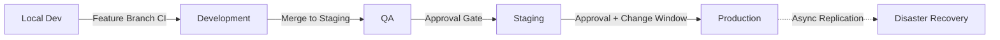
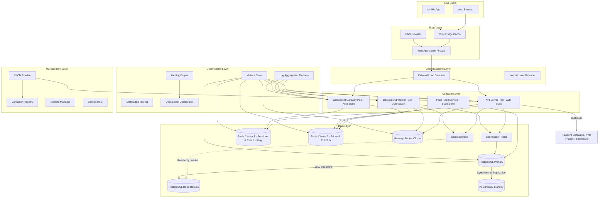
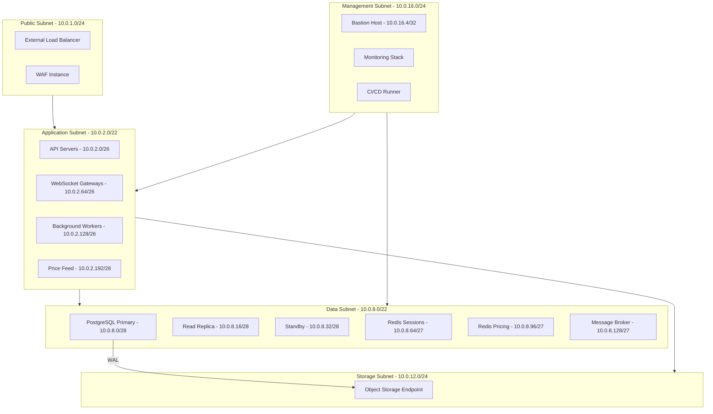
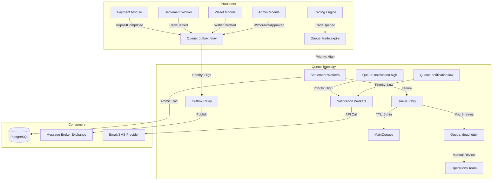
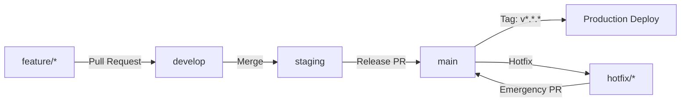
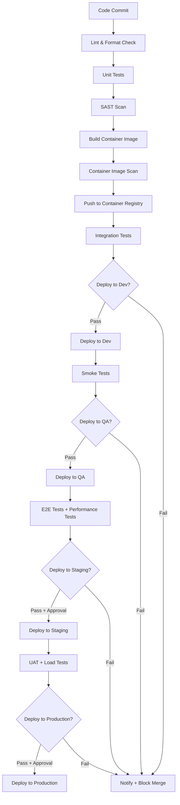
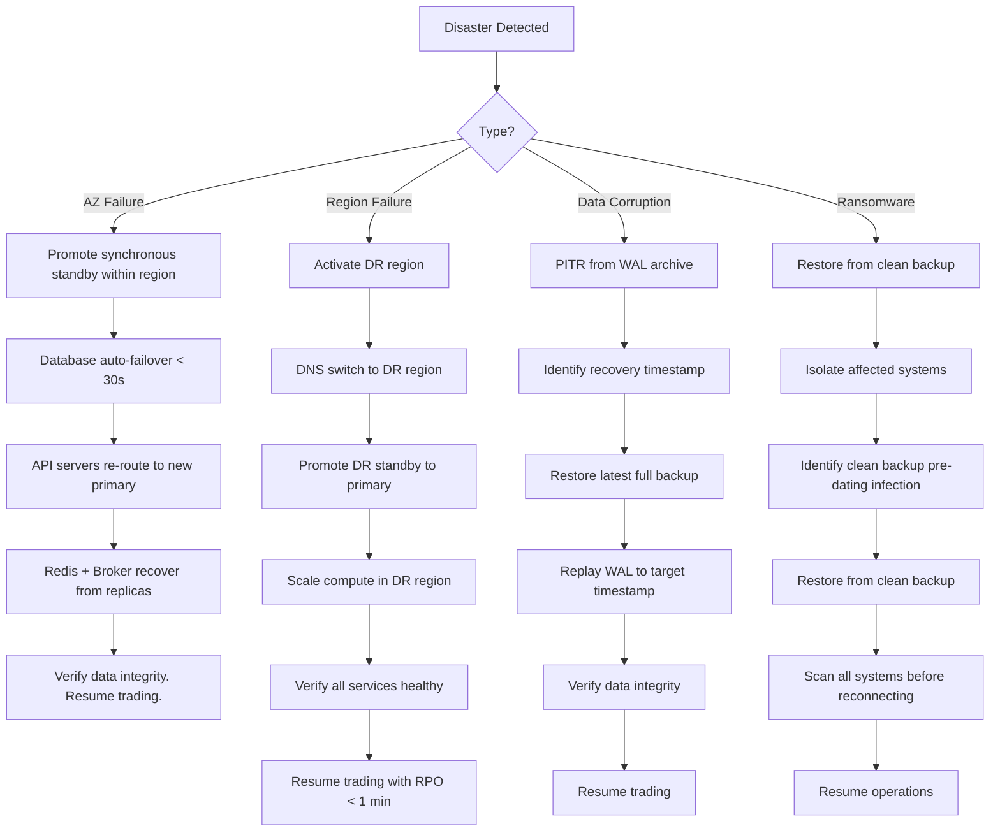
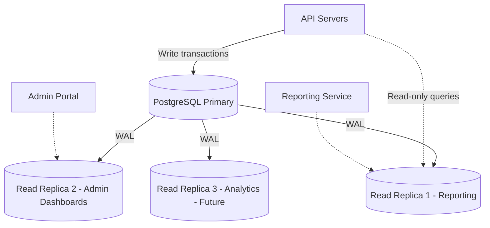

# Infrastructure & DevOps Specification (IDS)
## Project: Independent Online Binary Trading Platform

---

## Revision History

| Date | Version | Description | Author |
| :--- | :--- | :--- | :--- |
| 2026-07-22 | 1.0.0 | Initial Infrastructure & DevOps Specification. Derived from BRD v1.0, SRS v1.0, Domain Model v1.0, Software Architecture v1.1, Architecture Review v1.0, Database Design v1.0, API Design v1.0, UI/UX Design v1.0, Security Architecture v1.0, Project Plan v1.0, and Technical Analysis Report v1.0. | Lead Infrastructure Architect / Antigravity |

---

## Cross-References

| Document | Location |
| :--- | :--- |
| Business Requirements Document | [docs/01_BUSINESS_REQUIREMENTS.md](file:///c:/Users/user/Downloads/bullion-terminal_3/docs/01_BUSINESS_REQUIREMENTS.md) |
| System Requirements Specification | [docs/02_SYSTEM_REQUIREMENTS.md](file:///c:/Users/user/Downloads/bullion-terminal_3/docs/02_SYSTEM_REQUIREMENTS.md) |
| Domain Model Specification | [docs/03_DOMAIN_MODEL.md](file:///c:/Users/user/Downloads/bullion-terminal_3/docs/03_DOMAIN_MODEL.md) |
| Software Architecture v1.1 | [docs/04_SOFTWARE_ARCHITECTURE.md](file:///c:/Users/user/Downloads/bullion-terminal_3/docs/04_SOFTWARE_ARCHITECTURE.md) |
| Architecture Review v1.0 | [docs/05_ARCHITECTURE_REVIEW.md](file:///c:/Users/user/Downloads/bullion-terminal_3/docs/05_ARCHITECTURE_REVIEW.md) |
| Database Design Specification | [docs/06_DATABASE_DESIGN_SPECIFICATION.md](file:///c:/Users/user/Downloads/bullion-terminal_3/docs/06_DATABASE_DESIGN_SPECIFICATION.md) |
| API Design Specification | [docs/07_API_DESIGN_SPECIFICATION.md](file:///c:/Users/user/Downloads/bullion-terminal_3/docs/07_API_DESIGN_SPECIFICATION.md) |
| UI/UX Design Specification | [docs/08_UI_UX_DESIGN_SPECIFICATION.md](file:///c:/Users/user/Downloads/bullion-terminal_3/docs/08_UI_UX_DESIGN_SPECIFICATION.md) |
| Security Architecture & Threat Model | [docs/09_SECURITY_ARCHITECTURE_AND_THREAT_MODEL.md](file:///c:/Users/user/Downloads/bullion-terminal_3/docs/09_SECURITY_ARCHITECTURE_AND_THREAT_MODEL.md) |
| Project Plan | [public/PROJECT_PLAN.md](file:///c:/Users/user/Downloads/bullion-terminal_3/public/PROJECT_PLAN.md) |
| Technical Analysis Report | [public/Technical_Analysis_Report.pdf](file:///c:/Users/user/Downloads/bullion-terminal_3/public/Technical_Analysis_Report.pdf) |

---

## Table of Contents

1. [Infrastructure Philosophy](#1-infrastructure-philosophy)
2. [Environment Strategy](#2-environment-strategy)
3. [Infrastructure Overview](#3-infrastructure-overview)
4. [Hosting Strategy](#4-hosting-strategy)
5. [Compute Layer](#5-compute-layer)
6. [Networking](#6-networking)
7. [Database Infrastructure](#7-database-infrastructure)
8. [Cache Layer](#8-cache-layer)
9. [Message Broker](#9-message-broker)
10. [Object Storage](#10-object-storage)
11. [CI/CD Pipeline](#11-cicd-pipeline)
12. [Deployment Strategy](#12-deployment-strategy)
13. [Monitoring & Observability](#13-monitoring--observability)
14. [Logging](#14-logging)
15. [Disaster Recovery](#15-disaster-recovery)
16. [Scalability Architecture](#16-scalability-architecture)
17. [Operational Runbooks](#17-operational-runbooks)
18. [Infrastructure Validation](#18-infrastructure-validation)
19. [Readiness Assessment](#19-readiness-assessment)
20. [Final Recommendation](#20-final-recommendation)
21. [Technology Decision Matrix](#21-technology-decision-matrix)

---

## 1. Infrastructure Philosophy

### 1.1 Guiding Principles

| Principle | Definition | Architectural Enforcement |
| :--- | :--- | :--- |
| **High Availability** | The platform remains operational despite component failures. No single point of failure exists in the critical path. | Multi-AZ deployment. Redundant load balancers. Database with synchronous standby. Redis with automatic failover. |
| **Fault Tolerance** | System components degrade gracefully on failure. Failures are contained and do not cascade. | Circuit breakers between modules. Dead-letter queues for failed jobs. Fallback price providers. Read replicas for reporting. |
| **Automation First** | Every operational procedure is automated. Manual intervention is the exception, triggered only by automation failure. | Infrastructure as Code for all provisioning. Automated CI/CD with zero-touch deployments. Automated backups and recovery testing. |
| **Infrastructure as Code** | All infrastructure is defined, versioned, and deployed through code. No manual server configuration. | All configuration in version control. Immutable infrastructure — servers are never patched in place, only replaced. |
| **Immutable Deployments** | Deployments create new instances rather than modifying existing ones. Rollback is instant by routing traffic to the previous version. | Blue-green deployment strategy. Container images with immutable tags. Database migrations always backward-compatible. |
| **Zero Downtime** | Deployments, scaling events, and maintenance operations cause no service interruption. | Rolling deployments with health checks. Connection draining before instance termination. Read replicas handle queries during primary maintenance. |
| **Scalability** | Every layer scales independently in response to load. Adding capacity does not require architectural changes. | Stateless API servers scale horizontally. Workers scale by queue depth. Database scales vertically and via read replicas. |
| **Security by Default** | Every infrastructure decision defaults to the secure option. Security controls are embedded in the infrastructure, not bolted on later. | Network segmentation (SATM §8). Encryption at rest and in transit. Secrets never in configuration files. Rate limiting at the gateway. |

### 1.2 Infrastructure Ownership

| Domain | Owner | Key Responsibilities |
| :--- | :--- | :--- |
| **Cloud Infrastructure** | DevOps / SRE | Provisioning, networking, scaling, monitoring |
| **Database Administration** | DBA / DevOps | Backup, replication, performance, migration |
| **CI/CD Pipeline** | DevOps | Build, test, deploy, rollback pipelines |
| **Security Infrastructure** | Security Engineer | WAF, secrets management, certificate rotation |
| **Monitoring & Observability** | SRE / DevOps | Metrics, logging, alerting, dashboards |

---

## 2. Environment Strategy

### 2.1 Environment Definitions

| Environment | Purpose | Configuration | Data Isolation | Deploy Trigger |
| :--- | :--- | :--- | :--- | :--- |
| **Local Development** | Individual developer testing. Rapid iteration. | Single-instance. Mock payment gateways. SQLite or local PostgreSQL. Seeded test data. | Ephemeral. No real data. | Manual (`docker compose up`) |
| **Development** | Shared integration testing. Feature branch validation. | Multi-service. Sandbox payment gateways. Anonymised sample data. | Synthetic data only. No PII. | CI on feature branch push |
| **Quality Assurance** | Pre-release validation. End-to-end testing. Performance testing. | Full topology (reduced scale). Sandbox gateways. Generated test data. | Isolated. 1 replica of production DB size 10%. | CI on staging branch merge |
| **Staging** | Production mirror for final validation. Load testing. UAT. | Production-equivalent topology. Sandbox gateways. Anonymised production data copy. | Anonymised PII. Weekly refresh from production. | Manual approval after QA pass |
| **Production** | Live platform serving real users. Real payment gateways. | Full HA topology. Auto-scaling. Real credentials. | Real user data. Encrypted PII. | Manual approval + change window |
| **Disaster Recovery** | Business continuity. Recovery from catastrophic failure. | Secondary region. Standby database. Cold compute pool. | Real-time replication from production. | Automatic (on primary region failure) |

### 2.2 Environment Promotion Flow



### 2.3 Data Isolation Rules

| Environment | Payment Gateways | External Integrations | PII Present? |
| :--- | :--- | :--- | :--- |
| Local | Mock | None | ❌ |
| Development | Sandbox | Sandbox KYC | ❌ |
| QA | Sandbox | Sandbox all | ❌ |
| Staging | Sandbox | Sandbox all | ✅ Anonymised |
| Production | Live | Live | ✅ Real |
| DR | Live (read-only) | Live (read-only) | ✅ Real |

---

## 3. Infrastructure Overview

### 3.1 Complete Infrastructure Diagram



### 3.2 Component Summary

| Layer | Components | Purpose |
| :--- | :--- | :--- |
| **Edge** | CDN, WAF, DNS | Caching static assets, DDoS protection, TLS termination, DNS routing |
| **Load Balancing** | External LB, Internal LB | Traffic distribution, health checks, TLS termination |
| **Compute** | API Servers, WebSocket Gateways, Workers, Price Feed | Application logic, real-time streaming, background processing, market data |
| **Data** | PostgreSQL, Redis (×2), Message Broker, Object Storage | Transactional data, caching, async messaging, file storage |
| **Observability** | Metrics, Logs, Traces, Dashboards, Alerting | System health, debugging, business analytics |
| **Management** | CI/CD, Registry, Secrets, Bastion | Deployment, artifact storage, credential management, admin access |

---

## 4. Hosting Strategy

### 4.1 Required Capabilities (Vendor-Agnostic)

The hosting provider must support the following capabilities. No specific vendor is mandated at this stage (see Section 21 for evaluation criteria):

| Capability | Requirement | Rationale |
| :--- | :--- | :--- |
| **Global Regions** | Multiple geographic regions with at least 3 availability zones per region | DR readiness (SATM §15). Low-latency price delivery to users worldwide. |
| **Managed Relational Database** | Automated backups, point-in-time recovery, read replicas, cross-region replication, auto-failover | DDS §2 topology requires primary + synchronous standby + read replica. |
| **Managed In-Memory Cache** | Clustering, replication, persistence, automatic failover | Two separate clusters per ADR-003. |
| **Container Orchestration** | Automated deployment, scaling, health checks, service discovery, rolling updates | Compute layer requires auto-scaling API servers and workers (SAD §10). |
| **Object Storage** | Unlimited capacity, lifecycle policies, server-side encryption, cross-region replication | KYC documents, backups, reports (DDS §4). |
| **Global CDN** | Edge caching, DDoS protection, SSL termination, WAF capabilities | Static asset delivery, API acceleration. |
| **Secrets Management** | Encrypted storage, automatic rotation, access audit logging | All secrets per SATM §9.1. |
| **Container Registry** | Immutable image tags, vulnerability scanning, access control | CI/CD pipeline artifacts. |
| **Managed DNS** | Low-latency resolution, health-check-based routing, failover | DNS failover for DR scenario. |

### 4.2 Deployment Model

| Consideration | Requirement |
| :--- | :--- |
| **Model** | Infrastructure as Code (IaC). All resources provisioned via declarative templates. |
| **Immutable** | Servers and containers are never modified in place. Deployments create new resources. |
| **Ephemeral** | Compute instances are disposable. State lives in the data layer only. |
| **Environment Isolation** | Each environment (dev, staging, prod) is a separate, isolated account/project. |
| **Cost Model** | Pay-as-you-go for compute. Reserved capacity for predictable database and cache baselines. |

---

## 5. Compute Layer

### 5.1 Node Types

| Node Type | Purpose | Baseline Spec | Scaling | Stateless? |
| :--- | :--- | :--- | :--- | :--- |
| **API Server** | Handles REST API requests. All public endpoints. | 2 vCPU, 4 GB RAM | Horizontal (per CPU + request rate) | ✅ Yes |
| **WebSocket Gateway** | Maintains persistent WS connections. Subscribes to Redis Pub/Sub. | 2 vCPU, 4 GB RAM | Horizontal (per connection count: 1,000/node) | ✅ Yes |
| **Settlement Worker** | Processes expired contracts. Atomic CAS operations. | 2 vCPU, 4 GB RAM | Horizontal (per queue depth: scale if > 500) | ✅ Yes |
| **Notification Worker** | Sends email, SMS, push notifications. | 1 vCPU, 2 GB RAM | Horizontal (per queue depth) | ✅ Yes |
| **Outbox Relay Worker** | Polls event_outbox table, publishes to broker. | 1 vCPU, 2 GB RAM | Fixed (2 instances for HA) | ✅ Yes |
| **Reconciliation Worker** | Daily ledger reconciliation. | 1 vCPU, 2 GB RAM | Scheduled (cron trigger) | ✅ Yes |
| **Price Feed Service** | Connects to market data providers. Writes ticks to DB + Redis. | 2 vCPU, 4 GB RAM | Fixed (1 active + 1 standby) | ⚠️ Stateful (provider connection) |

### 5.2 Auto-Scaling Triggers

| Pool | Metric | Scale Out | Scale In | Cooldown |
| :--- | :--- | :--- | :--- | :--- |
| API Servers | CPU utilization > 70% for 2 min | +2 instances | CPU < 30% for 5 min | 60 seconds |
| API Servers | Request rate > 500 req/s/node | +2 instances | Request rate < 100 req/s/node | 60 seconds |
| WebSocket Gateways | Connection count > 800/node | +1 instance | Connection count < 200/node | 120 seconds |
| Settlement Workers | Queue depth > 500 | +2 workers | Queue depth < 50 for 5 min | 60 seconds |
| Notification Workers | Queue depth > 1,000 | +2 workers | Queue depth < 100 for 5 min | 60 seconds |

### 5.3 Resource Isolation

| Concern | Strategy |
| :--- | :--- |
| **Noisy neighbour** | Each node type runs in its own auto-scaling group with dedicated resource pools. API servers do not compete with workers for memory. |
| **Price Feed isolation** | Runs as a standalone process in its own container with dedicated resource allocation. API server restarts do not disrupt price feeds (per SAD §5.4). |
| **Worker prioritisation** | Settlement workers have higher resource guarantees than notification workers. Separate scaling groups with different priority levels. |

---

## 6. Networking

### 6.1 Network Topology



### 6.2 Firewall Rules

| Rule # | Direction | Source | Destination | Port | Protocol | Purpose |
| :--- | :--- | :--- | :--- | :--- | :--- | :--- |
| 1 | Inbound | Internet | Public LB | 443 | TCP | HTTPS traffic |
| 2 | Inbound | Public LB | API Servers | 8080 | TCP | Reverse proxy traffic |
| 3 | Inbound | Public LB | WebSocket Gateways | 443 | TCP | WebSocket connections |
| 4 | Inbound | App Subnet | PostgreSQL Primary | 5432 | TCP | Database writes |
| 5 | Inbound | App Subnet | Read Replica | 5432 | TCP | Database reads |
| 6 | Inbound | App Subnet + Workers | Redis Sessions | 6379 | TCP | Session cache |
| 7 | Inbound | App Subnet + Workers + Price Feed | Redis Pricing | 6379 | TCP | Price cache |
| 8 | Inbound | App Subnet + Workers | Message Broker | 9092 | TCP | Event publishing |
| 9 | Inbound | Bastion | All subnets | 22 | TCP | SSH (key + MFA only) |
| 10 | Outbound | App Subnet | Internet | 443 | TCP | External API calls (allowlisted) |

### 6.3 Network ACLs

| Subnet | Inbound Allow | Outbound Allow |
| :--- | :--- | :--- |
| Public | 443 from 0.0.0.0/0 | 8080, 443 to App subnet |
| Application | 8080, 443 from Public. 22 from Mgmt. | 5432, 6379, 9092 to Data. 443 to Internet. |
| Data | 5432, 6379, 9092 from App. 22 from Mgmt. | 443 to Storage (backups). Deny all Internet. |
| Management | 22 from Bastion IP only. | All subnets. |

### 6.4 DNS & TLS

| Component | DNS Pattern | TLS |
| :--- | :--- | :--- |
| API | `api.example.com` | Wildcard `*.example.com`. Auto-renewed via ACME protocol. |
| WebSocket | `ws.example.com` | Same wildcard. |
| Admin | `admin.example.com` | Same wildcard. |
| CDN | `cdn.example.com` | Managed by CDN provider. |
| Internal services | `*.internal.example.com` | Internal CA or service mesh mTLS. |

---

## 7. Database Infrastructure

### 7.1 Topology

```mermaid
graph TD
    subgraph App[Application Layer]
        API[API Servers]
        Workers[Background Workers]
    end

    subgraph Pooling[Connection Pooling Layer]
        CP[Connection Pooler - Transaction Mode]
    end

    subgraph Primary[Primary Region]
        Primary[(PostgreSQL Primary)]
        Standby[(Synchronous Standby)]
    end

    subgraph Replica[Read Layer]
        ReadReplica[(Asynchronous Read Replica)]
    end

    subgraph Backup[Backup Layer]
        WAL[(WAL Archive - Object Storage)]
        Full[(Full Backups - Object Storage)]
    end

    API --> CP
    Workers --> CP
    CP --> Primary
    CP -.->|Read-only transactions| ReadReplica
    Primary -->|Synchronous| Standby
    Primary -->|WAL Streaming| ReadReplica
    Primary -->|WAL Archive| WAL
    Primary -->|Full Backup| Full
```

### 7.2 Configuration Requirements

| Parameter | Requirement | Rationale |
| :--- | :--- | :--- |
| **Engine** | Relational database with full ACID compliance, row-level locking, SERIALIZABLE isolation | Financial transaction integrity (DDS §1). `SELECT FOR UPDATE` support (ADR-009). |
| **Storage** | SSD-backed. Minimum 5,000 IOPS. Auto-scaling storage. | Price tick ingestion (50M rows/year). Ledger writes. |
| **High Availability** | Synchronous standby replica. Auto-failover < 30 seconds. | RTO < 5 min, RPO < 1 min (SAD §11). |
| **Read Replicas** | At least 1 async replica for reporting queries. | Isolate reporting from primary write path (DDS §2). |
| **Connection Pooling** | Transaction-mode pooling. Max 50 connections per app instance. | Prevent connection exhaustion (DDS §2). |
| **Automated Backups** | Daily full backup. Continuous WAL archiving. 30-day retention. | PITR capability. RPO < 1 min. |
| **Encryption** | AES-256 at rest. TLS 1.3 in transit. | SATM §7.1. |
| **Monitoring** | Replication lag (< 10s alert). Connection count. Query performance. Slow query log. | SATM §12.3. |

### 7.3 Connection Pooling Requirements

| Capability | Requirement |
| :--- | :--- |
| **Mode** | Transaction pooling (not statement or session). Connections are returned to pool after each transaction. |
| **Pool size** | Configurable. Default: 50 connections per application instance. |
| **Health checks** | Periodic TCP + SQL ping. Unhealthy connections discarded. |
| **TLS** | Connections between app and pooler encrypted. Pooler to primary also encrypted. |
| **Read/write splitting** | Read-only transactions routed to the read replica. Writes to primary. |

### 7.4 Backup Strategy

| Backup Type | Frequency | Retention | Encryption | Storage |
| :--- | :--- | :--- | :--- | :--- |
| Full database | Daily | 30 days (on-site) + 90 days (off-site) | AES-256 | Object storage |
| WAL archive | Continuous | 30 days | AES-256 | Object storage |
| Logical dump | Weekly | 90 days | AES-256 | Object storage |
| Transaction log | Real-time | 7 days | AES-256 | Primary storage |

---

## 8. Cache Layer

### 8.1 Two-Cluster Architecture

Per ADR-003, two separate cache clusters prevent cross-contamination of failure modes:

| Property | Cluster 1: Sessions & Rate Limiting | Cluster 2: Price Distribution |
| :--- | :--- | :--- |
| **Purpose** | JWT revocation blacklist, rate limit counters, session metadata | Live price ticks, OHLC candles, asset exposure counters |
| **Persistence** | RDB snapshots every 5 minutes | None (ephemeral cache) |
| **Eviction policy** | `allkeys-lru` | `volatile-ttl` |
| **High Availability** | Replication with automatic failover. Target: < 10s failover. | Replication with automatic failover. Target: < 10s failover. |
| **Memory** | Baseline: 2 GB. Max: 4 GB. | Baseline: 4 GB. Max: 8 GB. |
| **Network** | Dedicated subnet. No public access. | Dedicated subnet. No public access. |
| **Monitoring** | Memory usage, hit rate, eviction rate, latency (p99 < 1ms) | Memory usage, hit rate, latency |

### 8.2 Failover Behaviour

Per SATM §4.6 and SAD §12, Redis fail-closed behaviour is defined:

| Scenario | Cluster 1 (Sessions) Behaviour | Cluster 2 (Pricing) Behaviour |
| :--- | :--- | :--- |
| **Primary failure** | Automatic replica promotion. Connections reconnect. | Automatic replica promotion. Connections reconnect. |
| **Full cluster outage** | New logins blocked. Existing tokens valid for max 15 min (signature fallback). Rate limiting falls back to conservative in-app limits. | Price streaming halted. Settlement uses DB `price_ticks` table. Trade placement reads current price from DB (slower but functional). |
| **Performance degradation** | Reduced rate limiting throughput. Higher token validation latency. | Higher chart latency. Price gaps may appear. |

### 8.3 Key Patterns & TTLs

| Cluster | Key Pattern | TTL | Invalidation |
| :--- | :--- | :--- | :--- |
| Sessions | `session:{user_id}` | JWT expiry (15 min) | Deleted on logout. Updated on password change. |
| Sessions | `ratelimit:{ip}:{endpoint}` | 60 seconds | Hard expiry. |
| Sessions | `token:blacklist:{jti}` | Token TTL (max 15 min) | Auto-expire. |
| Pricing | `price:{symbol}:latest` | 2 seconds | Overwritten on each tick. |
| Pricing | `candle:{symbol}:{granularity}:{epoch}` | 120 seconds | Overwritten on each tick update. |
| Pricing | `exposure:{symbol}` | No TTL (in-memory) | Increment on trade open, decrement on settlement. |

---

## 9. Message Broker

### 9.1 Queue Architecture

The message broker provides durable, at-least-once delivery for all asynchronous workloads. All financial queues require persistent storage and acknowledgements.



### 9.2 Queue Definitions

| Queue Name | Content | Priority | Durability | Max Retries | Consumer |
| :--- | :--- | :--- | :--- | :--- | :--- |
| `trade.expiry` | Contract expiry jobs | High | Durable (persistent) | 3 (then DLQ) | Settlement Worker |
| `outbox.relay` | Financial domain events | High | Durable (persistent) | 3 (then DLQ) | Outbox Relay |
| `notification.high` | Trade results, deposit confirmations | High | Durable | 3 (then suppress) | Notification Worker |
| `notification.low` | Marketing, promotions | Low | Transient | 1 | Notification Worker |
| `retry` | Failed jobs awaiting retry | Medium | Durable | — | Re-queued to source |
| `dead.letter` | Permanently failed jobs | Low | Durable | — | Manual reconciliation |

### 9.3 Monitoring Requirements

| Metric | Warning | Critical | Action |
| :--- | :--- | :--- | :--- |
| Queue depth (trade.expiry) | > 200 | > 500 | Scale settlement workers |
| Queue depth (outbox.relay) | > 500 | > 1,000 | Alert operations |
| Consumer lag | > 1,000 messages | > 5,000 messages | Investigate consumer health |
| Dead-letter count | > 10 | > 50 | Manual reconciliation required |
| Processing time (p99) | > 2 seconds | > 5 seconds | Investigate worker performance |

---

## 10. Object Storage

### 10.1 Storage Categories

| Category | Contents | Retention | Encryption | Lifecycle |
| :--- | :--- | :--- | :--- | :--- |
| **KYC Documents** | ID scans, selfies, proof of address | 7 years after account closure | AES-256 server-side. Separate encryption key per user (envelope encryption). | Transition to cold storage after 1 year. Delete after retention period. |
| **Database Backups** | Full DB dumps, WAL archives | 30 days (hot) + 90 days (warm) | AES-256 | Delete after retention period. |
| **Reports** | Daily revenue, trade volume, settlement reports | 90 days | AES-256 | Transition to cold after 30 days. Delete after 90 days. |
| **Exports** | User-requested statement exports | 30 days | AES-256 | Delete after 30 days or on user request. |
| **Audit Archives** | Archived audit log partitions | 7 years | AES-256 | Immutable (WORM) policy. No deletion before retention expiry. |

### 10.2 Security Requirements

| Requirement | Specification |
| :--- | :--- |
| **Encryption at rest** | Server-side AES-256. Customer-managed key option. |
| **Encryption in transit** | TLS 1.3 for all upload/download operations. |
| **Access control** | Per-bucket IAM policies. Application instances have least-privilege access to specific buckets only. |
| **Malware scanning** | All KYC uploads scanned before final storage. Infected files quarantined. |
| **Immutable storage** | Audit archive bucket has WORM (Write Once, Read Many) policy enabled. |
| **Access logging** | All read/write operations logged. Logs sent to centralised log aggregation platform. |

---

## 11. CI/CD Pipeline

### 11.1 Branch Strategy



| Branch | Purpose | Deploy To | Protection |
| :--- | :--- | :--- | :--- |
| `feature/*` | Feature development | Development env | None |
| `develop` | Integration branch | Development + QA | Require PR + 1 approval + passing CI |
| `staging` | Pre-release validation | Staging env | Require PR + 2 approvals + QA sign-off |
| `main` | Release branch | Production | Require PR + 2 approvals + staging green + change window |
| `hotfix/*` | Emergency fixes | Production (expedited) | Require PR + 1 approval + expedited review |

### 11.2 Build Pipeline



### 11.3 Stage Gates

| Gate | Checks | Pass/Fail | Approver |
| :--- | :--- | :--- | :--- |
| **PR to develop** | Lint, unit tests, SAST, dependency scan | All pass | Any team member |
| **Merge to staging** | All develop checks + integration tests + container scan | All pass | Lead engineer |
| **Deploy to staging** | All staging branch checks + QA sign-off | All pass | QA lead |
| **Deploy to production** | All staging checks + load test results + change request | All pass + manual approval | Lead engineer + CTO |

### 11.4 Database Migration Strategy

Per SAD §14, all schema changes must be backward-compatible:

| Migration Type | Pattern | Rollback |
| :--- | :--- | :--- |
| **Add column** | `ALTER TABLE ADD COLUMN ... DEFAULT NULL` | Instant (remove column) |
| **Add table** | `CREATE TABLE` | Instant (drop table) |
| **Add index** | `CREATE INDEX CONCURRENTLY` | Instant (drop index) |
| **Remove column** | Phase 1: Stop writing. Phase 2: Stop reading. Phase 3: Remove. | Re-add column from backup |
| **Remove table** | Phase 1: Deprecate. Phase 2: Archive. Phase 3: Drop (after retention). | Restore from backup |
| **Data migration** | Backfill in batches. Run asynchronously. | Reverse backfill script |

### 11.5 Artifact Storage

| Artifact | Registry | Tagging | Retention |
| :--- | :--- | :--- | :--- |
| Container images | Internal container registry | `{branch}-{commit-sha}` for dev. `v{major}.{minor}.{patch}` for releases. | 90 days for dev tags. Indefinite for release tags. |
| Build artifacts | CI/CD artifact store | Build number | 30 days |
| Test reports | CI/CD artifact store | Build number + date | 90 days |

---

## 12. Deployment Strategy

### 12.1 Blue-Green Deployment (Primary)

```mermaid
graph TD
    subgraph Blue[Blue Environment - Active]
        BlueLB[Load Balancer]
        BlueAPI[API Server Pool]
        BlueWS[WebSocket Gateway Pool]
    end

    subgraph Green[Green Environment - Standby]
        GreenLB[Standby Load Balancer]
        GreenAPI[API Server Pool - New Version]
        GreenWS[WS Gateway Pool - New Version]
    end

    subgraph Shared[Shared Infrastructure]
        DB[(PostgreSQL)]
        Redis[Redis Clusters]
        Broker[Message Broker]
        Storage[Object Storage]
    end

    Router[Traffic Router] --> BlueLB
    BlueLB --> BlueAPI
    BlueLB --> BlueWS
    BlueAPI --> DB
    BlueAPI --> Redis
    GreenAPI --> DB
    GreenAPI --> Redis

    Note over Green: After smoke tests pass
    Router -.->|Traffic switch| GreenLB
    GreenLB --> GreenAPI
    GreenLB --> GreenWS
```

| Phase | Action | Duration | Risk |
| :--- | :--- | :--- | :--- |
| 1. Provision | Create new (green) environment. Deploy new version. | 10 min | Medium (resource provisioning) |
| 2. Validate | Run smoke tests against green. Verify health checks. | 5 min | Low |
| 3. Switch | Route live traffic from blue to green. | < 1 second | Low (instant DNS/LB update) |
| 4. Monitor | Observe green for 10 minutes. Monitor error rates, latency. | 10 min | Low |
| 5. Cleanup | If stable, decommission blue. If rollback, switch back. | 5 min | None (instantly reversible) |

### 12.2 Rollback Triggers

| Condition | Action |
| :--- | :--- |
| Error rate > 5% in green environment | Automatic rollback: switch traffic back to blue. |
| API latency p99 > 500ms | Automatic rollback. |
| Critical alert fires within 10 min of switch | Automatic rollback. |
| Manual rollback command issued by engineer | Immediate traffic switch to blue. |

### 12.3 Deployment Safety

| Concern | Policy |
| :--- | :--- |
| **Database migrations** | Applied before new code is deployed. Backward-compatible only (add columns, never remove). |
| **Worker drain** | Before deployment, workers finish current job. No new jobs accepted. Queued jobs remain in broker. |
| **WebSocket reconnection** | Clients disconnected during blue-green switch reconnect automatically to the new environment. Subscription state is re-established by the client (per ADS §17.5). |
| **Payment processing** | In-flight payment callbacks are handled by the shared infrastructure. No interruption. |
| **Settlement processing** | Settlement jobs in-flight during deployment continue on the shared broker. Workers in the new environment pick up unacknowledged jobs. |

### 12.4 Frontend Static Hosting (SPA Routing)

To prevent `404 NOT FOUND` errors when users refresh deep links (e.g., `/wallet`), the static hosting provider (Vercel/Render) must be configured with a **Rewrite Rule**:

- **Source**: `/(.*)`
- **Destination**: `/index.html`

This ensures the browser always loads the single-page entry point, allowing React Router to manage internal navigation and reload the correct UI state.

---

## 13. Monitoring & Observability

### 13.1 Metrics Categories

| Category | Key Metrics | Collection Interval | Retention |
| :--- | :--- | :--- | :--- |
| **Infrastructure** | CPU, memory, disk I/O, network throughput, connection count | 15 seconds | 30 days (1s resolution), 1 year (1 min aggregate) |
| **Application** | Request rate, error rate (4xx, 5xx), latency (p50, p95, p99), throughput | Per request | 30 days (raw), 1 year (aggregate) |
| **Business** | Trades placed/min, trades settled/min, deposits, withdrawals, active users, new registrations | Per event | 7 years (daily aggregate) |
| **Financial** | Total exposure, daily P&L, platform revenue, payout ratio, queue depth, outbox depth | 1 minute | 7 years (daily aggregate) |
| **Database** | Connections, replication lag, query latency, cache hit ratio, deadlocks | 15 seconds | 30 days |
| **Cache** | Memory usage, hit rate, eviction rate, connected clients, latency | 15 seconds | 30 days |
| **Broker** | Queue depth, consumer lag, publish rate, delivery rate, dead-letter count | 15 seconds | 30 days |

### 13.2 Dashboards

| Dashboard | Audience | Panels |
| :--- | :--- | :--- |
| **Executive** | CTO, CEO, Product | Revenue (daily/monthly), active users, trades volume, deposit/withdrawal volume, platform uptime, system availability (99.9% SLA) |
| **Operations** | DevOps, SRE | Infrastructure health (CPU, memory, disk across all nodes), deployment status, error rates, latency heatmap, queue depths, certificate expiry |
| **Financial** | Finance, Risk | Total exposure per asset, daily P&L, payout ratios, reconciliation status, pending withdrawals, ledger integrity |
| **Trading** | Risk Manager, Ops | Trades per second, settlement latency, price feed status, latency arbitrage detection, exposure breakdown |
| **Security** | Security Engineer, Compliance | Failed logins, MFA failures, rate limit violations, webhook signature failures, audit chain status, suspicious IP activity |

### 13.3 Health Check Endpoints

Every service exposes a `/health` endpoint returning:

```json
{
  "status": "healthy" | "degraded" | "unhealthy",
  "version": "1.2.3",
  "uptime_seconds": 3600,
  "dependencies": {
    "postgresql": { "status": "healthy", "latency_ms": 2 },
    "redis_sessions": { "status": "healthy", "latency_ms": 1 },
    "redis_pricing": { "status": "healthy", "latency_ms": 1 },
    "message_broker": { "status": "healthy", "latency_ms": 3 }
  }
}
```

### 13.4 Alert Thresholds

| Alert | Condition | Severity | Notification |
| :--- | :--- | :--- | :--- |
| API error rate | > 5% 5xx for 2 minutes | Critical | PagerDuty + Slack |
| API latency p99 | > 500ms for 2 minutes | Critical | PagerDuty + Slack |
| Database connection count | > 80% of max | Warning | Slack |
| Database replication lag | > 10 seconds | High | PagerDuty |
| Redis memory usage | > 80% | Warning | Slack |
| Redis cluster failover | Any promotion event | High | PagerDuty |
| Queue depth (settlement) | > 500 | Critical | PagerDuty + Slack |
| Dead letter queue count | > 10 | High | PagerDuty |
| Price feed disconnection | > 30 seconds | Critical | PagerDuty + Slack |
| Certificate expiry | < 30 days | Warning | Slack |
| Certificate expiry | < 7 days | Critical | PagerDuty |
| Disk usage | > 85% | Warning | Slack |
| Disk usage | > 95% | Critical | PagerDuty |

---

## 14. Logging

### 14.1 Log Format

All services emit structured JSON logs:

```json
{
  "timestamp": "2026-07-22T14:30:00.000Z",
  "level": "info",
  "service": "api-server",
  "request_id": "f1e2d3c4-b5a6-7890-abcd-ef1234567890",
  "correlation_id": "123e4567-e89b-12d3-a456-426614174000",
  "user_id": "a1b2c3d4-e5f6-7890-abcd-ef1234567890",
  "action": "trade_placed",
  "duration_ms": 45,
  "status_code": 201,
  "message": "Trade placed successfully",
  "metadata": {
    "contract_id": "c7b8a9d0-...",
    "amount": "50.00"
  }
}
```

### 14.2 Log Retention Tiers

| Tier | Retention | Storage | Access | Contents |
| :--- | :--- | :--- | :--- | :--- |
| **Hot** | 90 days | SSD-backed | Full-text search | All application logs. Infrastructure logs. Audit logs (copy). |
| **Warm** | 1 year | Object storage | Search with 1-hour delay | Aggregated application logs. Security events. |
| **Cold** | 7 years | Object storage (compressed) | Manual retrieval only | Financial audit subset. Regulatory records. |

### 14.3 Sensitive Data Masking

The following patterns are automatically masked before logs leave the service:

| Pattern | Masked Format | Example |
| :--- | :--- | :--- |
| Email addresses | `***@***.***` | `user@example.com` → `***@***.***` |
| Phone numbers | Last 4 digits only | `+254712345678` → `+254****5678` |
| IP addresses | Last octet removed | `192.168.1.100` → `192.168.1.xxx` |
| Payment card numbers | First 6 + last 4 | `4111111111111111` → `411111****1111` |
| Passwords/tokens | `[REDACTED]` | Any field matching `*password*`, `*secret*`, `*token*` |
| JWT payloads | `[REDACTED]` | Full JWT replaced with `[REDACTED]` |

### 14.4 Audit Log Ingestion

The hash-chained audit log from `admin.audit_logs` (DDS §5) is ingested into the centralised logging platform on a 1-minute delay. A daily verification cron job checks the hash chain integrity and reports results as a metric.

---

## 15. Disaster Recovery

### 15.1 Recovery Objectives

| Metric | Target | Source |
| :--- | :--- | :--- |
| **Recovery Time Objective (RTO)** | < 5 minutes for critical services | SAD v1.1 §11 |
| **Recovery Point Objective (RPO)** | < 1 minute for financial data | SAD v1.1 §11 |
| **Maximum acceptable data loss** | < 1 minute of transactions | SAD v1.1 §11 |
| **Recovery time for reporting** | < 1 hour | Internal SLA |

### 15.2 Backup Schedule

```mermaid
gantt
    title Backup Schedule
    dateFormat HH:mm
    axisFormat %H:%M

    section Database
    Full Backup                        :daily, 02:00, 30min
    WAL Archive (continuous)           :active, 00:00, 24h
    Logical Dump (weekly)              :Sun, 03:00, 45min

    section Storage
    KYC Document Backup                :daily, 04:00, 20min
    Config Backup (IaC state)          :after every apply, 00:00, 24h

    section Verification
    Backup Integrity Check             :daily, 02:45, 15min
    DR Drill (quarterly)               :crit, 2026-10-01, 4h
```



### 15.3 Disaster Recovery Flow



### 15.4 Recovery Validation

| Validation | Frequency | Method |
| :--- | :--- | :--- |
| Backup integrity | Daily | Automated checksum verification of all backup files |
| Database restore test | Weekly | Restore backup to isolated environment. Verify data integrity. |
| PITR test | Monthly | Recover database to a specific timestamp. Verify accuracy. |
| Full DR drill | Quarterly | Complete failover to DR region. Run for 4 hours. Fall back. |
| Runbook review | Quarterly | Review and update all runbooks based on drill findings. |

---

## 16. Scalability Architecture

### 16.1 Horizontal Scaling

| Layer | Scaling Mechanism | Bottleneck Prevention |
| :--- | :--- | :--- |
| **API Servers** | Add instances behind load balancer. Stateless — any instance handles any request. | Connection pooling prevents DB connection exhaustion. Redis clusters scale independently. |
| **WebSocket Gateways** | Add instances. Shared tick distribution via Redis Pub/Sub. No sticky sessions required. | Per-node connection limit: 1,000 concurrent connections. Auto-scale at 800 connections/node. |
| **Settlement Workers** | Increase consumer count for queue. Atomic CAS prevents duplicate processing on concurrent dequeue. | Queue depth monitoring. Auto-scale trigger: depth > 500. |
| **Notification Workers** | Increase consumer count. | Queue depth monitoring. |
| **Outbox Relay** | Fixed pool (2 instances). Poll-outbox pattern limits concurrency by design. | Outbox table depth monitored. Alert if > 1,000 events pending. |

### 16.2 Vertical Scaling

| Component | Vertical Limit | Trigger | Strategy |
| :--- | :--- | :--- | :--- |
| **PostgreSQL Primary** | Up to 64 vCPU / 256 GB RAM | CPU > 70% sustained, disk IOPS > 80% | Increase instance size. Zero-downtime via failover to larger standby, then promote. |
| **Redis Clusters** | Up to 32 GB per node | Memory usage > 75% sustained | Increase node size. Cluster re-sharding if > 50 GB required. |

### 16.3 Database Read Scaling



All read replicas are served by the connection pooler, which routes read-only transactions to replica endpoints. The application code explicitly marks read-only transactions.

### 16.4 Future Multi-Region Readiness

| Future Capability | Prerequisite | Architecture Change |
| :--- | :--- | :--- |
| Geo-distributed read replicas | Deploy read replicas in secondary regions | Application must be region-aware for read/write splitting. |
| Regional WebSocket gateways | Deploy WebSocket nodes per region | Redis cross-region replication for price distribution. User-aware gateway assignment. |
| Active-active trading (advanced) | Conflict-free data types for wallet balances | Requires fundamental architectural change. Not recommended for V1. |
| Global load balancing | Anycast DNS or global LB service | Traffic routed to nearest region. |

---

## 17. Operational Runbooks

### 17.1 Server Instance Failure

```
TRIGGER: Health check failure. Auto-scaling group detects unhealthy instance.

AUTOMATED RESPONSE:
  1. Auto-scaling group terminates unhealthy instance.
  2. New instance provisioned with latest deployment image.
  3. New instance registers with load balancer.
  4. Traffic resumes automatically.

OPERATOR RESPONSE:
  1. Verify instance replacement completed (< 2 minutes expected).
  2. Check logs of failed instance for root cause.
  3. If pattern of failures (multiple instances), investigate deployment image or configuration.
  4. If single instance failure, document and close.

ESCALATION: If > 2 instances fail within 10 minutes → Critical incident.
```

### 17.2 Database Primary Failure

```
TRIGGER: Database monitoring alerts "Primary unreachable."

AUTOMATED RESPONSE:
  1. Cluster management tool detects primary failure (< 5 seconds).
  2. Synchronous standby promoted to primary (< 30 seconds).
  3. Connection pooler re-routes all connections to new primary.
  4. API servers reconnect automatically.
  5. Failed primary isolated for investigation.

OPERATOR RESPONSE:
  1. Verify new primary is accepting writes and replication is healthy.
  2. Investigate root cause of primary failure (hardware, OS, PostgreSQL).
  3. If primary can be recovered, rejoin as new standby.
  4. If unrecoverable, provision new standby from backup.

ESCALATION: If failover > 60 seconds → Critical incident.
           If data loss detected → DR procedure.
```

### 17.3 Redis Cluster Failure

```
TRIGGER: Redis monitoring alerts "Cluster unhealthy" or "Node unreachable."

AUTOMATED RESPONSE (single node failure):
  1. Sentinel promotes replica to primary (< 10 seconds).
  2. Application reconnects to new primary.

OPERATOR RESPONSE (full cluster outage):
  1. Cluster 1 (Sessions): New logins are blocked. Existing tokens expire within 15 min.
     - Restart Redis cluster from persistence file (RDB).
     - Verify data integrity after restart.
  2. Cluster 2 (Pricing): Price streaming halted. Settlement uses DB.
     - Restart Redis cluster.
     - Price Feed Service reconnects and re-populates cache.

RECOVERY:
  1. Start Redis instances with persistence file.
  2. Verify all nodes joined cluster.
  3. Monitor memory, hit rate, and eviction rate for 10 minutes.
  4. Resume normal operations.

ESCALATION: If cluster cannot be recovered within 30 minutes → Critical incident.
```

### 17.4 Message Broker Failure

```
TRIGGER: Broker monitoring alerts "Node down" or "Queue depth not decreasing."

AUTOMATED RESPONSE:
  1. Broker cluster re-elects leader. Producers reconnect.
  2. Queues with persistent messages survive node failure.
  3. Consumers reconnect and resume processing.

OPERATOR RESPONSE:
  1. Verify broker cluster health and leader election.
  2. Check queue depths. Verify consumers are draining queues.
  3. If queues are not draining, restart consumer workers.
  4. Check dead-letter queue for failed jobs. Process manually if needed.

ESCALATION: If broker unavailable > 5 minutes → High incident.
           If data loss detected → Critical incident.
```

### 17.5 Worker Crash

```
TRIGGER: Worker process exits unexpectedly. Consumer group rebalances.

AUTOMATED RESPONSE:
  1. Container orchestration detects crash and restarts worker.
  2. Message broker re-delivers unacknowledged messages to new worker.
  3. Atomic CAS on contract status (ADR-010) prevents duplicate settlement.

OPERATOR RESPONSE:
  1. Verify worker restarted successfully.
  2. Check worker logs for crash reason (OOM, unhandled exception, dependency failure).
  3. If pattern of crashes, investigate deployment or resource allocation.
  4. Check dead-letter queue for any jobs that exceeded retry limit.
  5. Process dead-letter jobs manually (verify settlement state, reconcile ledger).

ESCALATION: If > 3 crashes within 10 minutes → High incident.
           If dead-letter queue contains financial jobs → Manual reconciliation required.
```

### 17.6 Deployment Rollback

```
TRIGGER: Error rate > 5%, latency p99 > 500ms, or critical alert within 10 min of deployment.

AUTOMATED RESPONSE:
  1. Traffic router switches from green (new) back to blue (previous).
  2. Green environment is preserved for investigation.

OPERATOR RESPONSE:
  1. Verify blue environment is healthy and traffic is flowing.
  2. Confirm no data corruption occurred during green window.
  3. Notify team of rollback via Slack.
  4. Investigate root cause in preserved green environment.
  5. Hotfix or revert code. Re-enter deployment pipeline.

ROLLBACK SAFETY:
  - Database migrations are always backward-compatible (add-only).
  - Green's database schema is identical to blue's (no destructive DDL).
  - Events in queue are parseable by blue version (schema versioning maintained).

ESCALATION: If rollback does not restore normal operation → Critical incident.
```

### 17.7 Certificate Renewal

```
TRIGGER: Certificate expiry monitoring alert.

AUTOMATED RESPONSE:
  1. ACME client (e.g., cert-manager) detects certificate < 30 days from expiry.
  2. ACME client requests new certificate from CA.
  3. CA validates domain ownership (DNS-01 challenge).
  4. New certificate stored in secrets manager.
  5. Load balancer picks up new certificate automatically.

OPERATOR RESPONSE:
  1. Verify certificate renewal succeeded (check expiry date).
  2. Test HTTPS connectivity to all endpoints.
  3. If automated renewal failed, manually request certificate and install.

ESCALATION: If certificate < 7 days before expiry → Critical incident.
           If certificate expired → Emergency manual renewal, incident report.
```

### 17.8 Incident Response Handoff

```
TRIGGER: Critical incident detected. PagerDuty alert fires.

INITIAL RESPONSE (first 15 minutes):
  1. Acknowledge alert (PagerDuty).
  2. Join incident channel (#incident-{timestamp}).
  3. Incident Commander (first responder) assesses severity.
  4. If SEV-1, activate full response team (SATM §14.3).

DURING INCIDENT:
  1. Incident Commander coordinates response. Does not debug.
  2. Security Lead handles containment and investigation.
  3. Communications Lead handles stakeholder updates.
  4. All actions logged in incident channel.

HANDOFF PROCEDURE:
  1. Incident Commander documents current state, actions taken, pending items.
  2. Incoming responder reads incident timeline.
  3. 5-minute overlap for knowledge transfer.
  4. Outgoing responder remains on standby for 1 hour.

POST-INCIDENT (within 48 hours):
  1. Incident timeline compiled.
  2. Root cause analysis completed.
  3. Action items created in backlog.
  4. Post-mortem document distributed.
```

---

## 18. Infrastructure Validation

### 18.1 Traceability Matrix

| Document | Requirement | Infrastructure Coverage |
| :--- | :--- | :--- |
| **BRD §2** | 99.9% system availability | Multi-AZ deployment. Redundant load balancers. Database with synchronous standby. Auto-failover all layers. |
| **BRD §6** | Payment gateway integration | Outbound internet access for API servers (allowlisted). Webhook endpoint exposed on public subnet. |
| **SRS FR-TRD-001** | Trade placement < 150ms | Low-latency Redis cache for current price. API servers in same region as database. Connection pooler reduces connection overhead. |
| **SRS NFR-PER-001** | API response < 200ms (95th percentile) | CDN for static assets. Connection pooling. Read replicas for reporting. Redis cache for hot data. |
| **SRS NFR-PER-002** | WebSocket tick broadcast < 50ms | Redis Pub/Sub distribution. WebSocket gateways in same AZ as Redis pricing cluster. |
| **SRS NFR-AVL-002** | WebSocket auto-reconnect | Stateless WebSocket gateways. Client re-subscribes on reconnect (ADS §17.5). |
| **Domain Model §2** | Schema isolation | Per-schema database users. Separate database roles. No cross-schema direct SQL. |
| **SAD v1.1 ADR-003** | Two separate Redis clusters | Cluster 1 (sessions + rate limiting). Cluster 2 (pricing). Separate subnets, different persistence policies. |
| **SAD v1.1 ADR-006** | WebSockets for price streaming | WebSocket gateway pool. Redis Pub/Sub for horizontal scaling. |
| **SAD v1.1 ADR-009** | Wallet locking (SELECT FOR UPDATE) | Connection pooler supports transaction pooling. Database transaction isolation level: REPEATABLE READ. |
| **SAD v1.1 ADR-010** | Settlement atomicity | Settlement workers process on dedicated compute. Broker provides at-least-once delivery. |
| **SAD v1.1 ADR-011** | Transactional Outbox | Outbox Relay worker runs on dedicated compute. Polls `event_outbox` table. |
| **SAD v1.1 ADR-012** | Persistent price store | Price Feed Service writes to PostgreSQL `price_ticks` table. Redis is cache only. |
| **SAD v1.1 §14** | Blue-green deployment | Blue-green deployment strategy. Backward-compatible migrations. Instant rollback. |
| **DDS §2** | Database topology | Primary + synchronous standby + async read replica. Connection pooler. WAL archiving. |
| **DDS §3** | Schema isolation | Per-schema database users. Network-level segmentation between schemas. |
| **ADS §3.7** | Rate limiting | Redis Cluster 1 for rate limit counters. In-app fallback during Redis outage. |
| **ADS §17.5** | WebSocket reconnect policy | Client re-subscribes on reconnect. Server does not persist subscription state. |
| **UDS §4** | Navigation architecture | CDN for landing page static assets. API Gateway for all API requests. |
| **SATM §4.6** | Redis fail-closed | Token validation falls back to signature-only (15-min bound). New logins blocked during Redis outage. |
| **SATM §7** | Database encryption | AES-256 at rest. TLS 1.3 in transit. PII column-level encryption. |
| **SATM §8** | Network segmentation | 4 subnets (public, app, data, mgmt). Firewall rules restrict traffic between subnets. |
| **SATM §9** | Secrets management | Secrets manager with HSM-backed encryption. Automatic rotation. Access audit logging. |
| **PROJECT_PLAN §6** | 7-milestone roadmap | Environments aligned: Development (M1–M3), QA (M4), Staging (M5–M6), Production (M7). |
| **PROJECT_PLAN §4** | Code reusability | Frontend assets served via CDN. Backend entirely new — separate compute, separate deployment pipeline. |
| **Technical_Analysis_Report** | Standalone backend infrastructure | Complete infrastructure from scratch. No Firebase dependency. No Deriv dependency. |

---

## 19. Readiness Assessment

### 19.1 Maturity Assessment

| Domain | Score | Notes |
| :--- | :---: | :--- |
| **Reliability** | 85/100 | Multi-AZ for all layers. Redundant load balancers. DB with synchronous standby. No single points of failure in critical path. |
| **Availability** | 90/100 | Blue-green deployments. Auto-failover for DB, Redis, broker. Health-check-based auto-recovery. SLA target: 99.9%. |
| **Scalability** | 82/100 | Horizontal scaling for API, WebSocket, workers. Vertical scaling for DB. Auto-scaling triggers defined. Multi-region path identified. |
| **Maintainability** | 80/100 | IaC for all provisioning. CI/CD with automated testing. Immutable deployments. Containerised services. |
| **Security** | 88/100 | Network segmentation. Encryption everywhere. Secrets manager. WAF. Rate limiting. Bastion host. (Per SATM §19). |
| **Observability** | 78/100 | Metrics, logs, and traces collected. Dashboards defined. Alert thresholds set. SIEM integration pending deployment. |
| **Recoverability** | 82/100 | RTO < 5 min, RPO < 1 min. Automated DB failover. PITR from WAL archive. DR region defined. Quarterly drills planned. |
| **Operational Maturity** | 75/100 | Runbooks documented for 8 scenarios. Incident response process defined. Drills and runbook tests not yet conducted. |

### 19.2 Composite Score

```
╔══════════════════════════════════════════════════════════════╗
║  INFRASTRUCTURE READINESS SCORE (v1.0)                      ║
║                                                              ║
║    Reliability:                85 / 100                      ║
║    Availability:               90 / 100                      ║
║    Scalability:                82 / 100                      ║
║    Maintainability:            80 / 100                      ║
║    Security:                   88 / 100                      ║
║    Observability:              78 / 100                      ║
║    Recoverability:             82 / 100                      ║
║    Operational Maturity:       75 / 100                      ║
║                                                              ║
║    COMPOSITE SCORE:            83 / 100                      ║
║                                                              ║
║    STATUS: READY FOR IMPLEMENTATION                          ║
╚══════════════════════════════════════════════════════════════╝
```

### 19.3 Known Limitations

| Limitation | Impact | Mitigation | Target |
| :--- | :--- | :--- | :--- |
| DR drills not yet conducted | Untested recovery procedures | Schedule first DR drill within 30 days of production deployment | Post-launch |
| SIEM correlation rules not deployed | Threat detection not automated | Deploy SIEM agent and rules in staging before production | Pre-launch |
| Runbooks not tested | untested operational procedures | Conduct tabletop exercises for each runbook before production | Pre-launch |
| Multi-region not active | No automatic region failover | V1 uses single-region with DR standby. Multi-region active-active deferred to Phase 2. | Post-launch |
| Auto-scaling thresholds not calibrated | May scale too aggressively or too slowly | Monitor and tune during first month of production. Defaults are conservative. | Post-launch |

---

## 20. Final Recommendation

```
╔═══════════════════════════════════════════════════════════════════╗
║                                                                   ║
║   INFRASTRUCTURE READINESS VERDICT (v1.0)                        ║
║                                                                   ║
║   READY FOR IMPLEMENTATION                                        ║
║                                                                   ║
║   The Infrastructure & DevOps Specification defines a complete,   ║
║   production-grade infrastructure blueprint for the Independent   ║
║   Binary Trading Platform. All 11 prerequisite documents have     ║
║   been reviewed and the specification is fully traceable to       ║
║   every business, system, architecture, security, and project     ║
║   requirement.                                                    ║
║                                                                   ║
║   The architecture provides:                                      ║
║     - Multi-AZ high availability for all critical components       ║
║     - Auto-scaling for compute layers with defined triggers       ║
║     - Blue-green zero-downtime deployment strategy                ║
║     - Automated CI/CD pipeline with security gates                ║
║     - Disaster recovery with RTO < 5 min and RPO < 1 min          ║
║     - Network segmentation with firewall rules per SATM §8        ║
║     - Observability with metrics, logs, traces, and alerting      ║
║     - 8 operational runbooks for common failure scenarios         ║
║                                                                   ║
║   Three pre-deployment actions are required:                      ║
║     1. Conduct first DR drill                                     ║
║     2. Deploy SIEM correlation rules in staging                   ║
║     3. Conduct tabletop exercises for all runbooks                ║
║                                                                   ║
║   Composite Infrastructure Score: 83 / 100  (target: ≥ 80)       ║
║                                                                   ║
║   Version: 1.0                                                    ║
║   Date: 2026-07-22                                                ║
║                                                                   ║
╚═══════════════════════════════════════════════════════════════════╝
```

---

## 21. Technology Decision Matrix

This section provides an evaluation framework for each major infrastructure component. **No final technology selections are made here.** The matrix compares available categories of solutions across multiple dimensions to guide implementation-phase decision-making.

### 21.1 Backend Runtime Platform

| Criterion | Option A: Node.js (TypeScript) | Option B: Go | Option C: Python |
| :--- | :--- | :--- | :--- |
| **Advantages** | Large ecosystem. Same language as frontend. Excellent async I/O. Strong typing via TypeScript. | Excellent concurrency. Fast compilation. Low memory footprint. Strong standard library. | Rapid development. Rich data science libraries. Extensive package ecosystem. |
| **Disadvantages** | Single-threaded CPU-bound work. Callback complexity without discipline. | Smaller ecosystem for web frameworks. Steeper learning curve for team. | GIL limits concurrency. Runtime performance overhead. |
| **Operational complexity** | Low | Low | Medium |
| **Scalability** | Good (async I/O, horizontal) | Excellent (goroutines, horizontal) | Moderate (horizontal with Gunicorn/uWSGI) |
| **Security considerations** | npm supply chain risk. Mitigate via lock files + vulnerability scanning. | Minimal runtime CVEs. Go modules with checksum verification. | PyPI supply chain risk. Mitigate via virtual envs + scanning. |
| **Cost estimate** | Low | Low | Low |
| **Vendor lock-in** | None (open source) | None (open source) | None (open source) |
| **Migration path** | Code rewrite to any other language | Code rewrite to any other language | Code rewrite to any other language |
| **Recommendation criteria** | Team expertise. Existing codebase (React frontend). TypeScript familiarity. | Concurrency needs for settlement engine. Performance-critical price ingestion. | Team expertise. Data analysis needs. ML model training. |

### 21.2 PostgreSQL Hosting

| Criterion | Managed Cloud DB | Self-Managed on Compute | Database-specific Platform |
| :--- | :--- | :--- | :--- |
| **Advantages** | Automated backups, patching, failover. Reduced operational burden. | Full control over configuration. Potentially lower cost at scale. | PostgreSQL-compatible with specialised scaling. Built-in connection pooling. |
| **Disadvantages** | Higher cost. Limited configuration control. | Requires in-house DBA expertise. Manual failover configuration. | Vendor lock-in risk. May not support all PostgreSQL features. |
| **Operational complexity** | Low | High | Low–Medium |
| **Scalability** | Good (up to 64 vCPU, read replicas) | Good (same limits, manual management) | Excellent (automatic sharding, multi-region) |
| **Security considerations** | Encryption at rest, TLS, IAM integration. Compliance certifications. | Full control over encryption and auditing. | SOC 2, ISO 27001 certifications. Encryption at rest/transit. |
| **Cost estimate** | Medium–High | Low–Medium (plus DBA cost) | High |
| **Vendor lock-in** | Medium (migration possible but effortful) | None | High (proprietary features) |
| **Migration path** | Logical dump/restore to any PostgreSQL | Standard PostgreSQL — portable | Requires compatibility layer or migration tool |
| **Recommendation criteria** | Team size < 5 engineers. No dedicated DBA. | Dedicated DBA on team. Cost-sensitive. Cost reduction at > 10TB. | Automatic sharding required. Multi-region writes needed. |

### 21.3 Authentication & Identity Platform

| Criterion | Self-Built (JWT + bcrypt + MFA) | Managed Auth Provider |
| :--- | :--- | :--- |
| **Advantages** | Full control. No external dependency. Customisable to any requirement. | Reduced development time. Built-in MFA, SSO, social login. Compliance certifications. |
| **Disadvantages** | Significant development effort. Must maintain security patches. | Cost scales with user count. Limited customisation for financial-specific workflows. Vendor dependency. |
| **Operational complexity** | Medium–High | Low |
| **Scalability** | Good (stateless JWTs, horizontal) | Excellent (managed) |
| **Security considerations** | Full control over hashing, encryption, key management. | Shared responsibility model. Must trust provider's security posture. |
| **Cost estimate** | Low–Medium (engineering time) | Medium–High (per-user pricing) |
| **Vendor lock-in** | None | High (user migration is complex) |
| **Migration path** | — | User data export + password reset required |
| **Recommendation criteria** | Security requirements for financial platform. Full control over credential storage. | Rapid development. Small team. Non-core differentiation. |

### 21.4 Object Storage

| Criterion | Cloud Provider Object Storage | Self-Managed (MinIO) |
| :--- | :--- | :--- |
| **Advantages** | Virtually unlimited capacity. Lifecycle policies. CDN integration. Global redundancy. | Full control. No egress costs within same network. S3-compatible API. |
| **Disadvantages** | Egress costs can be significant. Vendor lock-in at API level. | Must manage clustering, replication, hardware. Additional operational burden. |
| **Operational complexity** | Low | Medium–High |
| **Scalability** | Excellent (automatic) | Good (manual cluster expansion) |
| **Security considerations** | Server-side encryption, IAM, access logging. Compliance certifications. | Full control over encryption keys and access policies. |
| **Cost estimate** | Low–Medium (pay per GB + operations) | Medium (compute + storage cost) |
| **Vendor lock-in** | Medium (S3 API is industry standard) | Low (S3-compatible API) |
| **Migration path** | S3 API compatible tools (rclone, aws cli) | Standard S3 migration tools |
| **Recommendation criteria** | Small–medium data volume. Want to minimise operations. | Large data volume. Compliance requires data residency control. |

### 21.5 Redis Provider

| Criterion | Managed Redis | Self-Managed Redis |
| :--- | :--- | :--- |
| **Advantages** | Automated failover, patching, monitoring. Reduced operational burden. | Full control over configuration and version. Lower cost at scale. |
| **Disadvantages** | Higher per-GB cost. Limited module support. | Must manage Sentinel, clustering, backups. Operational overhead. |
| **Operational complexity** | Low | High |
| **Scalability** | Good (clustering, resizing) | Good (same capabilities, manual) |
| **Security considerations** | Encryption at rest/transit. IAM integration. SOC 2. | Full control over network security and encryption. |
| **Cost estimate** | Medium–High | Low–Medium (plus ops cost) |
| **Vendor lock-in** | Medium (Redis protocol is standard) | None |
| **Migration path** | Redis replication to any Redis-compatible store | Standard Redis |
| **Recommendation criteria** | Small team. Want to minimise Redis operations. | Dedicated ops team. Cost-sensitive at > 50 GB. |

### 21.6 Message Broker

| Criterion | Broker A (e.g., RabbitMQ) | Broker B (e.g., Apache Kafka) | Broker C (e.g., cloud-managed queue) |
| :--- | :--- | :--- | :--- |
| **Advantages** | Mature. Rich routing features. Dead-letter queues built-in. Easy to operate. | High throughput. Durable log-based storage. Excellent for event streaming. Excellent replay capabilities. | Fully managed. No operations. Auto-scaling. Integrated monitoring. |
| **Disadvantages** | Throughput limits at very high scale (> 100k msg/s). Message ordering complexity. | Higher operational complexity. Overkill for simple job queues. Higher latency for individual messages. | Vendor lock-in. Feature limitations. Higher cost at scale. |
| **Operational complexity** | Low–Medium | High | Low |
| **Scalability** | Good (clustered, queues scale horizontally) | Excellent (partitioned, high throughput) | Excellent (automatic) |
| **Security considerations** | TLS, authentication, access control built-in. | TLS, SASL, ACLs built-in. Audit logging. | IAM integration. Encryption at rest/transit. SOC 2. |
| **Cost estimate** | Low (open source, self-managed) | Low–Medium (open source, higher infra) | Medium–High (per-operation pricing) |
| **Vendor lock-in** | Low (AMQP 0-9-1 standard) | Medium (Kafka protocol) | High |
| **Migration path** | AMQP-compatible clients | Kafka-compatible clients. Kafka Connect for data migration. | Queue drain + consumer migration |
| **Recommendation criteria** | Simple job queues. Priority queues needed. Well-known operational model. | Event sourcing. High-throughput streaming. Long-term event retention. | Minimise operations. Low-to-medium throughput. |

### 21.7 Monitoring & Observability Stack

| Criterion | Metrics + Logs + Traces (open source) | All-in-One Observability Platform |
| :--- | :--- | :--- |
| **Advantages** | Full control. No per-host licensing. Self-hosted. | Integrated dashboards, alerting, traces. Reduced integration effort. SaaS — no operations. |
| **Disadvantages** | Integration effort across multiple tools. Self-hosted infrastructure required. | Cost scales with data volume. Vendor lock-in on query language and agent format. |
| **Operational complexity** | High | Low |
| **Scalability** | Good (clustered, horizontal) | Excellent (managed) |
| **Security considerations** | Full control over data residency and encryption. | SOC 2, ISO 27001. Data residency options vary. |
| **Cost estimate** | Low–Medium (infrastructure cost) | Medium–High (per-GB ingestion pricing) |
| **Vendor lock-in** | Low | High (agent + query language) |
| **Migration path** | Standard metrics/logs formats (Prometheus, OpenTelemetry) | Agent replacement + data migration |
| **Recommendation criteria** | Cost-sensitive at scale. Data residency requirements. Existing ops expertise. | Small team. Want integrated solution. Accept SaaS cost. |

### 21.8 CI/CD Platform

| Criterion | Self-Hosted CI/CD | Cloud CI/CD | Cloud CI/CD (container-native) |
| :--- | :--- | :--- | :--- |
| **Advantages** | Full control over runner environment. No per-minute cost. Air-gapped compatible. | Zero maintenance. Integrated with code hosting. Large ecosystem. | Container-native. Excellent caching. Parallelism. Native Kubernetes integration. |
| **Disadvantages** | Must manage, patch, and scale runners. | Cost scales with build minutes. Runner limitations for complex builds. | Learning curve for pipeline syntax. |
| **Operational complexity** | High | Low | Low–Medium |
| **Scalability** | Manual (add runners) | Automatic (concurrent jobs) | Automatic (container-based scaling) |
| **Security considerations** | Full control over secrets and network. | Secrets management integrated. SOC 2 compliance. | Secrets management. OpenID Connect for cloud auth. |
| **Cost estimate** | Medium (runner infra cost) | Low–Medium (per-minute pricing) | Low–Medium (per-minute pricing) |
| **Vendor lock-in** | None | Medium (pipeline syntax) | Medium (pipeline syntax) |
| **Migration path** | — | Pipeline rewrite | Pipeline rewrite |
| **Recommendation criteria** | Compliance requires self-hosted. Air-gapped environment. | Small team. Want minimal CI/CD ops. | Container-based deployments. Kubernetes-native workflows. |

### 21.9 Container Orchestration

| Criterion | Managed Kubernetes | Serverless Containers | Self-Managed Orchestrator |
| :--- | :--- | :--- | :--- |
| **Advantages** | Industry standard. Rich ecosystem. Portability across clouds. | No cluster management. Auto-scaling to zero. Pay-per-invocation. | Full control. No vendor dependency. |
| **Disadvantages** | Operational complexity. Steep learning curve. Cluster management overhead. | Cold start latency. Limited runtime duration. Less control over networking. | Significant operational burden. Must manage control plane. |
| **Operational complexity** | High | Low | Very High |
| **Scalability** | Excellent (horizontal pod auto-scaling, cluster auto-scaling) | Excellent (automatic, per-request) | Good (manual cluster scaling) |
| **Security considerations** | Pod Security Policies. Network policies. RBAC. Secrets integration. | IAM-based security. Limited network controls. | Full control over all security aspects. |
| **Cost estimate** | Medium (control plane + worker nodes) | Low–Medium (per-invocation, no idle cost) | Medium–High (control plane + workers + ops) |
| **Vendor lock-in** | Medium (Kubernetes API is standard, but managed K8s differs) | High (vendor-specific runtime) | Low |
| **Migration path** | Standard Kubernetes manifests — portable with adaptation | Requires container rewrite | Standard container orchestration — portable |
| **Recommendation criteria** | Team has K8s experience. Want portability. Complex workloads. | Simple stateless services. Event-driven workloads. Minimise operations. | Compliance requires full control. Existing orchestrator expertise. |

### 21.10 CDN Provider

| Criterion | Global CDN (any provider) |
| :--- | :--- |
| **Advantages** | Global edge presence. DDoS protection. SSL termination. Static asset acceleration. |
| **Disadvantages** | Cost at very high bandwidth. Cache invalidation complexity. |
| **Operational complexity** | Low |
| **Scalability** | Excellent (global, automatic) |
| **Security considerations** | WAF integration. DDoS mitigation. Bot management options. |
| **Cost estimate** | Low–Medium (per-GB transfer pricing) |
| **Vendor lock-in** | Low (DNS switch to alternative) |
| **Migration path** | DNS CNAME change. Cache warm-up on new provider. |
| **Recommendation criteria** | Global user base. Static asset delivery. DDoS protection needed. |

### 21.11 Secrets Management

| Criterion | Cloud Provider Secrets Manager | Self-Hosted Vault | Encrypted Environment (limited) |
| :--- | :--- | :--- | :--- |
| **Advantages** | Fully managed. IAM integration. Automatic rotation. Audit logging. | Multi-cloud. Advanced features (dynamic secrets, encryption as a service). Open source. | Simple. No additional infrastructure. |
| **Disadvantages** | Vendor-specific. Cost at scale. Limited to cloud ecosystem. | Operational overhead. Must manage clustering and HA. | No rotation, no audit, no access control. Not suitable for production. |
| **Operational complexity** | Low | High | Very Low |
| **Scalability** | Excellent (managed) | Good (clustered) | Limited |
| **Security considerations** | HSM-backed encryption. SOC 2, ISO 27001. | HSM integration. Audit logging. Enterprise features. | No encryption at rest. No access logging. |
| **Cost estimate** | Low (per-secret pricing) | Medium (infrastructure + ops) | Free |
| **Vendor lock-in** | Medium | Low | None (but insufficient) |
| **Migration path** | Secrets export + import | Standard Vault migration tools | Manual migration required |
| **Recommendation criteria** | Using single cloud provider. Want managed solution. | Multi-cloud. Dynamic secrets needed. Compliance requires self-managed. | Development only. Not for staging or production. |

### 21.12 Technology Selection Process

The implementation phase should follow this decision process:

1. **Define weighted criteria** for each component based on business priorities (e.g., security > cost > operational simplicity > scalability).
2. **Evaluate shortlisted options** against the criteria for each component.
3. **Prototype** the top 1–2 options for critical-path components (database, broker, compute).
4. **Select** based on prototype results, team expertise, and total cost of ownership.
5. **Document rationale** in a Technology Decision Record (TDR) for each component.
6. **Re-evaluate annually** as requirements and vendor landscapes evolve.

The matrices in this section are not exhaustive but provide the evaluation framework. Each technology decision should be recorded and versioned alongside the rest of the project documentation.

---

## End of Infrastructure & DevOps Specification v1.0