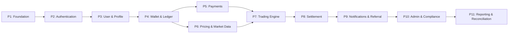

# Implementation Specification (IMP)
## Project: Independent Online Binary Trading Platform

---

## Revision History

| Date | Version | Description | Author |
| :--- | :--- | :--- | :--- |
| 2026-07-22 | 1.0.0 | Initial Implementation Specification. Derived from all 12 prerequisite documents: BRD v1.0, SRS v1.0, Domain Model v1.0, Software Architecture v1.1, Architecture Review v1.0, Database Design v1.0, API Design v1.0, UI/UX Design v1.0, Security Architecture v1.0, Infrastructure & DevOps v1.0, Project Plan v1.0, and Technical Analysis Report v1.0. | Lead Implementation Architect / Antigravity |

---

## Cross-References

| Abbreviation | Document | Location |
| :--- | :--- | :--- |
| **BRD** | Business Requirements Document | [docs/01_BUSINESS_REQUIREMENTS.md](../docs/01_BUSINESS_REQUIREMENTS.md) |
| **SRS** | System Requirements Specification | [docs/02_SYSTEM_REQUIREMENTS.md](../docs/02_SYSTEM_REQUIREMENTS.md) |
| **DM** | Domain Model Specification | [docs/03_DOMAIN_MODEL.md](../docs/03_DOMAIN_MODEL.md) |
| **SAD** | Software Architecture v1.1 | [docs/04_SOFTWARE_ARCHITECTURE.md](../docs/04_SOFTWARE_ARCHITECTURE.md) |
| **ARCH** | Architecture Review v1.0 | [docs/05_ARCHITECTURE_REVIEW.md](../docs/05_ARCHITECTURE_REVIEW.md) |
| **DDS** | Database Design Specification | [docs/06_DATABASE_DESIGN_SPECIFICATION.md](../docs/06_DATABASE_DESIGN_SPECIFICATION.md) |
| **ADS** | API Design Specification | [docs/07_API_DESIGN_SPECIFICATION.md](../docs/07_API_DESIGN_SPECIFICATION.md) |
| **UDS** | UI/UX Design Specification | [docs/08_UI_UX_DESIGN_SPECIFICATION.md](../docs/08_UI_UX_DESIGN_SPECIFICATION.md) |
| **SATM** | Security Architecture & Threat Model | [docs/09_SECURITY_ARCHITECTURE_AND_THREAT_MODEL.md](../docs/09_SECURITY_ARCHITECTURE_AND_THREAT_MODEL.md) |
| **IDS** | Infrastructure & DevOps Specification | [docs/10_INFRASTRUCTURE_AND_DEVOPS_SPECIFICATION.md](../docs/10_INFRASTRUCTURE_AND_DEVOPS_SPECIFICATION.md) |
| **PLAN** | Project Plan | [public/PROJECT_PLAN.md](../public/PROJECT_PLAN.md) |
| **TAR** | Technical Analysis Report | [public/Technical_Analysis_Report.pdf](../public/Technical_Analysis_Report.pdf) |

---

## Table of Contents

1. [Implementation Philosophy](#1-implementation-philosophy)
2. [How to Use This Document](#2-how-to-use-this-document)
3. [Implementation Roadmap](#3-implementation-roadmap)
4. [Project Structure](#4-project-structure)
5. [Module Dependency Map](#5-module-dependency-map)
6. [Backend Implementation Pattern](#6-backend-implementation-pattern)
7. [Backend Module Blueprints](#7-backend-module-blueprints)
8. [Frontend Implementation Pattern](#8-frontend-implementation-pattern)
9. [Business Logic Rules](#9-business-logic-rules)
10. [Validation Strategy](#10-validation-strategy)
11. [Transaction Strategy](#11-transaction-strategy)
12. [Event Implementation](#12-event-implementation)
13. [Background Workers](#13-background-workers)
14. [Configuration Management](#14-configuration-management)
15. [Logging Strategy](#15-logging-strategy)
16. [Error Handling Strategy](#16-error-handling-strategy)
17. [Security Implementation](#17-security-implementation)
18. [Development Workflow](#18-development-workflow)
19. [Quality Gates](#19-quality-gates)
20. [Milestone Mapping](#20-milestone-mapping)
21. [Implementation Readiness Assessment](#21-implementation-readiness-assessment)
22. [Final Recommendation](#22-final-recommendation)

---

## 1. Implementation Philosophy

| Principle | Definition | Source |
| :--- | :--- | :--- |
| **Architecture First** | Implement per the architecture decisions (ADR-009 through ADR-012). Never deviate from the approved contracts. All wallet locks use `SELECT FOR UPDATE` (ADR-009). Settlement uses atomic CAS (ADR-010). Financial events use Transactional Outbox (ADR-011). Settlement prices come from `price_ticks` table (ADR-012). | SAD §15, ARCH §11 |
| **Business Rules Before UI** | Business logic lives in services, never in controllers or UI. The Domain Model's aggregate boundaries (DM §9) are enforced at the service layer. Controllers parse HTTP and call services — they contain zero business logic. | DM §9, ADS §11.3 |
| **Security by Default** | Security controls are enabled at code generation time. MFA middleware is applied to all privileged routes by default (SATM §4.4). Rate limiting is active on all endpoints (SATM §6.3). Input validation rejects malformed payloads before business logic runs (SATM §6.5). | SATM §1, SATM §4, SATM §6 |
| **Incremental Delivery** | Each of the 11 phases (IMP §3) produces a working, testable increment. Phases build on predecessors. No phase requires functionality from a later phase. Every phase has defined completion criteria. | PLAN §6 |
| **Modular Development** | Each module owns its schema (DDS §3). Cross-module access uses module APIs, never direct database queries. Repository classes are restricted to their module's schema. | SAD §5, DDS §3.2 |
| **Testable Components** | Every module has defined input/output contracts. Services accept dependencies via constructor injection (or equivalent). Repositories are abstracted behind interfaces for mocking. Workers process single messages with deterministic outputs. | ADS §20 |
| **Loose Coupling** | Modules communicate via events for state changes (SAD §6). Synchronous calls are used only for queries. Financial events use Transactional Outbox (ADR-011). Non-financial events use in-process bus. | SAD §6, ADR-011 |
| **High Cohesion** | Each module owns its domain completely. Wallet Module owns all balance state (DM §2). Trading Module owns contract lifecycle. Compliance Module owns KYC state. No module reaches into another's domain. | DM §5, DM §9 |

---

## 2. How to Use This Document

### 2.1 Purpose

This document is the bridge between all 12 prerequisite specifications and production code. It translates every architectural, security, database, API, UI/UX, and infrastructure decision into a concrete implementation roadmap that developers and AI coding agents can follow.

### 2.2 Who Should Use This

| Role | How to Use |
| :--- | :--- |
| **Backend Developer** | Read §6 (backend patterns), §7 (your module's blueprint), §10 (validation), §11 (transactions), §12 (events), §13 (workers). Then implement your assigned phase from §3. |
| **Frontend Developer** | Read §8 (frontend patterns). For each feature, read the referenced UDS sections for screens/components, ADS sections for API calls, and §7 for backend expectations. |
| **DevOps Engineer** | Read §14 (configuration), §15 (logging), §18 (workflow), §19 (quality gates). Reference IDS for infrastructure provisioning. |
| **AI Coding Agent** | Given a feature (e.g., "implement login"), read this document's relevant phase + referenced ADS + DDS + SATM + UDS sections. Every cross-reference is explicit. |
| **Code Reviewer** | Verify implementation matches: patterns in §6, rules in §9, security in §17, quality gates in §19. |

### 2.3 How to Navigate

**First-time reader**: Read §1 (philosophy), §2 (this section), §3 (roadmap overview), §4 (structure), §5 (dependencies), §6 (patterns).

**Feature-specific assignment** (e.g., "Implement Trade Placement"):
1. Open this document → §3.7 (Phase 7: Trading Engine) → read the cross-reference table
2. Open ADS §11.3 → read endpoint specification for `POST /api/v1/trading/contracts`
3. Open DDS §5.12 → read `trading.binary_contracts` table
4. Open SAD §7.1 → read trade placement lifecycle diagram
5. Open SATM §11.3 → read wallet locking requirements
6. Open UDS §7 → read trading interface UI specification
7. Open §7.4 in this document → read Trading Module blueprint with implementation patterns

### 2.4 Cross-Reference Convention

Throughout this document, cross-references use bold abbreviations:
- **BRD §X** → Business Requirements Document, section X
- **SRS §X** → System Requirements Specification
- **DM §X** → Domain Model Specification
- **SAD §X** → Software Architecture Document
- **DDS §X** → Database Design Specification
- **ADS §X** → API Design Specification
- **UDS §X** → UI/UX Design Specification
- **SATM §X** → Security Architecture & Threat Model
- **IDS §X** → Infrastructure & DevOps Specification
- **PLAN §X** → Project Plan
- **IMP §X** → This document

### 2.5 Reading Order by Phase

| Phase | Prerequisite Documents to Read |
| :--- | :--- |
| Phase 1: Foundation | IMP §4, IMP §6, IMP §14, IMP §15, IDS §11, IDS §17 |
| Phase 2: Auth | IMP §7.1, ADS §7, DDS §5.1–5.8, SATM §4, UDS §5, SRS §2 (FR-ATH) |
| Phase 3: Users | IMP §7.2, ADS §8, DDS §5.1, UDS §8.1 |
| Phase 4: Wallet | IMP §7.3, ADS §9, DDS §5.9–5.10, SATM §11.3, SAD ADR-009 |
| Phase 5: Payments | IMP §7.4, ADS §10, DDS §5.19–5.23, SATM §10, UDS §8.2–8.3 |
| Phase 6: Pricing | IMP §7.5, ADS §12, DDS §5.16–5.18, SAD ADR-012, IDS §8 |
| Phase 7: Trading | IMP §7.6, ADS §11, DDS §5.12–5.15, UDS §7, SAD §7.1 |
| Phase 8: Settlement | IMP §7.7, ADS §16.1, SAD ADR-010, SAD §8, SATM §11.2 |
| Phase 9: Notifications | IMP §7.8, ADS §13, ADS §17, UDS §11 |
| Phase 10: Admin | IMP §7.9, ADS §14, ADS §15, UDS §12, SATM §5 |
| Phase 11: Reporting | IMP §7.10, ADS §14.6, IDS §13 |

---

## 3. Implementation Roadmap

### 3.1 Phase Overview



### 3.2 Phase 1 — Foundation

| Category | Details |
| :--- | :--- |
| **Prerequisite Docs** | IMP §4 (structure), IMP §6 (patterns), IMP §14 (config), IMP §15 (logging), IDS §11 (CI/CD), IDS §17 (runbooks) |
| **Modules Involved** | None (scaffolding) |
| **APIs Involved** | Health check endpoints (internal) |
| **Database Tables** | None (migration system only) |
| **UI Screens** | None |
| **Events** | None |
| **Workers** | None |
| **Security Rules** | None (infrastructure level per IDS §6) |
| **Testing Expectations** | CI pipeline passes. Migration framework tested. |
| **Deliverables** | Repository initialised, CI/CD pipeline configured, project folder structure created, database migration tool set up, configuration system implemented, logging framework integrated, health check endpoint returning 200, Docker Compose for local development |
| **Completion Criteria** | `git clone → docker compose up → health check returns 200`. Build pipeline green. |
| **PLAN Milestone** | M1 (partial: scaffolding) |

### 3.3 Phase 2 — Authentication

| Category | Details |
| :--- | :--- |
| **Prerequisite Docs** | ADS §7 (auth endpoints), DDS §5.1–5.8 (auth tables), SATM §4 (auth security), UDS §5 (auth screens), SRS §2 FR-ATH-001–004 |
| **Modules Involved** | Auth Module |
| **APIs Involved** | `POST /api/v1/auth/register` (ADS §7.1), `POST /api/v1/auth/login` (ADS §7.2), `POST /api/v1/auth/mfa/verify` (ADS §7.3), `POST /api/v1/auth/logout` (ADS §7.4), `POST /api/v1/auth/refresh` (ADS §7.5), `POST /api/v1/auth/forgot-password` (ADS §7.6), `POST /api/v1/auth/reset-password` (ADS §7.7), `POST /api/v1/auth/verify-email` (ADS §7.8), `POST /api/v1/auth/mfa/setup` (ADS §7.9), `POST /api/v1/auth/mfa/verify-setup` (ADS §7.10) |
| **Database Tables** | `auth.users` (DDS §5.1), `auth.roles` (DDS §5.2), `auth.permissions` (DDS §5.3), `auth.role_permissions` (DDS §5.4), `auth.user_roles` (DDS §5.5), `auth.sessions` (DDS §5.6), `auth.mfa_tokens` (DDS §5.7), `auth.password_reset_tokens` (DDS §5.8) |
| **UI Screens** | Login (UDS §5.1), Register (UDS §5.2), MFA (UDS §5.3), Forgot Password (UDS §5.4), Reset Password (UDS §5.5), Email Verification (UDS §5.6), Account Locked (UDS §5.7) |
| **Events** | `UserRegistered` (financial → outbox per SAD §6) |
| **Workers** | None |
| **Security Rules** | Password hashing bcrypt cost ≥ 12 (SATM §4.3), JWT RS256 (SATM §4.1), MFA mandatory for privileged roles (SATM §4.4), Account lockout after 5 failures (SATM §4.3), Rate-limited login 5/15min (SATM §6.3) |
| **Testing Expectations** | Unit: password hashing, token generation, MFA code validation. Integration: register → verify email → login → MFA → refresh → logout flow. Security: token forgery rejected, expired token rejected, brute force lockout. |
| **Deliverables** | Auth Module with all 10 endpoints. Frontend auth screens. JWT middleware. Redis token blacklist integration. MFA setup and verification flow. |
| **PLAN Milestone** | M1 |

### 3.4 Phase 3 — User & Profile

| Category | Details |
| :--- | :--- |
| **Prerequisite Docs** | ADS §8 (user endpoints), DDS §5.1 (users table), UDS §6 (dashboard), UDS §8.1 (wallet overview), BRD §4 (user types), SRS §2 FR-KYC-001–003 |
| **Modules Involved** | User Module (part of Auth) |
| **APIs Involved** | `GET /api/v1/users/profile` (ADS §8.1), `PUT /api/v1/users/profile` (ADS §8.2), `GET /api/v1/users/settings` (ADS §8.3), `PUT /api/v1/users/settings` (ADS §8.4), `GET /api/v1/users/notifications/preferences` (ADS §8.5), `PUT /api/v1/users/notifications/preferences` (ADS §8.6), `POST /api/v1/users/self-exclusion` (ADS §8.7) |
| **Database Tables** | `auth.users` (DDS §5.1) — profile fields, settings stored in config schema or user metadata |
| **UI Screens** | Dashboard (UDS §6.1), Settings (UDS §8.1 profile section) |
| **Events** | None |
| **Workers** | None |
| **Security Rules** | RBAC: user can only read/write own profile (SATM §5.3). Self-exclusion enforced at API level (SATM §11.4). |
| **Testing Expectations** | Unit: profile update validation. Integration: update profile → verify change. Negative: cannot update another user's profile. |
| **Deliverables** | Profile CRUD, settings management, notification preferences, self-exclusion. Frontend profile and settings screens. |
| **PLAN Milestone** | M1 |

### 3.5 Phase 4 — Wallet & Ledger

| Category | Details |
| :--- | :--- |
| **Prerequisite Docs** | ADS §9 (wallet endpoints), DDS §5.9–5.11 (wallet tables), SAD ADR-009 (wallet locking), SATM §11.3 (wallet security), SRS FR-WLT-001–003, DM §2 (Wallet domain) |
| **Modules Involved** | Wallet Module |
| **APIs Involved** | `GET /api/v1/wallets/balance` (ADS §9.1), `GET /api/v1/wallets/ledger` (ADS §9.2), `GET /api/v1/wallets/statements` (ADS §9.3) |
| **Database Tables** | `wallet.wallets` (DDS §5.9), `wallet.ledger_entries` (DDS §5.10), `wallet.wallet_version_log` (DDS §5.11), `events.event_outbox` (DDS §5.36) |
| **UI Screens** | Wallet Overview (UDS §8.1), balance in top nav (UDS §4.2), balance on dashboard (UDS §6.2) |
| **Events** | `WalletCredited`, `WalletDebited` (financial → outbox per SAD §6) |
| **Workers** | Outbox Relay (publishes wallet events) |
| **Security Rules** | `SELECT FOR UPDATE` on all balance modifications (SATM §11.3, ADR-009). Non-negative balance CHECK constraint (DDS §5.9). Ledger entries INSERT-only (SATM §7.4). Wallet Module is single write authority (DM §2). |
| **Testing Expectations** | Unit: ledger double-entry balancing, balance calculation. Integration: concurrent trade placements both read balance → second blocked. Negative: withdrawal exceeding balance rejected. Concurrency: 10 simultaneous stake locks on same wallet → all valid. |
| **Deliverables** | Wallet Module with balance, ledger, statements. Pessimistic locking implemented. Double-entry ledger writes. Outbox event publication on balance changes. |
| **PLAN Milestone** | M2 (partial) |

### 3.6 Phase 5 — Payments

| Category | Details |
| :--- | :--- |
| **Prerequisite Docs** | ADS §10 (payment endpoints), DDS §5.19–5.23 (payment tables), SATM §10 (payment security), UDS §8.2–8.3 (deposit/withdrawal UI), BRD §6 (payment processes), SRS FR-DEP-001–002, SRS FR-WTH-001–003 |
| **Modules Involved** | Payment Module |
| **APIs Involved** | `POST /api/v1/payments/deposit/initiate` (ADS §10.1), `POST /api/v1/payments/deposit/callback` (ADS §10.2), `GET /api/v1/payments/deposit/{id}/status` (ADS §10.3), `POST /api/v1/payments/withdraw/request` (ADS §10.4), `GET /api/v1/payments/withdraw/{id}/status` (ADS §10.5), `GET /api/v1/payments/gateways` (ADS §10.6) |
| **Database Tables** | `payments.deposits` (DDS §5.19), `payments.withdrawals` (DDS §5.20), `payments.payment_gateways` (DDS §5.21), `payments.payment_webhook_logs` (DDS §5.22), `payments.idempotency_keys` (DDS §5.23), `events.event_outbox` (DDS §5.36) |
| **UI Screens** | Deposit flow (UDS §8.2), Withdrawal flow (UDS §8.3), Pending withdrawals (UDS §8.4) |
| **Events** | `DepositCompleted`, `DepositFailed`, `WithdrawalDispatched`, `WithdrawalFailed` (all financial → outbox per SAD §6) |
| **Workers** | Outbox Relay (publishes payment events) |
| **Security Rules** | HMAC webhook signature verification (SATM §10.1). Idempotency keys with 7-day retention (SATM §6.4). KYC check before withdrawal (SATM §10.2). Withdrawal hold after password change (SATM §10.2). |
| **Testing Expectations** | Unit: HMAC signature validation, idempotency key detection. Integration: initiate deposit → mock webhook → verify wallet credited. Negative: duplicate webhook rejected, invalid signature rejected, withdrawal without KYC rejected. |
| **Deliverables** | Payment Module with deposit/withdrawal flows. Webhook handler with HMAC verification. Idempotency key store. Integration with at least one mock payment gateway. |
| **PLAN Milestone** | M2 |

### 3.7 Phase 6 — Pricing & Market Data

| Category | Details |
| :--- | :--- |
| **Prerequisite Docs** | ADS §12 (pricing endpoints), DDS §5.16–5.18 (pricing tables), SAD ADR-012 (price authority), SAD §5.4 (Price Feed Service), IDS §8 (Redis caching), UDS §7 (trading interface charts) |
| **Modules Involved** | Pricing Module (Price Feed Service as standalone process per SAD §5.4) |
| **APIs Involved** | `GET /api/v1/pricing/assets` (ADS §12.1), `GET /api/v1/pricing/assets/{symbol}/price` (ADS §12.2), `GET /api/v1/pricing/assets/{symbol}/candles` (ADS §12.3), `GET /api/v1/pricing/status` (ADS §12.4), WebSocket `price.{symbol}` channel (ADS §17.7) |
| **Database Tables** | `pricing.price_ticks` (DDS §5.16), `pricing.candles` (DDS §5.17), `pricing.market_hours` (DDS §5.18) |
| **UI Screens** | Price chart (UDS §7.1), Asset selector (UDS §7.2), Market status indicator (UDS §7.4), Latency indicator (UDS §7.5) |
| **Events** | None (Price Feed writes directly to DB + Redis — not event-driven per SAD §5.4) |
| **Workers** | None (Price Feed is a standalone daemon, not a worker) |
| **Security Rules** | Price Feed runs as separate process (SATM §8, MP-001). Redis is cache only — settlement reads from DB (ADR-012). Write access to `price_ticks` restricted to Price Feed Service user (SATM §7.2). |
| **Testing Expectations** | Unit: OHLC calculation from tick stream. Integration: Price Feed writes tick → verify in DB → verify in Redis → verify WebSocket broadcasts. Negative: feed disconnection → trade placement blocked. |
| **Deliverables** | Price Feed Service (standalone process). Redis Pub/Sub distribution. OHLC candle aggregation. WebSocket price streaming. Persistent tick storage in `price_ticks` table. Market hours management. |
| **PLAN Milestone** | M3 |

### 3.8 Phase 7 — Trading Engine

| Category | Details |
| :--- | :--- |
| **Prerequisite Docs** | ADS §11 (trading endpoints), DDS §5.12–5.15 (trading tables), UDS §7 (trading UI), SAD §7.1 (trade placement lifecycle), SAD ADR-009 (wallet locking), SATM §11 (trading security), BRD §6.3 (trade execution), SRS FR-TRD-001–003 |
| **Modules Involved** | Trading Module |
| **APIs Involved** | `GET /api/v1/trading/assets` (ADS §11.1), `GET /api/v1/trading/assets/{symbol}` (ADS §11.2), `POST /api/v1/trading/contracts` (ADS §11.3), `GET /api/v1/trading/contracts/{id}` (ADS §11.4), `GET /api/v1/trading/contracts` (ADS §11.5), `GET /api/v1/trading/contracts/active` (ADS §11.6) |
| **Database Tables** | `trading.binary_contracts` (DDS §5.12), `trading.contract_events` (DDS §5.13), `trading.assets` (DDS §5.14), `trading.asset_config` (DDS §5.15), `events.event_outbox` (DDS §5.36) |
| **UI Screens** | Trading interface (UDS §7.1), Asset selector (UDS §7.2), Stake input (UDS §7.2), Expiry selector (UDS §7.2), Buy Up/Down buttons (UDS §7.2), Contract confirmation (UDS §7.2), Open positions (UDS §7.1), Trade history (UDS §7.1) |
| **Events** | `TradeOpened` (financial → outbox per SAD §6) |
| **Workers** | Trade expiry scheduling via message broker (SAD §7.1) |
| **Security Rules** | 10-step validation before execution (SATM §11): self-exclusion check, market open check, stake limits, balance check, exposure check, latency check. `SELECT FOR UPDATE` on wallet (ADR-009). Strike price from Redis cache (falls back to DB). |
| **Testing Expectations** | Unit: payout calculation, strike price capture, expiry scheduling. Integration: place trade → verify wallet debited → verify contract created. Negative: insufficient balance rejected, self-excluded user rejected, market closed rejected, latency exceeded rejected. |
| **Deliverables** | Trading Module with full contract lifecycle. 10-step validation chain. Wallet stake lock integration. Expiry job scheduling via message broker. |
| **PLAN Milestone** | M4 (partial) |

### 3.9 Phase 8 — Settlement

| Category | Details |
| :--- | :--- |
| **Prerequisite Docs** | ADS §16.1 (internal settlement API), SAD ADR-010 (settlement atomicity), SAD §8 (settlement worker), SAD ADR-011 (outbox), SATM §11.2 (settlement security), DDS §5.12 (contracts table), SRS FR-SET-001–003 |
| **Modules Involved** | Settlement Worker (separate worker process) |
| **APIs Involved** | `POST /internal/v1/settlement/resolve` (ADS §16.1 — internal only) |
| **Database Tables** | `trading.binary_contracts` (DDS §5.12) — status updates, `pricing.price_ticks` (DDS §5.16) — settlement price, `wallet.wallets` (DDS §5.9) — payout, `wallet.ledger_entries` (DDS §5.10) — ledger write, `events.event_outbox` (DDS §5.36) — settlement event |
| **UI Screens** | Settlement animation (UDS §7.3), contract detail (UDS §7.1), trade history (UDS §7.1) |
| **Events** | `TradeSettled`, `TradeWon`, `TradeLost`, `TradeDraw` (all financial → outbox per SAD §6) |
| **Workers** | Settlement Worker (SAD §8), Outbox Relay (publishes settlement events) |
| **Security Rules** | Atomic CAS: `UPDATE contracts SET status='Settling' WHERE id=? AND status='Active'` (ADR-010). Settlement price from `price_ticks` table, not Redis (ADR-012). Dead-letter queue for failed settlements (SAD §8). Wallet operations use `SELECT FOR UPDATE` (ADR-009). |
| **Testing Expectations** | Unit: outcome calculation (Win/Loss/Draw). Integration: expire contract → verify settlement triggers → verify wallet credited. Negative: double-settlement attempt → second attempt discarded. Atomic CAS: two concurrent workers attempt to settle same contract → exactly one succeeds. |
| **Deliverables** | Settlement Worker with atomic CAS. Expiry queue consumer. Price query from persistent store. Payout processing via Wallet Module. Dead-letter queue for manual reconciliation. |
| **PLAN Milestone** | M4 (complete) |

### 3.10 Phase 9 — Notifications & Referral

| Category | Details |
| :--- | :--- |
| **Prerequisite Docs** | ADS §13 (referral endpoints), ADS §17 (WebSocket notifications), UDS §11 (notification UI), UDS §9 (referral UI), BRD §4 (referral system), BRD §8 (notification service), SAD §6 (notification events) |
| **Modules Involved** | Referral Module, Notification Worker |
| **APIs Involved** | `GET /api/v1/referral/codes` (ADS §13.1), `POST /api/v1/referral/codes/generate` (ADS §13.2), `GET /api/v1/referral/invites` (ADS §13.3), `GET /api/v1/referral/commissions` (ADS §13.4), `GET /api/v1/referral/statistics` (ADS §13.5) |
| **Database Tables** | `referral.referral_codes` (DDS §5.27), `referral.referrals` (DDS §5.28), `referral.referral_commissions` (DDS §5.29), `notifications.notifications` (DDS §5.32), `notifications.notification_queue` (DDS §5.33) |
| **UI Screens** | Referral Hub (UDS §9.1), Share sheet (UDS §9.2), Notification Centre (UDS §11.1), Toast notifications (UDS §11.3) |
| **Events** | `ReferralRegistered`, `ReferralCommissionAwarded` (financial → outbox), `TradeSettled` (consumed for commission calculation) |
| **Workers** | Notification Worker (SAD §8), Outbox Relay |
| **Security Rules** | Max 5 active referral codes per user (IMP §7.8). Code uniqueness enforced at DB level (DDS §5.27). No PII in notification payloads (SATM §17.1). |
| **Testing Expectations** | Unit: commission calculation formula. Integration: refer user → verify referral tracked → trade settles → verify commission awarded. Notification: event published → worker sends → user receives. |
| **Deliverables** | Referral Module with code generation, tracking, commission calculation, statistics. Notification Worker with email/SMS/WebSocket delivery. |
| **PLAN Milestone** | M5 (partial) |

### 3.11 Phase 10 — Admin & Compliance

| Category | Details |
| :--- | :--- |
| **Prerequisite Docs** | ADS §14 (admin endpoints), ADS §15 (compliance endpoints), DDS §5.24–5.26 (compliance tables), UDS §12 (admin UI), UDS §10 (KYC UI), SATM §5 (authorization), SRS FR-ADM-001–003, BRD §4 (admin roles) |
| **Modules Involved** | Admin Module, Compliance Module |
| **APIs Involved** | Admin: all `/api/v1/admin/*` (ADS §14.1–14.9). Compliance: `GET /api/v1/compliance/kyc/status` (ADS §15.1), `POST /api/v1/compliance/kyc/upload` (ADS §15.2), `GET /api/v1/compliance/aml/flags` (ADS §15.3) |
| **Database Tables** | `compliance.kyc_documents` (DDS §5.24), `compliance.aml_flags` (DDS §5.25), `compliance.compliance_rules` (DDS §5.26), `admin.audit_logs` (DDS §5.30), `admin.admin_actions` (DDS §5.31), `admin.support_tickets` (DDS §5.32) |
| **UI Screens** | Admin Portal layout (UDS §12.1), User Management (UDS §12.1), KYC Review (UDS §12.2), Withdrawal Queue (UDS §12.3), Risk Dashboard (UDS §12.4), Platform Settings, Audit Logs, Support Tickets, KYC Upload (UDS §10.2), KYC Status (UDS §10.2) |
| **Events** | `KYCApproved`, `KYCRejected`, `WithdrawalApproved`, `UserSuspended` (all financial → outbox per SAD §6) |
| **Workers** | Outbox Relay |
| **Security Rules** | RBAC enforced at module boundary (SATM §5.2). Four-eyes principle for financial actions > $500 (SATM §5.3). All admin actions logged to immutable audit log (SATM §12.2). No direct DB access (SATM §5.2). MFA mandatory for all admin roles (SATM §4.4). |
| **Testing Expectations** | Unit: permission checks for each admin role. Integration: admin login → view users → suspend user → verify audit log entry. Negative: unauthorised role cannot access admin endpoints. |
| **Deliverables** | Admin Module with user management, KYC/withdrawal review queues, risk dashboard, platform settings, support tickets. Compliance Module with KYC upload and status. Hash-chained audit logging. |
| **PLAN Milestone** | M5 |

### 3.12 Phase 11 — Reporting & Reconciliation

| Category | Details |
| :--- | :--- |
| **Prerequisite Docs** | ADS §14.6 (report endpoints), IDS §13 (monitoring), SATM §12 (logging), SRS FR-WLT-003 (reconciliation) |
| **Modules Involved** | Report Module, Reconciliation Worker |
| **APIs Involved** | `GET /api/v1/admin/reports/daily-revenue` (ADS §14.6), `GET /api/v1/admin/reports/trade-volume` (ADS §14.6), `GET /api/v1/admin/reports/user-registrations` (ADS §14.6), `GET /api/v1/admin/reports/settlement-performance` (ADS §14.6) |
| **Database Tables** | `reporting.daily_revenue_summary`, `reporting.daily_trade_summary`, `reporting.daily_settlement_summary` (DDS §5.34–5.36), plus read-only access to all module tables via read replica |
| **UI Screens** | Admin reports section (UDS §12.6) |
| **Events** | None (reports are pull-based, not event-driven) |
| **Workers** | Reconciliation Worker (SAD §8), Report Generation Worker (SAD §8) |
| **Security Rules** | Reports query read replica (IDS §16.3). Admin RBAC enforced (SATM §5.3). Report data masked for non-privileged roles. |
| **Testing Expectations** | Integration: daily revenue report matches ledger entries. Negative: report query does not affect primary database performance. |
| **Deliverables** | Report Generation Worker (cron). Reconciliation Worker (daily ledger balancing). Report endpoints. Admin report screens. |
| **PLAN Milestone** | M7 |

---

## 4. Project Structure

### 4.1 Top-Level Structure

```
/
├── backend/                    # Backend application (language TBD per IDS §21.1)
│   ├── src/
│   │   ├── main.{js,ts,go}     # Application entry point
│   │   ├── modules/            # Domain modules (IMP §7)
│   │   │   ├── auth/
│   │   │   ├── user/
│   │   │   ├── wallet/
│   │   │   ├── trading/
│   │   │   ├── pricing/
│   │   │   ├── payments/
│   │   │   ├── compliance/
│   │   │   ├── referral/
│   │   │   ├── admin/
│   │   │   └── notifications/
│   │   ├── shared/             # Shared utilities
│   │   │   ├── middleware/
│   │   │   ├── validators/
│   │   │   ├── errors/
│   │   │   ├── types/
│   │   │   └── utils/
│   │   ├── config/             # Configuration (IMP §14)
│   │   ├── database/           # Migrations and seeds
│   │   │   ├── migrations/
│   │   │   └── seeds/
│   │   └── workers/            # Background worker implementations (IMP §13)
│   │       ├── settlement/
│   │       ├── outbox-relay/
│   │       ├── notification/
│   │       ├── reconciliation/
│   │       └── cleanup/
│   ├── tests/
│   │   ├── unit/
│   │   ├── integration/
│   │   ├── e2e/
│   │   └── fixtures/
│   ├── Dockerfile
│   └── package.json / go.mod
│
├── frontend/                   # Frontend application (React per existing codebase)
│   ├── src/
│   │   ├── pages/              # Page-level components (UDS §4)
│   │   ├── components/         # Reusable components (UDS §13)
│   │   ├── layouts/            # Layout components (UDS §4.2–4.4)
│   │   ├── hooks/              # Custom hooks/composables
│   │   ├── stores/             # State management
│   │   ├── api/                # API client (IMP §8)
│   │   ├── auth/               # Authentication helpers
│   │   ├── router/             # Route definitions
│   │   ├── theme/              # Design system tokens (UDS §2)
│   │   └── utils/              # Utility functions
│   ├── public/
│   ├── tests/
│   ├── Dockerfile
│   └── package.json
│
├── shared/                     # Shared between frontend and backend
│   ├── constants/              # Error codes (ADS §6), event types (SAD §6)
│   ├── types/                  # TypeScript type definitions
│   └── validation/             # Validation schemas
│
├── infra/                      # Infrastructure as Code (per IDS §4.2)
│   ├── terraform/              # Infrastructure provisioning
│   ├── kubernetes/             # Container orchestration manifests
│   ├── ci/                     # CI/CD pipeline definitions
│   └── scripts/                # Automation scripts
│
├── docs/                       # All specification documents
│   ├── 01_BUSINESS_REQUIREMENTS.md
│   ├── ... (all 11 specs)
│   └── 11_IMPLEMENTATION_SPECIFICATION.md
│
├── tests/                      # End-to-end and cross-module tests
│   ├── e2e/
│   └── performance/
│
├── .github/                    # GitHub workflows (or equivalent)
├── docker-compose.yml          # Local development (IDS §2.1)
├── .env.example                # Environment template
└── README.md
```

### 4.2 Module Internal Structure

Each module in `backend/src/modules/{module}/` follows this convention:

```
backend/src/modules/{module}/
├── controllers/            # HTTP request handlers
│   └── {name}.controller.{js,ts,go}
├── services/               # Business logic
│   └── {name}.service.{js,ts,go}
├── repositories/           # Data access (module's schema only)
│   └── {name}.repository.{js,ts,go}
├── validators/             # Input and business validation
│   └── {name}.validator.{js,ts,go}
├── dto/                    # Request/Response DTOs
│   ├── request.{js,ts,go}
│   └── response.{js,ts,go}
├── models/                 # Domain models / entities
│   └── {entity}.model.{js,ts,go}
├── events/                 # Event publishers and handlers
│   ├── publishers/
│   └── handlers/
├── middleware/              # Module-specific middleware
├── routes.{js,ts,go}       # Route definitions
└── index.{js,ts,go}        # Module exports / DI container registration
```

### 4.3 Worker Internal Structure

Each worker in `backend/src/workers/{worker}/` follows this convention:

```
backend/src/workers/{worker}/
├── consumer.{js,ts,go}     # Queue consumer (message handler)
├── processor.{js,ts,go}    # Business logic processor
├── config.{js,ts,go}       # Worker-specific configuration
└── index.{js,ts,go}        # Entry point (registers consumer)
```

---

## 5. Module Dependency Map

### 5.1 Dependency Diagram

```mermaid
graph TD
    subgraph Independent[Independent Modules - No Dependencies]
        Auth[Auth Module]
        Pricing[Pricing Module]
    end

    subgraph Core[Core Modules]
        Wallet[Wallet Module]
        User[User Module]
    end

    subgraph Business[Business Modules]
        Trading[Trading Module]
        Payments[Payments Module]
        Compliance[Compliance Module]
        Referral[Referral Module]
    end

    subgraph Workers[Background Workers]
        Settlement[Settlement Worker]
        Notification[Notification Worker]
        Outbox[Outbox Relay]
        Reconciliation[Reconciliation Worker]
    end

    subgraph Admin[Admin Layer]
        Admin[Admin Module]
        Report[Report Module]
    end

    %% Dependencies
    User -->|owns| Auth
    Trading -->|balances| Wallet
    Trading -->|prices| Pricing
    Payments -->|credits| Wallet
    Payments -->|identity| User
    Compliance -->|identity| User
    Referral -->|trades| Trading
    Referral -->|payouts| Wallet
    Settlement -->|resolves| Trading
    Settlement -->|prices| Pricing
    Settlement -->|pays| Wallet
    Notification -->|consumes events| Outbox
    Admin -->|reads| Auth
    Admin -->|reads| Wallet
    Admin -->|reads| Trading
    Admin -->|reads| Payments
    Admin -->|reads| Compliance
    Admin -->|reads| Referral
    Report -->|reads replicas| AllModules
```

### 5.2 Module Dependency Table

| Module | Depends On | Used By | Type |
| :--- | :--- | :--- | :--- |
| **Auth** | None | User, Admin | Independent |
| **User** | Auth | Payments, Compliance, Admin | Core |
| **Wallet** | None | Trading, Payments, Referral, Settlement, Admin | Core |
| **Pricing** | None | Trading, Settlement | Independent |
| **Trading** | Wallet, Pricing | Referral, Settlement, Admin | Business |
| **Payments** | Wallet, User | Admin | Business |
| **Compliance** | User | Admin | Business |
| **Referral** | User, Trading (events), Wallet | Admin | Business |
| **Settlement** | Trading, Pricing, Wallet | None (worker) | Worker |
| **Notification** | Outbox (events) | None (worker) | Worker |
| **Outbox** | All financial modules' outbox tables | Notification, Audit | Worker |
| **Reconciliation** | Wallet, Payments | None (worker) | Worker |
| **Admin** | All modules (read via APIs) | None | Admin |
| **Report** | Read replica of all schemas | None | Admin |

### 5.3 Circular Dependency Prevention

- **No module depends on Admin**. Admin reads from all modules via their public APIs only.
- **No module depends on Notification**. Notification consumes events — producers never call Notification directly.
- **No module depends on Settlement**. Settlement consumes `trade.expiry` queue messages — Trading does not call Settlement.
- **Wallet has no dependencies** — it is the foundation module. All other financial modules depend on Wallet.

---

## 6. Backend Implementation Pattern

### 6.1 Layer Responsibilities

| Layer | Responsible For | NOT Responsible For |
| :--- | :--- | :--- |
| **Controller** | Parse HTTP request, extract parameters, call service, format response, set status code. Handle errors via global error handler. | ❌ Business logic. ❌ Direct database access. ❌ Calling other module's services directly (use events for state changes). |
| **Service** | Business logic. Orchestrate repository calls, validators, event publishers. Define transaction boundaries. Call other module's services ONLY for read queries (via module API). | ❌ HTTP concerns. ❌ Database query construction. ❌ Event publishing outside of outbox. |
| **Repository** | Data access for the module's schema (DDS §3). Parameterized queries. Map rows to models. | ❌ Business decisions. ❌ Cross-schema queries. ❌ Writing to other module's tables. |
| **Validator** | Input schema validation (ADS §5.5). Business rule validation (ADS §11.3). Idempotency key checking (ADS §1.5). | ❌ Data access. ❌ HTTP concerns. |
| **DTO** | Define request/response shapes matching API contracts (ADS §5). Type validation. Serialization/deserialization. | ❌ Business logic. ❌ Database access. |
| **Model** | Domain entity representation. May contain domain methods that operate on own data (e.g., `contract.calculatePayout()`). | ❌ Persistence logic. ❌ External service calls. |
| **Event Publisher** | Write event to `events.event_outbox` table within the same transaction as the state change (ADR-011). | ❌ Direct message broker publication. ❌ Business logic. |
| **Worker** | Consume queue messages. Process single message at a time. Implement idempotency via atomic CAS. Retry with backoff. Send to DLQ on exhaustion. | ❌ HTTP concerns. ❌ UI logic. |

### 6.2 Controller Pattern

```
Controller:
  1. Extract path parameters, query parameters, body from HTTP request
  2. Call service method with extracted data
  3. Format service response into API response shape (ADS §5)
  4. Return HTTP response with appropriate status code
  5. On error: throw to global error handler (IMP §16)

Example:
  POST /api/v1/trading/contracts
  Controller: parse body → validate idempotency key → call TradingService.placeTrade()
  → format response → return 201 Created
```

### 6.3 Service Pattern

```
Service:
  1. Call validators (input → business → idempotency)
  2. BEGIN transaction (for financial operations per IMP §11)
  3. Query data via repositories
  4. Execute business logic
  5. Write state changes via repositories
  6. Write outbox events via Event Publisher (within same transaction)
  7. COMMIT transaction
  8. Publish non-financial events via in-process bus (if applicable)
  9. Return result DTO
```

### 6.4 Repository Pattern

```
Repository:
  1. Accept parameters from service
  2. Build parameterized query (NEVER concatenate strings)
  3. Execute query against module's schema (DDS §3)
  4. Map result rows to domain models
  5. Return model(s) to service

Rules:
  - Only access tables within module's schema
  - Only one repository per entity
  - No business logic — repository returns data, service decides
  - Read-only queries should be marked as read-only transactions (go to read replica via connection pooler per IDS §7.3)
```

### 6.5 DTO Pattern

```
Request DTO:
  - Matches the expected request body from ADS endpoint specification
  - Contains type annotations and validation decorators
  - Example: CreateContractRequest { assetSymbol, contractType, stake, expirySeconds }

Response DTO:
  - Matches the API response shape from ADS §5
  - Wraps data in { data: {...}, meta: {...} } envelope
  - Example: ContractResponse { id, type, attributes: { assetSymbol, ... } }
```

### 6.6 Middleware Pattern (Applied at Route Level)

```
Middleware chain (applied in order):
  1. Request ID middleware — generate X-Request-ID if not provided (ADS §3.8)
  2. Correlation ID middleware — propagate X-Correlation-ID (ADS §3.8)
  3. Logging middleware — log request method, path, duration (IMP §15)
  4. Rate limiting middleware — check IP/token rate limits (ADS §3.7)
  5. Authentication middleware — validate JWT, extract user (SATM §4.1)
  6. Authorization middleware — check role/permissions (SATM §5.3)
  7. Idempotency middleware — check idempotency key for POST endpoints (ADS §1.5)
  8. Validation middleware — validate request body against schema (ADS §6.5)
  9. Controller
  10. Error handling middleware — catch errors, format response (IMP §16)
```

---

## 7. Backend Module Blueprints

### 7.1 Auth Module Blueprint

| Aspect | Specification |
| :--- | :--- |
| **Folder** | `backend/src/modules/auth/` |
| **Schema** | `auth.*` (DDS §3) |
| **Controllers** | `AuthController` — register, login, mfaVerify, logout, refresh, forgotPassword, resetPassword, verifyEmail, mfaSetup, mfaVerifySetup — maps to ADS §7.1–7.10 |
| **Services** | `AuthService` — registration with email validation trigger, credential verification with bcrypt, JWT token generation (RS256, 15-min TTL per SATM §4.1), refresh token rotation, MFA TOTP validation, password hashing, session revocation |
| **Repositories** | `UserRepository` — `auth.users` CRUD. `SessionRepository` — `auth.sessions` CRUD. `MFARepository` — `auth.mfa_tokens`. `PasswordResetRepository` — `auth.password_reset_tokens` (DDS §5.1–5.8) |
| **DTOs** | `RegisterRequest` (email, password, displayName, phone, referralCode). `LoginRequest` (email, password). `TokenResponse` (accessToken, refreshToken, expiresIn). `MFAVerifyRequest` (mfaSessionToken, totpCode) |
| **Validators** | Email format regex. Password strength (8+ chars, uppercase, lowercase, digit, special per SATM §4.3). Phone E.164 format. Referral code existence check. |
| **Middleware** | Rate limit: 5 login attempts per 15 min per IP (ADS §18.1). MFA required check for privileged roles (SATM §4.4). |
| **Events** | Published: `UserRegistered` (outbox). Non-financial: `UserLoggedIn`, `PasswordChanged` (in-process bus per SAD §6). |
| **Workers** | None |
| **Scheduled Jobs** | `CleanupExpiredSessions` — daily, delete expired sessions (DDS §5.6 retention: 30 days) |
| **Dependencies** | None (independent module) |
| **Security** | JWT RS256 with 2048-bit key (SATM §4.1). Refresh tokens opaque 32-byte random, hashed in DB (SATM §4.2). Password bcrypt cost ≥ 12 (SATM §4.3). TOTP 30-second window (SATM §4.4). Redis token blacklist (SATM §4.5). |

### 7.2 User Module Blueprint

| Aspect | Specification |
| :--- | :--- |
| **Folder** | `backend/src/modules/user/` (shares auth schema) |
| **Schema** | `auth.*` — shares with Auth Module (DDS §3) |
| **Controllers** | `UserController` — getProfile, updateProfile, getSettings, updateSettings, getNotificationPreferences, updateNotificationPreferences, activateSelfExclusion — maps to ADS §8.1–8.7 |
| **Services** | `UserService` — profile read/update, settings read/update, notification preference management, self-exclusion enforcement |
| **Repositories** | `UserRepository` (shared with Auth) — `auth.users` profile queries |
| **DTOs** | `ProfileResponse` (id, email, displayName, phone, kycStatus, mfaEnabled, createdAt). `SettingsResponse` (notifications, trading, display per UDS §8.3). `SelfExclusionRequest` (durationDays) |
| **Validators** | Phone uniqueness. Self-exclusion duration 1–365 days (ADS §8.7). Display name length 2–100. |
| **Middleware** | Auth required (SATM §4.1). Rate limit: 60 req/min authenticated (ADS §3.7). |
| **Events** | None |
| **Workers** | None |
| **Scheduled Jobs** | `SelfExclusionExpiry` — daily, clear expired self-exclusion flags |
| **Dependencies** | Auth Module (identity) |
| **Security** | Self-exclusion blocks trade placement at service layer (SATM §11.4). |

### 7.3 Wallet Module Blueprint

| Aspect | Specification |
| :--- | :--- |
| **Folder** | `backend/src/modules/wallet/` |
| **Schema** | `wallet.*` (DDS §3) |
| **Controllers** | `WalletController` — getBalance, getLedger, getStatements — maps to ADS §9.1–9.3 |
| **Services** | `WalletService` — balance query, ledger history (cursor-paginated per ADS §3.4), statement generation. `LedgerService` — double-entry write (debit + credit per DM §3), `SELECT FOR UPDATE` locking per ADR-009. |
| **Repositories** | `WalletRepository` — `wallet.wallets` with `SELECT ... FOR UPDATE` (DDS §5.9). `LedgerRepository` — `wallet.ledger_entries` INSERT-only (DDS §5.10). |
| **DTOs** | `BalanceResponse` (balance, lockedBalance, availableBalance, currency). `LedgerEntryResponse` (id, transactionId, entryType, amount, balanceBefore, balanceAfter, referenceType, referenceId, description, createdAt). |
| **Validators** | Amount > 0. Balance >= 0 after operation (DDS §5.9 CHECK constraint). Reference type in allowed ENUM. |
| **Middleware** | Auth required. Ownership check: user can only access own wallet. |
| **Events** | Published: `WalletCredited`, `WalletDebited` (both financial → outbox per SAD §6). |
| **Workers** | None directly. Outbox Relay publishes wallet events. |
| **Scheduled Jobs** | `DailyReconciliation` — compare wallet.balance sum vs ledger total (SRS FR-WLT-003) |
| **Dependencies** | None (foundation module — single write authority per DM §3) |
| **Security** | All balance modifications use `SELECT FOR UPDATE` within REPEATABLE READ transaction (ADR-009, SATM §11.3). Ledger is INSERT-only — no UPDATE/DELETE grants (SATM §7.4). Wallet Module is the ONLY module that writes wallet balances (DM §2). |

### 7.4 Payment Module Blueprint

| Aspect | Specification |
| :--- | :--- |
| **Folder** | `backend/src/modules/payments/` |
| **Schema** | `payments.*` (DDS §3) |
| **Controllers** | `DepositController` — initiate, callback, status. `WithdrawalController` — request, status. `GatewayController` — list. Maps to ADS §10.1–10.6. |
| **Services** | `DepositService` — initiate with gateway, handle callback with HMAC verification (SATM §10.1), idempotency check (SATM §6.4), credit wallet via Wallet Module API. `WithdrawalService` — request with KYC check, balance lock, auto-approval routing (< $100 auto, ≥ $100 manual per BRD §7). |
| **Repositories** | `DepositRepository` — `payments.deposits` (DDS §5.19). `WithdrawalRepository` — `payments.withdrawals` (DDS §5.20). `GatewayRepository` — `payments.payment_gateways` (DDS §5.21). `WebhookLogRepository` — `payments.payment_webhook_logs` (DDS §5.22). `IdempotencyRepository` — `payments.idempotency_keys` (DDS §5.23). |
| **DTOs** | `InitiateDepositRequest` (amount, currency, gatewayId, phone). `DepositResponse` (depositId, status, gatewayReference, gatewayAction). `WithdrawRequest` (amount, currency, gatewayId, phone). `WithdrawalResponse` (withdrawalId, status, amount, fee, netAmount). |
| **Validators** | Amount ≥ min deposit $10 (BRD §7). Amount ≥ min withdrawal $15 (BRD §7). Available balance sufficient. KYC status verified (SATM §10.2). Idempotency key uniqueness (ADS §10.4). |
| **Middleware** | Idempotency-Key required (ADS §10.1, §10.4). HMAC verification on callback endpoint (no JWT — public but signature-secured per SATM §10.1). |
| **Events** | Published: `DepositCompleted`, `DepositFailed`, `WithdrawalDispatched`, `WithdrawalFailed` (all financial → outbox per SAD §6). |
| **Workers** | None directly. Outbox Relay publishes payment events. |
| **Scheduled Jobs** | `StalePendingCleanup` — daily, cancel deposits > 24h in pending status. `GatewayStatusSync` — every 5 min, check unresolved gateways. |
| **Dependencies** | Wallet Module (credits/debits via API). User Module (KYC status check per ADS §10.4). |
| **Security** | HMAC-SHA256 webhook signature verification (SATM §10.1). Idempotency key 7-day retention (SATM §6.4). Withdrawal 24h hold after password change (SATM §10.2). Fraud detection rules (SATM §10.2). |

### 7.5 Pricing Module Blueprint

| Aspect | Specification |
| :--- | :--- |
| **Folder** | `backend/src/modules/pricing/` (Price Feed Service is a separate process per SAD §5.4) |
| **Schema** | `pricing.*` (DDS §3) |
| **Controllers** | `AssetController` — list, detail. `PriceController` — current price, candles, market status. Maps to ADS §12.1–12.4. |
| **Services** | `PriceFeedIngestionService` — connect to provider WebSocket, normalize ticks, write to `price_ticks` (DDS §5.16), publish to Redis Pub/Sub. Includes auto-failover to `MockPriceAdapter` on connection failure. `OHLCService` — aggregate ticks into 1m/5m/15m/1H/4H/1D candles (DDS §5.17). `MarketStatusService` — check market hours (DDS §5.18). |
| **Repositories** | `TickRepository` — `pricing.price_ticks` INSERT + SELECT (DDS §5.16). `CandleRepository` — `pricing.candles` (DDS §5.17). `MarketHoursRepository` — `pricing.market_hours`. |
| **DTOs** | `PriceResponse` (symbol, bid_price, ask_price, mid_price, tickTime). `CandleResponse` (openTime, closeTime, openPrice, highPrice, lowPrice, closePrice, volume). `MarketStatusResponse` (overallStatus, assets). |
| **Validators** | Symbol must exist in `trading.assets`. Granularity must be one of: 60, 300, 900, 3600, 86400. Date range limits. |
| **Middleware** | Auth required (ADS §12). Rate limit: 60 req/min (ADS §3.7). |
| **Events** | None (Price Feed writes directly — not event-driven per SAD §5.4). |
| **Workers** | None. Price Feed is a standalone daemon or auto-boot module (via `bootstrap.ts`). |
| **Scheduled Jobs** | `MarketOpenCheck` — every minute, check if any market opened/closed for trading. |
| **Dependencies** | None (independent module). Reads `trading.assets` for symbol validation (via API, not direct DB). |
| **Security** | Price Feed runs as separate process or auto-boot daemon. Redis is cache only — settlement reads from `price_ticks` table (ADR-012, SATM §11.1). Write access restricted. **Resilient Ingestion**: Fallback to `MockPriceAdapter` if Binance is blocked. |

### 7.6 Trading Module Blueprint

| Aspect | Specification |
| :--- | :--- |
| **Folder** | `backend/src/modules/trading/` |
| **Schema** | `trading.*` (DDS §3) |
| **Controllers** | `AssetController` — list, detail (ADS §11.1–11.2). `ContractController` — place, getById, list, listActive (ADS §11.3–11.6). |
| **Services** | `TradeService` — 10-step validation chain (ADS §11.3): (1) account active check, (2) self-exclusion check, (3) market open check, (4) stake limits, (5) expiry duration limits, (6) balance check via Wallet service, (7) exposure check, (8) latency check, (9) wallet lock via Wallet service, (10) contract creation + expiry scheduling. `AssetService` — asset CRUD, config updates. |
| **Repositories** | `ContractRepository` — `trading.binary_contracts` (DDS §5.12) with atomic status updates (`UPDATE ... WHERE status = 'previous'`). `ContractEventRepository` — `trading.contract_events` (DDS §5.13). `AssetRepository` — `trading.assets` (DDS §5.14). `AssetConfigRepository` — `trading.asset_config` (DDS §5.15). |
| **DTOs** | `PlaceTradeRequest` (assetSymbol, contractType, stake, expirySeconds). `ContractResponse` (id, assetSymbol, contractType, stake, payoutRate, status, strikePrice, purchaseTime, expiryTime, expiryPrice, payoutAmount, settledAt). |
| **Validators** | Contract type 'higher'/'lower' only (ADS §11.3). Stake within asset min/max (DDS §5.14). Expiry 60–86400 seconds (DDS §5.14). Asset must be active (DDS §5.14). |
| **Middleware** | Auth required with role 'trader' (ADS §11.3). Idempotency-Key required (ADS §11.3). Rate limit: 10 req/sec trading endpoints (ADS §18.1). |
| **Events** | Published: `TradeOpened` (financial → outbox per SAD §6). |
| **Workers** | None directly. Enqueues expiry job to `trade.expiry` queue (consumed by Settlement Worker per IMP §7.7). |
| **Scheduled Jobs** | None. Expiry scheduling is queue-based, not cron-based. |
| **Dependencies** | Wallet Module (balance check + stake lock via API). Pricing Module (current price for strike). Risk checks within module (self-exclusion, exposure, latency). |
| **Security** | 10-step validation prevents all known attacks (SATM §11). Latency check > 800ms rejects (SATM §11.4). Self-exclusion enforced (SATM §11.4). Max stake per trade 50,000 KES. Max exposure $10,000 per asset (BRD §7). |

### 7.7 Settlement Worker Blueprint

| Aspect | Specification |
| :--- | :--- |
| **Folder** | `backend/src/workers/settlement/` |
| **Queue** | `trade.expiry` — durable, priority high, 3 retries, dead-letter on exhaustion (IDS §9.2) |
| **Processor** | `SettlementProcessor` — (1) Dequeue message, (2) Atomic CAS: `UPDATE contracts SET status='Settling' WHERE id=? AND status='Active'`, (3) If 0 rows → discard (duplicate), (4) Fetch contract + price tick from `pricing.price_ticks` (ADR-012), **(4.5) Oracle Gap Check**: If `expiryTime - tick_time > 10s`, mark contract as `cancelled` and refund stake, (5) Calculate outcome (Win/Loss/Draw per BRD §7), (6) Call Wallet Module to process payout/loss/refund, (7) Update contract status to terminal, (8) Write `TradeSettled` to outbox (ADR-011), (9) Acknowledge message. |
| **Idempotency** | Atomic CAS guarantees exactly-once settlement (ADR-010). If CAS fails (0 rows), message is duplicate → discard. |
| **Retry Strategy** | 3 retries with exponential backoff (1s, 5s, 15s). On exhaustion → dead-letter queue for manual reconciliation (SAD §8). |
| **Security** | Settlement price from PostgreSQL `price_ticks` table, never from Redis (ADR-012, SATM §11.1). Hard 10s Oracle Gap prevents settlement on "Ghost Ticks" during feed drops. Wallet operations use `SELECT FOR UPDATE` via Wallet Module API (ADR-009). |
| **Dependencies** | Trading Module (contract data via API + DB). Pricing Module (price_ticks table via DB). Wallet Module (payout processing via API). |

### 7.8 Referral Module Blueprint

| Aspect | Specification |
| :--- | :--- |
| **Folder** | `backend/src/modules/referral/` |
| **Schema** | `referral.*` (DDS §3) |
| **Controllers** | `ReferralController` — listCodes, generateCode, listInvites, listCommissions, getStatistics — maps to ADS §13.1–13.5 |
| **Services** | `ReferralCodeService` — generate unique 8-char code, enforce max 5 active codes per user. `ReferralCommissionService` — calculate commission as % of platform margin from referred user's trades (BRD §8), batch and schedule weekly payouts. `ReferralStatisticsService` — aggregate totals. |
| **Repositories** | `ReferralCodeRepository` — `referral.referral_codes` (DDS §5.27). `ReferralRepository` — `referral.referrals` (DDS §5.28). `ReferralCommissionRepository` — `referral.referral_commissions` (DDS §5.29). |
| **DTOs** | `ReferralCodeResponse` (code, isActive, useCount, maxUses). `CommissionResponse` (id, referredUser, amount, status, createdAt). `StatisticsResponse` (totalReferred, activeReferred, totalCommissionEarned, pendingCommission, commissionThisMonth). |
| **Validators** | Max 5 active codes per user (ADS §13.2). Code uniqueness (DDS §5.27 UNIQUE). Referral code must exist and be active on registration. |
| **Middleware** | Auth required (ADS §13). Rate limit: 60 req/min. |
| **Events** | Published: `ReferralRegistered`, `ReferralCommissionAwarded` (financial → outbox per SAD §6). Consumed: `TradeSettled` (calculate commission), `UserRegistered` (link referral if code provided). |
| **Workers** | `CommissionPayoutWorker` — weekly batch, pay accumulated commissions via Wallet Module. |
| **Scheduled Jobs** | `WeeklyCommissionBatch` — every Sunday, aggregate pending commissions and trigger payouts. |
| **Dependencies** | User Module (identity). Trading Module (event: `TradeSettled`). Wallet Module (commission payouts). |

### 7.9 Admin Module Blueprint

| Aspect | Specification |
| :--- | :--- |
| **Folder** | `backend/src/modules/admin/` |
| **Schema** | `admin.*` (DDS §3). Read access to all other schemas via admin views (DDS §3.2). |
| **Controllers** | `UserManagementController` — list, get, update status (ADS §14.1). `KYCReviewController` — pending, get, review (ADS §14.2). `WithdrawalReviewController` — pending, get, approve, reject (ADS §14.3). `RiskController` — dashboard, exposure, update asset config (ADS §14.4). `SettingsController` — get, update, getByKey (ADS §14.5). `ReportController` — revenue, trade volume, registrations, settlement performance (ADS §14.6). `AuditLogController` — query (ADS §14.7). `SupportController` — list, get, update tickets (ADS §14.8). `WalletAdjustmentController` — adjust (ADS §14.9). |
| **Services** | Each controller maps to a service with business logic: `UserManagementService`, `KYCReviewService`, `WithdrawalReviewService`, `RiskService`, `SettingsService`, `ReportService`, `AuditService`, `SupportService`, `WalletAdjustmentService`. |
| **Repositories** | Admin repositories read from admin views and own admin schema tables: `admin.audit_logs` (DDS §5.30), `admin.admin_actions` (DDS §5.31), `admin.support_tickets` (DDS §5.32). |
| **DTOs** | `UserListResponse` (paginated). `KYCReviewRequest` (action, note). `WithdrawalApproveRequest` (note). `SettingsUpdateRequest` (key, value). `WalletAdjustRequest` (userId, amount, type, reason). |
| **Validators** | Permission checks for every action (SATM §5.3). Four-eyes principle for wallet adjustments > $500 (SATM §5.3, SAD §5). Reason required for all write actions. |
| **Middleware** | Auth required + role check (Admin/Super Admin per permission matrix SATM §5.3). Rate limit: 300 req/min (ADS §3.7). All actions logged to immutable audit log (SATM §12.2). |
| **Events** | Published: `WithdrawalApproved`, `UserSuspended`, `KYCApproved`, `KYCRejected` (all financial → outbox per SAD §6). |
| **Workers** | None directly. Outbox Relay publishes admin events. |
| **Scheduled Jobs** | `AuditChainVerification` — daily, verify hash chain integrity (SATM §12.2). |
| **Dependencies** | All modules (read-only via their APIs per DDS §3.2). Wallet, Payments, Compliance, User modules (write via their APIs — never direct DB). |
| **Security** | RBAC matrix enforced at controller boundary (SATM §5.3). Four-eyes principle (SAD §5). All actions in immutable audit log (SATM §12.2). MFA mandatory (SATM §4.4). No direct DB access (SATM §5.2). |

### 7.10 Notification Worker Blueprint

| Aspect | Specification |
| :--- | :--- |
| **Folder** | `backend/src/workers/notification/` |
| **Queues** | `notification.high` (trade results, deposit confirmations — durable, 3 retries). `notification.low` (marketing — transient, 1 retry) per IDS §9.2. |
| **Processor** | `NotificationProcessor` — (1) Dequeue message, (2) Determine channel (email/SMS/push per user preferences from ADS §8.5), (3) Render notification template, (4) Send via appropriate provider, (5) Acknowledge message. |
| **Retry Strategy** | High: 3 retries (1s, 5s, 15s). Low: 1 retry only. On exhaustion: suppress (data loss acceptable for notifications per SAD §6). |
| **WebSocket Publishing** | For connected clients, publish notification to user's WebSocket stream (ADS §17.6 — `notification` channel). |
| **Security** | No PII in notification payloads (SATM §17.1). Rate-limited sending per user per channel. |
| **Dependencies** | None (consumes events from broker, no direct module dependencies). |

---

## 8. Frontend Implementation Pattern

### 8.1 Layer Responsibilities

| Layer | Responsibility | Source Specification |
| :--- | :--- | :--- |
| **Pages** | Compose layouts and components for each route. Handle loading/error/empty states. Fetch data via hooks/composables. | UDS §4 (navigation), UDS §5–§12 (screen specs) |
| **Layouts** | Define page structure: top nav, sidebars, bottom tabs. Responsive breakpoints. | UDS §4.2–§4.4, UDS §16 |
| **Components** | Reusable UI elements built from design system tokens. Stateless where possible. Accessible. | UDS §13 (components library), UDS §15 (accessibility) |
| **Hooks/Composables** | Encapsulate reusable stateful logic: API calls, WebSocket subscriptions, auth state, form state. | ADS §17 (WebSocket), ADS §3.8 (request IDs) |
| **Stores** | Client-side state management: UI state (modals, toasts), cached server state, auth context. | UDS §11 (toasts), UDS §11.1 (notification state) |
| **API Client** | HTTP client wrapper. Base URL from config. Automatic JWT refresh on 401. Request ID injection. Error normalization to ADS §5 format. | ADS §4 (request format), ADS §5 (response format), SATM §4.5 (token refresh) |
| **Auth Guards** | Route guards: redirect to login if unauthenticated. Redirect to MFA if MFA required. Redirect to KYC if KYC required for withdrawal. | UDS §4.5 (auth flow navigation), SATM §4.4 (MFA enforcement) |
| **Theme** | Design system tokens as CSS custom properties (UDS §2). Light/dark mode switching (UDS §3.2). | UDS §2 (tokens), UDS §3.2 (themes) |
| **Real-time** | WebSocket client: connect with JWT, heartbeat (30s ping per ADS §17.3), auto-reconnect (exponential backoff per ADS §17.5), subscribe to channels (ADS §17.4). | ADS §17 (WebSocket API) |

### 8.2 Feature-to-UDS Mapping

| Feature | UDS Layout | UDS Components | UDS Responsive |
| :--- | :--- | :--- | :--- |
| **Login screen** | §5.1 | Buttons §13.1, Inputs §13.3 | §16.2 |
| **Dashboard** | §6.1 | Stat cards §13.2, Tables §13.4 | §16.2 |
| **Trading interface** | §7.1 | Charts §13.7, Buttons §13.1 (Buy Up/Down), Inputs §13.3 | §16.2 |
| **Wallet** | §8.1 | Tables §13.4, Badges §13.5, Pagination §13.8 | §16.2 |
| **Deposit flow** | §8.2 | Inputs §13.3, Dialogs §13.6, Buttons §13.1 | §16.2 |
| **Referral hub** | §9.1 | Tables §13.4, Badges §13.5, Share sheet (native) | §16.2 |
| **KYC upload** | §10.2 | Inputs §13.3, Progress, Camera | §16.2 |
| **Admin portal** | §12.1 | Tables §13.4, Tabs §13.9, Badges §13.5 | §16.2 |

### 8.3 State Management Rules

| State Type | Location | Persistence | Example |
| :--- | :--- | :--- | :--- |
| **Server state** (API responses) | API client cache (stale-while-revalidate) | In-memory + local storage fallback | User profile, trade history |
| **Client state** (UI) | Component state or stores | None (volatile) | Modal open/closed, active tab |
| **Auth state** | Auth store + JWT in memory | JWT in memory only (SATM §4.1). Refresh token in HTTP-only cookie (SATM §4.2). | isAuthenticated, user, role |
| **Real-time state** | WebSocket subscription manager | None (re-subscribed on reconnect per ADS §17.5) | Current price, trade status |

### 8.4 Loading States (per UDS §6.4)

| Pattern | Implementation |
| :--- | :--- |
| **Skeleton** | Pulsing grey rectangles matching content dimensions. Display for first 400ms. | 
| **Spinner** | Centered spinner overlay if data takes > 2 seconds. Message: "Loading..." | 
| **Error** | Inline error message with retry button. Network errors: "Connection failed. Retry?" | 
| **Empty** | Illustration + message + CTA (UDS §3.4) | 
| **Success** | Toast notification (UDS §11.3) or inline success message | 

---

## 9. Business Logic Rules

| Rule | Enforced At | Violation Consequence |
| :--- | :--- | :--- |
| Controllers MUST NOT contain business logic | Code review, lint rules | Refactor required |
| Repositories MUST NOT make business decisions | Code review, architecture test | Refactor required |
| UI MUST NOT enforce security — server enforces all authorization | Penetration test | Critical vulnerability |
| Validation occurs BEFORE business execution | Service method ordering | Integration test fails |
| Financial operations use explicit transactions (IMP §11) | Architecture test | Integration test fails |
| Cross-module writes use events, not direct DB | Code review, DB user permissions | Architecture violation |
| Wallet writes use `SELECT FOR UPDATE` | Code review, load test | Race condition vulnerability |
| Settlement uses atomic CAS | Integration test | Double-settlement risk |
| Financial events go through outbox, never direct publish | Code review, integration test | Event loss on crash |
| Prices for settlement come from `price_ticks` table, not Redis | Code review, integration test | Settlement price error |

---

## 10. Validation Strategy

### 10.1 Validation Layers

| Layer | Scope | Timing | Failure Response |
| :--- | :--- | :--- | :--- |
| **Input validation** | Request body schema (types, formats, lengths, ranges) | Before any business logic | HTTP 400 + field-level details (ADS §5.5) |
| **Business validation** | Business rules (balance check, exposure check, self-exclusion) | After input validation, before state change | HTTP 422 + error code (ADS §5.6) |
| **Database validation** | Constraints (UNIQUE, CHECK, FK, NOT NULL) | At query execution time | HTTP 409 or 500 + generic error |
| **Security validation** | Authentication (JWT valid/not revoked), Authorization (role check), Rate limiting | Before controller, at middleware | HTTP 401/403/429 (SATM §6) |
| **API validation** | Idempotency key, request ID format, content type | At middleware, before routing | HTTP 400 or 409 (ADS §6.4) |
| **Worker validation** | Message format, atomic CAS idempotency, retry count | At message processing start | DLQ on exhaustion (SAD §8) |

### 10.2 Validation Implementation

| Concern | Implementation | Source |
| :--- | :--- | :--- |
| **Input schema** | JSON Schema validation at controller level (or decorator). Refuse malformed payloads before routing. | ADS §6.5, SATM §6.5 |
| **Idempotency** | Check `payments.idempotency_keys` table for POST endpoints. Return cached response if key exists. | ADS §6.4, DDS §5.23 |
| **Business rules** | Service layer validates before any state mutation. 10-step trade validation (ADS §11.3). | ADS §11.3, BRD §9 |
| **Database constraints** | DDL constraints (UNIQUE, CHECK) as second line of defence. Never rely on application-only validation. | DDS §5 |

---

## 11. Transaction Strategy

### 11.1 Transaction Boundaries

| Operation | Transaction Scope | Isolation Level | Locking | Rollback Behaviour |
| :--- | :--- | :--- | :--- | :--- |
| **Deposit** (credit) | `BEGIN TX → SELECT FOR UPDATE wallet → INSERT ledger → UPDATE wallet (credit) → INSERT outbox (DepositCompleted) → COMMIT` | REPEATABLE READ | Wallet row lock held for duration | Full rollback. No partial credit. |
| **Withdrawal** (request) | `BEGIN TX → SELECT FOR UPDATE wallet → balance check → UPDATE wallet (lock amount) → INSERT ledger (debit) → INSERT withdrawal record → COMMIT` | REPEATABLE READ | Wallet row lock held for duration | Full rollback. No partial lock. |
| **Trade Placement** | `BEGIN TX → SELECT FOR UPDATE wallet → stake check → UPDATE wallet (lock stake) → INSERT ledger (debit) → INSERT contract → INSERT outbox (TradeOpened) → COMMIT` | REPEATABLE READ | Wallet row lock held for duration | Full rollback. No stake lock if placement fails. |
| **Settlement** (win) | Atomic CAS first: `UPDATE contracts SET status='Settling' WHERE id=? AND status='Active'`. THEN `BEGIN TX → SELECT FOR UPDATE wallet → INSERT ledger (credit) → UPDATE wallet (credit) → UPDATE contract → INSERT outbox (TradeSettled) → COMMIT` | REPEATABLE READ | Wallet row lock held for payout duration | If payout TX fails, contract stays 'Settling' → dead-letter queue. Manual reconciliation. |
| **Referral Commission** | `BEGIN TX → SELECT FOR UPDATE wallet → INSERT ledger → UPDATE wallet → INSERT outbox (CommissionAwarded) → COMMIT` | REPEATABLE READ | Wallet row lock held for duration | Full rollback. No partial commission. |

### 11.2 Rules

| Rule | Description |
| :--- | :--- |
| **Explicit transactions** | Every financial operation explicitly opens a transaction. No auto-commit for financial writes. |
| `SELECT FOR UPDATE` | Every wallet modification acquires a pessimistic lock on the wallet row. Lock is held until transaction completes (ADR-009). |
| **Outbox within transaction** | Event outbox INSERT happens inside the same transaction as the state change (ADR-011). If the TX fails, the event is never written. |
| **Short-lived transactions** | Transactions are opened as late as possible and committed as early as possible. No external API calls inside transactions. |
| **No nested transactions** | Service methods do not call other service methods that open separate transactions. If orchestration is needed, the orchestrating service owns the transaction. |
| **Dead-letter handling** | If a settlement transaction fails after atomic CAS has set status to 'Settling', the contract enters dead-letter queue for manual reconciliation (SAD §8). |

---

## 12. Event Implementation

### 12.1 Event Types

| Type | Delivery | Persistence | Examples | Source |
| :--- | :--- | :--- | :--- | :--- |
| **Domain Event** | In-process event bus | None (volatile) | `UserLoggedIn`, `PasswordChanged` | SAD §6 |
| **Integration Event** | Transactional Outbox → Message Broker | Durable (PostgreSQL + broker) | `DepositCompleted`, `TradeSettled`, `WalletCredited` | SAD §6, ADR-011 |
| **Notification Event** | Message Broker → Notification Worker | Durable (broker) | Trade result notifications, deposit confirmations | SAD §6 |
| **Worker Event** | Message Broker → Worker | Durable (broker) | `trade.expiry` → Settlement Worker | SAD §8 |

### 12.2 Event Flow (Financial)

```
1. Service executes business logic in transaction
2. Service calls Repository to write state changes
3. Service calls EventPublisher.write(event_name, payload)
4. EventPublisher inserts row into events.event_outbox (same transaction)
5. Transaction commits
6. Outbox Relay worker polls event_outbox every 500ms (SAD §8)
7. Outbox Relay publishes event to message broker
8. Broker delivers event to subscribed consumers
9. Consumer processes event with idempotency check
10. Consumer acknowledges message
```

### 12.3 Outbox Table (DDS §5.36)

| Column | Type | Purpose |
| :--- | :--- | :--- |
| `id` | BIGSERIAL | Primary key |
| `event_type` | VARCHAR | e.g., 'DepositCompleted', 'TradeSettled' |
| `payload` | JSONB | Event data |
| `correlation_id` | VARCHAR | Traces across services (ADS §3.8) |
| `status` | VARCHAR | 'pending', 'published', 'failed' |
| `created_at` | TIMESTAMPTZ | When event was created |
| `published_at` | TIMESTAMPTZ | When Outbox Relay published it |

### 12.4 Retry Strategy

| Number of Retries | Delay | Action on Exhaustion |
| :--- | :--- | :--- |
| 1st failure | 1 second | Retry |
| 2nd failure | 5 seconds | Retry |
| 3rd failure | 15 seconds | Send to dead-letter queue |

### 12.5 Idempotent Consumer Pattern

```
Consumer.process(message):
  1. Check if message.id exists in processed_events table
  2. If exists → acknowledge (already processed)
  3. If not exists → process business logic
  4. If success → INSERT into processed_events, acknowledge
  5. If failure → retry with backoff (up to 3 times)
  6. If exhausted → send to dead-letter queue
```

---

## 13. Background Workers

### 13.1 Worker Definitions

| Worker | Queue | Processing Rate | Retry | Idempotency | Scaling |
| :--- | :--- | :--- | :--- | :--- | :--- |
| **Settlement** | `trade.expiry` | Per-message | 3x (1s, 5s, 15s) → DLQ | Atomic CAS (ADR-010) | Horizontal (queue depth > 500 trigger per IDS §5.2) |
| **Outbox Relay** | `outbox.relay` | Polls every 500ms | 3x → DLQ | event_outbox idempotency | Fixed 2 instances (IDS §5.1) |
| **Notification** | `notification.high`, `notification.low` | Per-message | High: 3x → suppress. Low: 1x → suppress | Notification ID dedup | Horizontal (queue depth > 1000 trigger per IDS §5.2) |
| **Reconciliation** | None (cron) | Daily at midnight UTC | Manual re-run on alert | Total wallet sum vs ledger sum | Fixed 1 instance (IDS §5.1) |
| **Cleanup** | None (cron) | Weekly | Manual re-run | Idempotent (deletes by date) | Fixed 1 instance |
| **Audit Chain Verification** | None (cron) | Daily | Alert on failure | Idempotent (verifies latest) | Fixed 1 instance |

### 13.2 Scheduling Strategy

| Worker | Trigger | Cron Expression | Source |
| :--- | :--- | :--- | :--- |
| Settlement | Queue message | N/A (event-driven) | SAD §8 |
| Outbox Relay | Poll timer | Every 500ms | SAD §8 |
| Notification | Queue message | N/A (event-driven) | SAD §8 |
| Reconciliation | Cron | `0 0 * * *` (midnight UTC) | SAD §8 |
| Cleanup | Cron | `0 2 * * 0` (Sunday 2am UTC) | IDS §5.1 |
| Audit Chain Verification | Cron | `0 3 * * *` (daily 3am UTC) | SATM §12.2 |

### 13.3 Worker Monitoring

Per IDS §9.3:
- Queue depth (warning at 200, critical at 500 for trade.expiry)
- Consumer lag (warning at 1,000, critical at 5,000)
- Dead-letter count (warning at 10, critical at 50)
- Processing time p99 (warning at 2s, critical at 5s)

---

## 14. Configuration Management

### 14.1 Configuration Sources (Priority Order)

| Priority | Source | Used For | Example |
| :--- | :--- | :--- | :--- |
| 1 (highest) | Secrets Manager | Sensitive credentials | DB password, JWT private key, API keys |
| 2 | Environment variables | Environment-specific values | DB host, Redis URL, broker URL |
| 3 | Config file (defaults) | Non-sensitive defaults | Rate limits, timeout values |

### 14.2 Required Configuration Variables

| Variable | Required? | Source | Example |
| :--- | :--- | :--- | :--- |
| `NODE_ENV` / `APP_ENV` | Yes | Environment | `production` |
| `DB_HOST` | Yes | Environment | `postgres-primary.internal` |
| `DB_PORT` | Yes | Environment | `5432` |
| `DB_NAME` | Yes | Environment | `bullion_terminal` |
| `DB_USER` | Yes | Environment | `wallet_user` |
| `DB_PASSWORD` | Yes | Secrets manager | — |
| `REDIS_SESSION_HOST` | Yes | Environment | `redis-session.internal` |
| `REDIS_PRICING_HOST` | Yes | Environment | `redis-pricing.internal` |
| `BROKER_URL` | Yes | Environment | `broker.internal:9092` |
| `JWT_PRIVATE_KEY` | Yes | Secrets manager | — |
| `JWT_PUBLIC_KEY` | Yes | Secrets manager | — |
| `JWT_ACCESS_TTL` | No (default 900s) | Config file | `900` |
| `JWT_REFRESH_TTL` | No (default 604800s) | Config file | `604800` |
| `PAYMENT_GATEWAY_KEY_{id}` | Conditional | Secrets manager | — |
| `PAYMENT_WEBHOOK_SECRET_{id}` | Conditional | Secrets manager | — |
| `KYC_PROVIDER_API_KEY` | Conditional | Secrets manager | — |
| `EMAIL_PROVIDER_API_KEY` | Conditional | Secrets manager | — |
| `LOG_LEVEL` | No (default 'info') | Environment | `debug` |
| `RATE_LIMIT_UNAUTHENTICATED` | No (default 60) | Config file | `60` |
| `RATE_LIMIT_AUTHENTICATED` | No (default 300) | Config file | `300` |

### 14.3 Configuration Validation

- All required configuration is validated at application startup.
- Missing required config → application fails to start with clear error message listing missing variables.
- Invalid config values (wrong type, out of range) → application fails to start.
- Secrets are never logged, even in debug mode (SATM §9.3).

### 14.4 Feature Flags

| Flag | Purpose | Default | Rollout |
| :--- | :--- | :--- | :--- |
| `new_trading_flow` | Gradual rollout of trading UI changes | `false` | Canary → 10% → 50% → 100% |
| `auto_withdrawal_approval` | Enable auto-approval for low amounts | `true` | On/off toggle |
| `maintenance_mode` | Block all non-admin requests | `false` | Emergency toggle |

---

## 15. Logging Strategy

### 15.1 Log Format

Every log entry is a structured JSON object (per IDS §14.1):

```json
{
  "timestamp": "2026-07-22T14:30:00.000Z",
  "level": "info",
  "service": "api-server",
  "request_id": "uuid",
  "correlation_id": "uuid",
  "user_id": "uuid | null",
  "action": "trade_placed",
  "duration_ms": 45,
  "status_code": 201,
  "message": "Trade placed successfully",
  "metadata": { ... }
}
```

### 15.2 Log Levels

| Level | Usage | Examples |
| :--- | :--- | :--- |
| `ERROR` | Unexpected errors requiring investigation | Database connection failure, unhandled exception, payment gateway timeout |
| `WARN` | Business rule failures, degraded functionality | Trade rejected (insufficient balance), rate limit exceeded, MFA failed |
| `INFO` | State changes, successful operations | User registered, trade placed, deposit completed, wallet credited |
| `DEBUG` | Development troubleshooting | SQL queries, external API call details, request/response bodies |

### 15.3 Sensitive Data Masking (per IDS §14.3)

| Pattern | Masked As |
| :--- | :--- |
| `email` field | `***@***.***` |
| `phone` field | Last 4 digits only |
| `password*` fields | `[REDACTED]` |
| `token*` fields | `[REDACTED]` |
| `secret*` fields | `[REDACTED]` |
| Credit card fields | First 6 + last 4 |

### 15.4 Audit Logging (per SATM §12.2)

All admin actions and financial state changes are written to `admin.audit_logs` with hash chain:

```sql
INSERT INTO admin.audit_logs (entry_hash, previous_hash, actor_id, action, affected_entity, details)
VALUES (
  SHA256(CONCAT(prev_hash, action, actor_id, details, NOW())),
  (SELECT entry_hash FROM admin.audit_logs ORDER BY id DESC LIMIT 1),
  :actor_id, :action, :entity, :details
);
```

### 15.5 Correlation ID Propagation

- `X-Correlation-ID` is generated by the first service that receives a request (API Gateway or worker consumer).
- It is propagated to all downstream calls: service → repository → outbox → broker → consumer.
- It allows tracing a single business operation across all services and workers.

---

## 16. Error Handling Strategy

### 16.1 Error Categories

| Category | HTTP Status | Code Prefix | Examples | User Message |
| :--- | :--- | :--- | :--- | :--- |
| **Validation** | 400 | `VALIDATION_ERROR` | Invalid email, missing field, wrong type | "Please check your input and try again." |
| **Authentication** | 401 | `AUTH_*` | Invalid credentials, expired token, revoked session | "Please sign in again." |
| **Authorization** | 403 | `AUTH_*` | Insufficient role, MFA not configured, account locked | "You do not have permission." |
| **Not Found** | 404 | `TRADING_008` | Contract not found, user not found | "The requested resource was not found." |
| **Conflict** | 409 | `PAYMENT_004` | Duplicate idempotency key, duplicate email | "This request conflicts with an existing record." |
| **Business Rule** | 422 | `TRADING_*`, `PAYMENT_*`, `LEDGER_*`, `KYC_*` | Insufficient balance, market closed, self-exclusion active | Specific business rule message. |
| **Rate Limit** | 429 | `SYSTEM_003` | Too many requests | "Too many requests. Please wait and try again." |
| **Server Error** | 500 | `SYSTEM_001` | Unexpected exception, DB connection failure | "An unexpected error occurred. Our team has been notified." |
| **Service Unavailable** | 503 | `SYSTEM_002` | Price feed down, DB unavailable, maintenance mode | "Service temporarily unavailable. Please try again shortly." |

### 16.2 Error Response Format (per ADS §5.4)

```json
{
  "error": {
    "code": "TRADING_001",
    "message": "Insufficient balance for trade stake.",
    "details": [
      { "field": "stake", "message": "Requested stake 500.00 exceeds available balance 120.00" }
    ],
    "request_id": "uuid"
  }
}
```

### 16.3 Global Error Handler

A global error handling middleware catches all errors thrown by controllers and services:

```
1. Catch error
2. Determine error category (by type, code prefix, or HTTP status)
3. Log error with full context (request_id, user_id, stack trace for 500s)
4. Format error response per ADS §5.4
5. Return appropriate HTTP status code
6. Mask sensitive details in user-facing messages (never expose internal errors)
```

### 16.4 Worker Error Handling

```
1. Catch error during message processing
2. Log error with full context (message_id, queue name, retry count)
3. If retries remaining → requeue with delay (1s, 5s, 15s)
4. If retries exhausted → send to dead-letter queue
5. If dead-letter also fails → log critical alert
```

---

## 17. Security Implementation

### 17.1 Authentication (per SATM §4)

| Control | Implementation | Source |
| :--- | :--- | :--- |
| **Password hashing** | bcrypt cost factor ≥ 12, or Argon2id | SATM §4.3 |
| **JWT signing** | RS256 with 2048-bit RSA key. Private key in secrets manager. Public key in application config. | SATM §4.1 |
| **JWT access token TTL** | 15 minutes (900 seconds) | SATM §4.1 |
| **JWT claims** | `sub` (user ID), `role`, `permissions` array, `jti` (unique token ID), `iat`, `exp` | SATM §4.1 |
| **Refresh token** | Opaque 32-byte base64 random string. Hashed (SHA-256) in DB. HTTP-only Secure SameSite=Strict cookie. | SATM §4.2 |
| **Refresh token rotation** | New refresh token issued on each use. Old token invalidated. | SATM §4.2 |
| **MFA (TOTP)** | 6-digit code, 30-second window. Mandatory for Finance, Risk, Compliance, Admin, Super Admin. | SATM §4.4 |
| **Account lockout** | 5 failed attempts → 15 min lock (increasing: 15min, 1hr, 24hr) | SATM §4.3 |
| **Session revocation** | Logout: JTI added to Redis blacklist (TTL = token expiry). Password change: all sessions revoked. | SATM §4.5 |
| **Redis fail-closed** | Token validation falls back to signature-only (15-min bound). New logins blocked. | SATM §4.6 |

### 17.2 Authorization (per SATM §5)

| Control | Implementation | Source |
| :--- | :--- | :--- |
| **RBAC** | Role checked on every protected route. Role hierarchy defined in `auth.roles` table. | SATM §5.1 |
| **Permission check** | `auth.permissions` + `auth.role_permissions` tables. Controller checks `user.permissions.includes('action')`. | SATM §5.1 |
| **Module isolation** | Each module's database user restricted to its schema (DDS §3). Cross-module reads via APIs only. | SATM §5.2 |
| **Permission matrix** | 10 critical actions mapped per SATM §5.3. Enforced at controller middleware level. | SATM §5.3 |
| **Four-eyes principle** | Wallet adjustments > $500 require second admin approval. Implemented as pending action queue. | SATM §5.3 |
| **Admin bypass prevention** | All admin write operations route through owning module's API. No direct DB writes. | SATM §5.2 |

### 17.3 Rate Limiting (per SATM §6.3)

| Scope | Limit | Window | Implementation |
| :--- | :--- | :--- | :--- |
| Unauthenticated (by IP) | 60 requests | 1 minute | Redis counter. Fallback: in-app 30 req/min |
| Authenticated (by token) | 300 requests | 1 minute | Redis counter. Fallback: in-app 150 req/min |
| Trading endpoints | 10 requests | 1 second | Redis counter |
| Login (by IP) | 5 attempts | 15 minutes | Database counter |
| Password reset (by email) | 3 attempts | 1 hour | Database counter |

### 17.4 Input Security (per SATM §6.5)

| Control | Implementation |
| :--- | :--- |
| **JSON Schema validation** | All request bodies validated against schema at controller entry. |
| **Parameterized queries** | All database queries use parameterized statements. No string concatenation. |
| **Output encoding** | JSON serialization only. No HTML rendering from API. Content-Type enforced. |
| **CORS** | Restricted to `https://app.example.com`. No wildcard origins. |
| **CSP** | `default-src 'self'` with specific overrides for charting resources. |

### 17.5 Encryption Usage (per SATM §7.1)

| Data | Encryption | Key Management |
| :--- | :--- | :--- |
| **Passwords** | bcrypt/Argon2id (one-way hash) | No key (salting built-in) |
| **JWT private key** | Not encrypted (kept in secrets manager) | HSM-backed |
| **PII (email, phone)** | AES-256-GCM at column level via pgcrypto | App-level key in secrets manager |
| **TOTP secrets** | AES-256-GCM in DB | Separate key from PII |
| **Database at rest** | AES-256 | Cloud KMS |
| **Network traffic** | TLS 1.3 | Auto-renewed certificates via ACME |

### 17.6 Secrets Handling (per SATM §9.3)

**Prohibited:**
- ❌ Secrets in source code
- ❌ Secrets in `.env` files in production
- ❌ Secrets in log output
- ❌ Secrets in container images
- ❌ Secrets in error messages

**Required:**
- ✅ All secrets fetched from secrets manager at application startup
- ✅ Secrets stored in environment variables only at runtime (injected by container orchestration)
- ✅ Secrets rotated on schedule (JWT keys: 90 days, DB passwords: 30 days, internal tokens: 24 hours)

---

## 18. Development Workflow

### 18.1 Branch Strategy (per IDS §11.1)

| Branch | Source | Merges To | Purpose |
| :--- | :--- | :--- | :--- |
| `feature/{issue}-{short-description}` | `develop` | `develop` via PR | New feature development |
| `bugfix/{issue}-{short-description}` | `develop` | `develop` via PR | Bug fixes |
| `hotfix/{issue}-{short-description}` | `main` | `main` + `develop` via PR | Production hotfix |
| `develop` | — | `staging` via PR | Integration branch |
| `staging` | — | `main` via PR | Pre-release validation |
| `main` | — | — | Production releases (tagged) |

### 18.2 Pull Request Expectations

| Requirement | Value |
| :--- | :--- |
| **Title format** | `[TYPE-XXX] Short description` (e.g., `[FEA-042] Add trade placement endpoint`) |
| **Description** | What was changed, why, how to test. Reference to specification sections. |
| **Size** | < 400 lines changed. Larger changes must be split into multiple PRs. |
| **Required checks** | Lint, unit tests (≥ 80% coverage), SAST scan (0 criticals), build succeeds |
| **Approvals** | 1 for `develop`, 2 for `staging`, 2 + CTO for `main` |
| **Squash merge** | Yes — single commit per feature |

### 18.3 Definition of Done

| Criterion | Verification |
| :--- | :--- |
| Code compiles without errors | CI pipeline |
| Linting passes (no warnings) | CI pipeline |
| Unit tests pass with ≥ 80% coverage | CI pipeline |
| SAST scan: 0 critical/high findings | CI pipeline |
| Integration tests pass | CI pipeline |
| Code reviewed and approved | PR approval |
| Documentation updated (if applicable) | Manual check |
| No secrets, no TODOs, no debug code | Code review |

---

## 19. Quality Gates

### 19.1 Gate Definitions (per IDS §11.3)

| Gate | Trigger | Checks | Fail Action |
| :--- | :--- | :--- | :--- |
| **G1: PR** | Push to feature branch | Compilation, lint, format, unit tests, SAST scan (0 criticals), dependency scan (0 critical CVEs) | Block merge |
| **G2: Integration** | Merge to `staging` | All G1 checks + integration tests + container image scan (0 critical CVEs) | Block deploy to staging |
| **G3: Staging** | Deploy to staging environment | All G2 checks + E2E tests + load tests (< 200ms p95 latency per SRS NFR-PER-001) | Block promotion to production |
| **G4: Production** | Deploy to production | All G3 checks + change request approval + manual sign-off (Lead Engineer + CTO) | Block deploy |

### 19.2 Code Quality Metrics

| Metric | Target | Measurement |
| :--- | :--- | :--- |
| Unit test coverage | ≥ 80% (lines) | Code coverage tool |
| SAST findings | 0 critical, 0 high | SAST tool |
| Dependency CVEs | 0 critical, < 5 high | Dependency scanner |
| Cyclomatic complexity | < 10 per function | Lint tool |
| Duplication | < 5% | Code analysis tool |
| Documentation | All public APIs documented | Lint rule |

---

## 20. Milestone Mapping

### 20.1 Complete Traceability

| Phase | PLAN Milestone | BRD § | SRS § | DM § | SAD § | DDS § | ADS § | UDS § | SATM § | IDS § |
| :--- | :--- | :--- | :--- | :--- | :--- | :--- | :--- | :--- | :--- | :--- |
| **P1: Foundation** | M1 | — | — | — | §14 | — | — | — | — | §11, §17 |
| **P2: Auth** | M1 | §4, §5 | FR-ATH-001–004 | §2 | §5 | §5.1–5.8 | §7 | §5 | §4 | §6 |
| **P3: Users** | M1 | §4 | FR-KYC-001 | §3 | §5 | §5.1 | §8 | §8.1 | §5 | — |
| **P4: Wallet** | M2 | §6 | FR-WLT-001–003 | §2, §3 | ADR-009 | §5.9–5.11 | §9 | §8.1 | §11.3 | §7 |
| **P5: Payments** | M2 | §6 | FR-DEP-001–002, FR-WTH-001–003 | §2 | §5 | §5.19–5.23 | §10 | §8.2–8.3 | §10 | §6 |
| **P6: Pricing** | M3 | — | FR-MKT-001–003 | §2 | ADR-012, §5.4 | §5.16–5.18 | §12, §17 | §7 | §11.1 | §8 |
| **P7: Trading** | M4 | §6.3 | FR-TRD-001–003 | §2, §3 | ADR-009, §7.1 | §5.12–5.15 | §11 | §7 | §11 | — |
| **P8: Settlement** | M4 | — | FR-SET-001–003 | §4 | ADR-010, ADR-011, §8 | §5.12, §5.16 | §16.1 | §7.3 | §11.2 | §9 |
| **P9: Notifications** | M5 | §4, §8 | — | §6 | §6 | §5.27–5.29, §5.32 | §13, §17 | §9, §11 | — | — |
| **P10: Admin** | M5 | §4 | FR-ADM-001–003 | §5 | §5 | §5.24–5.26, §5.30 | §14, §15 | §10, §12 | §5 | — |
| **P11: Reporting** | M7 | — | FR-WLT-003 | — | — | §5.34–5.36 | §14.6 | §12.6 | §12 | §13 |

---

## 21. Implementation Readiness Assessment

### 21.1 Dimension Scores

| Dimension | Score | Notes |
| :--- | :---: | :--- |
| **Architecture Readiness** | 92/100 | All ADRs resolved (SAD v1.1). All Architecture Review findings addressed (ARCH v1.0). Complete module dependency map (IMP §5). |
| **Development Readiness** | 85/100 | Complete folder structure (IMP §4). Module blueprints with all layers (IMP §7). Patterns defined (IMP §6). Validation strategy (IMP §10). Transaction strategy (IMP §11). |
| **Testing Readiness** | 78/100 | Testing expectations defined per phase (IMP §3). Quality gates defined (IMP §19). Test automation framework not yet selected (deferred to IDS §21.8). |
| **Deployment Readiness** | 83/100 | CI/CD pipeline defined (IDS §11). Blue-green deployment (IDS §12). Runbooks documented (IDS §17). DR plan defined (IDS §15). |
| **Documentation Readiness** | 95/100 | All 12 prerequisite documents complete and cross-referenced. This document provides the complete implementation guide. |
| **Risk Readiness** | 80/100 | Risks identified in SATM §18 and ARCH §10. Mitigations defined. Residual risks accepted. |
| **Composite Readiness** | **85/100** | **READY FOR IMPLEMENTATION** |

### 21.2 Known Implementation Risks

| Risk | Impact | Mitigation |
| :--- | :--- | :--- |
| Settlement worker partial-failure complexity (ADR-010) | Contract stuck in 'Settling' state requires manual reconciliation | Dead-letter queue + manual reconciliation UI. Runbook defined (IDS §17.5). |
| Price tick table growth at scale (ADR-012) | 50M rows/year, query performance degradation | Monthly partitioning (DDS §5.16). Retention policy (7 years). Future migration to TimescaleDB (SAD §16). |
| Outbox relay latency (ADR-011) | Financial events delayed 10–50ms | Acceptable for V1. Monitor outbox table depth (alert > 1,000 per IDS §12.3). |
| Modular monolith discipline maintenance | Cross-module coupling over time | Schema isolation enforced at DB level (DDS §3). Code review enforces no cross-schema queries. Architecture fitness tests in CI. |
| Team unfamiliarity with backend language | Slower initial development | Allocate learning time in first sprint. Pair programming for complex modules. |

---

## 22. Final Recommendation

```
╔═══════════════════════════════════════════════════════════════════╗
║                                                                   ║
║   IMPLEMENTATION READINESS VERDICT (v1.0)                        ║
║                                                                   ║
║   READY FOR IMPLEMENTATION                                        ║
║                                                                   ║
║   The Implementation Specification defines the complete           ║
║   development blueprint for the Independent Binary Trading        ║
║   Platform. All 12 prerequisite documents have been reviewed      ║
║   and cross-referenced. Every architectural decision has been     ║
║   translated into practical implementation guidance.              ║
║                                                                   ║
║   Suggested First Sprint (2 weeks per PLAN §6):                    ║
║     - Phase 1: Foundation (project setup, CI, config, logging)   ║
║     - Phase 2: Authentication (register, login, JWT, MFA)        ║
║                                                                   ║
║   Suggested Team Allocation:                                      ║
║     - 2 Backend Engineers                                         ║
║     - 1 Frontend Engineer                                         ║
║     - 1 DevOps / Infrastructure Engineer                          ║
║     - Rotating Code Reviewer                                      ║
║                                                                   ║
║   Known Implementation Risks:                                     ║
║     - Settlement atomic complexity → dead-letter queue defined    ║
║     - Price tick table growth → partitioning plan in place        ║
║     - Modular monolith discipline → enforcement mechanisms in CI  ║
║                                                                   ║
║   Composite Implementation Readiness Score: 85 / 100              ║
║                                                                   ║
║   Version: 1.0                                                    ║
║   Date: 2026-07-22                                                ║
║                                                                   ║
╚═══════════════════════════════════════════════════════════════════╝
```

---

## End of Implementation Specification v1.0