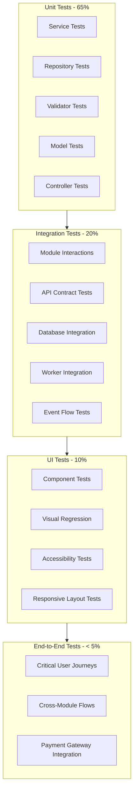
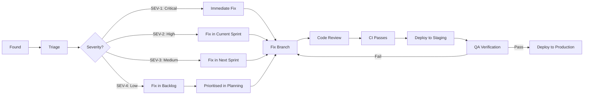

# Testing Strategy & QA Specification (TSQS)
## Project: Independent Online Binary Trading Platform

---

## Revision History

| Date | Version | Description | Author |
| :--- | :--- | :--- | :--- |
| 2026-07-22 | 1.0.0 | Initial Testing Strategy & QA Specification. Derived from all 13 prerequisite documents: BRD v1.0, SRS v1.0, Domain Model v1.0, Software Architecture v1.1, Architecture Review v1.0, Database Design v1.0, API Design v1.0, UI/UX Design v1.0, Security Architecture v1.0, Infrastructure & DevOps v1.0, Implementation v1.0, Project Plan v1.0, and Technical Analysis Report v1.0. | Lead QA Architect / Antigravity |

---

## Cross-References

| Abbreviation | Document |
| :--- | :--- |
| **BRD** | Business Requirements Document (docs/01) |
| **SRS** | System Requirements Specification (docs/02) |
| **DM** | Domain Model Specification (docs/03) |
| **SAD** | Software Architecture v1.1 (docs/04) |
| **ARCH** | Architecture Review v1.0 (docs/05) |
| **DDS** | Database Design Specification (docs/06) |
| **ADS** | API Design Specification (docs/07) |
| **UDS** | UI/UX Design Specification (docs/08) |
| **SATM** | Security Architecture & Threat Model (docs/09) |
| **IDS** | Infrastructure & DevOps Specification (docs/10) |
| **IMP** | Implementation Specification (docs/11) |
| **PLAN** | Project Plan (public/PROJECT_PLAN.md) |
| **TSQS** | This document |

---

## Table of Contents

1. [Testing Philosophy](#1-testing-philosophy)
2. [How to Use This Document](#2-how-to-use-this-document)
3. [Testing Pyramid](#3-testing-pyramid)
4. [Unit Testing Strategy](#4-unit-testing-strategy)
5. [Integration Testing](#5-integration-testing)
6. [API Testing](#6-api-testing)
7. [Database Testing](#7-database-testing)
8. [Business Rule Testing](#8-business-rule-testing)
9. [Wallet & Financial Testing](#9-wallet--financial-testing)
10. [Trading & Settlement Testing](#10-trading--settlement-testing)
11. [Security Testing](#11-security-testing)
12. [UI Testing](#12-ui-testing)
13. [Performance Testing](#13-performance-testing)
14. [Infrastructure Testing](#14-infrastructure-testing)
15. [Automation Strategy](#15-automation-strategy)
16. [Bug Lifecycle](#16-bug-lifecycle)
17. [Test Environment Strategy](#17-test-environment-strategy)
18. [Test Data Management](#18-test-data-management)
19. [Acceptance Criteria Catalogue](#19-acceptance-criteria-catalogue)
20. [Example Test Implementations](#20-example-test-implementations)
21. [Traceability Matrix](#21-traceability-matrix)
22. [Testing Readiness Assessment](#22-testing-readiness-assessment)
23. [Final Recommendation](#23-final-recommendation)

---

## 1. Testing Philosophy

| Principle | Definition | Source |
| :--- | :--- | :--- |
| **Quality-First Development** | Quality is not a separate phase — tests are written alongside code. Every feature includes tests before it is considered complete. | IMP §18.3 (Definition of Done) |
| **Shift-Left Testing** | Test as early as possible. Unit tests run on every commit. Integration tests run on every PR. Security scans run before code is merged. | IMP §19 (Quality Gates) |
| **Risk-Based Testing** | Test effort is proportional to risk. Financial operations receive exhaustive testing (concurrency, idempotency, rollback). UI layout receives visual testing. | SAD §11 (Fault Tolerance), SATM §18 (Risk Register) |
| **Financial Correctness** | Every financial operation must have tests proving: no double-spending, no lost transactions, no race conditions, no balance corruption. | ADR-009, ADR-010, ADR-011, ADR-012 |
| **Security-First Validation** | Security tests are not optional. OWASP Top 10, authentication bypass, injection attacks, and rate limit bypass are tested every release. | SATM §16 (Security Testing) |
| **Automation-First Strategy** | All regression tests are automated. Manual testing is reserved for exploratory, usability, and acceptance testing only. | IDS §11 (CI/CD), IDS §16 (Testing cadence) |

### 1.1 Quality Objectives

| Objective | Target | Measurement |
| :--- | :--- | :--- |
| **Defect escape rate** | < 5% of bugs found in production | Bugs found in production / total bugs |
| **Test automation coverage** | > 90% of regression tests automated | Automated tests / total regression tests |
| **Mean time to detect** | < 15 minutes for SEV-1 incidents | Time from deployment to alert |
| **Mean time to resolve** | < 4 hours for SEV-1, < 24 hours for SEV-2 | Time from alert to fix deployed |
| **Flaky test rate** | < 1% of test runs | Flaky test executions / total test executions |

---

## 2. How to Use This Document

| Role | How to Use |
| :--- | :--- |
| **Backend Developer** | Read §4 (unit tests for your module), §5 (integration tests your module participates in), §6 (API tests for your endpoints), §7 (database tests). Each test section references the specification that defines the behaviour. |
| **Frontend Developer** | Read §12 (UI tests for your screens). Each test references the UDS section defining the screen's appearance and behaviour. |
| **QA Engineer** | Read §3 (test pyramid), §4–§14 (test strategies by layer), §16 (bug lifecycle), §17 (environment strategy), §18 (test data), §19 (acceptance criteria). Use §21 (traceability matrix) to verify coverage. |
| **Security Engineer** | Read §11 (security tests mapped to SATM). Verify OWASP coverage. Review SATM §16 for testing cadence. |
| **DevOps Engineer** | Read §14 (infrastructure tests), §15 (automation strategy), §17 (environment strategy). Configure CI/CD to enforce quality gates per IMP §19. |
| **AI Coding Agent** | Given a module (e.g., "Wallet"), read the corresponding test section (§9) for financial test cases, §4.3 for Wallet unit tests, §5.4 for Wallet integration tests, §6.1–6.3 for API tests. Use §20 for example test implementations. |

### 2.1 Document Navigation by Feature

| Feature | Read These Sections |
| :--- | :--- |
| **Implement Login** | §4.2 (Auth unit tests), §6.2 (Auth API tests), §11.1 (Auth security tests), §12.1 (Login UI tests), §19.1 (Auth acceptance criteria), §20.1 (example test) |
| **Implement Trade Placement** | §4.4 (Trading unit tests), §6.3 (Trading API tests), §10.1 (Trade placement tests), §19.3 (Trading acceptance criteria), §20.3 (example test) |
| **Implement Wallet** | §4.3 (Wallet unit tests), §6.4 (Wallet API tests), §9 (Financial tests), §19.2 (Wallet acceptance criteria) |
| **Implement Settlement** | §4.6 (Settlement unit tests), §10.2 (Settlement tests), §19.4 (Settlement acceptance criteria) |
| **Implement Payment Webhook** | §4.5 (Payment unit tests), §6.5 (Payment API tests), §11.5 (Payment security tests), §19.5 (Payment acceptance criteria) |

---

## 3. Testing Pyramid

### 3.1 Pyramid Diagram



### 3.2 Test Distribution

| Layer | Percentage | Speed | Runs Per | Environment |
| :--- | :---: | :--- | :--- | :--- |
| Unit Tests | 65% | < 10ms each | Every commit | Local / CI |
| Integration Tests | 20% | < 500ms each | Every PR | CI |
| UI Tests | 10% | < 2s each | Every staging deploy | CI (browser) |
| End-to-End Tests | 5% | < 5min total | Every production deploy | Staging / Prod-like |

### 3.3 Coverage Targets

| Metric | Unit | Integration | UI | E2E |
| :--- | :---: | :---: | :---: | :---: |
| **Line coverage** | ≥ 80% | ≥ 60% | — | — |
| **Branch coverage** | ≥ 75% | — | — | — |
| **Critical paths covered** | 100% | 100% | 100% | 100% |
| **Error paths covered** | ≥ 90% | ≥ 80% | ≥ 80% | ≥ 80% |
| **Security controls tested** | 100% | 100% | — | 100% |

### 3.4 Test Types Summary

| Test Type | What It Validates | Tools (Examples) | When |
| :--- | :--- | :--- | :--- |
| **Unit** | Individual functions, methods, classes in isolation | Jest, Mocha, Go test, pytest | Every commit |
| **Integration** | Module interactions, database queries, event flows | Supertest, TestContainers, Docker Compose | Every PR |
| **Contract** | API request/response shapes match ADS specifications | Pact, Dredd, Postman/Newman | Every PR |
| **API** | Endpoint behaviour: success, validation, auth, errors | Postman, Insomnia, REST Assured | Every staging deploy |
| **UI Component** | Individual UI elements render and behave correctly | Storybook, Testing Library, Vitest | Every PR |
| **Visual Regression** | UI appearance matches design specifications | Percy, Chromatic, Applitools | Every staging deploy |
| **Accessibility** | WCAG compliance, keyboard nav, screen reader | axe-core, Lighthouse, Pa11y | Every staging deploy |
| **E2E** | Full user journeys across all layers | Cypress, Playwright, Selenium | Every production deploy |
| **Performance** | Latency, throughput, scalability under load | k6, Locust, Artillery | Weekly / pre-release |
| **Security (SAST)** | Static code analysis for vulnerabilities | SonarQube, Semgrep, CodeQL | Every commit |
| **Security (DAST)** | Dynamic scanning of running application | OWASP ZAP, Burp Suite | Weekly |
| **Chaos** | System behaviour under component failures | Chaos Monkey, Gremlin, Litmus | Monthly |
| **Disaster Recovery** | Backup restore, failover, region recovery | Custom scripts | Quarterly |

---

## 4. Unit Testing Strategy

### 4.1 General Rules

| Rule | Enforcement |
| :--- | :--- |
| Mock all external dependencies (DB, Redis, broker, external APIs) | Use mocking framework. Verify mocks were called. |
| Test public methods only | Private methods tested through public interface. |
| One assertion behaviour per test | Multiple assertions allowed only if all test the same behaviour. |
| Use real domain objects, not mocks, for input | Test factory methods for complex object creation. |
| Name pattern: `{method}_{scenario}_{expectedResult}` | e.g., `placeTrade_insufficientBalance_returnsError` |
| No network calls in unit tests | Tests must complete in < 10ms. |
| No file I/O in unit tests | Use in-memory substitutes. |
| No database connections in unit tests | Repositories are mocked at the service layer. |
| Tests must be deterministic | Same input always produces same output. No random data without seeded RNG. |
| Tests must be isolated | No shared mutable state between tests. Each test sets up its own data. |

### 4.2 Auth Module Unit Tests

| Test ID | Test Case | Assertion | Source |
| :--- | :--- | :--- | :--- |
| **AUTH-UNIT-001** | `register_user_validInput_createsUser` | User record created. Password hashed. Email verification queued. | ADS §7.1 |
| **AUTH-UNIT-002** | `register_duplicateEmail_returnsError` | Error AUTH_001 returned. No user created. | ADS §7.1 |
| **AUTH-UNIT-003** | `register_duplicatePhone_returnsError` | Error returned. No user created. | ADS §7.1 |
| **AUTH-UNIT-004** | `register_invalidEmailFormat_returnsError` | 400 VALIDATION_ERROR. | ADS §7.1 |
| **AUTH-UNIT-005** | `register_weakPassword_returnsError` | 400 VALIDATION_ERROR. Password < 8 chars. | SATM §4.3 |
| **AUTH-UNIT-006** | `register_referralCodeValid_linksReferrer` | Referral relationship created. | BRD §4 |
| **AUTH-UNIT-007** | `register_referralCodeInvalid_ignores` | Registration succeeds without referral link. | ADS §7.1 |
| **AUTH-UNIT-008** | `login_validCredentials_returnsTokens` | Access token (RS256, 15-min TTL). Refresh token (opaque, 7-day). JWT claims contain sub, role, jti. | SATM §4.1 |
| **AUTH-UNIT-009** | `login_invalidPassword_returnsError` | AUTH_001 returned. Failed attempt counter incremented. | SATM §4.3 |
| **AUTH-UNIT-010** | `login_accountLocked_returnsError` | AUTH_004 returned after 5 failed attempts. | SATM §4.3 |
| **AUTH-UNIT-011** | `login_accountSuspended_returnsError` | 403 returned. | SATM §4.3 |
| **AUTH-UNIT-012** | `login_mfaEnabled_requiresMfaToken` | Returns `requires_mfa: true` + mfa_session_token. No access token issued. | SATM §4.4 |
| **AUTH-UNIT-013** | `mfaVerify_validCode_returnsTokens` | TOTP 6-digit code accepted within 30-second window. | SATM §4.4 |
| **AUTH-UNIT-014** | `mfaVerify_expiredCode_returnsError` | AUTH_003 returned for code outside window. | SATM §4.4 |
| **AUTH-UNIT-015** | `mfaVerify_invalidCode_returnsError` | AUTH_003 returned for wrong code. | SATM §4.4 |
| **AUTH-UNIT-016** | `refreshToken_validToken_rotatesAndReturns` | Old refresh token invalidated. New token issued. | SATM §4.2 |
| **AUTH-UNIT-017** | `refreshToken_expiredToken_returnsError` | AUTH_002 returned. | SATM §4.2 |
| **AUTH-UNIT-018** | `refreshToken_revokedToken_returnsError` | AUTH_005 returned. | SATM §4.2 |
| **AUTH-UNIT-019** | `logout_revokesSession` | JTI added to Redis blacklist. Session marked revoked. | SATM §4.5 |
| **AUTH-UNIT-020** | `passwordHash_meetsComplexity` | bcrypt cost ≥ 12 verification. Same password produces different hashes. | SATM §4.3 |
| **AUTH-UNIT-021** | `passwordHash_neverStoredInPlaintext` | Database stores hash only. Original password never logged. | SATM §4.3 |
| **AUTH-UNIT-022** | `mfaRequired_privilegedRole_loginRequiresMfa` | Login for Admin role returns `requires_mfa: true` before tokens. | SATM §4.4 |
| **AUTH-UNIT-023** | `mfaSetup_generatesSecret_encrypted` | TOTP secret generated. Stored encrypted (AES-256-GCM). | SATM §4.4 |
| **AUTH-UNIT-024** | `mfaSetup_returnsRecoveryCodes` | 10 single-use recovery codes generated. | ADS §7.10 |
| **AUTH-UNIT-025** | `forgotPassword_existingEmail_sendsEmail` | Reset token created (1-hour TTL). Email queued. | ADS §7.6 |
| **AUTH-UNIT-026** | `forgotPassword_nonexistentEmail_returnsSuccess` | Always returns 200 (no email enumeration). | ADS §7.6 |
| **AUTH-UNIT-027** | `resetPassword_validToken_updatesPassword` | Password changed. All sessions revoked. | ADS §7.7 |
| **AUTH-UNIT-028** | `resetPassword_expiredToken_returnsError` | AUTH_002 returned. | ADS §7.7 |
| **AUTH-UNIT-029** | `resetPassword_reusedPassword_returnsError` | Last 5 passwords cannot be reused. | ADS §7.7 |
| **AUTH-UNIT-030** | `verifyEmail_validToken_activatesUser` | User status changes from 'unverified' to 'verified'. | ADS §7.8 |

### 4.3 Wallet Module Unit Tests

| Test ID | Test Case | Assertion | Source |
| :--- | :--- | :--- | :--- |
| **WLT-UNIT-001** | `getBalance_validUser_returnsBalances` | balance, lockedBalance, availableBalance returned. available = balance - locked. | ADS §9.1 |
| **WLT-UNIT-002** | `getBalance_newUser_zeroBalance` | New wallet has balance = 0, locked = 0, available = 0. | DDS §5.9 |
| **WLT-UNIT-003** | `debit_sufficientBalance_reducesBalance` | Balance reduced by amount. Ledger entry created (debit type). | DDS §5.9, ADR-009 |
| **WLT-UNIT-004** | `debit_insufficientBalance_returnsError` | LEDGER_001 returned. Balance unchanged. | ADS §6.4 |
| **WLT-UNIT-005** | `debit_zeroAmount_returnsError` | Amount must be > 0. | DDS §5.9 |
| **WLT-UNIT-006** | `debit_negativeAmount_returnsError` | Amount must be > 0. | DDS §5.9 |
| **WLT-UNIT-007** | `credit_increasesBalance` | Balance increased by amount. Ledger entry created (credit type). | DDS §5.9 |
| **WLT-UNIT-008** | `credit_zeroAmount_returnsError` | Amount must be > 0. | DDS §5.9 |
| **WLT-UNIT-009** | `lockStake_availableBalanceSufficient_locksAmount` | lockedBalance increased. availableBalance decreased. Ledger entry written. | ADR-009 |
| **WLT-UNIT-010** | `lockStake_exceedsAvailable_returnsError` | LEDGER_001 returned. No lock applied. | ADR-009 |
| **WLT-UNIT-011** | `lockStake_partialLock_correct` | Lock $30 from $100 balance. locked = $30, available = $70. | ADR-009 |
| **WLT-UNIT-012** | `releaseLock_returnsFunds` | lockedBalance decreased. availableBalance increased. | ADR-009 |
| **WLT-UNIT-013** | `doubleEntry_alwaysBalances` | Sum of all debit entries = sum of all credit entries for any transaction_id. | DM §3 |
| **WLT-UNIT-014** | `doubleEntry_eachTransactionHasDebitAndCredit` | Every transaction_id has at least one debit and one credit entry. | DM §3 |
| **WLT-UNIT-015** | `ledgerEntry_immutable_noUpdateAllowed` | UPDATE statement on ledger_entries returns error. | SATM §7.4 |
| **WLT-UNIT-016** | `ledgerEntry_immutable_noDeleteAllowed` | DELETE statement on ledger_entries returns error. | SATM §7.4 |
| **WLT-UNIT-017** | `concurrentDebits_bothReadSameBalance_secondBlocked` | Simulate two concurrent debits. First succeeds. Second blocks or fails. | ADR-009 |
| **WLT-UNIT-018** | `concurrentCreditAndDebit_noDeadlock` | Simultaneous credit and debit on same wallet. Both complete. | ADR-009 |
| **WLT-UNIT-019** | `balance_neverNegative_afterMultipleDebits` | Sequence of debits never produces negative balance. | DM §8 |
| **WLT-UNIT-020** | `wallet_createdOnUserRegistration` | Wallet automatically created when user registers. | DM §3 |

### 4.4 Trading Module Unit Tests

| Test ID | Test Case | Assertion | Source |
| :--- | :--- | :--- | :--- |
| **TRD-UNIT-001** | `placeTrade_validInput_createsContract` | Contract created with status 'active'. Strike price captured. Expiry scheduled. | ADS §11.3 |
| **TRD-UNIT-002** | `placeTrade_selfExcluded_returnsError` | TRADING_005 returned. No contract created. | SATM §11.4 |
| **TRD-UNIT-003** | `placeTrade_marketClosed_returnsError` | TRADING_004 returned. | ADS §11.3 |
| **TRD-UNIT-004** | `placeTrade_stakeBelowMinimum_returnsError` | TRADING_006 returned. | DDS §5.14 |
| **TRD-UNIT-005** | `placeTrade_stakeAboveMaximum_returnsError` | TRADING_006 returned. | DDS §5.14 |
| **TRD-UNIT-006** | `placeTrade_expiryTooShort_returnsError` | TRADING_007 returned. | DDS §5.14 |
| **TRD-UNIT-007** | `placeTrade_expiryTooLong_returnsError` | TRADING_007 returned. | DDS §5.14 |
| **TRD-UNIT-008** | `placeTrade_exceedsExposure_returnsError` | TRADING_002 returned. | ADS §11.3 |
| **TRD-UNIT-009** | `placeTrade_latencyExceeded_returnsError` | TRADING_003 returned when execution time > 800ms. | SATM §11.4 |
| **TRD-UNIT-010** | `placeTrade_accountSuspended_returnsError` | 403 returned. | ADS §11.3 |
| **TRD-UNIT-011** | `placeTrade_assetInactive_returnsError` | TRADING_004 returned. | DDS §5.14 |
| **TRD-UNIT-012** | `placeTrade_invalidContractType_returnsError` | 400 VALIDATION_ERROR. Only 'higher'/'lower' allowed. | ADS §11.3 |
| **TRD-UNIT-013** | `calculatePayout_win_correctAmount` | Payout = stake × (1 + payout_rate). | BRD §8 |
| **TRD-UNIT-014** | `calculatePayout_loss_zero` | Payout = 0. Stake transferred to platform reserve. | BRD §8 |
| **TRD-UNIT-015** | `calculatePayout_draw_stakeRefunded` | Stake returned. No profit. No loss. | BRD §7 |
| **TRD-UNIT-016** | `calculatePayout_rate60pct_win` | Stake $50, rate 0.60 → payout = $80. | BRD §8 |
| **TRD-UNIT-017** | `calculatePayout_rate65pct_win` | Stake $50, rate 0.65 → payout = $82.50. | BRD §8 |
| **TRD-UNIT-018** | `strikePrice_capturedAtExecution` | Strike price matches current market price at purchase_time. | ADS §11.3 |
| **TRD-UNIT-019** | `expiryTime_strictlyGreaterThanPurchase` | expiry_time > purchase_time. | DM §8 |
| **TRD-UNIT-020** | `contractEvent_createdOnEachTransition` | contract_events table has entries for created, stake_locked, expired, settled. | DDS §5.13 |

### 4.5 Payment Module Unit Tests

| Test ID | Test Case | Assertion | Source |
| :--- | :--- | :--- | :--- |
| **PAY-UNIT-001** | `initiateDeposit_validAmount_createsPending` | Deposit record created with status 'pending'. Gateway reference generated. | ADS §10.1 |
| **PAY-UNIT-002** | `initiateDeposit_belowMinimum_returnsError` | PAYMENT_006 returned. Min deposit = $10. | BRD §7 |
| **PAY-UNIT-003** | `initiateDeposit_gatewayInactive_returnsError` | PAYMENT_001 returned. | ADS §10.1 |
| **PAY-UNIT-004** | `initiateDeposit_idempotencyKey_duplicate_returnsCached` | Same key returns cached 201 response. | ADS §1.5 |
| **PAY-UNIT-005** | `processWebhook_validSignature_updatesStatus` | Deposit status changed to 'completed'. Wallet credited. Outbox event written. | SATM §10.1 |
| **PAY-UNIT-006** | `processWebhook_invalidSignature_returnsError` | PAYMENT_002 returned. No state change. | SATM §10.1 |
| **PAY-UNIT-007** | `processWebhook_duplicateCallback_returnsCached` | Idempotency key detected. Cached 200 returned. No double-credit. | SATM §6.4 |
| **PAY-UNIT-008** | `processWebhook_amountMismatch_returnsError` | Webhook amount differs from deposit record. Flagged for review. | SATM §10.1 |
| **PAY-UNIT-009** | `processWebhook_gatewayTimeout_retries` | Gateway timeout. Transaction stays pending. Retry queued. | SRS EH-001 |
| **PAY-UNIT-010** | `requestWithdrawal_kycNotVerified_returnsError` | PAYMENT_005 returned. | SATM §10.2 |
| **PAY-UNIT-011** | `requestWithdrawal_belowMinimum_returnsError` | PAYMENT_006 returned. Min withdrawal = $15. | BRD §7 |
| **PAY-UNIT-012** | `requestWithdrawal_insufficientBalance_returnsError` | LEDGER_001 returned. | ADS §10.4 |
| **PAY-UNIT-013** | `requestWithdrawal_passwordChangedWithin24h_holdApplied` | Withdrawal created with withdrawal_hold flag. | SATM §10.2 |
| **PAY-UNIT-014** | `requestWithdrawal_autoApproval_belowThreshold` | Amount < $100 auto-approved. Status = 'approved'. | BRD §7 |
| **PAY-UNIT-015** | `requestWithdrawal_manualReview_aboveThreshold` | Amount ≥ $100 status = 'pending_review'. | BRD §7 |
| **PAY-UNIT-016** | `requestWithdrawal_idempotencyKey_duplicate_returnsCached` | Same key returns cached 202 response. | ADS §1.5 |
| **PAY-UNIT-017** | `hmacSignature_correctlyValidates` | HMAC-SHA256 computed on payload matches provided signature. | SATM §10.1 |
| **PAY-UNIT-018** | `hmacSignature_tamperedPayload_fails` | Modified payload produces different HMAC. Validation fails. | SATM §10.1 |
| **PAY-UNIT-019** | `idempotencyKey_expiredAfter7Days` | Key older than 7 days allows new request. | SATM §6.4 |
| **PAY-UNIT-020** | `withdrawalFee_calculatedCorrectly` | Fee = max(1.5% of amount, $2.00). | BRD §8 |

### 4.6 Settlement Worker Unit Tests

| Test ID | Test Case | Assertion | Source |
| :--- | :--- | :--- | :--- |
| **SET-UNIT-001** | `settle_win_correctOutcome` | Status updated to 'Won'. Payout = stake × (1 + rate). Wallet credited. | ADR-010 |
| **SET-UNIT-002** | `settle_loss_correctOutcome` | Status updated to 'Lost'. Stake transferred to platform reserve. | ADR-010 |
| **SET-UNIT-003** | `settle_draw_correctOutcome` | Status updated to 'Draw'. Stake refunded to wallet. | BRD §7 |
| **SET-UNIT-004** | `settle_duplicateJob_discarded` | Atomic CAS on second attempt returns 0 rows → discarded. | ADR-010 |
| **SET-UNIT-005** | `settle_priceFromRedisNotUsed` | Settlement price query goes to `pricing.price_ticks`, not Redis. | ADR-012 |
| **SET-UNIT-006** | `settle_concurrentSameContract_oneSucceeds` | Two workers attempt CAS on same contract. Exactly one succeeds. | ADR-010 |
| **SET-UNIT-007** | `settle_missingPriceTick_usesNearestPreceding` | No tick at exact expiry. Uses nearest tick before expiry. | ADR-012 |
| **SET-UNIT-008** | `settle_contractAlreadySettled_ignored` | Contract status already terminal. Job discarded. | ADR-010 |
| **SET-UNIT-009** | `settle_walletOperationFails_deadLetter` | Wallet Module unavailable. Job sent to dead-letter queue after retries. | SAD §8 |
| **SET-UNIT-010** | `settle_outboxEventWritten` | TradeSettled event written to event_outbox after successful settlement. | ADR-011 |

### 4.7 Referral Module Unit Tests

| Test ID | Test Case | Assertion | Source |
| :--- | :--- | :--- | :--- |
| **REF-UNIT-001** | `generateCode_unique_createsCode` | 8-char alphanumeric code created. Owned by requesting user. | ADS §13.2 |
| **REF-UNIT-002** | `generateCode_maxActiveExceeded_returnsError` | Error when user already has 5 active codes. | ADS §13.2 |
| **REF-UNIT-003** | `generateCode_codeUniqueness_enforced` | Duplicate code generation retries until unique. | DDS §5.27 |
| **REF-UNIT-004** | `registerWithReferral_linksReferral` | Referral relationship created between referrer and referred user. | BRD §4 |
| **REF-UNIT-005** | `registerWithReferral_invalidCode_ignored` | Registration proceeds without referral link. | ADS §7.1 |
| **REF-UNIT-006** | `registerWithReferral_selfReferral_ignored` | User cannot refer themselves. | BRD §4 |
| **REF-UNIT-007** | `calculateCommission_percentageOfMargin_correct` | Commission = platform_margin_from_referred × commission_percentage. | BRD §8 |
| **REF-UNIT-008** | `calculateCommission_noTrade_noCommission` | No commission if referred user has no trades. | BRD §8 |
| **REF-UNIT-009** | `calculateCommission_lossTrade_noCommission` | Commission only on platform margin (winning trades). | BRD §8 |
| **REF-UNIT-010** | `weeklyPayout_batch_correctTotal` | Weekly batch pays accumulated commissions correctly. | BRD §8 |

### 4.8 Compliance Module Unit Tests

| Test ID | Test Case | Assertion | Source |
| :--- | :--- | :--- | :--- |
| **KYC-UNIT-001** | `uploadDocument_validFile_createsPending` | Document record created with status 'pending'. File hash recorded. | ADS §15.2 |
| **KYC-UNIT-002** | `uploadDocument_invalidFileType_returnsError` | Rejected. Accepted: PDF, JPG, PNG only. | ADS §15.2 |
| **KYC-UNIT-003** | `uploadDocument_exceedsSizeLimit_returnsError` | Max 5MB per file enforced. | ADS §18.5 |
| **KYC-UNIT-004** | `uploadDocument_malwareDetected_quarantined` | File flagged by malware scanner. Quarantined. Not stored. | SATM §10.2 |
| **KYC-UNIT-005** | `uploadDocument_maxDocumentsReached_returnsError` | Max 5 documents per user. | ADS §15.2 |
| **KYC-UNIT-006** | `reviewDocument_approve_updatesStatus` | Status changed to 'approved'. User kyc_status updated. Outbox event written. | ADS §14.2 |
| **KYC-UNIT-007** | `reviewDocument_reject_updatesStatus` | Status changed to 'rejected'. User notified. | ADS §14.2 |
| **KYC-UNIT-008** | `reviewDocument_requiresComplianceRole` | Non-compliance role cannot review. 403. | SATM §5.3 |
| **KYC-UNIT-009** | `amlFlag_rapidDepositWithdrawal_triggered` | Deposit + withdrawal within 5 min without trading. Flag created. | SATM §10.2 |
| **KYC-UNIT-010** | `amlFlag_sameIPMultipleAccounts_triggered` | > 3 accounts from same IP in 24h. All flagged. | SATM §10.2 |

### 4.9 Admin Module Unit Tests

| Test ID | Test Case | Assertion | Source |
| :--- | :--- | :--- | :--- |
| **ADM-UNIT-001** | `suspendUser_updatesStatus_revokesSessions` | User status changed to 'suspended'. All sessions revoked. Audit log written. | SATM §4.5 |
| **ADM-UNIT-002** | `activateUser_updatesStatus` | User status changed to 'active'. | ADS §14.1 |
| **ADM-UNIT-003** | `adjustWallet_singleAdminOver500_fourEyesRequired` | Adjustment > $500 requires second approval. Status: 'pending_approval'. | SATM §5.3 |
| **ADM-UNIT-004** | `adjustWallet_superAdminUnder500_immediate` | Super Admin adjustment < $500 executes immediately. Audit log written. | ADS §14.9 |
| **ADM-UNIT-005** | `adjustWallet_secondApprover_confirms` | Second admin approves. Adjustment applied. | SATM §5.3 |
| **ADM-UNIT-006** | `adjustWallet_secondApprover_rejects` | Second admin rejects. Adjustment cancelled. | SATM §5.3 |
| **ADM-UNIT-007** | `adjustWallet_negativeBalance_returnsError` | Adjustment would cause negative balance. LEDGER_001. | DDS §5.9 |
| **ADM-UNIT-008** | `auditLog_chainIntegrity_verified` | Hash chain links correctly. Each entry_hash = SHA256(previous_hash + content). | SATM §12.2 |
| **ADM-UNIT-009** | `auditLog_chainBroken_alertTriggered` | Modified entry breaks chain. Verification cron job detects. | SATM §12.2 |
| **ADM-UNIT-010** | `auditLog_allAdminActionsLogged` | Every admin write action creates audit log entry. | SATM §12.2 |

### 4.10 Pricing Module Unit Tests

| Test ID | Test Case | Assertion | Source |
| :--- | :--- | :--- | :--- |
| **PRC-UNIT-001** | `ingestTick_writesToPriceTicks` | Tick written to `pricing.price_ticks` table. | DDS §5.16 |
| **PRC-UNIT-002** | `ingestTick_publishesToRedis` | Latest price published to Redis `price:{symbol}:latest`. | IDS §8.3 |
| **PRC-UNIT-003** | `ingestTick_duplicateTimestamp_ignored` | Same tick_time + symbol combination ignored. | DDS §5.16 |
| **PRC-UNIT-004** | `calculateOHLC_1minute_correct` | 1-minute candle: open, high, low, close from tick stream. | DDS §5.17 |
| **PRC-UNIT-005** | `calculateOHLC_5minute_correct` | 5-minute candle aggregated from 1-minute candles. | DDS §5.17 |
| **PRC-UNIT-006** | `marketStatus_openDuringHours` | Market open during configured hours. | DDS §5.18 |
| **PRC-UNIT-007** | `marketStatus_closedOutsideHours` | Market closed outside configured hours. | DDS §5.18 |
| **PRC-UNIT-008** | `marketStatus_247_alwaysOpen` | 24/7 markets always return open. | DDS §5.18 |

### 4.11 Notification Module Unit Tests

| Test ID | Test Case | Assertion | Source |
| :--- | :--- | :--- | :--- |
| **NOTIF-UNIT-001** | `emailQueue_validPayload_createsJob` | Email job added to message broker queue with correct routing key. | IDS §8.4 |
| **NOTIF-UNIT-002** | `smsQueue_validPayload_createsJob` | SMS job added to message broker queue with correct routing key. | IDS §8.4 |
| **NOTIF-UNIT-003** | `pushQueue_validPayload_createsJob` | Push notification job added to message broker queue with correct routing key. | IDS §8.4 |
| **NOTIF-UNIT-004** | `templateRender_validTemplate_returnsHtml` | Template engine renders HTML with correct structure. Variables substituted. | IMP §16 |
| **NOTIF-UNIT-005** | `variableSubstitution_allVariablesReplaced` | All template variables ({{name}}, {{amount}}, etc.) replaced with provided values. | IMP §16 |
| **NOTIF-UNIT-006** | `retryLogic_transientFailure_retries` | Temporary provider failure triggers retry with exponential backoff. Max 3 retries. | IDS §8.4 |
| **NOTIF-UNIT-007** | `deadLetterRouting_permanentFailure_routesToDLQ` | After max retries exhausted, job sent to dead-letter queue. Alert triggered. | IDS §8.4 |
| **NOTIF-UNIT-008** | `duplicatePrevention_sameNotificationId_ignored` | Duplicate notification_id within 24-hour window ignored. Idempotency enforced. | ADS §1.5 |
| **NOTIF-UNIT-009** | `deliveryStatus_success_updatesRecord` | Successful delivery updates notification record status to 'delivered'. Timestamp recorded. | DDS §5.29 |
| **NOTIF-UNIT-010** | `preferenceFiltering_userDisabledChannel_skipsQueue` | User has email notifications disabled. Email job not created. SMS created if enabled. | BRD §4 |

---

## 5. Integration Testing

### 5.1 Module Interaction Matrix

| Interaction | Test | Asserts | Source |
| :--- | :--- | :--- | :--- |
| **Wallet ↔ Trading** | Trade placement locks wallet balance | Wallet lockedBalance increases. Trade contract created with reference to ledger entry. | ADR-009, IMP §11 |
| **Payments ↔ Wallet** | Deposit callback credits wallet | Wallet balance increases by deposit amount. Ledger entry created. | ADS §10.2, DDS §5.9 |
| **Payments ↔ User** | Withdrawal checks KYC status | Withdrawal request blocked if user kyc_status != 'verified'. | SATM §10.2 |
| **Settlement ↔ Wallet** | Settlement credits winning payout | Wallet balance increases by stake + payout. Ledger entry created. | ADR-010 |
| **Settlement ↔ Trading** | Settlement updates contract status | Contract status transitions from 'Settling' to 'Won'/'Lost'/'Draw'. | ADR-010 |
| **Settlement ↔ Pricing** | Settlement queries price_ticks | Settlement price retrieved from `pricing.price_ticks`, not Redis. | ADR-012 |
| **Referral ↔ Trading** | TradeSettled event triggers commission | Commission record created when referred user's trade settles. | BRD §8 |
| **Referral ↔ Wallet** | Commission payout credits referrer | Referrer wallet credited with commission amount. | BRD §8 |
| **Auth ↔ Redis** | Token blacklist checked on request | Revoked token returns 401. Valid token passes. | SATM §4.5 |
| **Outbox ↔ Broker** | Event published to broker consumed by worker | Worker receives event and processes it. | ADR-011 |
| **Admin ↔ Wallet** | Admin wallet adjustment routes through Wallet API | Adjustment creates ledger entry. Balance updated. | ADS §14.9 |
| **Compliance ↔ User** | KYC approval updates user status | User kyc_status changes to 'verified'. | ADS §14.2 |

### 5.2 Integration Test Specifications

| Test ID | Test | Precondition | Steps | Expected | Source |
| :--- | :--- | :--- | :--- | :--- | :--- |
| **INT-001** | Full trade lifecycle | User has 100 KES balance, active KYC | Place trade (50 KES, EUR/USD, Higher, 5min) → verify wallet locked (50 KES) → wait for expiry → verify settlement → verify outcome | Wallet balance: 50 KES (loss) or 80 KES (win). Contract status terminal. | ADS §11, ADR-010 |
| **INT-002** | Deposit then trade then withdraw | User has $0 balance | Initiate deposit ($100) → callback → verify balance ($100) → place trade ($30) → expire → verify → request withdrawal ($50) → approve → verify balance | End balance correct after each step. | ADS §10, ADS §9 |
| **INT-003** | Concurrent trades on same wallet | User has $200 balance | Place trade A ($150) simultaneously with trade B ($150) | One succeeds (balance locked). One fails (insufficient funds). | ADR-009 |
| **INT-004** | Idempotent deposit callback | Deposit pending | Send callback → verify credited → send duplicate callback → verify no double credit | Balance = initial + deposit (once). | SATM §6.4 |
| **INT-005** | Outbox relay end-to-end | Deposit completed | Outbox relay picks up event → publishes to broker → Notification Worker receives → WebSocket notification sent | Event delivered exactly-once. | ADR-011 |
| **INT-006** | KYC prevents withdrawal | User kyc_status = 'unverified' | Request withdrawal | Error KYC_001. No withdrawal created. | SATM §10.2 |
| **INT-007** | Self-exclusion blocks trade | User self_excluded_until > now | Place trade | Error TRADING_005. No contract created. | SATM §11.4 |
| **INT-008** | Referral commission on trade | User A referred User B. User B trades. | User B's trade settles (win) → commission calculated → User A wallet credited | User A receives commission. | BRD §8 |
| **INT-009** | Admin four-eyes wallet adjustment | Admin creates adjustment > $500 | Admin A submits → status 'pending_approval' → Admin B approves → adjustment applied | Both admins logged in audit. Balance updated. | SATM §5.3 |
| **INT-010** | Password change revokes all sessions | User has 3 active sessions | User changes password → all 3 sessions return 401 on next request | All sessions revoked. | SATM §4.5 |
| **INT-011** | MFA enforcement for admin login | Admin user without MFA configured | Admin attempts login → receives `requires_mfa: true` → configures MFA → logs in successfully | MFA setup required before first login. | SATM §4.4 |
| **INT-012** | Market closed blocks trading | Asset market hours = closed | Place trade during closed hours | Error TRADING_004. No contract created. | ADS §11.3 |

---

## 6. API Testing

### 6.1 Test Structure per Endpoint

Every endpoint in ADS must have at minimum:

- **1 positive test**: Valid request → expected success response
- **1 validation test**: Invalid input → 400 with field-level errors
- **1 authorization test**: No token → 401. Wrong role → 403.
- **1 rate limit test**: Exceed rate → 429
- **1 idempotency test** (POST only): Duplicate key → cached response (200) or 409
- **1 error handling test**: Trigger business rule → appropriate error code

### 6.2 Authentication API Tests (ADS §7)

| Test ID | Endpoint | Test | Expected | Source |
| :--- | :--- | :--- | :--- | :--- |
| **API-AUTH-001** | POST /auth/register | Valid email, password, name, phone | 201 + user object | ADS §7.1 |
| **API-AUTH-002** | POST /auth/register | Duplicate email | 409 AUTH_001 | ADS §7.1 |
| **API-AUTH-003** | POST /auth/register | Invalid email format | 400 VALIDATION_ERROR | ADS §7.1 |
| **API-AUTH-004** | POST /auth/register | Weak password (< 8 chars) | 400 VALIDATION_ERROR | SATM §4.3 |
| **API-AUTH-005** | POST /auth/register | Missing required field | 400 VALIDATION_ERROR | ADS §7.1 |
| **API-AUTH-006** | POST /auth/register | With valid referral code | 201 + referral linked | ADS §7.1 |
| **API-AUTH-007** | POST /auth/login | Valid credentials | 200 + access_token, refresh_token | ADS §7.2 |
| **API-AUTH-008** | POST /auth/login | Invalid password | 401 AUTH_001 | ADS §7.2 |
| **API-AUTH-009** | POST /auth/login | Nonexistent email | 401 AUTH_001 (no enumeration) | ADS §7.2 |
| **API-AUTH-010** | POST /auth/login | Locked account (5 failures) | 403 AUTH_004 | SATM §4.3 |
| **API-AUTH-011** | POST /auth/login | MFA-enabled user | 200 + requires_mfa: true | ADS §7.2 |
| **API-AUTH-012** | POST /auth/login | Suspended account | 403 | SATM §4.3 |
| **API-AUTH-013** | POST /auth/mfa/verify | Valid TOTP code | 200 + tokens | ADS §7.3 |
| **API-AUTH-014** | POST /auth/mfa/verify | Invalid TOTP code | 401 AUTH_003 | ADS §7.3 |
| **API-AUTH-015** | POST /auth/mfa/verify | Expired session token | 401 AUTH_002 | ADS §7.3 |
| **API-AUTH-016** | POST /auth/refresh | Valid refresh token | 200 + new tokens | ADS §7.5 |
| **API-AUTH-017** | POST /auth/refresh | Expired refresh token | 401 AUTH_002 | ADS §7.5 |
| **API-AUTH-018** | POST /auth/refresh | Revoked refresh token | 401 AUTH_005 | ADS §7.5 |
| **API-AUTH-019** | POST /auth/logout | Valid token | 200 + session revoked | ADS §7.4 |
| **API-AUTH-020** | POST /auth/logout | No token | 401 | ADS §7.4 |
| **API-AUTH-021** | POST /auth/logout | Expired token | 200 (still accepted for logout) | ADS §7.4 |
| **API-AUTH-022** | POST /auth/forgot-password | Existing email | 200 always (no enum) | ADS §7.6 |
| **API-AUTH-023** | POST /auth/forgot-password | Nonexistent email | 200 always (no enum) | ADS §7.6 |
| **API-AUTH-024** | POST /auth/reset-password | Valid token + new password | 200 | ADS §7.7 |
| **API-AUTH-025** | POST /auth/reset-password | Expired token | 401 AUTH_002 | ADS §7.7 |
| **API-AUTH-026** | POST /auth/reset-password | Weak new password | 400 VALIDATION_ERROR | SATM §4.3 |
| **API-AUTH-027** | POST /auth/verify-email | Valid token | 200 | ADS §7.8 |
| **API-AUTH-028** | POST /auth/verify-email | Expired token | 401 AUTH_002 | ADS §7.8 |
| **API-AUTH-029** | POST /auth/mfa/setup | Authenticated | 200 + secret, qr_code | ADS §7.9 |
| **API-AUTH-030** | POST /auth/mfa/setup | Unauthenticated | 401 | ADS §7.9 |
| **API-AUTH-031** | POST /auth/mfa/verify-setup | Valid TOTP | 200 + MFA enabled | ADS §7.10 |
| **API-AUTH-032** | POST /auth/mfa/verify-setup | Invalid TOTP | 401 AUTH_003 | ADS §7.10 |
| **API-AUTH-033** | All auth endpoints | Rate limit exceeded | 429 SYSTEM_003 after 5 login attempts/15min | SATM §6.3 |
| **API-AUTH-034** | Protected endpoint | No Authorization header | 401 | SATM §4.1 |
| **API-AUTH-035** | Protected endpoint | Malformed JWT | 401 | SATM §4.1 |

### 6.3 Trading API Tests (ADS §11)

| Test ID | Endpoint | Test | Expected | Source |
| :--- | :--- | :--- | :--- | :--- |
| **API-TRD-001** | GET /trading/assets | Authenticated | 200 + asset list | ADS §11.1 |
| **API-TRD-002** | GET /trading/assets | Unauthenticated | 401 | ADS §11.1 |
| **API-TRD-003** | GET /trading/assets/{symbol} | Valid symbol | 200 + asset detail | ADS §11.2 |
| **API-TRD-004** | GET /trading/assets/{symbol} | Invalid symbol | 404 | ADS §11.2 |
| **API-TRD-005** | POST /trading/contracts | Valid trade | 201 + contract with strike price | ADS §11.3 |
| **API-TRD-006** | POST /trading/contracts | Insufficient balance | 422 TRADING_001 | ADS §11.3 |
| **API-TRD-007** | POST /trading/contracts | Self-excluded user | 403 TRADING_005 | SATM §11.4 |
| **API-TRD-008** | POST /trading/contracts | Market closed | 503 TRADING_004 | ADS §11.3 |
| **API-TRD-009** | POST /trading/contracts | Stake below minimum | 422 TRADING_006 | ADS §11.3 |
| **API-TRD-010** | POST /trading/contracts | Stake above maximum | 422 TRADING_006 | ADS §11.3 |
| **API-TRD-011** | POST /trading/contracts | Expiry too short | 422 TRADING_007 | ADS §11.3 |
| **API-TRD-012** | POST /trading/contracts | Expiry too long | 422 TRADING_007 | ADS §11.3 |
| **API-TRD-013** | POST /trading/contracts | Trader role only | 403 (support agent tries) | SATM §5.3 |
| **API-TRD-014** | POST /trading/contracts | Duplicate idempotency key | 409 PAYMENT_004 or cached 200 | ADS §1.5 |
| **API-TRD-015** | POST /trading/contracts | Rate limit exceeded | 429 (10 req/sec) | SATM §6.3 |
| **API-TRD-016** | POST /trading/contracts | Missing idempotency key | 400 | ADS §1.5 |
| **API-TRD-017** | GET /trading/contracts/{id} | Contract owner | 200 + contract detail | ADS §11.4 |
| **API-TRD-018** | GET /trading/contracts/{id} | Different user | 404 | ADS §11.4 |
| **API-TRD-019** | GET /trading/contracts/{id} | Admin user | 200 (admin can view any) | ADS §11.4 |
| **API-TRD-020** | GET /trading/contracts/{id} | Nonexistent contract | 404 TRADING_008 | ADS §11.4 |
| **API-TRD-021** | GET /trading/contracts | Paginated, filtered | 200 + paginated list | ADS §11.5 |
| **API-TRD-022** | GET /trading/contracts | Filter by status | 200 + filtered | ADS §11.5 |
| **API-TRD-023** | GET /trading/contracts | Cursor pagination | 200 + next_cursor | ADS §3.4 |
| **API-TRD-024** | GET /trading/contracts/active | Authenticated | 200 + active contracts | ADS §11.6 |
| **API-TRD-025** | GET /trading/contracts/active | No active contracts | 200 + empty array | ADS §11.6 |

### 6.4 Wallet API Tests (ADS §9)

| Test ID | Endpoint | Test | Expected | Source |
| :--- | :--- | :--- | :--- | :--- |
| **API-WLT-001** | GET /wallets/balance | Authenticated | 200 + balance, locked, available | ADS §9.1 |
| **API-WLT-002** | GET /wallets/balance | Unauthenticated | 401 | ADS §9.1 |
| **API-WLT-003** | GET /wallets/balance | Different user's wallet | 404 (ownership enforced) | ADS §9.1 |
| **API-WLT-004** | GET /wallets/ledger | Authenticated | 200 + paginated entries | ADS §9.2 |
| **API-WLT-005** | GET /wallets/ledger | Filtered by type | 200 + filtered entries | ADS §9.2 |
| **API-WLT-006** | GET /wallets/ledger | Cursor pagination | 200 + next_cursor | ADS §3.4 |
| **API-WLT-007** | GET /wallets/ledger | Date range filter | 200 + filtered | ADS §9.2 |
| **API-WLT-008** | GET /wallets/statements | Valid date range | 200 + statement | ADS §9.3 |
| **API-WLT-009** | GET /wallets/statements | Range > 365 days | 400 VALIDATION_ERROR | ADS §9.3 |
| **API-WLT-010** | GET /wallets/statements | CSV format | 200 + text/csv | ADS §9.3 |

### 6.5 Payment API Tests (ADS §10)

| Test ID | Endpoint | Test | Expected | Source |
| :--- | :--- | :--- | :--- | :--- |
| **API-PAY-001** | POST /payments/deposit/initiate | Valid amount | 201 + pending deposit | ADS §10.1 |
| **API-PAY-002** | POST /payments/deposit/initiate | Below minimum | 422 PAYMENT_006 | BRD §7 |
| **API-PAY-003** | POST /payments/deposit/initiate | No idempotency key | 400 | ADS §1.5 |
| **API-PAY-004** | POST /payments/deposit/initiate | Inactive gateway | 422 PAYMENT_001 | ADS §10.1 |
| **API-PAY-005** | POST /payments/deposit/initiate | Duplicate idempotency key | 200 (cached) | ADS §1.5 |
| **API-PAY-006** | POST /payments/deposit/callback | Valid HMAC | 200 + deposit completed | ADS §10.2 |
| **API-PAY-007** | POST /payments/deposit/callback | Invalid HMAC | 400 PAYMENT_002 | SATM §10.1 |
| **API-PAY-008** | POST /payments/deposit/callback | Duplicate callback | 200 (cached) | SATM §6.4 |
| **API-PAY-009** | POST /payments/deposit/callback | Unknown reference | 404 | ADS §10.2 |
| **API-PAY-010** | GET /payments/deposit/{id}/status | Completed deposit | 200 + status | ADS §10.3 |
| **API-PAY-011** | GET /payments/deposit/{id}/status | Not owner | 404 | ADS §10.3 |
| **API-PAY-012** | POST /payments/withdraw/request | Valid request | 202 + pending withdrawal | ADS §10.4 |
| **API-PAY-013** | POST /payments/withdraw/request | KYC not verified | 422 KYC_001 | SATM §10.2 |
| **API-PAY-014** | POST /payments/withdraw/request | Below minimum | 422 PAYMENT_006 | BRD §7 |
| **API-PAY-015** | POST /payments/withdraw/request | Insufficient balance | 422 LEDGER_001 | ADS §10.4 |
| **API-PAY-016** | POST /payments/withdraw/request | No idempotency key | 400 | ADS §1.5 |
| **API-PAY-017** | POST /payments/withdraw/request | Password changed < 24h ago | 422 PAYMENT_007 | SATM §10.2 |
| **API-PAY-018** | GET /payments/withdraw/{id}/status | Pending withdrawal | 200 + status | ADS §10.5 |
| **API-PAY-019** | GET /payments/gateways | Authenticated | 200 + gateway list | ADS §10.6 |
| **API-PAY-020** | GET /payments/gateways | Unauthenticated | 401 | ADS §10.6 |

### 6.6 Referral API Tests (ADS §13)

| Test ID | Endpoint | Test | Expected | Source |
| :--- | :--- | :--- | :--- | :--- |
| **API-REF-001** | GET /referral/codes | Authenticated | 200 + codes list | ADS §13.1 |
| **API-REF-002** | GET /referral/codes | No codes | 200 + empty array | ADS §13.1 |
| **API-REF-003** | POST /referral/codes/generate | Valid | 201 + new code | ADS §13.2 |
| **API-REF-004** | POST /referral/codes/generate | Max 5 reached | 422 | ADS §13.2 |
| **API-REF-005** | GET /referral/invites | Authenticated | 200 + invites list | ADS §13.3 |
| **API-REF-006** | GET /referral/commissions | Authenticated | 200 + commission history | ADS §13.4 |
| **API-REF-007** | GET /referral/commissions | Paginated | 200 + paginated | ADS §13.4 |
| **API-REF-008** | GET /referral/statistics | Authenticated | 200 + stats | ADS §13.5 |

### 6.7 Admin API Tests (ADS §14)

| Test ID | Endpoint | Test | Expected | Source |
| :--- | :--- | :--- | :--- | :--- |
| **API-ADM-001** | GET /admin/users | Admin role | 200 + paginated users | ADS §14.1 |
| **API-ADM-002** | GET /admin/users | Trader role | 403 | SATM §5.3 |
| **API-ADM-003** | GET /admin/users | Filtered by role | 200 + filtered | ADS §14.1 |
| **API-ADM-004** | GET /admin/users/{id} | Admin | 200 + user detail | ADS §14.1 |
| **API-ADM-005** | PUT /admin/users/{id}/status | Admin | 200 + status updated | ADS §14.1 |
| **API-ADM-006** | PUT /admin/users/{id}/status | Invalid status | 400 | ADS §14.1 |
| **API-ADM-007** | GET /admin/kyc/pending | Compliance role | 200 + pending list | ADS §14.2 |
| **API-ADM-008** | PUT /admin/kyc/{id}/review | Compliance role | 200 + document reviewed | ADS §14.2 |
| **API-ADM-009** | PUT /admin/kyc/{id}/review | Support role | 403 | SATM §5.3 |
| **API-ADM-010** | PUT /admin/kyc/{id}/review | Invalid action | 400 | ADS §14.2 |
| **API-ADM-011** | GET /admin/withdrawals/pending | Finance role | 200 + pending list | ADS §14.3 |
| **API-ADM-012** | PUT /admin/withdrawals/{id}/approve | Finance role | 200 + withdrawal approved | ADS §14.3 |
| **API-ADM-013** | PUT /admin/withdrawals/{id}/reject | Finance role | 200 + withdrawal rejected | ADS §14.3 |
| **API-ADM-014** | GET /admin/risk/dashboard | Risk Manager | 200 + risk overview | ADS §14.4 |
| **API-ADM-015** | PUT /admin/risk/asset-config/{symbol} | Risk Manager | 200 + config updated | ADS §14.4 |
| **API-ADM-016** | GET /admin/settings | Admin | 200 + settings | ADS §14.5 |
| **API-ADM-017** | PUT /admin/settings | Admin | 200 + settings updated | ADS §14.5 |
| **API-ADM-018** | POST /admin/wallets/adjust | Super Admin only | 200 + adjustment applied | ADS §14.9 |
| **API-ADM-019** | POST /admin/wallets/adjust | Admin role | 403 | SATM §5.3 |
| **API-ADM-020** | POST /admin/wallets/adjust | > $500 without second approval | 202 + pending_approval | SATM §5.3 |
| **API-ADM-021** | GET /admin/audit-logs | Admin | 200 + paginated logs | ADS §14.7 |
| **API-ADM-022** | GET /admin/audit-logs | Filtered by actor | 200 + filtered | ADS §14.7 |
| **API-ADM-023** | GET /admin/support/tickets | Support role | 200 + tickets | ADS §14.8 |
| **API-ADM-024** | PUT /admin/support/tickets/{id} | Support role | 200 + ticket updated | ADS §14.8 |
| **API-ADM-025** | GET /admin/reports/daily-revenue | Finance role | 200 + report | ADS §14.6 |

### 6.8 Compliance API Tests (ADS §15)

| Test ID | Endpoint | Test | Expected | Source |
| :--- | :--- | :--- | :--- | :--- |
| **API-CMP-001** | GET /compliance/kyc/status | Authenticated | 200 + status | ADS §15.1 |
| **API-CMP-002** | GET /compliance/kyc/status | Unauthenticated | 401 | ADS §15.1 |
| **API-CMP-003** | POST /compliance/kyc/upload | Valid file | 201 + pending | ADS §15.2 |
| **API-CMP-004** | POST /compliance/kyc/upload | No file | 400 | ADS §15.2 |
| **API-CMP-005** | POST /compliance/kyc/upload | File > 5MB | 400 | ADS §18.5 |
| **API-CMP-006** | POST /compliance/kyc/upload | Invalid file type | 400 | ADS §15.2 |
| **API-CMP-007** | GET /compliance/aml/flags | Authenticated | 200 + flags | ADS §15.3 |

### 6.9 Pricing API Tests (ADS §12)

| Test ID | Endpoint | Test | Expected | Source |
| :--- | :--- | :--- | :--- | :--- |
| **API-PRC-001** | GET /pricing/assets | Authenticated | 200 + assets with prices | ADS §12.1 |
| **API-PRC-002** | GET /pricing/assets | Unauthenticated | 401 | ADS §12.1 |
| **API-PRC-003** | GET /pricing/assets/{symbol}/price | Valid symbol | 200 + price | ADS §12.2 |
| **API-PRC-004** | GET /pricing/assets/{symbol}/price | Invalid symbol | 404 | ADS §12.2 |
| **API-PRC-005** | GET /pricing/assets/{symbol}/candles | Valid params | 200 + candles | ADS §12.3 |
| **API-PRC-006** | GET /pricing/assets/{symbol}/candles | Invalid granularity | 400 | ADS §12.3 |
| **API-PRC-007** | GET /pricing/assets/{symbol}/candles | Date range too large | 400 | ADS §12.3 |
| **API-PRC-008** | GET /pricing/status | Authenticated | 200 + market status | ADS §12.4 |

---

## 7. Database Testing

### 7.1 Constraint Tests

| Test ID | Table | Constraint | Test | Expected Behaviour | Source |
| :--- | :--- | :--- | :--- | :--- | :--- |
| **DB-001** | `wallet.wallets` | `CHECK (balance >= 0)` | Attempt to set balance to -10 | Constraint violation. Row not updated. | DDS §5.9 |
| **DB-002** | `wallet.wallets` | `CHECK (available_balance <= balance)` | Set locked_balance > balance | Constraint violation. | DDS §5.9 |
| **DB-003** | `auth.users` | UNIQUE (email) | Insert duplicate email | Unique violation. | DDS §5.1 |
| **DB-004** | `auth.users` | UNIQUE (phone) | Insert duplicate phone | Unique violation. | DDS §5.1 |
| **DB-005** | `trading.binary_contracts` | `CHECK (expiry_time > purchase_time)` | Set expiry before purchase | Constraint violation. | DDS §5.12 |
| **DB-006** | `trading.binary_contracts` | `CHECK (stake > 0)` | Insert stake = 0 | Constraint violation. | DDS §5.12 |
| **DB-007** | `trading.binary_contracts` | `CHECK (payout_rate = 0.60)` | Set rate to 0.50 | Constraint violation. | DDS §5.12 |
| **DB-008** | `payments.deposits` | UNIQUE (gateway_reference) | Insert duplicate gateway ref | Unique violation. | DDS §5.19 |
| **DB-009** | `referral.referral_codes` | UNIQUE (code) | Insert duplicate code | Unique violation. | DDS §5.27 |
| **DB-010** | `payments.idempotency_keys` | PRIMARY KEY (key) | Insert duplicate key | Unique violation. | DDS §5.23 |
| **DB-011** | `auth.users` | `CHECK (failed_login_attempts >= 0)` | Set negative attempts | Constraint violation. | DDS §5.1 |
| **DB-012** | `wallet.ledger_entries` | `CHECK (amount > 0)` | Insert amount = 0 | Constraint violation. | DDS §5.10 |

### 7.2 Foreign Key Tests

| Test ID | Child Table | Parent Table | Test | Expected | Source |
| :--- | :--- | :--- | :--- | :--- | :--- |
| **DB-FK-001** | `wallet.wallets` | `auth.users` | Delete user with wallet | RESTRICT — deletion blocked. | DDS §5.9 |
| **DB-FK-002** | `wallet.ledger_entries` | `wallet.wallets` | Delete wallet with ledger entries | RESTRICT — deletion blocked. | DDS §5.10 |
| **DB-FK-003** | `trading.binary_contracts` | `auth.users` | Delete user with contracts | RESTRICT — deletion blocked. | DDS §5.12 |
| **DB-FK-004** | `payments.deposits` | `payments.payment_gateways` | Delete active gateway with deposits | RESTRICT — deletion blocked. | DDS §5.19 |
| **DB-FK-005** | `referral.referrals` | `auth.users` | Delete referrer with referrals | RESTRICT — deletion blocked. | DDS §5.28 |
| **DB-FK-006** | `compliance.kyc_documents` | `auth.users` | Delete user with KYC docs | RESTRICT — deletion blocked. | DDS §5.24 |

### 7.3 Transaction Tests

| Test ID | Scenario | Steps | Expected | Source |
| :--- | :--- | :--- | :--- | :--- |
| **DB-TXN-001** | Wallet debit within transaction | BEGIN → SELECT FOR UPDATE → UPDATE → INSERT ledger → COMMIT | Balance updated. Ledger entry created. | ADR-009 |
| **DB-TXN-002** | Wallet debit — rollback on error | BEGIN → SELECT FOR UPDATE → UPDATE → INSERT ledger → ROLLBACK | Balance unchanged. No ledger entry. | ADR-009 |
| **DB-TXN-003** | Atomic CAS settlement | UPDATE contracts SET status='Settling' WHERE id=? AND status='Active' | Affected_rows = 1. Status = 'Settling'. | ADR-010 |
| **DB-TXN-004** | Atomic CAS — duplicate discarded | Same UPDATE after already Settling | Affected_rows = 0. No change. | ADR-010 |
| **DB-TXN-005** | Outbox + state change in same transaction | INSERT outbox + UPDATE wallet in single TX → COMMIT → verify both | Both committed. Crash before commit → neither persisted. | ADR-011 |
| **DB-TXN-006** | SELECT FOR UPDATE blocks concurrent write | TX1: SELECT FOR UPDATE. TX2: SELECT FOR UPDATE (blocks). | TX2 waits until TX1 commits. | ADR-009 |
| **DB-TXN-007** | SELECT FOR UPDATE — lock released on commit | TX1: SELECT FOR UPDATE → COMMIT. TX2: SELECT FOR UPDATE (succeeds). | TX2 proceeds after TX1 commits. | ADR-009 |
| **DB-TXN-008** | REPEATABLE READ — phantom row prevented | TX1 reads wallet sum. TX2 inserts new wallet. TX1 re-reads. | Same result. Phantom prevented. | DDS §8 |

### 7.4 Index and Performance Tests

| Test ID | Index | Query Pattern | Expected | Source |
| :--- | :--- | :--- | :--- | :--- |
| **DB-IDX-001** | `price_ticks_settlement_idx` | `SELECT * FROM price_ticks WHERE symbol=? AND tick_time<=? ORDER BY tick_time DESC LIMIT 1` | Index scan. < 10ms on 10M rows. | DDS §5.16 |
| **DB-IDX-002** | `ledger_wallet_id_created_idx` | `SELECT * FROM ledger_entries WHERE wallet_id=? ORDER BY created_at DESC LIMIT 20` | Index scan. < 5ms. | DDS §5.10 |
| **DB-IDX-003** | `trading_contracts_expiry_idx` | `SELECT * FROM binary_contracts WHERE status='active' AND expiry_time < NOW()` | Index scan. < 10ms on 1M active rows. | DDS §5.12 |
| **DB-IDX-004** | `auth_users_email_idx` | `SELECT * FROM users WHERE email=?` | Unique index scan. < 2ms. | DDS §5.1 |
| **DB-IDX-005** | `deposits_gateway_reference_idx` | `SELECT * FROM deposits WHERE gateway_reference=?` | Unique index scan. < 2ms. | DDS §5.19 |

### 7.5 Audit Chain Tests

| Test ID | Scenario | Steps | Expected | Source |
| :--- | :--- | :--- | :--- | :--- |
| **DB-AUD-001** | Hash chain integrity | Insert 100 audit entries. Verify each entry_hash = SHA256(previous_hash + content). | All entries valid. Chain intact. | SATM §12.2 |
| **DB-AUD-002** | Tampered entry detected | Modify content of entry #50. Re-run chain verification. | Verification fails at entry #50. | SATM §12.2 |
| **DB-AUD-003** | Ledger immutability | Attempt UPDATE on ledger_entries | Error. No rows updated. | SATM §7.4 |
| **DB-AUD-004** | Ledger immutability | Attempt DELETE on ledger_entries | Error. No rows deleted. | SATM §7.4 |
| **DB-AUD-005** | First entry has null previous_hash | Insert first audit entry | previous_hash = NULL. entry_hash = SHA256(content). | SATM §12.2 |

### 7.6 Partitioning Tests

| Test ID | Table | Test | Expected | Source |
| :--- | :--- | :--- | :--- | :--- |
| **DB-PART-001** | `price_ticks` | Insert data across month boundary | Data routed to correct partition. | DDS §5.16 |
| **DB-PART-002** | `price_ticks` | Query with date range across partitions | Partition pruning. Query scans relevant partitions only. | DDS §5.16 |
| **DB-PART-003** | `ledger_entries` | Insert data across month boundary | Data routed to correct partition. | DDS §5.10 |
| **DB-PART-004** | `binary_contracts` | Insert data across month boundary | Data routed to correct partition. | DDS §5.12 |

---

## 8. Business Rule Testing

| Test ID | Invariant | Test | Expected | Source |
| :--- | :--- | :--- | :--- | :--- |
| **BIZ-001** | Balance non-negative | Attempt to withdraw more than balance | Error LEDGER_001. | DM §8 |
| **BIZ-002** | Ledger double-entry balances | Sum of all debits ≠ sum of all credits for any transaction | Error. Transaction rejected. | DM §8 |
| **BIZ-003** | Trade expiry > purchase | Set expiry <= purchase | Error TRADING_007. | DM §8 |
| **BIZ-004** | Wallet-write authority | Non-Wallet module attempts to modify wallet balance | Error. Operation blocked. | DM §5 |
| **BIZ-005** | Single owner per wallet | Create second wallet for same user | Error. UNIQUE constraint. | DM §8 |
| **BIZ-006** | KYC before withdrawal | Withdrawal request with kyc_status = 'unverified' | Error KYC_001. | ADS §10.4 |
| **BIZ-007** | Self-exclusion blocks trading | Trade request with active self-exclusion | Error TRADING_005. | SATM §11.4 |
| **BIZ-008** | Minimum deposit | Deposit request < $10 | Error PAYMENT_006. | BRD §7 |
| **BIZ-009** | Minimum withdrawal | Withdrawal request < $15 | Error PAYMENT_006. | BRD §7 |
| **BIZ-010** | Max stake per trade | Trade stake > $500 | Error TRADING_006. | BRD §7 |
| **BIZ-011** | Max asset exposure | Trade would exceed $10,000 exposure for asset | Error TRADING_002. | BRD §7 |
| **BIZ-012** | Draw settlement refund | Strike price == expiry price | Stake refunded. No profit/loss. | BRD §7 |
| **BIZ-013** | MFA for privileged roles | Admin logs in without MFA configured | Login returns `requires_mfa: true`. No tokens issued. | SATM §4.4 |
| **BIZ-014** | 24-hour withdrawal hold | Password changed < 24 hours ago | Withdrawal blocked (PAYMENT_007). | SATM §10.2 |
| **BIZ-015** | Max 5 referral codes | User generates 6th code | Error. | ADS §13.2 |
| **BIZ-016** | Latency threshold | Trade execution > 800ms | Error TRADING_003. | SATM §11.4 |
| **BIZ-017** | Withdrawal auto-approval limit | Withdrawal < $100 auto-approved | Status = 'approved'. No manual review. | BRD §7 |
| **BIZ-018** | Withdrawal manual review | Withdrawal ≥ $100 requires review | Status = 'pending_review'. | BRD §7 |
| **BIZ-019** | Four-eyes for large adjustments | Wallet adjustment > $500 | Requires second admin approval. | SATM §5.3 |
| **BIZ-020** | Email uniqueness | Register with existing email | Error AUTH_001. | DDS §5.1 |

---

## 9. Wallet & Financial Testing

### 9.1 Financial Correctness Tests

| Test ID | Scenario | Setup | Steps | Expected | Source |
| :--- | :--- | :--- | :--- | :--- | :--- |
| **FIN-001** | Deposit + Trade + Win + Withdraw | User: $0 balance | Deposit $100 → verify $100 → trade $50 (win) → verify $140 → withdraw $50 → verify $90 | All balances correct at each step. Ledger entries balance. | BRD §6 |
| **FIN-002** | Deposit + Trade + Loss + Withdraw | User: $0 balance | Deposit $100 → trade $50 (loss) → verify $50 → withdraw $30 → verify $20 | All correct. Loss correctly deducted. | BRD §6 |
| **FIN-003** | Deposit + Trade + Draw | User: $0 balance | Deposit $100 → trade $50 (draw) → verify $100 | Stake refunded. No profit/loss. | BRD §7 |
| **FIN-004** | Concurrent deposits | User: $0 | Two simultaneous $50 deposits | Both credited. Balance = $100. | ADR-009 |
| **FIN-005** | Concurrent trades exhausting balance | User: $100 | Trade A: $60, Trade B: $60 simultaneously | One executes. One fails (TRADING_001). | ADR-009 |
| **FIN-006** | Double-spend prevented | User: $50 | Submit trade twice with same idempotency key | One contract created. Duplicate returns cached 200. | ADS §1.5 |
| **FIN-007** | Double-settlement prevented | Contract: active | Submit same settlement job twice | First succeeds. Second discarded (atomic CAS). | ADR-010 |
| **FIN-008** | Multiple deposits over time | User: $0 | Deposit $10, $20, $50 over 3 days | Balance = $80. All ledger entries correct. | DDS §5.9 |
| **FIN-009** | Full balance withdrawal | User: $100 | Withdraw $100 | Balance = $0. Ledger entry created. | ADS §10.4 |
| **FIN-010** | Withdrawal fee calculation | User: $100 | Withdraw $50 | Fee = $1.50 (1.5%). Net = $48.50. | BRD §8 |

### 9.2 Ledger Integrity Tests

| Test ID | Scenario | Steps | Expected | Source |
| :--- | :--- | :--- | :--- | :--- |
| **LED-001** | Start balance 0 → 10 operations | Execute 10 mixed deposits, trades, settlements | Sum of all wallet balances = sum of all credits - sum of all debits | DM §3 |
| **LED-002** | Manual admin adjustment | Super Admin credits $100 with reason | Ledger entry created with reference_type='admin_adjustment'. Balance increases. | ADS §14.9 |
| **LED-003** | Four-eyes adjustment | Admin adjusts $600 → pending approval → second admin approves | Only applied after second approval. Audit trail complete. | SATM §5.3 |
| **LED-004** | Ledger reconciliation | Compare wallet.balance sum vs ledger total | Must match. Alert if discrepancy > $0.01. | SRS FR-WLT-003 |
| **LED-005** | Platform revenue calculation | Sum of all trade_loss entries | Platform revenue = sum of all losing stakes - sum of all winning payouts. | BRD §8 |

---

## 10. Trading & Settlement Testing

### 10.1 Trade Placement Tests

| Test ID | Scenario | Steps | Expected | Source |
| :--- | :--- | :--- | :--- | :--- |
| **TRD-001** | Valid trade | Buy EUR/USD Higher, 50 KES, 5min | 201 Created. Stake locked. Strike price captured. Expiry scheduled. | ADS §11.3 |
| **TRD-002** | Valid trade — Lower | Buy XAU/USD Lower, 30 KES, 15min | 201 Created. Contract type = 'lower'. | ADS §11.3 |
| **TRD-003** | Invalid contract type | Buy EUR/USD 'equal', $50, 5min | 400 VALIDATION_ERROR. | ADS §11.3 |
| **TRD-004** | Asset not found | Buy FAKE/USD Higher, $50, 5min | 404. | ADS §11.2 |
| **TRD-005** | 10-step validation order | Trigger each validation step individually | Steps execute in order per ADS §11.3. First failure blocks. | ADS §11.3 |
| **TRD-006** | Strike price from Redis | Redis available | Strike price from Redis cache. | IDS §8.3 |
| **TRD-007** | Strike price from DB fallback | Redis unavailable | Strike price from PostgreSQL price_ticks. | IDS §8.2 |
| **TRD-008** | Expiry job enqueued | Trade placed successfully | Message enqueued to `trade.expiry` queue with contract ID and expiry timestamp. | SAD §7.1 |

### 10.2 Settlement Tests

| Test ID | Scenario | Steps | Expected | Source |
| :--- | :--- | :--- | :--- | :--- |
| **SET-001** | Win — price increased | Strike: 1.10000, Expiry: 1.10500, Higher | Won. Payout = stake × 1.60. | BRD §8 |
| **SET-002** | Loss — price decreased | Strike: 1.10000, Expiry: 1.09500, Higher | Lost. Stake lost. | BRD §8 |
| **SET-003** | Draw — price unchanged | Strike: 1.10000, Expiry: 1.10000, Higher | Draw. Stake refunded. | BRD §7 |
| **SET-004** | Win — Lower | Strike: 1.10000, Expiry: 1.09500, Lower | Won. | BRD §8 |
| **SET-005** | Loss — Lower | Strike: 1.10000, Expiry: 1.10500, Lower | Lost. | BRD §8 |
| **SET-006** | Settlement with missing price tick | Expiry time has no price_ticks entry | Settlement falls back to nearest preceding tick. Contract status kept in dead-letter if gap > threshold. | ADR-012 |
| **SET-007** | 100 simultaneous settlements | 100 contracts expire at same time | All 100 settled within 2 seconds (SRS NFR-PER-003). No double-settlements. | SRS NFR-PER-003 |
| **SET-008** | Settlement with Redis unavailable | Redis cluster down | Settlement price from PostgreSQL. No delay. | ADR-012 |
| **SET-009** | Settlement worker crash mid-process | Worker crashes after CAS but before payout | Job redelivered. CAS finds status != 'Active'. Discarded. Dead-letter for reconciliation. | SAD §8 |

---

## 11. Security Testing

### 11.1 Authentication Security Tests (SATM §4)

| Test ID | Attack Vector | Test | Expected | Source |
| :--- | :--- | :--- | :--- | :--- |
| **SEC-AUTH-001** | JWT forgery (HS256) | Submit JWT signed with public key as HMAC secret | 401. Token rejected. | SATM §4.1 |
| **SEC-AUTH-002** | JWT expired | Submit token with past `exp` | 401 AUTH_002. | SATM §4.1 |
| **SEC-AUTH-003** | JWT missing signature | Submit token with empty signature | 401. | SATM §4.1 |
| **SEC-AUTH-004** | JWT tampered payload | Modify `sub` claim | 401. Signature validation fails. | SATM §4.1 |
| **SEC-AUTH-005** | JWT alg confusion | Change `alg` to 'none' | 401. Algorithm enforced. | SATM §4.1 |
| **SEC-AUTH-006** | Refresh token reuse | Use refresh token after rotation | 401 AUTH_007. Old token invalid. | SATM §4.2 |
| **SEC-AUTH-007** | Brute force login | 10 rapid login attempts with wrong password | Locked after 5 attempts. 429 rate limit after threshold. | SATM §4.3 |
| **SEC-AUTH-008** | MFA bypass | Skip MFA step, request tokens directly | 401 AUTH_003. | SATM §4.4 |
| **SEC-AUTH-009** | MFA code reuse | Use same TOTP code twice | Second attempt fails (code already used or outside window). | SATM §4.4 |
| **SEC-AUTH-010** | Session revocation bypass | Use token after logout | 401 AUTH_005 (JTI in blacklist). | SATM §4.5 |
| **SEC-AUTH-011** | Session revocation after password change | Use old token after password reset | 401. All sessions revoked. | SATM §4.5 |
| **SEC-AUTH-012** | Password hash extraction | Access database password_hash column | Hash is bcrypt/Argon2id. Cannot reverse. | SATM §4.3 |

### 11.2 Authorization Security Tests (SATM §5)

| Test ID | Attack Vector | Test | Expected | Source |
| :--- | :--- | :--- | :--- | :--- |
| **SEC-AUTHZ-001** | Role escalation | Trader attempts to access /admin/users | 403 Forbidden. | SATM §5.3 |
| **SEC-AUTHZ-002** | Privilege escalation | Support agent attempts to approve withdrawal | 403. | SATM §5.3 |
| **SEC-AUTHZ-003** | IDOR — own data | User A views User B's wallet | 404 or 403. | SATM §5.3 |
| **SEC-AUTHZ-004** | IDOR — admin access | Admin views User B's wallet (authorised) | 200. | SATM §5.3 |
| **SEC-AUTHZ-005** | IDOR — trade history | User A views User B's trade list | 404 or 403. | SATM §5.3 |
| **SEC-AUTHZ-006** | Direct DB bypass | Attempt SQL injection to modify wallet balance | Parameterized query rejects. 0 rows affected or error. | SATM §6.5 |
| **SEC-AUTHZ-007** | Role modification | Trader attempts to change own role | 403. Role changes require Super Admin. | SATM §5.3 |
| **SEC-AUTHZ-008** | Four-eyes bypass | Single admin attempts > $500 adjustment | 202 + pending_approval. Not applied. | SATM §5.3 |

### 11.3 Injection Security Tests (SATM §6.5)

| Test ID | Attack Vector | Test | Expected | Source |
| :--- | :--- | :--- | :--- | :--- |
| **SEC-INJ-001** | SQL injection | Submit `' OR 1=1; --` in email field | Query parameterized. No injection. 400 or 401. | SATM §6.5 |
| **SEC-INJ-002** | SQL injection — login bypass | Submit `admin' --` in password field | Parameterized. No bypass. 401. | SATM §6.5 |
| **SEC-INJ-003** | SQL injection — UNION | Submit `' UNION SELECT * FROM users; --` | Parameterized. No injection. | SATM §6.5 |
| **SEC-INJ-004** | NoSQL injection | Submit `{ "$gt": "" }` in email field | JSON Schema validation rejects. 400. | SATM §6.5 |
| **SEC-INJ-005** | XSS — stored | Submit `<script>alert('XSS')</script>` in display_name | Stored as literal text. Not rendered as HTML. UDS §15. | SATM §6.5 |
| **SEC-INJ-006** | XSS — reflected | Submit `<script>` in query parameter | HTML-encoded in response. Not executed. | SATM §6.5 |
| **SEC-INJ-007** | Command injection | Submit `; rm -rf /` in input field | Rejected by input validation. No shell execution. | SATM §6.5 |

### 11.4 API Security Tests (SATM §6)

| Test ID | Attack Vector | Test | Expected | Source |
| :--- | :--- | :--- | :--- | :--- |
| **SEC-API-001** | Rate limit bypass | Exceed 300 req/min with different tokens | Each token tracked separately. 429 after limit. | SATM §6.3 |
| **SEC-API-002** | Rate limit bypass — trading | 20 trade requests in 1 second | 429 after 10 requests. | SATM §6.3 |
| **SEC-API-003** | Rate limit bypass — login | 20 login attempts in 1 minute | 429 after 5 attempts. | SATM §6.3 |
| **SEC-API-004** | Replay attack | Replay captured deposit/initiate request | Idempotency key prevents duplicate. 409 or cached 200. | SATM §6.4 |
| **SEC-API-005** | CSRF | POST request without origin header | API uses JWT, not cookies. CSRF not applicable. | SATM §6.8 |
| **SEC-API-006** | CORS bypass | Request from unauthorized origin | CORS headers deny access. | SATM §6.7 |
| **SEC-API-007** | Payload size exceed | Submit 100KB request body | 400. Max 10KB enforced. | SATM §6.6 |
| **SEC-API-008** | HTTP method override | Submit POST with `X-HTTP-Method-Override: DELETE` | Ignored or rejected. | SATM §6.5 |
| **SEC-API-009** | Path traversal | Submit `../../etc/passwd` in path parameter | Rejected. Path normalized. | SATM §6.5 |

### 11.5 Payment Security Tests (SATM §10)

| Test ID | Attack Vector | Test | Expected | Source |
| :--- | :--- | :--- | :--- | :--- |
| **SEC-PAY-001** | Webhook forgery | Submit fake deposit callback without signature | 400 PAYMENT_002. | SATM §10.1 |
| **SEC-PAY-002** | Webhook replay | Capture valid webhook, replay it | Idempotency key check. Cached 200. No double-credit. | SATM §10.1 |
| **SEC-PAY-003** | Amount tampering | Modify amount in captured webhook payload | HMAC signature verification fails. | SATM §10.1 |
| **SEC-PAY-004** | Webhook from unknown IP | Submit callback from non-allowlisted IP | 403 or 400. | SATM §10.1 |
| **SEC-PAY-005** | Duplicate gateway reference | Submit callback with used gateway reference | Idempotency check. Cached response. | SATM §6.4 |

### 11.6 OWASP Top 10 (2021) Validation

| OWASP Category | Test Coverage | Verified By |
| :--- | :--- | :--- |
| **A01: Broken Access Control** | SEC-AUTHZ-001 through SEC-AUTHZ-008 | Integration tests |
| **A02: Cryptographic Failures** | SEC-AUTH-001 through SEC-AUTH-005, SEC-AUTH-012 | Unit tests |
| **A03: Injection** | SEC-INJ-001 through SEC-INJ-007 | DAST + unit tests |
| **A04: Insecure Design** | ARCH review, STRIDE analysis (SATM §3) | Document review |
| **A05: Security Misconfiguration** | IDS hardening, container scanning | Infrastructure tests |
| **A06: Vulnerable Components** | Dependency scanning (IMP §19) | CI/CD gate |
| **A07: Auth Failures** | SEC-AUTH-001 through SEC-AUTH-012 | Integration tests |
| **A08: Data Integrity Failures** | DB-AUD-001, DB-AUD-002, FIN-005, FIN-006 | Database tests |
| **A09: Logging Failures** | Audit chain tests, log masking verification | Unit + integration |
| **A10: SSRF** | Outbound network allowlist verification | Infrastructure tests |

---

## 12. UI Testing

### 12.1 Screen Tests (mapped to UDS)

| Test ID | Screen | Tests | UDS Source |
| :--- | :--- | :--- | :--- |
| **UI-LOGIN-001** | Login | All elements render: logo, email field, password field, Sign In button, Forgot Password link, Create Account link | §5.1 |
| **UI-LOGIN-002** | Login | Invalid email shows inline validation error in red | §5.1 |
| **UI-LOGIN-003** | Login | Loading state: button shows spinner, fields disabled | §5.1 |
| **UI-LOGIN-004** | Login | MFA transition: after valid credentials, MFA screen appears | §5.1, §5.3 |
| **UI-LOGIN-005** | Login | Session expired banner appears when redirected from expired session | §5.1 |
| **UI-LOGIN-006** | Login | Error state: "Invalid email or password" displayed | §5.1 |
| **UI-LOGIN-007** | Login | Account locked message with timer | §5.7 |
| **UI-REG-001** | Register | Password strength meter updates in real-time | §5.2 |
| **UI-REG-002** | Register | Duplicate email shows error message | §5.2 |
| **UI-REG-003** | Register | Steps indicator shows progress (1. Details → 2. Verify) | §5.2 |
| **UI-REG-004** | Register | Referral code optional field visible | §5.2 |
| **UI-MFA-001** | MFA | 6 individual digit inputs with auto-advance | §5.3 |
| **UI-MFA-002** | MFA | Paste support for 6-digit code | §5.3 |
| **UI-MFA-003** | MFA | Countdown timer: 30 seconds | §5.3 |
| **UI-MFA-004** | MFA | Error: "Invalid code. Try again." | §5.3 |
| **UI-DASH-001** | Dashboard | 4 stat cards render: Balance, Today's P&L, Open Trades, Win Rate | §6.2 |
| **UI-DASH-002** | Dashboard | Empty state for first-time user: "Deposit to start trading" CTA | §6.3 |
| **UI-DASH-003** | Dashboard | Skeleton loading states for 400ms before data | §6.4 |
| **UI-DASH-004** | Dashboard | Open trades table renders with correct columns | §6.1 |
| **UI-DASH-005** | Dashboard | Notification bell shows unread count badge | §6.1 |
| **UI-TRADE-001** | Trading interface | Asset selector opens dropdown with search | §7.2 |
| **UI-TRADE-002** | Trading interface | Stake input shows quick-adjust buttons (10, 25, 50, 100) | §7.2 |
| **UI-TRADE-003** | Trading interface | Expected payout updates live as stake changes | §7.2 |
| **UI-TRADE-004** | Trading interface | Buy Up button green, Buy Down button red | §7.2 |
| **UI-TRADE-005** | Trading interface | Buttons disabled when market closed + tooltip | §7.4 |
| **UI-TRADE-006** | Trading interface | Countdown timer shows seconds remaining (mono font) | §7.2 |
| **UI-TRADE-007** | Trading interface | Settlement animation: flash green for win, red for loss, yellow for draw | §7.3 |
| **UI-TRADE-008** | Trading interface | Latency indicator changes colour by threshold | §7.5 |
| **UI-TRADE-009** | Trading interface | Contract confirmation panel shows all trade details | §7.2 |
| **UI-TRADE-010** | Trading interface | Chart timeframe selector: 1m, 5m, 15m, 1H, 4H, 1D | §7.2 |
| **UI-WALLET-001** | Wallet | Balance, locked, available amounts displayed | §8.1 |
| **UI-WALLET-002** | Wallet | Deposit button navigates to deposit flow | §8.2 |
| **UI-WALLET-003** | Wallet | Transaction table with search, filter, pagination | §8.1 |
| **UI-WALLET-004** | Wallet | Withdrawal flow shows fee breakdown | §8.3 |
| **UI-WALLET-005** | Wallet | Pending withdrawals tab shows status badges | §8.4 |
| **UI-KYC-001** | KYC | Upload ID screen with drag-and-drop zone | §10.2 |
| **UI-KYC-002** | KYC | Pending state shows progress indicator | §10.2 |
| **UI-KYC-003** | KYC | Approved state shows green checkmark | §10.2 |
| **UI-KYC-004** | KYC | Rejected state shows reason + resubmit button | §10.2 |
| **UI-ADMIN-001** | Admin portal | Sidebar navigation with all sections | §12.1 |
| **UI-ADMIN-002** | Admin | KYC review queue shows pending documents | §12.2 |
| **UI-ADMIN-003** | Admin | Withdrawal queue can be approved/rejected | §12.3 |
| **UI-ADMIN-004** | Admin | Risk dashboard shows exposure bars | §12.4 |
| **UI-ADMIN-005** | Admin | Audit log viewer with search and filters | §12.7 |

### 12.2 Component Tests (UDS §13)

| Test ID | Component | Tests | Source |
| :--- | :--- | :--- | :--- |
| **UI-COMP-001** | Primary Button | Renders with correct height (44px), brand bg, white text. Hover: darker. Disabled: opacity 0.4. Loading: spinner replaces text. | §13.1 |
| **UI-COMP-002** | Buy Up Button | Green bg, white text, 48px height. Hover: darker green. Pressed: scale(0.97). | §13.1 |
| **UI-COMP-003** | Buy Down Button | Red bg, white text, 48px height. Hover: darker red. Pressed: scale(0.97). | §13.1 |
| **UI-COMP-004** | Text Input | Renders with 44px height, 1px border. Focus: brand 2px ring. Error: danger ring + message below. | §13.3 |
| **UI-COMP-005** | Badge | Success: green bg, green text. Warning: amber bg. Danger: red bg. | §13.5 |
| **UI-COMP-006** | Modal | Fade-in + scale-up animation. Escape key closes. Overlay at 50% opacity. | §13.6 |
| **UI-COMP-007** | Table | Header: bg-secondary, 12px uppercase. Rows: alternating bg. Sortable headers with arrow. | §13.4 |
| **UI-COMP-008** | Pagination | "Showing 1–25 of 142" text. « Prev, page numbers with ellipsis, Next ». | §13.8 |
| **UI-COMP-009** | Tabs (Underline) | Horizontal list. Active tab: brand bottom border, bold text. | §13.9 |
| **UI-COMP-010** | Skeleton | Pulsing grey rectangle. Opacity 0.1. Animation: 1.5s ease-in-out infinite. | §14.1 |

### 12.3 Responsive Tests (UDS §16)

| Test ID | Breakpoint | Screen | Expected Layout | Source |
| :--- | :--- | :--- | :--- | :--- |
| **UI-RESP-001** | < 640px | Dashboard | Single column, stat cards stacked. Bottom tab bar visible. | §16.2 |
| **UI-RESP-002** | < 640px | Trading | Chart top 50% of viewport. Trade panel below. Bottom sheet for confirmation. | §16.2 |
| **UI-RESP-003** | < 640px | Wallet | Single column. Full-width transaction list. | §16.2 |
| **UI-RESP-004** | < 640px | Admin | Stacked cards. Simple list views. | §16.2 |
| **UI-RESP-005** | 640–1023px | Dashboard | 2×2 stat grid. Side-by-side trades + activity. | §16.2 |
| **UI-RESP-006** | 640–1023px | Trading | Chart left (60%), panel right (40%). Full modal for confirmation. | §16.2 |
| **UI-RESP-007** | ≥ 1024px | Dashboard | 4 stat cards in a row. Multi-column layout. Sidebar expanded. | §16.2 |
| **UI-RESP-008** | ≥ 1024px | Trading | Side-by-side chart (65%) + panel (35%). Inline confirmation. | §16.2 |
| **UI-RESP-009** | ≥ 1440px | Dashboard | 4 stat cards + extra margins. Wide layout. | §16.1 |
| **UI-RESP-010** | Landscape (phone) | Trading | Chart full height. Trade panel as collapsible bottom sheet. | §16.3 |

### 12.4 Accessibility Tests (UDS §15)

| Test ID | Criterion | Test | Expected | Source |
| :--- | :--- | :--- | :--- | :--- |
| **UI-A11Y-001** | Keyboard navigation | Tab through entire login form | All elements reachable. Visible focus ring. | §15.2 |
| **UI-A11Y-002** | Skip link | First tabbable element is "Skip to content" | Visible on focus. | §15.2 |
| **UI-A11Y-003** | Escape key | Open modal → press Escape | Modal closes. | §15.2 |
| **UI-A11Y-004** | Screen reader | Balance update announced | `aria-live="polite"` on balance element. | §15.3 |
| **UI-A11Y-005** | Screen reader | Error message announced | `role="alert"` on validation errors. | §15.3 |
| **UI-A11Y-006** | Screen reader | Landmarks present | `header`, `nav`, `main`, `aside`, `footer` semantic elements. | §15.3 |
| **UI-A11Y-007** | Contrast | Body text (#1A1D23) on bg (#FFFFFF) | Ratio 14:1 ≥ 7:1 AAA target. | §15.4 |
| **UI-A11Y-008** | Contrast | Brand button text (#FFFFFF) on brand bg (#2563EB) | Ratio 4.5:1 ≥ 4.5:1 AA target. | §15.4 |
| **UI-A11Y-009** | Contrast | Error text (#DC2626) on bg (#FFFFFF) | Ratio 4.7:1 ≥ 4.5:1 AA target. | §15.4 |
| **UI-A11Y-010** | Touch targets | All interactive elements | Min 44×44px. | §15.5 |
| **UI-A11Y-011** | Touch targets | Bottom tab items | Min 48×48px. | §15.5 |
| **UI-A11Y-012** | Font scaling | Scale browser to 200% | No text truncation or overflow. | §15.6 |
| **UI-A11Y-013** | Reduced motion | Enable prefers-reduced-motion | All animations disabled. Settlement shows static badge. | §14.3 |
| **UI-A11Y-014** | Focus order | Tab through trading interface | Logical left-to-right, top-to-bottom. | §15.2 |
| **UI-A11Y-015** | Heading hierarchy | Each page has single h1 | Logical h1 → h2 → h3 nesting. | §15.3 |

---

## 13. Performance Testing

### 13.1 Load Tests

| Test ID | Scenario | Target | Threshold | Source |
| :--- | :--- | :--- | :--- | :--- |
| **PERF-LD-001** | API — normal load | 500 concurrent users, 1000 req/s | p95 latency < 200ms. Error rate < 1%. | SRS NFR-PER-001 |
| **PERF-LD-002** | API — peak load | 2000 concurrent users, 5000 req/s | p95 latency < 500ms. Error rate < 5%. | SRS §10 |
| **PERF-LD-003** | Trade placement | 50 trades/sec | p95 execution < 150ms. All succeed. | SRS §10 |
| **PERF-LD-004** | WebSocket streaming | 1000 concurrent WS connections, tick every 200ms | p95 tick delivery < 50ms. | SRS NFR-PER-002 |
| **PERF-LD-005** | Settlement throughput | 100 contracts expiring simultaneously | All settled within 2 seconds. | SRS NFR-PER-003 |
| **PERF-LD-006** | Database write load | 500 ledger writes/sec | Write latency < 10ms. No deadlocks. | DDS §2 |
| **PERF-LD-007** | Login flow | 100 login requests/sec | p95 < 500ms. | SRS §10 |
| **PERF-LD-008** | Deposit callback | 50 webhook callbacks/sec | p95 < 200ms. All processed. | SRS §10 |

### 13.2 Stress Tests

| Test ID | Scenario | Target | Expected Behaviour |
| :--- | :--- | :--- | :--- |
| **PERF-STR-001** | API — 3× peak load | 6000 req/s sustained for 5 min | Degradation but no crash. 503 errors, not 500. Recovers after load drops. |
| **PERF-STR-002** | Queue flood | 10,000 settlement jobs enqueued simultaneously | Workers scale up. Queue drains within 5 min. No job loss. |
| **PERF-STR-003** | Database connection exhaustion | 200 simultaneous connections | Pooler queues excess. Requests wait, not error. |
| **PERF-STR-004** | Memory exhaustion | Increase load until OOM | Process restarts. No data corruption. |
| **PERF-STR-005** | Disk full | Fill disk to 100% | Graceful error. No partial writes. |

### 13.3 Endurance Tests

| Test ID | Scenario | Duration | Expected |
| :--- | :--- | :--- | :--- |
| **PERF-END-001** | Sustained API load | 12 hours at 500 req/s | No memory leak. No latency degradation. No error rate increase. |
| **PERF-END-002** | Continuous price streaming | 24 hours | WebSocket connections stable. No disconnection cascade. |
| **PERF-END-003** | Trade + settle cycle | 8 hours, 10 trades/min | Ledger balances correct at end. All contracts settled. |
| **PERF-END-004** | Database under continuous write | 24 hours at 100 writes/sec | No replication lag > 5s. No deadlocks. |

### 13.4 Scalability Tests

| Test ID | Scenario | Steps | Expected |
| :--- | :--- | :--- | :--- |
| **PERF-SCL-001** | API auto-scaling | Increase load from 100 to 2000 req/s | Auto-scaling group adds instances. Latency stays < 500ms. |
| **PERF-SCL-002** | Worker auto-scaling | Enqueue 5000 settlement jobs | Worker count increases. Queue drains. |
| **PERF-SCL-003** | Database read replica | Run 100 concurrent report queries | Read replica handles load. Primary unaffected. |

---

## 14. Infrastructure Testing

### 14.1 Deployment Tests

| Test ID | Scenario | Steps | Expected | Source |
| :--- | :--- | :--- | :--- | :--- |
| **INFRA-DEP-001** | Blue-green deploy | Deploy new version → switch traffic → verify | Zero downtime during switch. Old version still serving during provisioning. | IDS §12.1 |
| **INFRA-DEP-002** | Rollback | Switch to green → trigger rollback | Traffic returns to blue in < 1 second. No data loss. | IDS §12.2 |
| **INFRA-DEP-003** | Database migration | Run backward-compatible migration | Old version operates correctly with new schema. | IDS §12.3 |
| **INFRA-DEP-004** | Worker drain | Deploy new worker version | Old workers finish current jobs. New workers pick up new jobs. | IDS §12.3 |
| **INFRA-DEP-005** | Zero-downtime migration | Add column while serving traffic | No errors during migration. New column available after. | IDS §11.4 |

### 14.2 Failover Tests

| Test ID | Scenario | Steps | Expected | Source |
| :--- | :--- | :--- | :--- | :--- |
| **INFRA-FO-001** | Database primary failure | Stop PostgreSQL primary | Standby promoted < 30 seconds. API reconnects. No data loss. | IDS §7.2 |
| **INFRA-FO-002** | Redis primary failure (sessions) | Stop Redis primary | Replica promoted < 10 seconds. New auth tokens continue. Existing tokens valid. | IDS §8.2 |
| **INFRA-FO-003** | Redis primary failure (pricing) | Stop Redis primary | Replica promoted. Price streaming resumes. Settlement via DB unaffected. | IDS §8.2 |
| **INFRA-FO-004** | Broker node failure | Stop one broker node | Other nodes take over. No message loss. | IDS §9.1 |
| **INFRA-FO-005** | API server failure | Kill one API server instance | Load balancer routes away. No downtime. | IDS §17.1 |
| **INFRA-FO-006** | Full Redis cluster outage (sessions) | Stop all Redis session nodes | New logins blocked. Existing tokens valid for 15 min. Rate limiting falls back. | IDS §8.2 |
| **INFRA-FO-007** | Full Redis cluster outage (pricing) | Stop all Redis pricing nodes | Price streaming halted. Settlement uses DB. Trade placement reads from DB. | IDS §8.2 |

### 14.3 Backup & Restore Tests

| Test ID | Scenario | Steps | Expected | Source |
| :--- | :--- | :--- | :--- | :--- |
| **INFRA-BKP-001** | Full database backup | Trigger daily backup | Backup completes within 30 min. Backup file encrypted (AES-256). | IDS §7.4 |
| **INFRA-BKP-002** | Point-in-time recovery | Restore to specific timestamp | Database recovered with all transactions up to that timestamp. | IDS §15.3 |
| **INFRA-BKP-003** | Disaster recovery failover | Activate DR region | DNS switch completes. DR standby promoted. RTO < 5 min. RPO < 1 min. | IDS §15.3 |
| **INFRA-BKP-004** | Backup integrity check | Verify checksums of all backup files | All checksums valid. | IDS §15.4 |
| **INFRA-BKP-005** | WAL archive restore | Replay WAL from backup | Database reaches consistent state at target time. | IDS §15.3 |

---

## 15. Automation Strategy

### 15.1 Test Execution in CI/CD Pipeline (per IMP §19)

```mermaid
graph TD
    A[Code Commit] --> B[G1: PR Gate]
    B --> B1[Lint + Format]
    B --> B2[Unit Tests]
    B --> B3[SAST Scan]
    B --> B4[Dependency Scan]
    B --> B5{All Pass?}
    B5 -->|Yes| C[Merge to develop]
    B5 -->|No| D[Block Merge + Notify]
    
    C --> E[G2: Staging Gate]
    E --> E1[Integration Tests]
    E --> E2[Container Scan]
    E --> E3{All Pass?}
    E3 -->|Yes| F[Deploy to Staging]
    E3 -->|No| D
    
    F --> G[G3: Staging Validation]
    G --> G1[Smoke Tests]
    G --> G2[API Tests]
    G --> G3[UI Tests]
    G --> G4[Accessibility Tests]
    G --> G5[Performance Tests (sampled)]
    G --> G6{All Pass?}
    G6 -->|Yes| H[Ready for Production]
    G6 -->|No| D
    
    H --> I[G4: Production Gate]
    I --> I1[E2E Tests]
    I --> I2[Security Scans]
    I --> I3[Manual Approval]
    I --> I4{Approved?}
    I4 -->|Yes| J[Blue-Green Deploy]
    I4 -->|No| K[Block]
    
    J --> L[Post-Deploy]
    L --> L1[Smoke Tests]
    L --> L2[Monitor 10 min]
    L --> L3{Healthy?}
    L3 -->|Yes| M[Complete]
    L3 -->|No| N[Auto-Rollback]
```

### 15.2 Test Execution Speed Targets

| Test Type | Max Duration | Fail Action |
| :--- | :--- | :--- |
| Unit tests (per module) | 30 seconds | Block PR merge |
| Unit tests (all modules) | 3 minutes | Block PR merge |
| Integration tests | 10 minutes | Block staging deploy |
| API tests | 15 minutes | Block staging deploy |
| UI tests | 20 minutes | Warning (non-blocking for staging) |
| E2E tests | 30 minutes | Block production deploy |
| Security scans (SAST) | 10 minutes | Block PR merge |
| Dependency scan | 5 minutes | Block PR merge |
| Load tests | 30 minutes | Block production deploy |

### 15.3 Coverage Thresholds per Quality Gate

| Gate | Unit Coverage | Integration | Security | Performance |
| :--- | :---: | :---: | :---: | :---: |
| **G1: PR** | ≥ 70% | — | 0 critical SAST | — |
| **G2: Staging** | ≥ 75% | ≥ 50% | 0 critical DAST | — |
| **G3: Staging validation** | ≥ 80% | ≥ 60% | 0 critical pen-test | p95 < 200ms |
| **G4: Production** | ≥ 80% | ≥ 60% | All security tests pass | All perf tests pass |

### 15.4 Test Execution Schedule

| Test Type | Frequency | Trigger | Environment |
| :--- | :--- | :--- | :--- |
| Unit | Every commit | Pre-commit hook + CI | Local + CI |
| Integration | Every PR | PR opened/updated | CI |
| API | Every staging deploy | Deploy to staging | Staging |
| UI | Every staging deploy | Deploy to staging | Staging |
| E2E | Every production deploy | Deploy to production | Staging |
| Performance | Weekly | Cron schedule | Staging |
| Security (SAST) | Every commit | Pre-commit hook | CI |
| Security (DAST) | Weekly | Cron schedule | Staging |
| Chaos | Monthly | Cron schedule | Staging |
| DR | Quarterly | Scheduled drill | DR environment |

---

## 16. Bug Lifecycle

### 16.1 Bug Workflow



### 16.2 Severity Definitions

| Severity | Label | Definition | SLA | Example |
| :--- | :--- | :--- | :--- | :--- |
| **SEV-1** | Critical | System unavailable. Financial data at risk. Security breach. | Fix within 4 hours | Wallet balance incorrect. Double-settlement. Auth bypass. |
| **SEV-2** | High | Major feature broken. Significant financial impact. No workaround. | Fix within 24 hours | Trade placement failing. Withdrawal blocked for all users. |
| **SEV-3** | Medium | Feature partially broken. Workaround exists. Minor financial impact. | Fix within 1 week | UI display issue on trade history. Filter not working. |
| **SEV-4** | Low | Cosmetic issue. Documentation. Minor UI polish. | Fix within 1 month | Typo in tooltip. Colour slightly off. |

### 16.3 Priority Definitions

| Priority | Definition | Example |
| :--- | :--- | :--- |
| **P0** | Blocking release. Must fix before next deploy. | Login broken for all users. |
| **P1** | Should fix in current sprint. High business impact. | Trade history pagination broken. |
| **P2** | Fix in next sprint. Moderate impact. | Admin report export missing column. |
| **P3** | Fix when time permits. Low impact. | Minor UI alignment issue. |

### 16.4 Regression Policy

| Change Type | Regression Tests Required |
| :--- | :--- |
| Bug fix | All unit tests for affected module + integration test for the fix + relevant API tests |
| Feature addition | All unit + integration + API tests for the new feature + smoke test on related modules |
| Refactor | Full unit test suite for affected modules + integration tests for all module interactions |
| Dependency update | Full test suite (unit + integration + API + UI + E2E) |
| Database migration | All integration tests + data integrity verification tests |

---

## 17. Test Environment Strategy

### 17.1 Environment Specifications

| Environment | Purpose | Configuration | Test Data | Gateways |
| :--- | :--- | :--- | :--- | :--- |
| **Local Dev** | Developer testing during implementation | Docker Compose. Mock all externals. | Synthetic, generated per test run. | Mock |
| **CI** | Automated test execution per commit/PR | Ephemeral CI runner. Fresh DB per run. | Generated per test suite. | Mock |
| **QA** | Manual and automated pre-release testing | Full stack. Reduced scale (2 API, 1 worker). | Generated + anonymised production subset. | Sandbox |
| **Staging** | UAT, load testing, final validation | Full production topology. Read replica. | Anonymised production copy. Weekly refresh. | Sandbox |
| **Production** | Live platform | Full HA. Auto-scaling. | Real user data. | Live |

### 17.2 Environment Access

| Environment | Access | Credentials | Data Sensitivity |
| :--- | :--- | :--- | :--- |
| Local Dev | Developer only | Local credentials | None |
| CI | CI pipeline only | Automated | None |
| QA | QA team + developers | Shared test accounts | Anonymised |
| Staging | QA team + developers | Shared test accounts | Anonymised PII |
| Production | Operations only | Individual MFA-protected | Real PII |

### 17.3 Database Refresh Policy

| Environment | Refresh Source | Frequency | Method |
| :--- | :--- | :--- | :--- |
| Local Dev | Seed scripts | On demand | `docker compose down -v && up` |
| CI | Seed scripts | Every CI run | Fresh migration + seed |
| QA | Seed scripts + anonymised subset | Weekly | Restore from anonymised snapshot |
| Staging | Anonymised production snapshot | Weekly | Restore + anonymise script |
| Production | — | — | Real data |

---

## 18. Test Data Management

### 18.1 Data Factories

Each module should have a test data factory that generates valid domain objects:

| Factory | Output | Key Fields |
| :--- | :--- | :--- |
| `createUser(overrides)` | User object | email, password, displayName, phone, role |
| `createWallet(overrides)` | Wallet object | userId, balance, lockedBalance |
| `createContract(overrides)` | Contract object | userId, assetSymbol, stake, contract_type, expiry |
| `createDeposit(overrides)` | Deposit object | userId, amount, gatewayId, status |
| `createWithdrawal(overrides)` | Withdrawal object | userId, amount, status |
| `createReferralCode(overrides)` | ReferralCode object | ownerId, code |
| `createKYCDocument(overrides)` | KYCDocument object | userId, documentType, status |

### 18.2 Test Data Rules

| Rule | Description |
| :--- | :--- |
| **Deterministic** | Same seed produces same data. Use seeded RNG. |
| **Isolated** | Each test creates its own data. No shared state. |
| **Cleanup** | Test teardown removes all created data. |
| **Realistic** | Use realistic values (valid emails, real asset symbols, reasonable amounts). |
| **Boundary** | Include boundary values (min deposit $10, max stake $500, min expiry 60s). |

### 18.3 Anonymisation Rules (for Staging Data)

| Field | Anonymisation |
| :--- | :--- |
| email | `user{id}@test.example.com` |
| phone | `+0000000{last4}` |
| display_name | `User {firstName} {lastName}` (random from list) |
| IP address | Last octet randomised |
| KYC document images | Replaced with placeholder image |

---

## 19. Acceptance Criteria Catalogue

### 19.1 Authentication Acceptance Criteria

| ID | Criterion | Pass Condition |
| :--- | :--- | :--- |
| **AC-AUTH-001** | User can register with valid email, password, name, phone | 201 response. User created. |
| **AC-AUTH-002** | User cannot register with duplicate email | 409 error. |
| **AC-AUTH-003** | User cannot register with weak password | 400 error. Password must be ≥ 8 chars with mixed case, digit, special. |
| **AC-AUTH-004** | User can log in with valid credentials | 200 response. Access token + refresh token returned. |
| **AC-AUTH-005** | User cannot log in with wrong password | 401 error. Failed attempt counter increments. |
| **AC-AUTH-006** | Account locks after 5 failed attempts | 403 error. "Account locked" message. |
| **AC-AUTH-007** | MFA-enabled user must complete MFA before receiving tokens | Login returns `requires_mfa: true`. |
| **AC-AUTH-008** | Valid TOTP code completes MFA and returns tokens | 200 response with tokens. |
| **AC-AUTH-009** | Refresh token can be used to get new access token | 200 response with new tokens. Old token invalidated. |
| **AC-AUTH-010** | Logout invalidates current session | Subsequent request with same token returns 401. |
| **AC-AUTH-011** | Password reset email sent for existing email | 200 response. Email queued. |
| **AC-AUTH-012** | Password reset with valid token updates password | 200 response. User can log in with new password. |
| **AC-AUTH-013** | Email verification activates account | 200 response. User status = 'verified'. |

### 19.2 Wallet Acceptance Criteria

| ID | Criterion | Pass Condition |
| :--- | :--- | :--- |
| **AC-WLT-001** | User can view wallet balance | 200 response. balance, locked, available returned. |
| **AC-WLT-002** | User can view paginated ledger history | 200 response. Entries sorted by date. Cursor pagination works. |
| **AC-WLT-003** | User can view account statements for date range | 200 response. All transactions in range included. |
| **AC-WLT-004** | Balance is never negative | Any operation that would cause negative balance returns error. |
| **AC-WLT-005** | Ledger entries are immutable | UPDATE/DELETE on ledger_entries fails. |
| **AC-WLT-006** | Double-entry ledger always balances | Sum of debits = sum of credits for every transaction. |

### 19.3 Trading Acceptance Criteria

| ID | Criterion | Pass Condition |
| :--- | :--- | :--- |
| **AC-TRD-001** | User can place a valid trade | 201 response. Contract created. Stake locked. |
| **AC-TRD-002** | Trade validates all business rules before execution | Each rule failure returns appropriate error. |
| **AC-TRD-003** | Self-excluded user cannot trade | 403 TRADING_005. |
| **AC-TRD-004** | Trade cannot be placed when market is closed | 503 TRADING_004. |
| **AC-TRD-005** | Stake must be within asset limits | 422 TRADING_006 for below min or above max. |
| **AC-TRD-006** | Expiry must be within allowed range | 422 TRADING_007 for too short or too long. |
| **AC-TRD-007** | User can view own contract details | 200 response with contract data. |
| **AC-TRD-008** | User cannot view another user's contract | 404. |
| **AC-TRD-009** | User can list own trade history with filters | 200 response. Filtered and paginated. |

### 19.4 Settlement Acceptance Criteria

| ID | Criterion | Pass Condition |
| :--- | :--- | :--- |
| **AC-SET-001** | Winning contract pays correct payout | Status = 'Won'. Wallet credited with stake + profit. |
| **AC-SET-002** | Losing contract correctly deducts stake | Status = 'Lost'. Stake not returned. |
| **AC-SET-003** | Draw contract refunds stake | Status = 'Draw'. Stake returned. No profit/loss. |
| **AC-SET-004** | Duplicate settlement job is discarded | Second attempt has no effect. |
| **AC-SET-005** | Settlement uses price from price_ticks table | Query goes to PostgreSQL, not Redis. |
| **AC-SET-006** | Concurrent settlement of same contract is safe | Exactly one worker succeeds. |
| **AC-SET-007** | Settlement completes within 2 seconds of expiry | SRS NFR-PER-003. |

### 19.5 Payment Acceptance Criteria

| ID | Criterion | Pass Condition |
| :--- | :--- | :--- |
| **AC-PAY-001** | User can initiate deposit | 201 response. Pending deposit created. |
| **AC-PAY-002** | Deposit amount must be ≥ $10 | 422 for amount < $10. |
| **AC-PAY-003** | Valid webhook callback credits wallet | Deposit status = 'completed'. Balance increased. |
| **AC-PAY-004** | Invalid webhook signature is rejected | 400 PAYMENT_002. No state change. |
| **AC-PAY-005** | Duplicate webhook callback does not double-credit | Cached 200 response. Balance unchanged. |
| **AC-PAY-006** | User can request withdrawal | 202 response. Pending withdrawal created. |
| **AC-PAY-007** | Withdrawal requires KYC verification | 422 KYC_001 if unverified. |
| **AC-PAY-008** | Withdrawal amount must be ≥ $15 | 422 for amount < $15. |
| **AC-PAY-009** | Withdrawal < $100 auto-approved | Status = 'approved'. |
| **AC-PAY-010** | Withdrawal ≥ $100 requires manual review | Status = 'pending_review'. |

---

## 20. Example Test Implementations

### 20.1 Example: Auth Login Unit Test (Pseudocode)

```
Test: login_validCredentials_returnsTokens

Setup:
  - Mock UserRepository.findByEmail() returns user with hashed password
  - Mock PasswordService.verify() returns true
  - Mock TokenService.generateAccessToken() returns 'access-token-123'
  - Mock TokenService.generateRefreshToken() returns 'refresh-token-456'
  - Mock SessionRepository.create() returns session record

Execute:
  result = authService.login('user@example.com', 'correct-password')

Assert:
  result.accessToken == 'access-token-123'
  result.refreshToken == 'refresh-token-456'
  result.expiresIn == 900
  result.tokenType == 'Bearer'
  result.user.email == 'user@example.com'
  result.user.role == 'trader'
  
  Verify UserRepository.findByEmail was called with 'user@example.com'
  Verify PasswordService.verify was called with 'correct-password' and stored hash
  Verify TokenService.generateAccessToken was called with user.id, user.role
  Verify SessionRepository.create was called
```

### 20.2 Example: Trade Placement Integration Test (Pseudocode)

```
Test: INT-001 Full trade lifecycle

Setup:
  - Create user with 100 KES balance (via UserFactory + WalletFactory)
  - Ensure EUR/USD market is open
  - Ensure user is not self-excluded

Execute:
  response = POST /api/v1/trading/contracts {
    assetSymbol: 'EUR/USD',
    contractType: 'higher',
    stake: '50.00',
    expirySeconds: 300
  }
  
  Assert Step 1:
  response.status == 201
  response.data.status == 'active'
  response.data.stake == '50.00'
  response.data.strikePrice != null
  response.data.purchaseTime != null
  response.data.expiryTime == purchaseTime + 300 seconds
  
  // Step 2: Verify wallet locked
  walletResponse = GET /api/v1/wallets/balance
  walletResponse.data.availableBalance == '50.00'  // 100 KES - 50 KES
  walletResponse.data.lockedBalance == '50.00'
  
  // Step 3: Wait for expiry (or trigger settlement manually)
  // ... simulate expiry ...
  
  // Step 4: Verify settlement
  contractResponse = GET /api/v1/trading/contracts/{contractId}
  contractResponse.data.status is one of ['won', 'lost', 'draw']
  contractResponse.data.expiryPrice != null
  contractResponse.data.settledAt != null
  
  // Step 5: Verify final balance
  finalWallet = GET /api/v1/wallets/balance
  // If won: balance == 50 KES + 80 KES = 130 KES
  // If lost: balance == 50 KES
  // If draw: balance == 100 KES
```

### 20.3 Example: Atomic CAS Settlement Test (Pseudocode)

```
Test: SET-UNIT-004 settle_duplicateJob_discarded

Setup:
  - Create contract with status = 'Active'
  - Mock SettlementWorker.process()

Execute:
  // First attempt
  result1 = settlementWorker.settle(contractId)
  
  // Second attempt (simulating duplicate delivery)
  result2 = settlementWorker.settle(contractId)

Assert:
  result1.success == true
  result1.contractStatus == 'Won' (or 'Lost' or 'Draw')
  
  result2.success == true
  result2.discarded == true  // Atomic CAS returned 0 rows
  result2.contractStatus == result1.contractStatus  // Unchanged
  
  // Verify wallet was credited exactly once
  Verify WalletService.credit was called exactly 1 time
```

### 20.4 Example: Concurrent Wallet Debit Test (Pseudocode)

```
Test: WLT-UNIT-009 concurrentDebits_bothReadSameBalance_secondBlocked

Setup:
  - Create wallet with balance = $100
  - Use database transaction with REPEATABLE READ isolation

Execute:
  // Thread 1: Debit $60
  thread1 = spawn(() => walletService.debit(walletId, 60))
  
  // Thread 2: Debit $60 (simultaneous)
  thread2 = spawn(() => walletService.debit(walletId, 60))
  
  // Wait for both
  result1 = thread1.join()
  result2 = thread2.join()

Assert:
  // Exactly one succeeds
  (result1.success && !result2.success) || (!result1.success && result2.success)
  
  // Balance is $40 (one debit succeeded)
  finalBalance = walletRepository.getBalance(walletId)
  finalBalance == 40
  
  // Exactly one ledger entry created
  ledgerEntries = ledgerRepository.getByWallet(walletId)
  ledgerEntries.length == 1
  ledgerEntries[0].amount == 60
  ledgerEntries[0].type == 'debit'
```

---

## 21. Traceability Matrix

### 21.1 BRD → Test Mapping

| BRD Requirement | Covered By | Test IDs |
| :--- | :--- | :--- |
| User Registration (§4, §5) | Auth API tests | API-AUTH-001–006 |
| KYC Verification (§4, §5) | Compliance tests | KYC-UNIT-001–010, API-CMP-001–007 |
| Deposit Funds (§6) | Payment tests | API-PAY-001–005, FIN-001–004 |
| Withdrawal (§6) | Payment + Wallet tests | API-PAY-012–018, FIN-001–002 |
| Binary Trade Execution (§6.3) | Trading tests | TRD-UNIT-001–020, API-TRD-001–025 |
| Trade Settlement (§6.3) | Settlement tests | SET-UNIT-001–010, SET-001–009 |
| Real-Time Price Streaming | Pricing + WS tests | API-PRC-001–008 |
| Admin Back-Office (§4) | Admin tests | API-ADM-001–025, ADM-UNIT-001–010 |
| Referral System (§4) | Referral tests | REF-UNIT-001–010, API-REF-001–008 |
| Risk Management (§9) | Business rule tests | BIZ-001–020 |
| Draw Settlement | Settlement tests | SET-003, SET-UNIT-003, BIZ-012 |
| Self-Exclusion (§9) | Business rule tests | BIZ-007, TRD-UNIT-002 |

### 21.2 SRS → Test Mapping

| SRS Requirement | Covered By | Test IDs |
| :--- | :--- | :--- |
| FR-ATH-001 (Registration) | Auth API tests | API-AUTH-001–006 |
| FR-ATH-002 (Login) | Auth API tests | API-AUTH-007–012 |
| FR-ATH-003 (MFA) | Auth API tests | API-AUTH-013–015 |
| FR-ATH-004 (Logout) | Auth API tests | API-AUTH-019–021 |
| FR-KYC-001 (KYC Submission) | Compliance tests | KYC-UNIT-001–005, API-CMP-003–006 |
| FR-KYC-002 (KYC Status) | Compliance tests | API-CMP-001–002 |
| FR-KYC-003 (Admin KYC) | Admin tests | API-ADM-007–010 |
| FR-WLT-001 (Wallet Query) | Wallet tests | WLT-UNIT-001–002, API-WLT-001–003 |
| FR-WLT-002 (Ledger) | Wallet tests | WLT-UNIT-013–016, API-WLT-004–007 |
| FR-WLT-003 (Reconciliation) | Financial tests | LED-001, LED-004 |
| FR-DEP-001 (Deposit Init) | Payment tests | API-PAY-001–005 |
| FR-DEP-002 (Webhook Handler) | Payment tests | API-PAY-006–009, SEC-PAY-001–005 |
| FR-WTH-001 (Withdrawal Request) | Payment tests | API-PAY-012–018 |
| FR-WTH-002 (Approval Routing) | Admin tests | API-ADM-011–013 |
| FR-WTH-003 (Disbursement) | Admin tests | API-ADM-012 |
| FR-TRD-001 (Trade Placement) | Trading tests | TRD-UNIT-001–012, API-TRD-005–016 |
| FR-TRD-002 (Strike Price) | Trading tests | TRD-UNIT-018 |
| FR-TRD-003 (Active Trades) | Trading tests | API-TRD-024–025 |
| FR-SET-001 (Expiry Scheduler) | Settlement tests | SET-007 |
| FR-SET-002 (Contract Resolution) | Settlement tests | SET-UNIT-001–010 |
| FR-SET-003 (Payout Settlement) | Financial tests | FIN-001–010 |
| FR-MKT-001 (Price Feed) | Pricing tests | PRC-UNIT-001–008 |
| FR-MKT-002 (Tick Streaming) | Pricing tests | PERF-LD-004 |
| FR-MKT-003 (OHLC Query) | Pricing tests | API-PRC-005–007 |
| FR-ADM-001 (User Management) | Admin tests | API-ADM-001–006 |
| FR-ADM-002 (Risk Console) | Admin tests | API-ADM-014–015 |
| FR-ADM-003 (Wallet Adjustment) | Admin tests | ADM-UNIT-003–007, API-ADM-018–020 |
| NFR-PER-001 (API < 200ms) | Performance tests | PERF-LD-001 |
| NFR-PER-002 (WS < 50ms) | Performance tests | PERF-LD-004 |
| NFR-PER-003 (Settlement < 2s) | Performance tests | PERF-LD-005 |

### 21.3 ADR → Test Mapping

| ADR | Description | Test IDs |
| :--- | :--- | :--- |
| **ADR-009** | Wallet locking (SELECT FOR UPDATE) | WLT-UNIT-009, WLT-UNIT-017–019, DB-TXN-001–002, DB-TXN-006–007, FIN-004–005 |
| **ADR-010** | Settlement atomicity (CAS) | SET-UNIT-004–006, SET-UNIT-008–009, DB-TXN-003–004, FIN-006–007 |
| **ADR-011** | Transactional Outbox | DB-TXN-005, INT-005, SET-UNIT-010 |
| **ADR-012** | Price authority (DB, not Redis) | SET-UNIT-005, SET-005, DB-IDX-001 |

### 21.4 ADS → Test Mapping

| ADS Section | Endpoints | Covered By |
| :--- | :--- | :--- |
| §7 (Authentication) | 10 endpoints | API-AUTH-001–035 |
| §8 (User) | 7 endpoints | — |
| §9 (Wallet) | 3 endpoints | API-WLT-001–010 |
| §10 (Payment) | 6 endpoints | API-PAY-001–020 |
| §11 (Trading) | 6 endpoints | API-TRD-001–025 |
| §12 (Pricing) | 4 endpoints + WebSocket | API-PRC-001–008 |
| §13 (Referral) | 5 endpoints | API-REF-001–008 |
| §14 (Admin) | 20+ endpoints | API-ADM-001–025 |
| §15 (Compliance) | 3 endpoints | API-CMP-001–007 |

### 21.5 UDS → Test Mapping

| UDS Section | Screens | Covered By |
| :--- | :--- | :--- |
| §5 (Authentication) | Login, Register, MFA, etc. | UI-LOGIN-001–007, UI-REG-001–004, UI-MFA-001–004 |
| §6 (Dashboard) | Dashboard layout | UI-DASH-001–005 |
| §7 (Trading) | Trading interface | UI-TRADE-001–010 |
| §8 (Wallet) | Wallet overview | UI-WALLET-001–005 |
| §10 (KYC) | KYC screens | UI-KYC-001–004 |
| §12 (Admin) | Admin portal | UI-ADMIN-001–005 |
| §13 (Components) | Button, Input, Badge, etc. | UI-COMP-001–010 |
| §14 (Animations) | Settlement, page transitions | UI-TRADE-007 |
| §15 (Accessibility) | WCAG, keyboard, contrast, etc. | UI-A11Y-001–015 |
| §16 (Responsive) | Breakpoints | UI-RESP-001–010 |

### 21.6 SATM → Test Mapping

| SATM Section | Security Controls | Covered By |
| :--- | :--- | :--- |
| §4 (Authentication) | JWT, MFA, password, lockout | SEC-AUTH-001–012 |
| §5 (Authorization) | RBAC, module isolation, four-eyes | SEC-AUTHZ-001–008 |
| §6.3 (Rate Limiting) | Rate limit scopes | SEC-API-001–003 |
| §6.4 (Replay Prevention) | Idempotency keys | SEC-API-003–004 |
| §6.5 (Input Validation) | SQL injection, XSS | SEC-INJ-001–007 |
| §6.7 (CORS) | Cross-origin restrictions | SEC-API-006 |
| §6.8 (CSRF) | CSRF protection | SEC-API-007 |
| §7 (Database Security) | Encryption, roles, schema isolation | §7.1, §7.5, ADM-UNIT-008–009 |
| §8 (Infrastructure Security) | Network segmentation, firewall | §14 (Infrastructure Testing) |
| §9 (Secrets Management) | Secret rotation, access control | §14 (Infrastructure Testing) |
| §10 (Payment Security) | Webhook verification, PCI compliance | SEC-PAY-001–005 |
| §11 (Logging & Monitoring) | Audit log integrity, tamper evidence | ADM-UNIT-008–009, §7.5 |
| §12 (Incident Response) | Alerting, escalation, containment | §14 (Infrastructure Testing) |

### 21.7 Database Design Specification (DDS) → Test Mapping

| DDS Section | Database Feature | Covered By |
| :--- | :--- | :--- |
| §5.1–§5.28 (Table Constraints) | NOT NULL, CHECK, UNIQUE, FOREIGN KEY | §7.1 (Constraint Tests) |
| §5.9 (Wallet Ledger) | Double-entry ledger, balance non-negative | WLT-UNIT-013–016, BIZ-001–002, LED-001–004 |
| §5.13 (Contract Events) | Immutable event log, state transitions | TRD-UNIT-020, §7.1 |
| §5.14 (Binary Contracts) | Stake limits, expiry validation | TRD-UNIT-004–007, BIZ-010–012 |
| §5.16 (Price Ticks) | Duplicate prevention, time-series ordering | PRC-UNIT-001–003, DB-IDX-001 |
| §5.17 (OHLC Candles) | Aggregation correctness, time buckets | PRC-UNIT-004–005, DB-IDX-002 |
| §5.18 (Market Schedule) | Trading hours, 24/7 markets | PRC-UNIT-006–008, BIZ-003 |
| §5.27 (Referral Codes) | Code uniqueness, max active per user | REF-UNIT-001–003, BIZ-015 |
| §5.29 (Notifications) | Delivery tracking, status updates | NOTIF-UNIT-009, §7.1 |
| §6 (Indexes) | Performance, query optimization | DB-IDX-001–010 |
| §7 (Partitioning) | Ledger partitioning by date, retention | DB-PART-001–004 |
| §8 (Transactions) | ACID compliance, isolation levels | DB-TXN-001–008 |
| §9 (Audit Chain) | Hash chain integrity, tamper evidence | ADM-UNIT-008–009, §7.5 |

### 21.8 Domain Model Specification (DM) → Test Mapping

| DM Section | Domain Concept | Covered By |
| :--- | :--- | :--- |
| §3 (Aggregates) | User, Wallet, Contract, Settlement | WLT-UNIT-020, TRD-UNIT-020, SET-UNIT-001–010 |
| §4 (Core Entities) | User, Wallet, LedgerEntry, Contract, Asset | All module unit tests |
| §5 (Value Objects) | Money, Percentage, Timestamp, Email | WLT-UNIT-001–002, TRD-UNIT-013–017 |
| §6 (Domain Events) | UserRegistered, TradePlaced, TradeSettled, DepositCompleted | INT-001–005, SET-UNIT-010 |
| §7 (Aggregate Boundaries) | Wallet aggregate boundary, Contract aggregate boundary | BIZ-004, WLT-UNIT-013–016 |
| §8 (Business Invariants) | Balance non-negative, double-entry balances, expiry > purchase | BIZ-001–020 |
| §9 (Ownership Matrix) | Module ownership, access rules | SEC-AUTHZ-001–008, BIZ-004 |

### 21.9 Software Architecture Document (SAD) → Test Mapping

| SAD Section | Architecture Decision | Covered By |
| :--- | :--- | :--- |
| §4 (ADR-001) | Modular Monolith | INT-001–012, SEC-AUTHZ-001–008 |
| §4 (ADR-002) | Schema Isolation per Module | §7.1, ADM-UNIT-008–009 |
| §4 (ADR-003) | Event-Driven Internal Communication | INT-005, SET-UNIT-010, DB-TXN-005 |
| §4 (ADR-004) | Background Worker Fleet | SET-UNIT-009, INT-005, PERF-LD-005 |
| §4 (ADR-005) | WebSocket Gateway for Real-Time | PERF-LD-004, API-PRC-001–008 |
| §4 (ADR-006) | Message Broker for Durable Events | INT-005, DB-TXN-005, SET-UNIT-010 |
| §4 (ADR-007) | Redis for Caching and Sessions | AUTH-UNIT-019, INT-010, SEC-AUTH-001–012 |
| §4 (ADR-008) | PostgreSQL as Primary Database | DB-TXN-001–008, §7.1 |
| §4 (ADR-009) | Wallet Locking (SELECT FOR UPDATE) | WLT-UNIT-009, 017–019, DB-TXN-001–002 |
| §4 (ADR-010) | Settlement Atomicity (CAS) | SET-UNIT-004–006, SET-UNIT-008–009 |
| §4 (ADR-011) | Transactional Outbox | DB-TXN-005, INT-005, SET-UNIT-010 |
| §4 (ADR-012) | Price Authority (DB, not Redis) | SET-UNIT-005, SET-005, DB-IDX-001 |
| §5 (Module Architecture) | Module responsibilities, boundaries | All module unit tests, SEC-AUTHZ-001–008 |
| §6 (Communication Patterns) | Request/Response, Event Publishing | INT-001–012, DB-TXN-005 |
| §8 (Background Processing) | Worker roles, job queues | SET-UNIT-009, NOTIF-UNIT-006–007 |
| §11 (Fault Tolerance) | Retry logic, dead-letter queues | NOTIF-UNIT-006–007, SET-UNIT-009 |

### 21.10 Architecture Review → Test Mapping

| ARCH Finding | Recommendation | Validation Test |
| :--- | :--- | :--- |
| CR-001 | Add Referral System module to SAD | REF-UNIT-001–010, API-REF-001–008 |
| CR-002 | Enforce fee transparency in architecture | BIZ-010–012, TRD-UNIT-013–017 |
| CR-003 | Add self-exclusion enforcement at trade placement | BIZ-007, TRD-UNIT-002, INT-007 |
| CR-004 | Implement atomic settlement updates | SET-UNIT-004–006, DB-TXN-003–004 |
| CR-005 | Add wallet locking for concurrent operations | WLT-UNIT-009, 017–019, DB-TXN-001–002 |
| HP-001 | Define Redis fail-closed behavior | INT-010, SEC-AUTH-001–012 |
| HP-002 | Specify Redis failover strategy | PERF-LD-004, §14 (Infrastructure Testing) |
| HP-003 | Define audit log tamper-evidence | ADM-UNIT-008–009, §7.5 |
| HP-004 | Add deployment rollback strategy | §14 (Infrastructure Testing) |

### 21.11 Infrastructure & DevOps Specification (IDS) → Test Mapping

| IDS Section | Infrastructure Feature | Covered By |
| :--- | :--- | :--- |
| §3 (Environment Strategy) | Dev, Staging, Production environments | §17 (Test Environment Strategy) |
| §4 (Infrastructure Topology) | Network segmentation, firewall rules | §14 (Infrastructure Testing) |
| §5 (Compute Layer) | Auto-scaling, node types | PERF-LD-001–003, §14 |
| §6 (Database Infrastructure) | Backup strategy, replication | DB-TXN-001–008, §14 |
| §7 (Cache Layer) | Redis clustering, failover | PERF-LD-004, §14 |
| §8 (Message Broker) | Queue architecture, dead-letter queues | INT-005, NOTIF-UNIT-006–007 |
| §9 (Object Storage) | File storage, security | KYC-UNIT-001–005, §14 |
| §11 (CI/CD Pipeline) | Branch strategy, quality gates | §15 (Automation Strategy) |
| §12 (Deployment) | Blue-green deployment, rollback | §15.1, §14 |
| §13 (Monitoring) | Metrics, alerting, dashboards | PERF-LD-001–008, §14 |
| §14 (Logging) | Centralized logging, log retention | ADM-UNIT-008–009, §7.5, §14 |
| §15 (Health Checks) | Liveness, readiness probes | §14 |
| §16 (Disaster Recovery) | Backup restore, failover, recovery | §14, DB-PART-001–004 |

### 21.12 Implementation Specification (IMP) → Test Mapping

| IMP Phase | Implementation Milestone | Testing Phase |
| :--- | :--- | :--- |
| Phase 1 (Foundation) | Project setup, database schema, CI/CD | §7.1, §15 (Automation Strategy) |
| Phase 2 (Authentication) | Auth module, JWT, MFA | AUTH-UNIT-001–030, API-AUTH-001–035, SEC-AUTH-001–012 |
| Phase 3 (User/Profile) | User management, profile settings | §6.2 (User API tests), SEC-AUTHZ-001–008 |
| Phase 4 (Wallet/Ledger) | Wallet module, ledger, double-entry | WLT-UNIT-001–020, API-WLT-001–010, §9 (Financial Testing) |
| Phase 5 (Payments) | Deposit, withdrawal, webhooks | PAY-UNIT-001–018, API-PAY-001–020, SEC-PAY-001–005 |
| Phase 6 (Pricing) | Price feed, OHLC, WebSocket | PRC-UNIT-001–008, API-PRC-001–008, PERF-LD-004 |
| Phase 7 (Trading Engine) | Trade placement, strike price | TRD-UNIT-001–020, API-TRD-001–025, BIZ-001–020 |
| Phase 8 (Settlement) | Expiry scheduler, contract resolution | SET-UNIT-001–010, SET-001–009, PERF-LD-005 |
| Phase 9 (Notifications/Referral) | Email/SMS, referral system | NOTIF-UNIT-001–010, REF-UNIT-001–010, API-REF-001–008 |
| Phase 10 (Admin/Compliance) | Admin portal, KYC, AML | ADM-UNIT-001–010, API-ADM-001–025, KYC-UNIT-001–010 |
| Phase 11 (Reporting/Reconciliation) | Daily reports, ledger reconciliation | LED-001–004, §9 (Financial Testing), §7.5 |

### 21.13 Project Plan → Test Mapping

| PLAN Milestone | Project Milestone | QA Checkpoint | Release Gate |
| :--- | :--- | :--- | :--- |
| Milestone 1 (Foundation) | Infrastructure setup, CI/CD | §15 (Automation Strategy) pass | G1 (PR Gate) |
| Milestone 2 (Core Auth) | Authentication complete | AUTH-UNIT-001–030 pass, SEC-AUTH-001–012 pass | G1 (PR Gate) |
| Milestone 3 (Wallet & Payments) | Financial operations live | WLT-UNIT-001–020, PAY-UNIT-001–018, §9 (Financial Testing) pass | G2 (Staging Gate) |
| Milestone 4 (Trading Engine) | Trading functionality | TRD-UNIT-001–020, BIZ-001–020 pass | G2 (Staging Gate) |
| Milestone 5 (Settlement) | Settlement system | SET-UNIT-001–010, PERF-LD-005 pass | G3 (Staging Validation) |
| Milestone 6 (Admin & Compliance) | Admin portal, KYC | ADM-UNIT-001–010, KYC-UNIT-001–010 pass | G3 (Staging Validation) |
| Milestone 7 (Beta Launch) | Full system beta | All unit/integration tests pass, p95 < 200ms | G3 (Staging Validation) |
| Milestone 8 (Production Launch) | Go-live | All tests pass, security scans clear, manual approval | G4 (Production Gate) |
| Acceptance Criteria | BRD requirements met | §19 (Acceptance Criteria Catalogue) | Final Release |