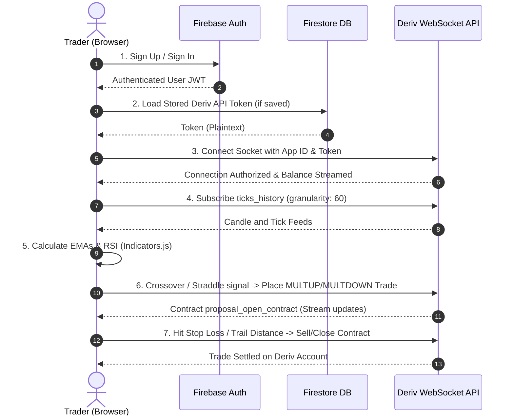
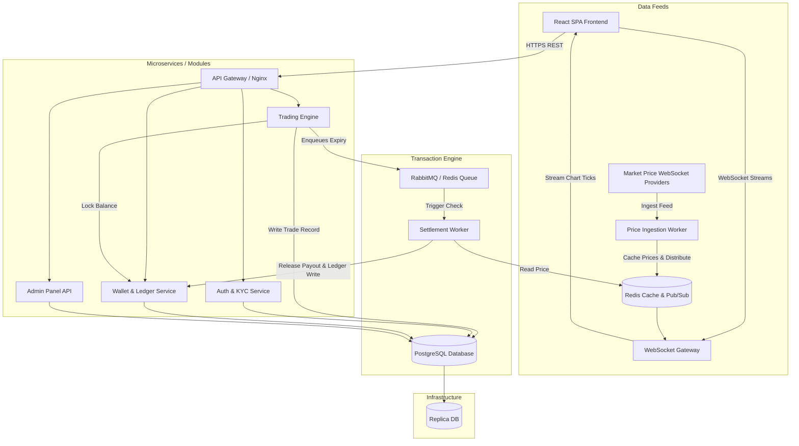
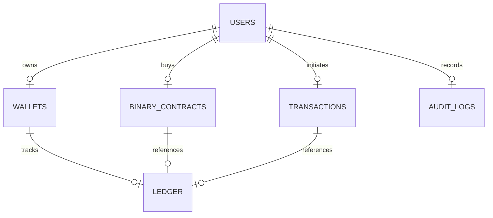

# PROJECT PLAN: INDEPENDENT BINARY TRADING PLATFORM
## Migration, Architecture, and Technical Blueprint Report

This document serves as the comprehensive architectural analysis and development blueprint for transitioning from the **Bullion Terminal** client-side automation tool to a fully independent, enterprise-grade binary trading platform owned and operated in-house.

---

## Table of Contents

1. [Executive Summary](#1-executive-summary)
2. [Current Architecture Review](#2-current-architecture-review)
   - [Architectural Overview](#architectural-overview)
   - [Authentication & Data Flows](#authentication--data-flows)
   - [Key Technical Boundaries & Limitations](#key-technical-boundaries--limitations)
3. [Requirement Gap Analysis](#3-requirement-gap-analysis)
   - [Functional System Gaps](#functional-system-gaps)
   - [Why These Missing Systems Are Critical](#why-these-missing-systems-are-critical)
4. [Code Reusability Analysis](#4-code-reusability-analysis)
   - [Category A: Reuse Without Modification](#category-a-reuse-without-modification)
   - [Category B: Reuse With Refactoring](#category-b-reuse-with-refactoring)
   - [Category C: Remove Completely](#category-c-remove-completely)
   - [Category D: Replace Completely](#category-d-replace-completely)
5. [Proposed Architecture (Future Standalone Platform)](#5-proposed-architecture-future-standalone-platform)
   - [High-Level Future System Diagram](#high-level-future-system-diagram)
   - [System Components & Layers](#system-components--layers)
6. [Development Roadmap](#6-development-roadmap)
   - [Milestone Breakdowns](#milestone-breakdowns)
7. [Database Design](#7-database-design)
   - [Entity Relationships & Schema Architecture](#entity-relationships--schema-architecture)
8. [API Service Planning](#8-api-service-planning)
   - [Backend Endpoint Groups](#backend-endpoint-groups)
9. [Risk Assessment](#9-risk-assessment)
   - [Technical, Business, Security, and Scalability Risks](#technical-business-security-and-scalability-risks)
   - [Mitigation Strategies](#mitigation-strategies)
10. [Final Recommendation](#10-final-recommendation)

---

## 1. Executive Summary

Based on a thorough review of the current **Bullion Terminal** codebase and the lead architect's technical review document ([Technical_Analysis_Report.pdf](file:///c:/Users/user/Downloads/bullion-terminal_3/public/Technical_Analysis_Report.pdf)), there is a fundamental misalignment between the existing software implementation and the client's business objectives.

*   **The Current Implementation**: An automation utility that bridges a trader's browser to the third-party **Deriv** brokerage. It runs strategies via a direct client-side WebSocket, requiring users to register with Deriv, deposit funds into Deriv, generate API tokens on Deriv, and run the browser tab continuously to execute trades. The platform acts solely as a user interface shell and owns no financial infrastructure.
*   **The Business Goal**: A self-contained, independent web-based **Binary Trading Platform**. The platform must register its own users, support direct local/international deposits and withdrawals, manage internal user wallets via a double-entry ledger, execute and settle trades on its own backend engine, and provide administrators with absolute operational and risk control.
*   **The Strategy**: A complete separation of concerns. The current frontend terminal is a high-quality reference design for charts, math indicators, and layouts, but the backend must be built entirely from scratch. Trying to refactor Firebase and Deriv client-side logic to simulate a real platform would introduce critical security vulnerabilities, transaction integrity failures, and operational hazards.

This document maps out the blueprint for building this standalone platform.

---

## 2. Current Architecture Review

### Architectural Overview

The current **Bullion Terminal** is a single-page React app that utilizes:
*   **Firebase Authentication** for user accounts.
*   **Cloud Firestore** to persist personal Deriv API tokens.
*   **Deriv WebSocket API** to fetch tick feeds, authenticate balances, and execute multiplier purchases.

Everything runs within the client's web browser process.



### Authentication & Data Flows

1.  **Auth Flow**: Traditional Firebase Authentication (Email/Password). User documents exist solely to link a Firebase UID (`request.auth.uid`) to a saved API token document in Firestore under `derivTokens/{uid}`.
2.  **Market Price Flow**: Managed via WebSocket subscriptions directly to Deriv. The browser requests `ticks_history` for a symbol (e.g., `R_100` Volatility Index). Deriv streams OHLC (Open, High, Low, Close) updates. The client updates its state, triggers local computations in [indicators.js](file:///c:/Users/user/Downloads/bullion-terminal_3/src/lib/indicators.js) (EMA/RSI), and updates SVG sparklines in real-time.
3.  **Trading Execution Flow**: Handled by [useStrategyEngine.js](file:///c:/Users/user/Downloads/bullion-terminal_3/src/hooks/useStrategyEngine.js) and [useStraddleStrategy.js](file:///c:/Users/user/Downloads/bullion-terminal_3/src/hooks/useStraddleStrategy.js) calling `buyMultiplier` via the WebSocket. The client relies on Deriv to execute the position, verify balance availability, and calculate profit/loss.

### Key Technical Boundaries & Limitations

*   **Client-Side Strategy Execution**: The trading bot runs **only when the browser tab is open**. If a user closes the tab, loss caps, trailing stops, and logic evaluations freeze, exposing the user to unmanaged market risks.
*   **Deriv Core Dependency**: If Deriv updates its API, experiences downtime, or restricts a user's API token, the platform completely breaks down. The platform holds zero customer funds and earns no direct trading fee revenue.
*   **Security Risks**: Storing API tokens with Read and Trade privileges on the client and in standard Firestore collections raises security concerns, as compromised keys grant external malicious actors full control to trade away client funds on Deriv.
*   **No Transaction Integrity**: Since balances and trade settlements are external, the platform cannot guarantee database-level atomic operations (ACID compliance) for user accounts.

---

## 3. Requirement Gap Analysis

To convert this application into a standalone binary trading business, a complete set of backend components must be introduced.

| Missing System | Operational Role & Business Necessity |
| :--- | :--- |
| **User Account & KYC Service** | Manages direct user registration, password hashing (bcrypt/argon2), session tokens (JWT), profile tracking, and verification document uploads (Passport, ID) for legal compliance. |
| **Internal Wallet System** | A secure database layer recording user virtual balances. It must handle multi-currency accounts and guarantee balance integrity during trades. |
| **Double-Entry Ledger** | Logs every credit and debit transaction (deposits, stakes, wins, losses, withdrawals, fees) as dual balancing entries. Essential for accounting audits and preventing balance tampering. |
| **Deposit System** | Automated integrations with mobile money (e.g., M-Pesa API) and payment gateways (Stripe, Flutterwave, or Crypto checkouts) to dynamically credit wallets upon verification. |
| **Withdrawal System** | Form processing, bank routing validations, and an admin dashboard to review, approve, queue, or reject payout transactions. |
| **Internal Trading Engine** | The heart of the platform. Validates user balances, locks stakes, registers trade entries (Asset, Stake, Contract Type, Strike Price, Purchase Time, Expiry Time), and logs them to the database. |
| **Internal Settlement Engine** | Runs asynchronous tasks (e.g., cron jobs or workers) to check expiring trades. It compares the asset's expiry price against the entry strike price, resolves the trade (Win/Loss), unlocks the stake, and credits payouts. |
| **Realtime Market Price Ingest** | A backend system that connects to high-fidelity liquidity feeds (e.g., Binance, FXCM, OANDA) via WebSockets. It acts as the "source of truth" and distributes prices to active clients. |
| **Risk & Exposure Engine** | Monitors active open contracts in real-time. Automatically adjusts payout rates, restricts maximum trade sizes, and flags suspicious patterns to protect the platform from heavy losses. |
| **Revenue & Spread Manager** | Controls the platform's pricing markup. Configures commission percentages, withdrawal fees, and asset payout rates (e.g., offering a 60% payout on winning trades, leaving a 40% margin for the house). |
| **Admin Dashboard (Back-Office)** | Web-based interface for operations managers to adjust settings, ban users, manually audit ledgers, approve payments, and view revenue analytics. |
| **Affiliate & Referral Engine** | Tracks user invitation codes. Calculates commissions (e.g., percentage of referee stakes or losses) and distributes payouts to referrers automatically. |
| **Notification Service** | Sends transactional alerts (receipts, withdrawal alerts, margin warnings) via Email (SendGrid), SMS (Twilio), and Web Push. |
| **Security Audit Logger** | Records immutable logs of administrative actions, user IP logs, authentication failures, and balance updates for forensic tracking. |

---

## 4. Code Reusability Analysis

We must evaluate every folder and file in the codebase to determine its value in the new architecture.

### Category A: Reuse Without Modification
*   **[indicators.js](file:///c:/Users/user/Downloads/bullion-terminal_3/src/lib/indicators.js)**: Standard mathematical functions for calculating EMA and RSI series, along with crossover detection logic. These are pure functions and are fully compatible with any architecture.
*   **[storage.js](file:///c:/Users/user/Downloads/bullion-terminal_3/src/lib/storage.js)**: Simple helper utilities for reading/writing configuration profiles to browser `localStorage`.
*   **[Sparkline.jsx](file:///c:/Users/user/Downloads/bullion-terminal_3/src/components/Sparkline.jsx)**: A self-contained SVG charting component. It takes price arrays and renders them efficiently, making it highly portable.

### Category B: Reuse With Refactoring
*   **[AuthPage.jsx](file:///c:/Users/user/Downloads/bullion-terminal_3/src/components/AuthPage.jsx)**: The forms and styling can be preserved, but the form submission action must point to our custom `/api/v1/auth/` backend endpoints rather than calling Firebase's `signInWithEmailAndPassword`. Registration fields must also be expanded to capture user phone numbers, full names, and addresses.
*   **[Dashboard.jsx](file:///c:/Users/user/Downloads/bullion-terminal_3/src/components/Dashboard.jsx)**: Keep as the core structural grid layout (Layout, Columns, Panels). Modify it to load user wallet details from our backend instead of listening to Deriv's balance stream.
*   **[MarketPanel.jsx](file:///c:/Users/user/Downloads/bullion-terminal_3/src/components/MarketPanel.jsx)**: Refactor the symbol selection dropdown to load asset lists from our server-side API rather than the Deriv active symbols feed.
*   **[AccountSummary.jsx](file:///c:/Users/user/Downloads/bullion-terminal_3/src/components/AccountSummary.jsx)**: Update the labels to show internal wallet balances, deposited currencies, and internal platform P/L.
*   **[StrategyPanel.jsx](file:///c:/Users/user/Downloads/bullion-terminal_3/src/components/StrategyPanel.jsx)**: Change the input parameters. Remove options like "multiplier" if the platform only operates vanilla Higher/Lower binary options, and tie the execution start buttons to our own API.
*   **[ActivityLog.jsx](file:///c:/Users/user/Downloads/bullion-terminal_3/src/components/ActivityLog.jsx)**: Modify the event list stream to ingest websocket logs broadcast by our own trading engine.
*   **[usePriceFeed.js](file:///c:/Users/user/Downloads/bullion-terminal_3/src/hooks/usePriceFeed.js)**: Retain the candle state merging and historical backfill structure, but change the WebSocket endpoint path from Deriv’s server address to our own gateway WebSocket server (e.g., `wss://api.ourplatform.com/prices`).
*   **[useStrategyEngine.js](file:///c:/Users/user/Downloads/bullion-terminal_3/src/hooks/useStrategyEngine.js)** & **[useStraddleStrategy.js](file:///c:/Users/user/Downloads/bullion-terminal_3/src/hooks/useStraddleStrategy.js)**: The decision-making loops (crossover detection and straddle state transitions) can be repurposed. However, the execution calls (opening and closing trades) must call our platform's REST endpoints (e.g., `/api/v1/trades/buy`) instead of the Deriv WebSocket commands.

### Category C: Remove Completely
*   **[derivApi.js](file:///c:/Users/user/Downloads/bullion-terminal_3/src/lib/derivApi.js)**: Entirely obsolete. This wraps communication specific to Deriv's API contracts, tokens, and schemas.
*   **[tokenStore.js](file:///c:/Users/user/Downloads/bullion-terminal_3/src/lib/tokenStore.js)**: Fully obsolete. Deriv API token storage is no longer needed.
*   **[ConnectDerivStep.jsx](file:///c:/Users/user/Downloads/bullion-terminal_3/src/components/ConnectDerivStep.jsx)**: Fully obsolete. Users do not connect API tokens anymore. Instead, they will see a wallet/deposit screen to fund their account.
*   **[firestore.rules](file:///c:/Users/user/Downloads/bullion-terminal_3/firestore.rules)**: Obsolete. Firebase rules are replaced by backend database constraints.

### Category D: Replace Completely
*   **Firebase Authentication/Firestore config** ([firebase.js](file:///c:/Users/user/Downloads/bullion-terminal_3/src/lib/firebase.js)): Replace with a custom relational database management system (PostgreSQL) and backend application server (Node.js/TypeScript or Go) to handle users and wallets securely.
*   **Client-Side Trade Execution**: Replace with a backend execution engine to process trades securely.

---

## 5. Proposed Architecture (Future Standalone Platform)

The new architecture migrates all business logic, wallet transactions, trading parameters, and order management to a secure, private backend cluster.

### High-Level Future System Diagram



### System Components & Layers

1.  **Frontend (UI Layer)**: Refactored Vite/React SPA. Communicates with backend REST APIs for actions (auth, wallets, trading) and connects to a WebSocket server for tick streams.
2.  **Backend API Gateway**: Exposes API endpoints, terminates TLS, handles rate-limiting, and routes traffic to internal handlers.
3.  **Real-Time Price Ingestion Handler**: A backend service that opens stable WebSocket feeds from institutional data providers. It normalizes prices and publishes them to Redis Pub/Sub.
4.  **WebSocket Gateway**: Subscribes to Redis Pub/Sub channels and broadcasts real-time ticks to connected browser clients for active charting.
5.  **Trading & Settlement Engine**:
    *   **Trading Service**: Validates trade requests against user wallet balances, locks the stake, and stores the contract with its strike price.
    *   **Message Broker (Queue)**: Schedules expiry tasks.
    *   **Settlement Worker**: Runs asynchronously, consumes expiry messages, fetches the current asset price from the cache, determines the trade outcome (Win/Loss), updates the contract status, and executes wallet updates via the ledger.
6.  **Wallet & Double-Entry Ledger Service**: Ensures every balance change is logged in a relational table. All transactions run inside strict database transactions to guarantee integrity.
7.  **Database & Caching Layer**:
    *   **PostgreSQL**: Primary transactional database containing tables for users, ledger, transactions, and active trades.
    *   **Redis**: Caches live asset prices, handles WebSocket distribution pub/sub topics, and stores user sessions.
8.  **Background Workers**: Handle secondary tasks like processing payment callback alerts, sending verification emails, and generating daily accounting audit reports.

---

## 6. Development Roadmap

To ensure a smooth transition, development is broken down into structured, testable milestones.

```mermaid
gantt
    title Platform Development Timeline
    dateFormat  YYYY-MM-DD
    section Backend
    Milestone 1: Core Auth & KYC           :active, m1, 2026-08-01, 14d
    Milestone 2: Wallets & Payments        :   m2, after m1, 21d
    Milestone 3: Price Ingest & WS Streams :   m3, after m2, 14d
    Milestone 4: Trading & Settlement Engine:  m4, after m3, 28d
    Milestone 5: Admin Panel & Settings    :   m5, after m4, 21d
    section Frontend
    Milestone 6: UI Refactor & Integration :   m6, after m4, 28d
    section Launch
    Milestone 7: Auditing, Risk, & Launch  :   m7, after m6, 14d
```

### Milestone Breakdowns

#### Milestone 1: User Management & Authentication
*   **Deliverables**: User table schema, signup/login APIs (JWT), password recovery endpoints, profile management, and KYC upload handlers.
*   **Dependencies**: Database cluster setup.
*   **Estimated Complexity**: Medium.

#### Milestone 2: Wallet Infrastructure & Payments
*   **Deliverables**: Wallet balances table, double-entry ledger database tables, payment gateway API webhooks (M-Pesa, card networks), and deposit/withdrawal tracking systems.
*   **Dependencies**: Milestone 1.
*   **Estimated Complexity**: High (requires precise mathematical precision and transactional security).

#### Milestone 3: Real-Time Pricing & WebSocket Server
*   **Deliverables**: Integration with price feed providers, Redis caching for asset prices, and a WebSocket broadcast server for live streaming.
*   **Dependencies**: None (can be developed in parallel).
*   **Estimated Complexity**: Medium.

#### Milestone 4: Binary Trading Engine & Expiry Worker
*   **Deliverables**: Trade creation API, order verification, active trades database tables, queue handlers for trade expiries, and the payout settlement worker.
*   **Dependencies**: Milestones 2 & 3.
*   **Estimated Complexity**: Very High (the core of the platform's trading operations).

#### Milestone 5: Admin Back-Office Dashboard
*   **Deliverables**: Administrative interfaces to manage users, manually process withdrawals, audit ledgers, change asset payout rates, and view system metrics.
*   **Dependencies**: Milestones 1, 2, & 4.
*   **Estimated Complexity**: Medium.

#### Milestone 6: Frontend Interface Refactoring & Backend Integration
*   **Deliverables**: Replace Firebase SDK bindings with internal backend endpoints, build user wallet and deposit/withdrawal screens, and connect charts to the new WebSocket price feed.
*   **Dependencies**: Milestones 1 to 5.
*   **Estimated Complexity**: High.

#### Milestone 7: Risk Management, Security Audits, and Deployment
*   **Deliverables**: Automated risk checks, payment reconciliation audits, security penetration testing, and production deployment on cloud infrastructure (e.g., AWS or GCP).
*   **Dependencies**: Milestone 6.
*   **Estimated Complexity**: Medium.

---

## 7. Database Design

A relational database with strict constraint checks (e.g., PostgreSQL) is required to ensure transactional safety and balance integrity.



### schema Entities

#### Table: `users`
*   **Purpose**: Manages user profiles, credentials, and verification state.
*   **Primary Key**: `id` (UUID)
*   **Attributes**: `email` (VARCHAR, Unique), `password_hash` (VARCHAR), `role` (ENUM: 'trader', 'admin', 'risk_manager'), `kyc_status` (ENUM: 'unverified', 'pending', 'verified'), `referral_code` (VARCHAR), `referred_by_id` (UUID, nullable, foreign key to `users.id`), `created_at` (TIMESTAMP).

#### Table: `wallets`
*   **Purpose**: Records user account balances.
*   **Primary Key**: `id` (UUID)
*   **Foreign Key**: `user_id` (UUID, references `users.id`, Unique)
*   **Attributes**: `balance` (NUMERIC(16, 4), constraint `balance >= 0`), `currency` (VARCHAR), `updated_at` (TIMESTAMP).

#### Table: `ledger`
*   **Purpose**: Immutable double-entry transaction record.
*   **Primary Key**: `id` (BIGSERIAL)
*   **Foreign Key**: `wallet_id` (UUID, references `wallets.id`)
*   **Attributes**: `amount` (NUMERIC(16, 4)), `transaction_type` (ENUM: 'deposit', 'withdrawal', 'trade_stake', 'trade_win', 'fee', 'referral_bonus'), `reference_type` (ENUM: 'transaction', 'binary_contract'), `reference_id` (UUID), `balance_before` (NUMERIC(16,4)), `balance_after` (NUMERIC(16,4)), `created_at` (TIMESTAMP).

#### Table: `transactions`
*   **Purpose**: Logs deposits and withdrawals.
*   **Primary Key**: `id` (UUID)
*   **Foreign Key**: `user_id` (UUID, references `users.id`)
*   **Attributes**: `type` (ENUM: 'deposit', 'withdrawal'), `amount` (NUMERIC(16, 4)), `gateway` (VARCHAR: 'mpesa', 'card'), `gateway_reference` (VARCHAR, Unique), `status` (ENUM: 'pending', 'approved', 'declined', 'failed'), `approved_by_admin_id` (UUID, nullable, references `users.id`), `created_at` (TIMESTAMP).

#### Table: `binary_contracts`
*   **Purpose**: Records individual binary options trades.
*   **Primary Key**: `id` (UUID)
*   **Foreign Key**: `user_id` (UUID, references `users.id`)
*   **Attributes**: `asset_symbol` (VARCHAR), `contract_type` (ENUM: 'higher', 'lower'), `stake` (NUMERIC(16, 4)), `payout_rate` (NUMERIC(4, 2), e.g., 0.60), `status` (ENUM: 'open', 'won', 'lost', 'cancelled'), `strike_price` (NUMERIC(18, 6)), `expiry_price` (NUMERIC(18, 6), nullable), `purchase_time` (TIMESTAMP), `expiry_time` (TIMESTAMP), `settled_at` (TIMESTAMP, nullable).

#### Table: `audit_logs`
*   **Purpose**: Immutable security trail.
*   **Primary Key**: `id` (BIGSERIAL)
*   **Foreign Key**: `user_id` (UUID, nullable, references `users.id`)
*   **Attributes**: `action` (VARCHAR), `details` (JSONB), `ip_address` (INET), `user_agent` (VARCHAR), `created_at` (TIMESTAMP).

#### Table: `platform_settings`
*   **Purpose**: Global platform variables.
*   **Primary Key**: `key` (VARCHAR)
*   **Attributes**: `value` (VARCHAR), `description` (TEXT), `updated_at` (TIMESTAMP).

---

## 8. API Service Planning

The backend service layer will expose REST endpoints grouped by business domain.

### Backend Endpoint Groups

#### Domain: Authentication (`/api/v1/auth`)
*   `POST /register` — Register a new user profile.
*   `POST /login` — Authenticate credentials and return JWT tokens.
*   `POST /logout` — Invalidate user sessions.
*   `POST /reset-password` — Initiate password recovery workflows.

#### Domain: User Management (`/api/v1/users`)
*   `GET /profile` — Fetch details of the authenticated user.
*   `POST /kyc` — Upload identification documents.
*   `GET /referrals` — View referral history and earnings.

#### Domain: Wallets & Payments (`/api/v1/wallets`)
*   `GET /balance` — Get current wallet balances.
*   `GET /history` — Get paginated account transaction histories.
*   `POST /deposit/initiate` — Initiate a payment gateway checkout session (e.g., M-Pesa push).
*   `POST /deposit/callback` — Webhook for payment gateway status updates.
*   `POST /withdraw/request` — Request a balance withdrawal.

#### Domain: Trading Engine (`/api/v1/trades`)
*   `POST /buy` — Open a binary options contract (requires wallet balance verification).
*   `GET /active` — List open trades.
*   `GET /history` — Fetch paginated trading history.

#### Domain: Administrative Dashboard (`/api/v1/admin`)
*   `GET /users` — Paginated list of registered accounts.
*   `POST /users/:id/suspend` — Lock or suspend a user account.
*   `POST /withdrawals/:id/approve` — Approve manual withdrawals.
*   `POST /settings/payouts` — Modify asset payout rates globally.
*   `GET /stats/revenue` — Fetch revenue and trading statistics.

---

## 9. Risk Assessment

Operating an independent binary trading platform introduces complex technical, financial, and regulatory challenges.

### Technical, Business, Security, and Scalability Risks

#### 1. Financial Exposure Risk
*   **The Risk**: Volatile markets can result in high user win rates, potentially draining the platform's liquidity.
*   **Mitigation Strategy**:
    *   Implement dynamic payout scaling. During periods of high directional volume, automatically reduce payout rates (e.g., from 60% to 50%).
    *   Set strict trading limits per user and cap maximum concurrent open stakes globally.

#### 2. Price Manipulation & Arbitrage
*   **The Risk**: Latency discrepancies between the platform's internal price feed and external brokers can allow users to exploit "stale" prices (latency arbitrage).
*   **Mitigation Strategy**:
    *   Deploy low-latency pricing nodes using Redis caches in memory.
    *   Validate trade entry timestamps against the price feed on the backend. If a trade request arrives with a timestamp discrepancy, reject the entry.

#### 3. Concurrent Settlement Bottlenecks
*   **The Risk**: Hundreds of binary trades expiring at the exact same second can create database performance bottlenecks during settlement.
*   **Mitigation Strategy**:
    *   Decouple trade execution from settlement using a message broker (e.g., RabbitMQ or BullMQ).
    *   Distribute expiry evaluations across multiple container instances running backend workers.

#### 4. Payment Gateway Fraud
*   **The Risk**: Users initiating chargebacks or exploiting payment webhooks to credit balances fraudulently.
*   **Mitigation Strategy**:
    *   Implement double-entry transaction validation for all incoming webhook calls.
    *   Require full identity verification (KYC) before processing withdrawals.

---

## 10. Final Recommendation

Based on the technical assessment of the existing codebase and the client's requirements:

> [!IMPORTANT]
> **Recommendation**: Build a new, dedicated backend from scratch while refactoring and reusing the UI layouts and technical indicators from the frontend.

### Supporting Rationale:
1.  **Backend Incompatibility**: The current project does not possess a backend database or trading server. Adapting a client-side, browser-reliant WebSocket wrapper into a multi-user trading platform is not feasible. The required ledger systems, settlement engine, and payment gateways must be built on a secure backend server.
2.  **Frontend Asset Reusability**: The frontend dashboard is highly reusable. The layout grid, technical indicator calculators ([indicators.js](file:///c:/Users/user/Downloads/bullion-terminal_3/src/lib/indicators.js)), SVG sparklines, and visual elements can be preserved. This saves considerable time on frontend development.
3.  **Security and Compliance**: Migrating logic to a secure, private backend is the only way to safeguard customer funds, enforce database transactions, prevent fraud, and run settlement checks reliably.

Building the backend from scratch with a robust language (e.g., Node.js or Go) and database (PostgreSQL) is the most secure and scalable approach for the platform.
