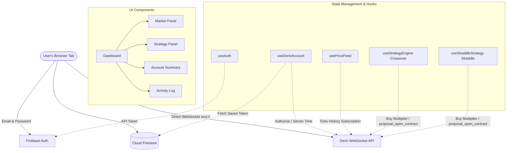
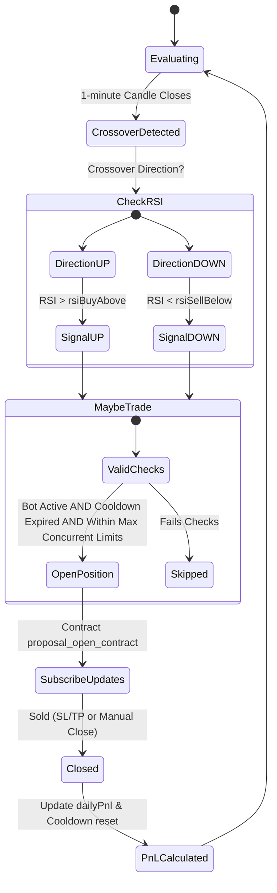
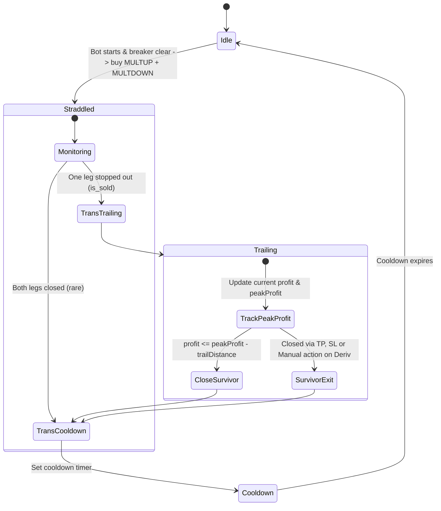

# Project Analysis: Bullion Terminal

Bullion Terminal is a client-side, browser-only trading dashboard. It connects to a user's **Deriv** account using a personal API token and executes automated trading strategies on **Multiplier contracts** (Deriv's leverage instrument with built-in Stop Loss and Take Profit properties).

The app relies on two main third-party services:
1. **Firebase Authentication & Firestore**: Used to authenticate users, manage application sessions, and optionally store Deriv API tokens securely (restricted via Firestore rules).
2. **Deriv WebSocket API**: Used to connect directly from the browser to Deriv servers to stream real-time market data, retrieve account metadata, check balances, and execute trades.

This document describes the architecture, component connections, data flows, and detailed strategy operational logic.

---

## 1. High-Level Architecture & Connectivity

The application operates as a single-page React app served statically (e.g., from Vite/Firebase Hosting). Since there is **no custom backend database or server**, all data subscriptions, technical indicator calculations, and trade actions are executed inside the user's browser tab.



---

## 2. Codebase Structure & Component Map

The codebase is organized logically into components, custom hooks, and utility libraries:

### Core Files
*   **[main.jsx](file:///c:/Users/user/Downloads/bullion-terminal_3/src/main.jsx)**: Entry point that mounts the root React component under `<React.StrictMode>`.
*   **[App.jsx](file:///c:/Users/user/Downloads/bullion-terminal_3/src/App.jsx)**: Directs top-level routing and state flow. If the user is unauthenticated, it presents the `AuthPage`. Once signed in, it prompts the user to enter or fetch their saved Deriv API token via `ConnectDerivStep`. When connected, it mounts the `Dashboard` and renders the header status diagnostics.
*   **[index.css](file:///c:/Users/user/Downloads/bullion-terminal_3/src/index.css)**: Implements design tokens for a dark trading terminal layout utilizing antique-gold accents (`--accent: #c9a961`), custom fonts, and tabular-numbers layout for monospaced figures.

### Custom Hooks
*   **[useAuth.js](file:///c:/Users/user/Downloads/bullion-terminal_3/src/hooks/useAuth.js)**: Integrates Firebase Authentication, tracking user session state (`user`, `checking`), and providing wrappers for signup, login, logout, and password resets.
*   **[useDerivAccount.js](file:///c:/Users/user/Downloads/bullion-terminal_3/src/hooks/useDerivAccount.js)**: Instantiates the WebSocket-based `DerivClient`. It manages authorization state, fetches lists of active trading symbols, subscribes to balance updates, and polls for server time every 20 seconds to diagnose connection health.
*   **[usePriceFeed.js](file:///c:/Users/user/Downloads/bullion-terminal_3/src/hooks/usePriceFeed.js)**: Subscribes to 1-minute historical and live candles for the selected symbol, calculates real-time Exponential Moving Averages (EMAs), and pipes the feeds into the UI and strategies.
*   **[useStrategyEngine.js](file:///c:/Users/user/Downloads/bullion-terminal_3/src/hooks/useStrategyEngine.js)**: Coordinates the **EMA/RSI Crossover** strategy. It evaluates signals when candles close, places positions, listens to contract events, and tracks daily P/L.
*   **[useStraddleStrategy.js](file:///c:/Users/user/Downloads/bullion-terminal_3/src/hooks/useStraddleStrategy.js)**: Coordinates the **Straddle + Trail** strategy. It implements a state machine to manage concurrent UP and DOWN contracts, trailing stop logic, and re-arm cooldown intervals.

### Components
*   **[AuthPage.jsx](file:///c:/Users/user/Downloads/bullion-terminal_3/src/components/AuthPage.jsx)**: UI for signing up or logging into the terminal.
*   **[ConnectDerivStep.jsx](file:///c:/Users/user/Downloads/bullion-terminal_3/src/components/ConnectDerivStep.jsx)**: Step for entering a Deriv API token, option to save it to Firestore, and calling the connection handler.
*   **[Dashboard.jsx](file:///c:/Users/user/Downloads/bullion-terminal_3/src/components/Dashboard.jsx)**: Orchestrates the central layout. It loads strategy parameters from local storage, registers the logging utility, subscribes to the price feed, and hooks up the active strategy.
*   **[AccountSummary.jsx](file:///c:/Users/user/Downloads/bullion-terminal_3/src/components/AccountSummary.jsx)**: Displays balance, active credentials, running P/L for the current day, and breaker-tripped alerts.
*   **[MarketPanel.jsx](file:///c:/Users/user/Downloads/bullion-terminal_3/src/components/MarketPanel.jsx)**: Dropdown for asset selection and real-time bid/ask tick calculations, housing the sparkline.
*   **[Sparkline.jsx](file:///c:/Users/user/Downloads/bullion-terminal_3/src/components/Sparkline.jsx)**: Renders a lightweight, high-performance inline SVG chart displaying price candles and fast/slow EMAs.
*   **[StrategyPanel.jsx](file:///c:/Users/user/Downloads/bullion-terminal_3/src/components/StrategyPanel.jsx)**: Toggles active strategy parameters, risk thresholds, stakes, multipliers, stop loss/take profit values, and bot play/pause toggles.
*   **[ActivityLog.jsx](file:///c:/Users/user/Downloads/bullion-terminal_3/src/components/ActivityLog.jsx)**: Scrollable list of time-stamped system events, signal logs, order fills, and API rejections.

### Libraries
*   **[derivApi.js](file:///c:/Users/user/Downloads/bullion-terminal_3/src/lib/derivApi.js)**: The core WebSocket API adapter wrapper. It routes parallel request-response promises via sequential `req_id` numbers, subscribes to streams, handles automated reconnect events, and packages API wrappers for authorization, balances, purchases, and contract updating.
*   **[firebase.js](file:///c:/Users/user/Downloads/bullion-terminal_3/src/lib/firebase.js)**: Configures and initializes Firebase services if the appropriate environment variables are active.
*   **[indicators.js](file:///c:/Users/user/Downloads/bullion-terminal_3/src/lib/indicators.js)**: Computes EMAs, Wilder's RSI, and detects moving-average crossover directions.
*   **[tokenStore.js](file:///c:/Users/user/Downloads/bullion-terminal_3/src/lib/tokenStore.js)**: Interacts with Firestore database to retrieve or save the user's encrypted-in-transit token using the Firebase SDK.
*   **[storage.js](file:///c:/Users/user/Downloads/bullion-terminal_3/src/lib/storage.js)**: LocalStorage wrappers for preserving config objects.

---

## 3. Operational Mechanics & Data Flow

### 1. Connection Lifecycle
```
User Auth -> Connect Deriv -> Stream Symbols -> Select Symbol -> Start Bot
```
1.  **Firebase Sign-in**: The user authenticates. `useAuth` changes state, prompting `App.jsx` to load.
2.  **Token Retrieval**: `ConnectDerivStep` checks Firestore at `derivTokens/{uid}`. If a token is found, it loads automatically.
3.  **WebSocket Init**: When "Connect" is clicked, `useDerivAccount` runs. A WebSocket is opened to `wss://ws.derivws.com/websockets/v3?app_id={appId}`.
4.  **Authorization**: The app transmits an `{authorize: "token"}` packet. Deriv responds with account properties (name, balance, currency, virtual/live status).
5.  **Streaming Subscriptions**:
    *   An active listener streams `{balance: 1}` to keep the header and summary updated.
    *   A periodic callback sends `{time: 1}` every 20 seconds to confirm the WebSocket is live.
    *   `active_symbols` are fetched to populate the asset selection menu.

### 2. Market Data Flow
When a user selects a symbol in the `MarketPanel`:
1.  **Price Feed Subscription**: `usePriceFeed` sends a `ticks_history` message with `style: "candles"` and `granularity: 60`.
2.  **History & Live updates**:
    *   The first response contains a 200-candle history array (`msg.candles`), loaded into the local `candles` array.
    *   Subsequent stream updates send `{ohlc: {...}}` messages representing ticks inside the current active 1-minute bar.
    *   If the incoming tick shares the same epoch timestamp as the last candle in state, the last candle is updated. If a new epoch timestamp arrives, a new candle is appended, finalizing the previous one.
3.  **Indicator Pipelines**:
    *   The `closes` array is mapped out.
    *   `emaSeries(closes, fastPeriod)` and `emaSeries(closes, slowPeriod)` calculate moving averages.
    *   The `Sparkline` component computes SVG path maps scaled to the maximum and minimum price boundaries, updating visually with each tick.

---

## 4. Trading Strategy Engines

### Strategy 1: EMA/RSI Crossover
This strategy operates strictly on **closed 1-minute candles** to prevent whipsawing (multiple false entries during a single volatile minute).



*   **Logic Evaluation**:
    *   When `closes.length` increments, `evaluateSignal` is triggered on `closes.slice(0, -1)` (all closed candles, excluding the current active candle).
    *   `crossoverAt` detects if the fast EMA crossed the slow EMA on the most recently closed candle.
    *   If EMA fast crossed **above** EMA slow, and the RSI at that candle is above `rsiBuyAbove`, an `up` signal is fired.
    *   If EMA fast crossed **below** EMA slow, and the RSI at that candle is below `rsiSellBelow`, a `down` signal is fired.
*   **Execution Checks**:
    *   **Cooldown**: Prevents trading if the time since the last trade is less than `cooldownSec`.
    *   **Max Concurrent**: Ensures total positions do not exceed `maxConcurrent`.
    *   **Flip Signal**: If an `up` signal is fired, but a `down` position is active, the bot closes the `down` position first, then opens the `up` position (and vice versa).
*   **Monitoring**:
    *   Once a trade is placed, `useStrategyEngine` subscribes to `{proposal_open_contract: 1, contract_id}` updates.
    *   Real-time profit updates are logged and rendered.
    *   When the contract is sold (via target hits or manual close), its final profit is added to `dailyPnl`, the position is removed, and the cooldown timer resets.

---

## 5. Strategy 2: Straddle + Trail
This strategy opens two opposing Multiplier positions simultaneously. It uses a tight stop loss on both to quickly eliminate the losing side in a trending market, and then trails the winning side client-side.

```
       [Market Price]
             ▲
             │
 ┌───────────┼───────────┐
 │ + MULTUP  │ + MULTDOWN│  Stake & Multiplier are equal on both legs.
 └─────┬─────┴─────┬─────┘
       │           │
   [StopLoss]  [StopLoss]   Tight stop loss on both (e.g. $5).
```

### Operational State Machine
The strategy utilizes a custom state engine that checks status every **2 seconds** (`TICK_MS = 2000`).



1.  **Phase: `idle`**:
    *   If the bot is running and the daily loss cap is clear, the engine calls `armStraddle()`.
    *   It sends parallel buy requests for `MULTUP` and `MULTDOWN` with identical stakes and multiplier config, using `straddleStopLoss` (e.g., $5).
    *   The phase shifts to `straddled`.
2.  **Phase: `straddled`**:
    *   Both contracts are active. The engine subscribes to open proposal contracts for both IDs.
    *   When the market moves, one direction will typically hit its tight Stop Loss and close on Deriv's server side.
    *   Once one leg is flagged as `is_sold`, the state transition triggers `onLegClosed`. The engine determines which leg survived and enters the `trailing` phase.
3.  **Phase: `trailing`**:
    *   The engine tracks the surviving leg's live profit (`leg.profit`) and the maximum profit it has reached during the session (`leg.peakProfit`).
    *   On each 2-second tick, if `leg.peakProfit > 0` and the current profit drops below `leg.peakProfit - trailDistance` (from its peak), the engine triggers an automated market exit, calling `sellContract` on the active leg.
    *   If the contract closes on Deriv's side instead (e.g., hitting a take profit), the close event is intercepted.
4.  **Phase: `cooldown`**:
    *   Upon closure of the survivor, `finishCycle()` runs.
    *   The P/L of both legs is summed, added to `dailyPnl`, and the engine sets a re-arm timestamp (`cooldownUntil = Date.now() + rearmCooldownSec * 1000`).
    *   When the current time exceeds `cooldownUntil`, the phase is reset to `idle`, ready for the next cycle.

---

## 6. Risk and Protection Rules
To protect the trading account, three risk-management features are evaluated across both strategy hooks:
1.  **Daily Loss Cap (`maxDailyLoss`)**:
    *   Calculates total cumulative strategy profits/losses for the current calendar day.
    *   If `dailyPnl` drops below `-maxDailyLoss`, the engine trips a breaker (`breakerTripped: true`).
    *   All new trade entries are locked out.
    *   A background timer checks the calendar date every 30 seconds. When the calendar day rolls over, the daily loss limit and breaker status are reset.
2.  **Virtual Account Safety Badge**:
    *   Deriv API authorization responses indicate whether the token is linked to a virtual demo account (`is_virtual`).
    *   If the token is live, the dashboard renders warning alerts highlighting that real funds are at risk.
3.  **Direct Execution Control**:
    *   A manual stop switch on the UI stops the bot immediately.
    *   Active contract parameters (stake, multipliers, periods) cannot be changed while the bot is active, preventing parameters from changing mid-trade.

---

## 7. Database Security & Access Restrictions

The project uses Firebase Cloud Firestore solely for optional API token persistence. The configuration is secure and locked down via **[firestore.rules](file:///c:/Users/user/Downloads/bullion-terminal_3/firestore.rules)**:

```javascript
rules_version = '2';
service cloud.firestore {
  match /databases/{database}/documents {
    match /derivTokens/{uid} {
      allow read, write: if request.auth != null && request.auth.uid == uid;
    }
    match /{document=**} {
      allow read, write: if false;
    }
  }
}
```

*   **Restricted User Namespace**: Each user can only read or write to `derivTokens/{uid}` where `{uid}` matches their own authenticated Firebase user ID (`request.auth.uid`). No user can read or overwrite another user's stored token.
*   **Security Caveat**: Stored tokens are transmitted securely (HTTPS) and stored in plain text on Firestore (not end-to-end encrypted with a secondary user-derived password). The client UI recommends using demo account tokens first.
